# Python自动化办公：P81：13 实战-给员工批量自动邮件发工资条 📧


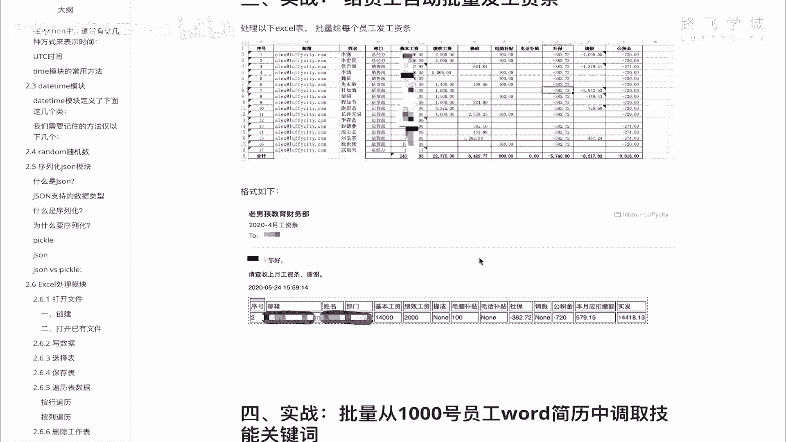

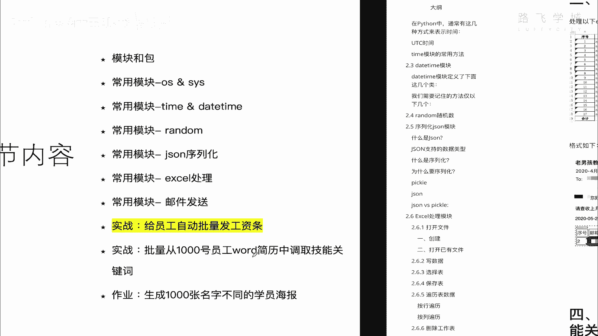

在本节课中，我们将学习如何结合Python的Excel处理和邮件发送功能，实现一个自动化批量发送员工工资条的小工具。这个工具可以显著提高财务人员的工作效率。

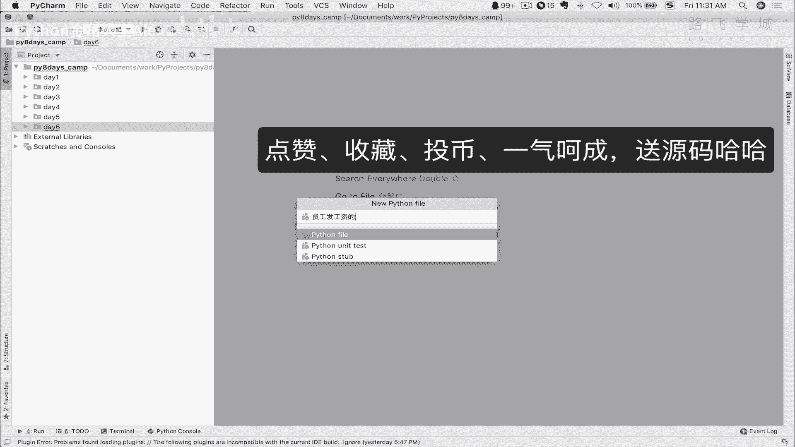

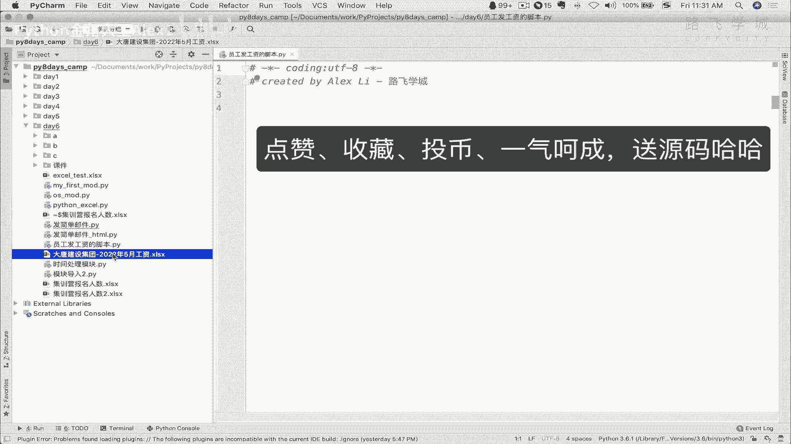

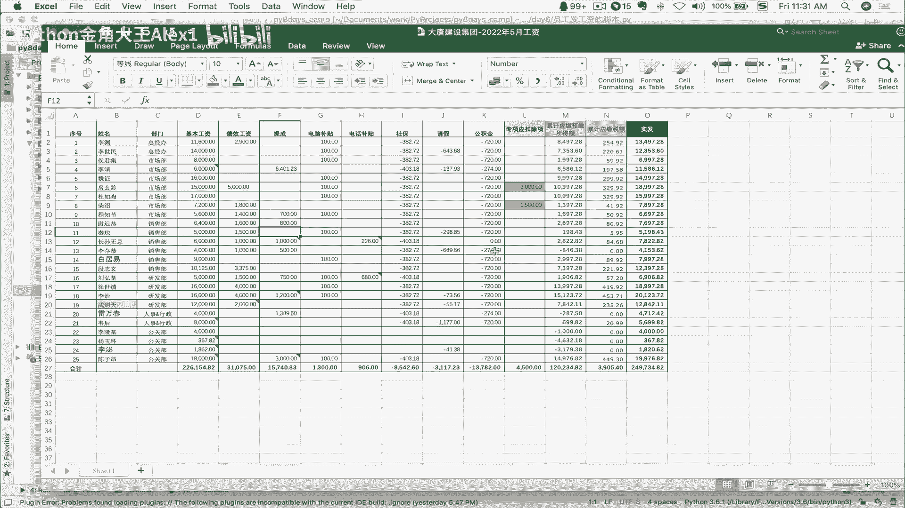

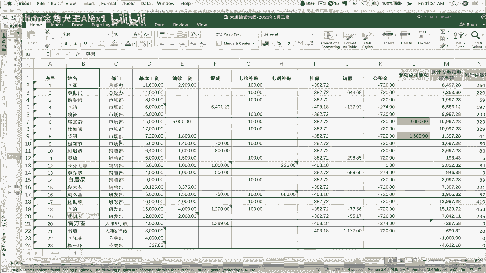

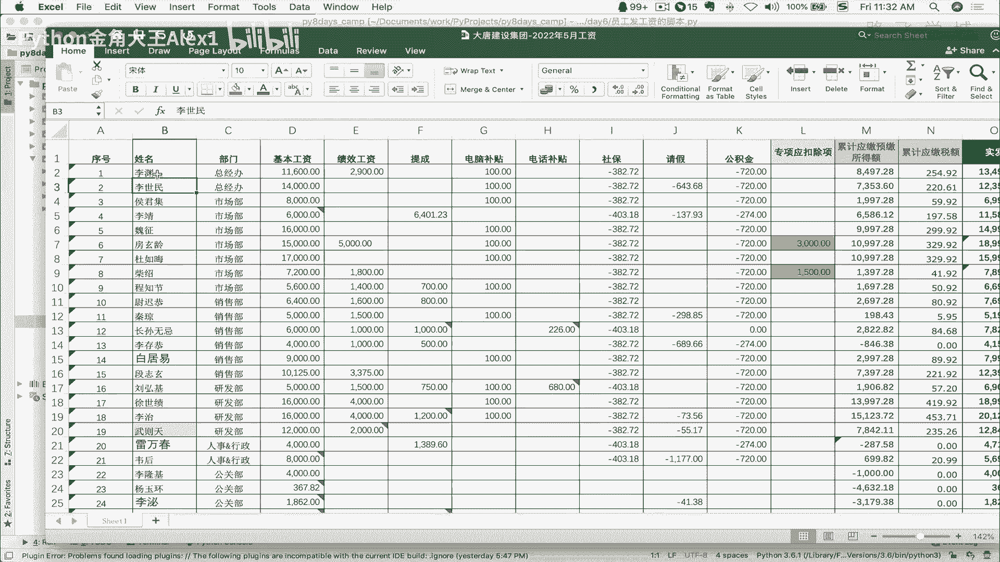

## 概述

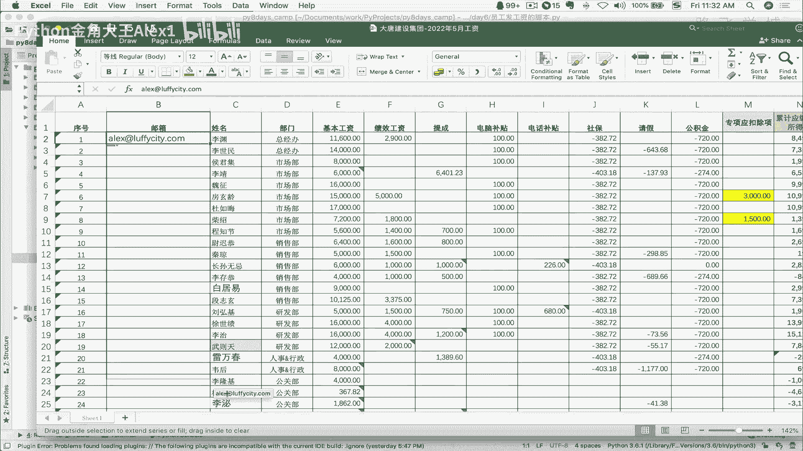

许多公司在发放工资时，财务人员需要手动将每位员工的工资条信息通过邮件或微信单独发送，这个过程耗时且容易出错。我们将编写一个Python脚本，自动读取包含员工信息和工资数据的Excel表格，并为每位员工生成格式化的工资条，通过邮件批量发送。

## 准备工作

首先，我们需要准备员工工资表。这是一个Excel文件，其中每一行代表一位员工的工资信息。关键的一步是，我们需要在表格中添加一列“邮箱”，用于存储每位员工的邮件地址。在测试阶段，可以先将所有邮箱地址暂时替换为自己的邮箱，以避免误发。

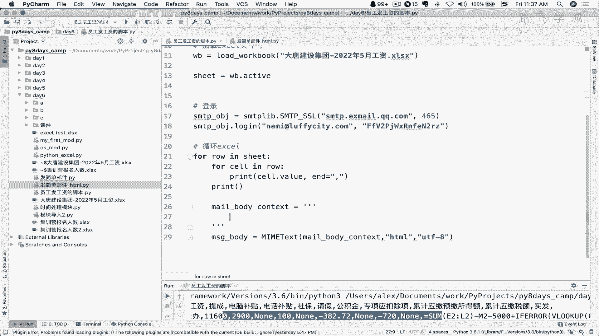

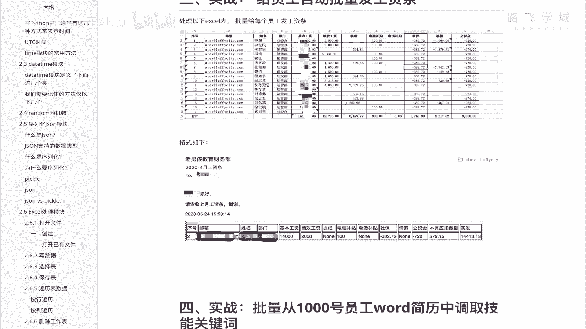

## 核心步骤分解

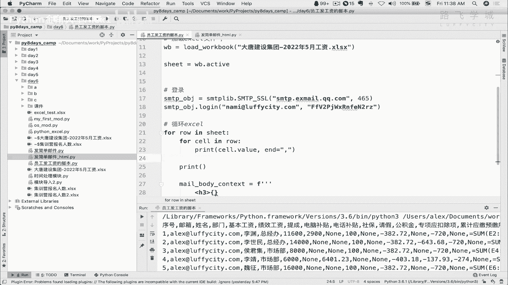

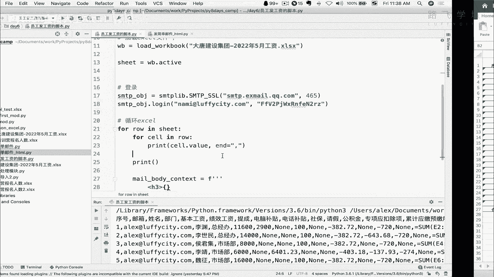

实现该功能主要分为三个核心步骤：
1.  使用 `openpyxl` 库加载并读取Excel文件中的数据。
2.  使用 `smtplib` 和 `email` 库构建并发送邮件。
3.  将Excel中的数据动态嵌入到HTML格式的邮件正文中，生成美观的工资条表格。

以下是实现这些步骤的详细过程。

## 第一步：加载Excel文件

我们首先导入必要的库，并加载包含工资数据的Excel工作簿。

```python
from openpyxl import load_workbook
import smtplib
from email.mime.text import MIMEText
from email.header import Header

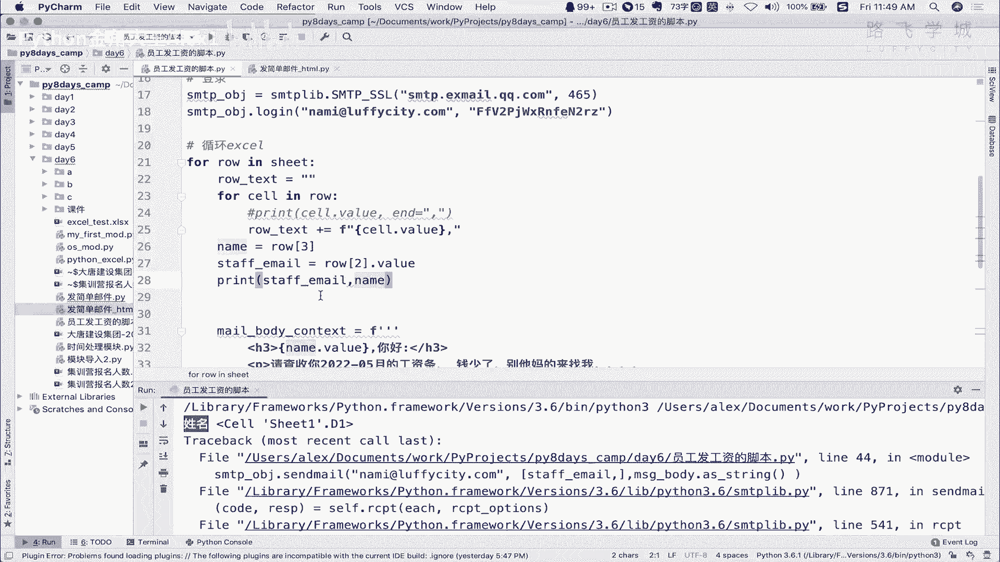

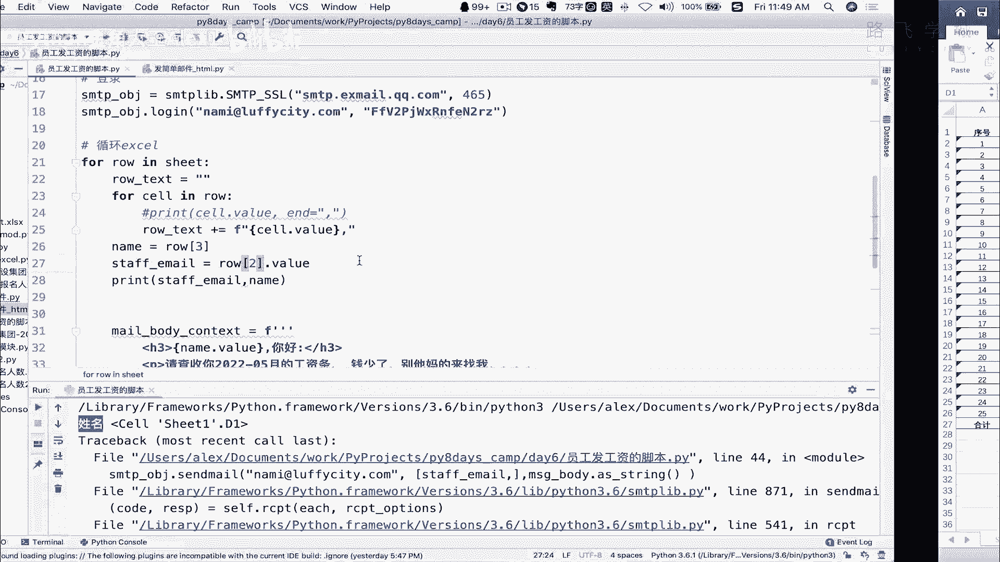

# 1. 加载Excel文件
wb = load_workbook(‘salary.xlsx‘， data_only=True) # data_only=True确保获取公式计算结果，而非公式本身
sheet = wb.active # 获取当前活跃的工作表
```

## 第二步：登录邮件服务器

在循环发送邮件之前，我们只需要登录一次邮件服务器。

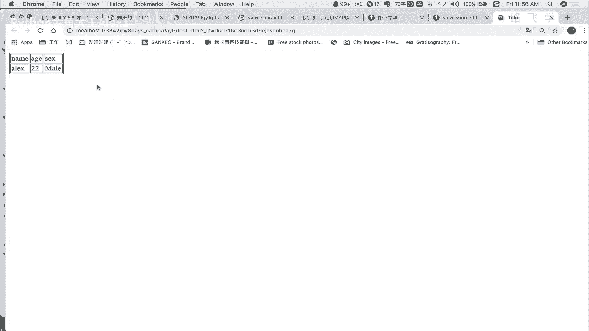

```python
# 2. 登录邮箱服务器
smtp_obj = smtplib.SMTP_SSL(‘smtp.example.com‘， 465) # 替换为你的SMTP服务器和端口
smtp_obj.login(‘your_email@example.com‘， ‘your_password‘) # 替换为你的邮箱和授权码/密码
```

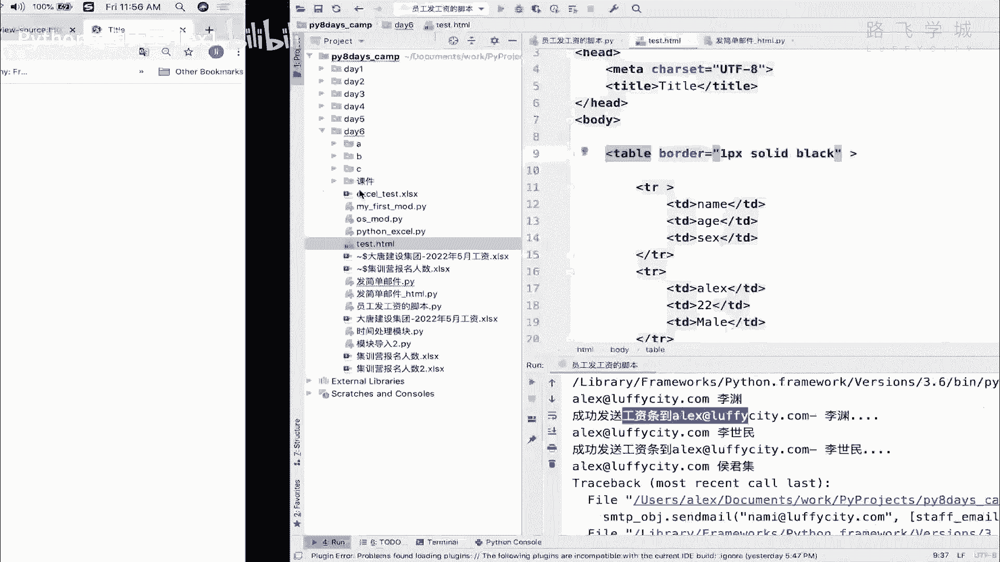

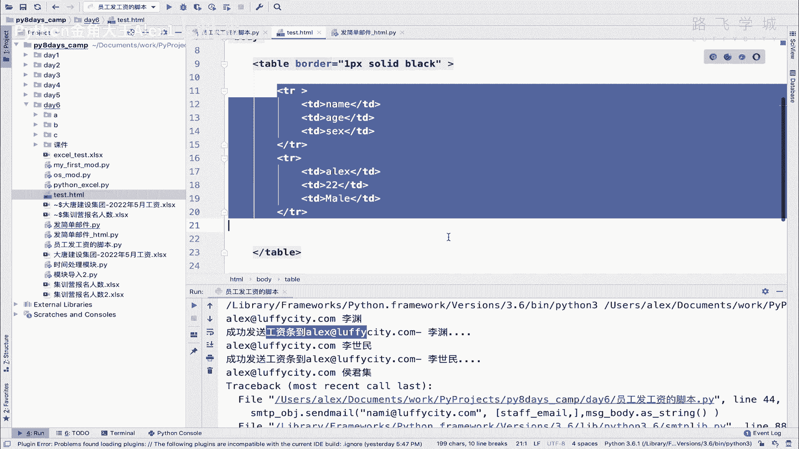

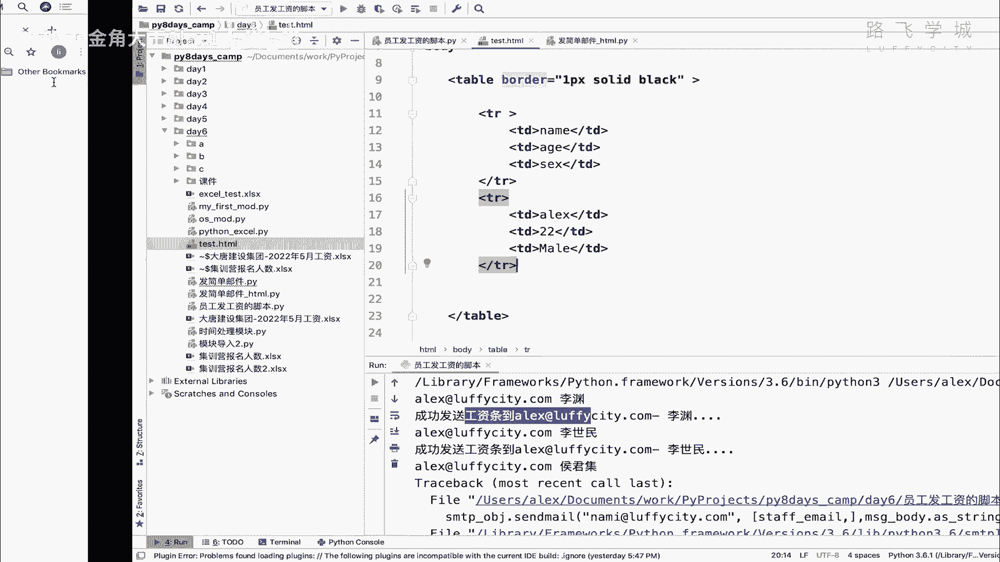

## 第三步：循环处理并发送邮件

接下来，我们循环遍历Excel表中的每一行数据（跳过标题行），为每位员工构建并发送邮件。

```python
# 初始化行计数器，用于跳过标题行
count = 0
# 用于存储表格标题行的HTML
table_header_html = ‘‘

for row in sheet.iter_rows(min_row=1):
    count += 1

    # 3.1 处理标题行（第一行）
    if count == 1:
        # 生成表格的标题行HTML
        table_header_html = ‘<tr>‘
        for cell in row:
            table_header_html += f‘<th style=“border: 1px solid black;“>{cell.value}</th>‘
        table_header_html += ‘</tr>‘
        continue # 跳过标题行的发送流程

    # 3.2 处理数据行（员工工资信息）
    # 获取员工姓名和邮箱
    staff_name = row[1].value # 假设姓名在第二列
    staff_email = row[0].value # 假设邮箱在第一列

    # 动态生成该员工工资数据的表格行HTML
    table_row_html = ‘<tr>‘
    for cell in row:
        table_row_html += f‘<td style=“border: 1px solid black;“>{cell.value}</td>‘
    table_row_html += ‘</tr>‘

    # 3.3 构建完整的邮件正文HTML
    html_body = f‘‘‘
    <h3>{staff_name}， 你好！</h3>
    <p>请查收你2024年06月的工资条：</p>
    <table style=“border-collapse: collapse;“>
        {table_header_html}
        {table_row_html}
    </table>
    ‘‘‘

    # 3.4 构建邮件
    message_body = MIMEText(html_body， ‘html‘， ‘utf-8‘)
    message_body[‘From‘] = Header(‘公司人事部 <hr@company.com>‘， ‘utf-8‘)
    message_body[‘To‘] = Header(staff_email， ‘utf-8‘)
    message_body[‘Subject‘] = Header(‘2024年06月工资条‘， ‘utf-8‘)

    # 3.5 发送邮件
    try:
        smtp_obj.sendmail(‘hr@company.com‘， [staff_email]， message_body.as_string())
        print(f‘成功发送工资条给 {staff_name} <{staff_email}>‘)
    except Exception as e:
        print(f‘发送给 {staff_name} 失败: {e}‘)

# 4. 关闭服务器连接
smtp_obj.quit()
print(“所有邮件发送任务完成！“)
```

## 代码要点解析

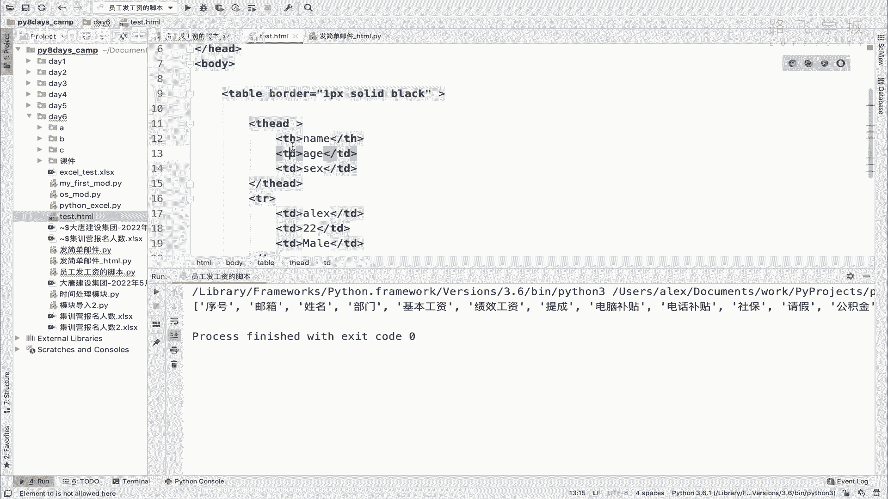

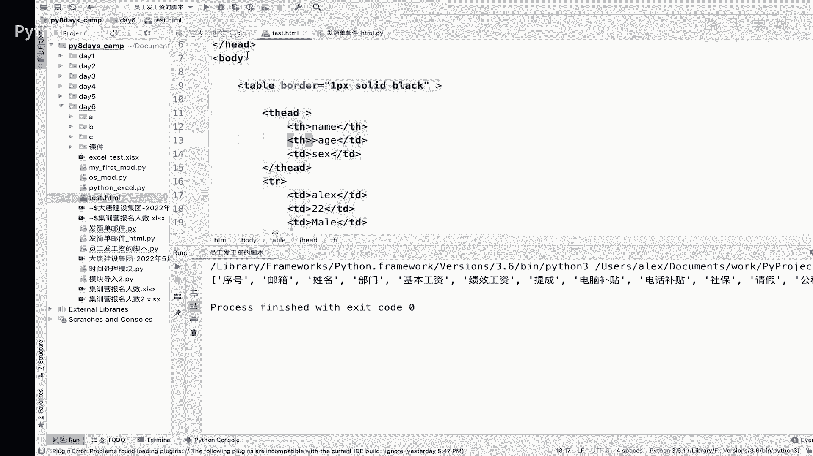

1.  **`iter_rows(min_row=1)`**: 此方法用于按行遍历工作表。`min_row=1` 表示从第一行开始读取。
2.  **`data_only=True`**: 在 `load_workbook` 时使用此参数至关重要。它确保 `cell.value` 返回的是Excel单元格中公式计算后的结果，而不是公式字符串本身。
3.  **HTML表格构建**: 邮件正文使用HTML格式。我们通过字符串拼接的方式，动态生成包含标题行(`<th>`)和数据行(`<td>`)的表格(`<table>`)。`style=“border: 1px solid black;“` 为表格添加了边框使其更清晰。
4.  **邮件头信息**: `From`， `To`， `Subject` 等邮件头需要正确设置，其中 `To` 和 `Subject` 可以根据每位员工的信息动态变化。
5.  **错误处理**: 在 `try-except` 块中发送邮件，可以捕获并打印发送失败的信息，避免因某封邮件失败而导致整个程序中断。

## 总结

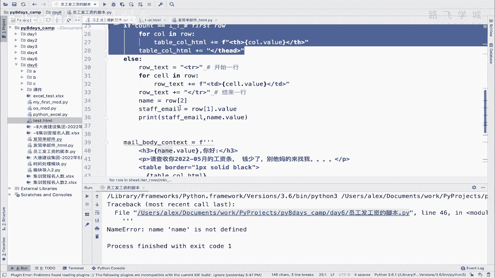

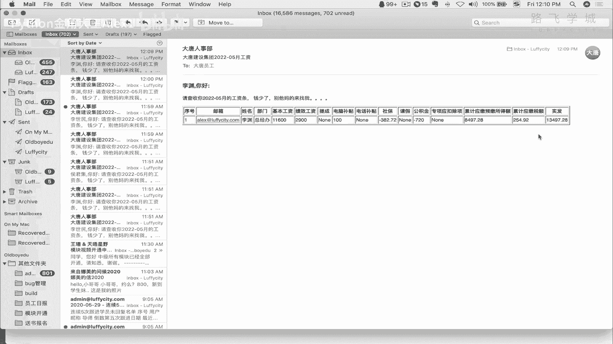

本节课中，我们一起完成了一个非常实用的Python自动化办公项目——批量自动发送工资条。我们主要学习了：
*   如何用 `openpyxl` 读取Excel数据，并注意使用 `data_only` 模式获取计算结果。
*   如何用 `smtplib` 和 `email` 库构建和发送HTML格式的邮件。
*   如何将数据处理与邮件发送逻辑结合，通过循环实现批量操作。
*   如何使用简单的HTML标签（如 `<table>`， `<tr>`， `<td>`， `<th>`）来格式化邮件内容，生成专业的工资条表格。

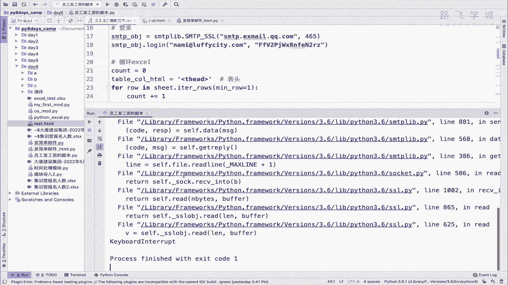

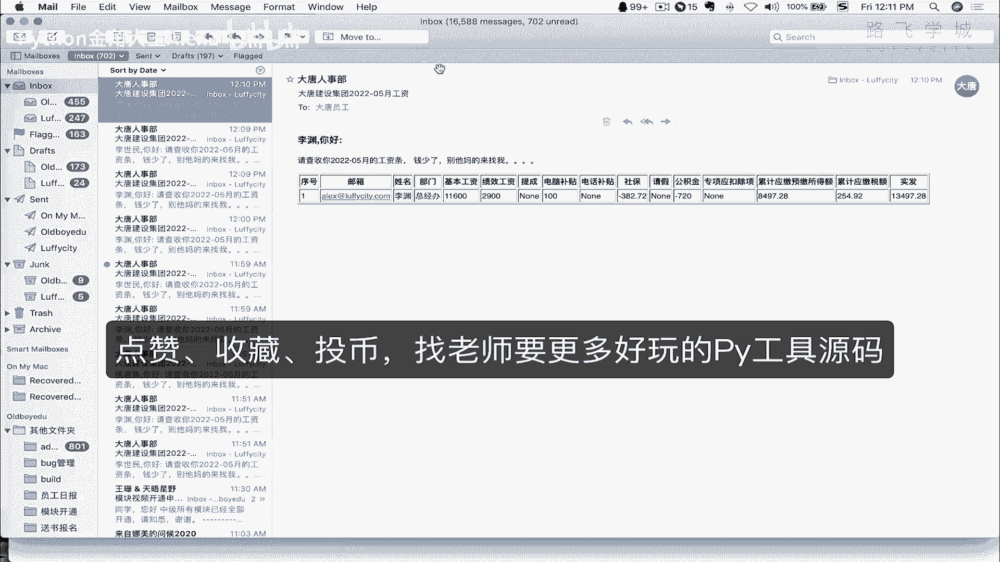

这个脚本虽然只有几十行代码，但能自动化完成原本需要数小时的手工重复劳动，是Python提升工作效率的经典案例。你可以在此基础上进一步优化，例如添加更精美的CSS样式、从配置文件读取邮件服务器信息、或增加日志记录功能。