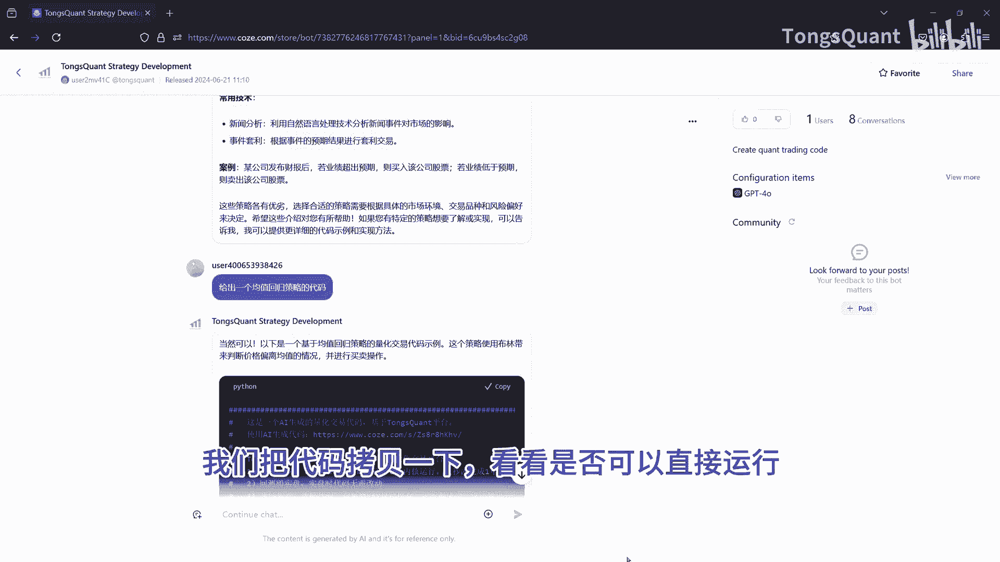
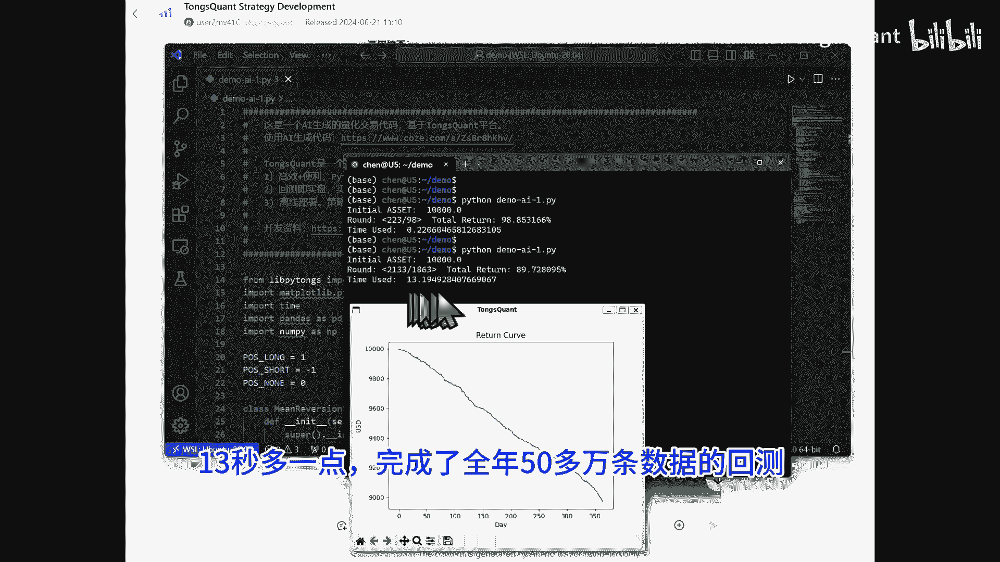
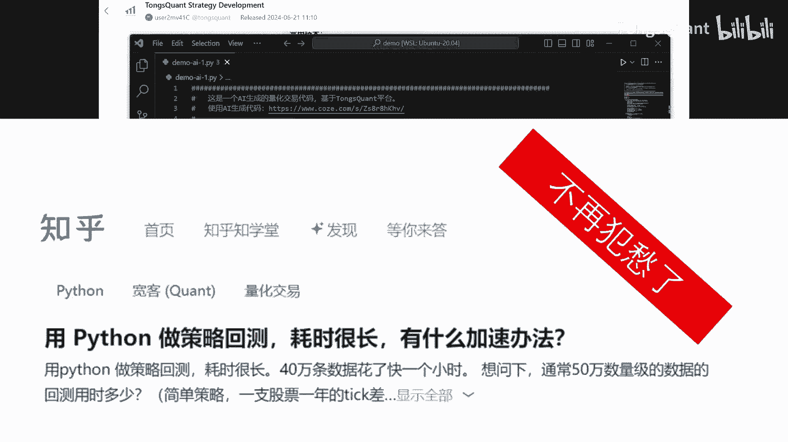
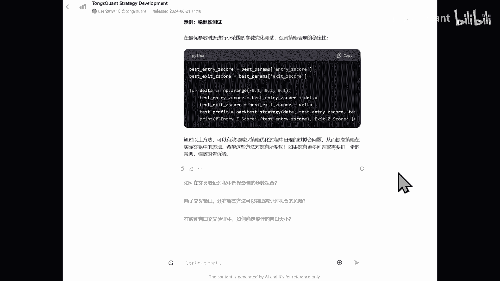

# 量化交易入门：P1：使用GPT与TongsQuant快速创建策略 🚀

在本教程中，我们将学习如何结合GPT智能体与TongsQuant平台，快速创建并回测一个量化交易策略。整个过程旨在让初学者也能轻松上手，从获取代码到运行回测，体验高效策略开发的流程。

## 智能体介绍与访问 🔧

Tom Squint开发了一个辅助代码编写的智能体。该智能体基于ChatGPT-4，并部署在Coze平台上。它除了具备量化交易的常用知识外，核心功能是能够生成可直接在TradingView的Pine Script或类似环境中运行的Python代码。

现在，我们来看一下如何找到并使用它。

以下是访问该智能体的步骤：
1.  在Coze平台的商店中搜索“TSQUANT”。
2.  或者，直接使用提供的专属网址进入。

进入智能体界面后，系统会显示一些英文提示信息和几个可选问题。你可以直接要求它使用中文进行交互。切换成功后，界面将转为中文。此时，你可以点击预设的问题，也可以直接输入你想要它完成的具体任务。

## 生成并运行初始策略代码 💻

通常情况下，我们建议从简单的任务开始。这样可以确保智能体输出的代码没有错误，能够直接运行。我们可以将生成的代码复制下来，测试其可运行性。

上图是智能体生成的策略代码。它自动添加了注释。代码基于一个策略基类创建了一个新的策略类，并设置了滑点、手续费等参数。其中，回溯周期预设为`20`，开仓阈值设为`2.0`，平仓阈值设为`0.5`。

后面的函数包含了具体的策略逻辑。该示例以以太坊（ETH）为例，选择的K线周期是60分钟。整段代码共130多行。

现在，我们尝试运行这段代码进行回测。回测仅用0.2秒就完成了。需要注意的是，这次回测是基于小时级别数据，每次计算会回溯20小时的数据。从结果来看，这个初始策略是稳定亏损的，因此还不能直接使用。

## 调整参数与优化回测 ⚙️

上一节我们运行了初始策略，本节我们来调整参数，观察策略表现和系统效率的变化。我们将参数调整到更实际的级别，并把回溯周期加大到`120`，同时将K线周期改为`60`秒。

再次运行回测，结果如下图所示。

本次回测耗时约13秒，完成了全年超过50万条数据的计算。这体现了强大的运算效率，使得我们无需再像过去那样花费大量精力进行代码层面的优化。

## 持续咨询与策略迭代 🔄

我们还可以继续向ChatGPT智能体咨询，请求它帮助我们优化算法。如下图所示，智能体会给出解释并提供具体的优化代码。

通过这种方式，我们可以不断迭代和优化策略，直到得到一个具备盈利潜力的版本。

## 平台信息与支持 📢

TongsQuant平台目前是免费的。如果你通过我们的交易所推荐码注册，可以享受额外的10%手续费减免。更多信息，如开发文档、示例代码等，请查询GitHub仓库。

## 总结 📝

本节课中，我们一起学习了如何利用GPT智能体与TongsQuant平台快速创建量化交易策略。我们从访问智能体开始，生成了初始策略代码并进行了回测。接着，通过调整参数，我们体验了高效的回测过程。最后，我们了解到可以持续与智能体交互来优化策略。这个过程大大降低了量化交易策略开发的门槛和耗时。