# Python金融分析量化交易：P6：突变点调参 🎯

在本节课中，我们将学习如何调整Prophet模型中的关键参数——突变点权重（`changepoint_prior_scale`），并观察其对模型预测结果的影响。我们将通过实验对比不同参数值下的模型表现，并学习如何根据评估指标选择最优参数。

## 概述

上一节我们介绍了Prophet模型的基本原理和构建流程。本节中，我们来看看一个对模型结果影响至关重要的参数：`changepoint_prior_scale`。这个参数控制着模型对数据中突变趋势的敏感度，直接关系到模型是欠拟合还是过拟合。

## 突变点权重参数详解

`changepoint_prior_scale`参数指定了突变点的先验权重。其核心含义是：**权重越大，模型越重视训练数据中的突变点，拟合程度越高，但过拟合风险也越大；权重越小，模型对突变点越不敏感，趋势预测越保守，但可能导致欠拟合。**

在Prophet框架中，该参数的默认值为 **`0.05`**，这是一个相对较小的值，表明模型默认对突变趋势持保守态度。

为了直观展示参数的影响，我们进行了四组实验，分别设置 `changepoint_prior_scale` 为：**`0.001`**, **`0.05`**, **`0.1`**, **`0.2`**。

以下是核心实验代码逻辑：

```python
# 定义不同的突变点权重参数
cp_scale_list = [0.001, 0.05, 0.1, 0.2]
predictions = {}

for scale in cp_scale_list:
    # 1. 使用新参数创建模型
    model = Prophet(changepoint_prior_scale=scale)
    model.fit(train_df)

    # 2. 构建未来时间框架并进行预测
    future = model.make_future_dataframe(periods=180)
    forecast = model.predict(future)

    # 3. 存储预测结果
    predictions[scale] = forecast[['ds', 'yhat']].set_index('ds')
```

## 不同参数下的结果对比

我们通过可视化来对比不同参数下模型的拟合与预测效果。图中黑色线条代表股票价格的真实值，其他颜色的线条代表不同参数下的模型预测值。

以下是不同参数表现的直观对比：

*   **蓝色线 (权重=0.001)**：权重极小。模型几乎无法捕捉训练数据中的突变信息，预测趋势非常平缓，呈现明显的欠拟合状态。
*   **红色线 (权重=0.05)**：默认权重。拟合效果优于极小权重，能捕捉部分趋势，但预测依然相对保守。
*   **灰色/黄色线 (权重=0.1, 0.2)**：权重较大。模型能紧密跟随训练数据的波动，包括突变点，拟合程度很高。但这也意味着模型可能过于“记忆”训练数据，存在过拟合风险，导致对未来未知数据的预测偏差增大。

## 模型评估与参数选择

仅仅观察拟合曲线不够客观，我们需要量化评估指标。我们主要关注**测试误差（test error）**，因为它反映了模型在未知数据上的泛化能力，这对时间序列预测至关重要。

我们计算了不同参数下的训练误差和测试误差。一个明显的趋势是：随着 `changepoint_prior_scale` 值增大，训练误差持续下降，因为模型对训练数据的拟合越来越好。测试误差的变化则是我们选择参数的关键。

以下是评估结果示例（数值为示意）：
| 参数值 | 训练误差 | 测试误差 |
| :--- | :--- | :--- |
| 0.001 | 较高 | 较高 |
| 0.05 | 降低 | 降低 |
| 0.2 | 很低 | **127.60** |
| ... | ... | ... |

我们的目标是选择**测试误差最低**的参数。在上面的例子中，参数为0.2时测试误差为127.60，是当时的最优选择。

## 深入调参实验

为了找到更优参数，我们扩大了参数搜索范围，尝试了 `[0.25, 0.4, 0.5, 0.6, 0.7, 0.8]` 等值。

实验发现，当参数增加到 **`0.7`** 左右时，测试误差达到了最低点（例如66左右），之后趋于稳定。因此，针对当前数据集和预测任务，我们最终选择 **`changepoint_prior_scale = 0.7`** 作为最优参数。

使用优化后的参数重新训练模型并进行预测，其预测值（如1263）与真实值（1294）的差距比使用默认参数时更小，验证了调参的有效性。

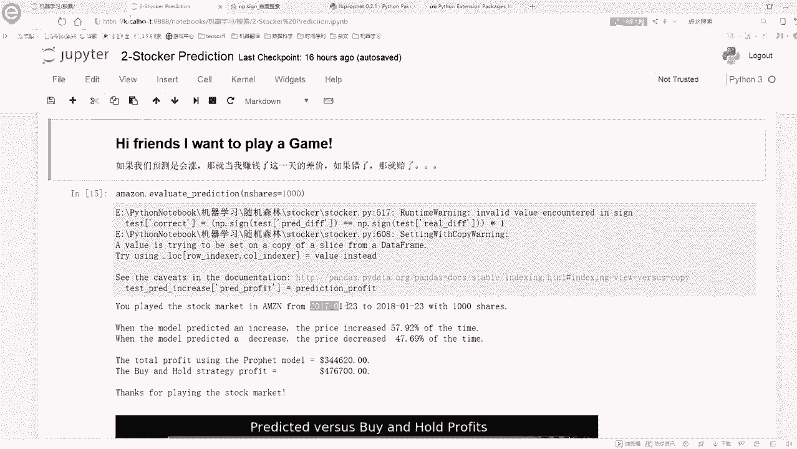

## 模型应用：简单的交易策略模拟

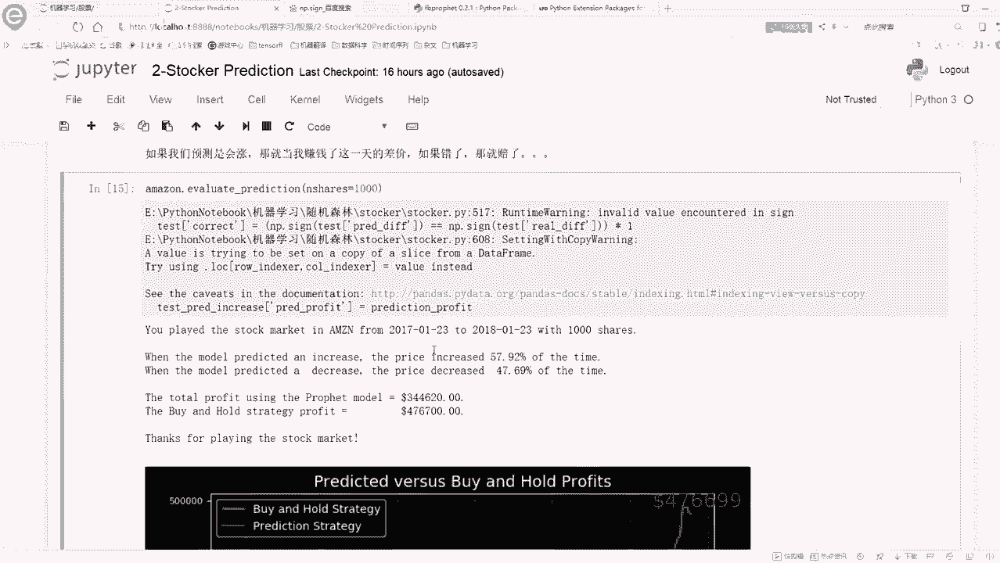

Prophet模型不仅可以预测价格，还可以用于构建简单的交易策略逻辑进行模拟。我们设计了一个小游戏来验证预测的实用性：

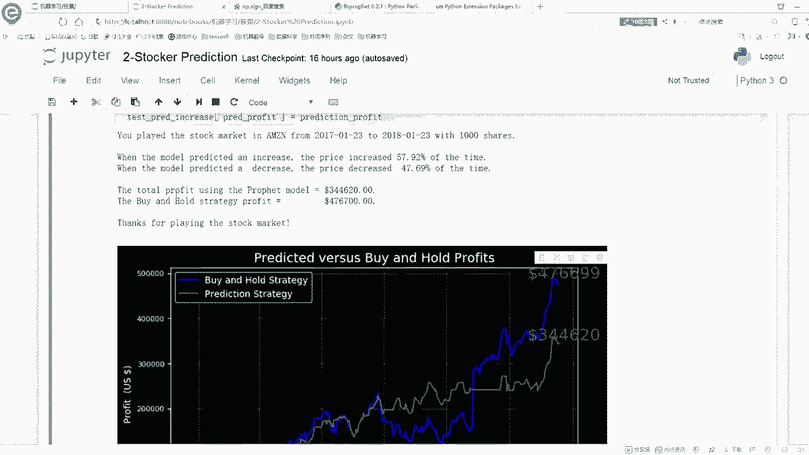

*   **规则**：基于模型对次日股价“涨”或“跌”的预测进行决策。若预测涨，则当日买入并在次日卖出，赚取差价；若预测跌，则不持有。
*   **结果**：在2017-2018年的特定时间段内模拟，该策略的预测准确率接近50%，并能获得一定累积收益。但这**绝不意味着**该模型能稳定盈利。金融市场极其复杂，在不同时间段（如2008-2009年金融危机期间）模拟，策略很可能亏损。这说明了预测模型在实际交易中的局限性。

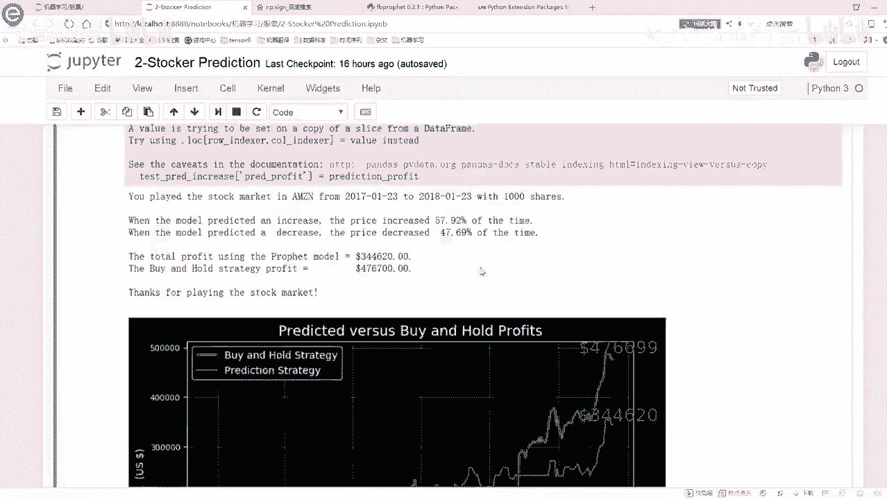

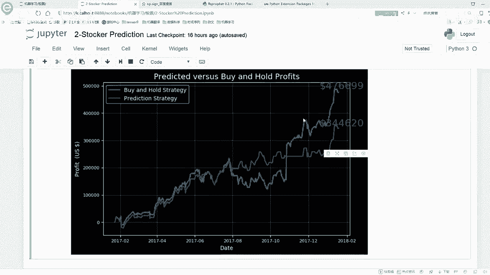

## 预测未来价格

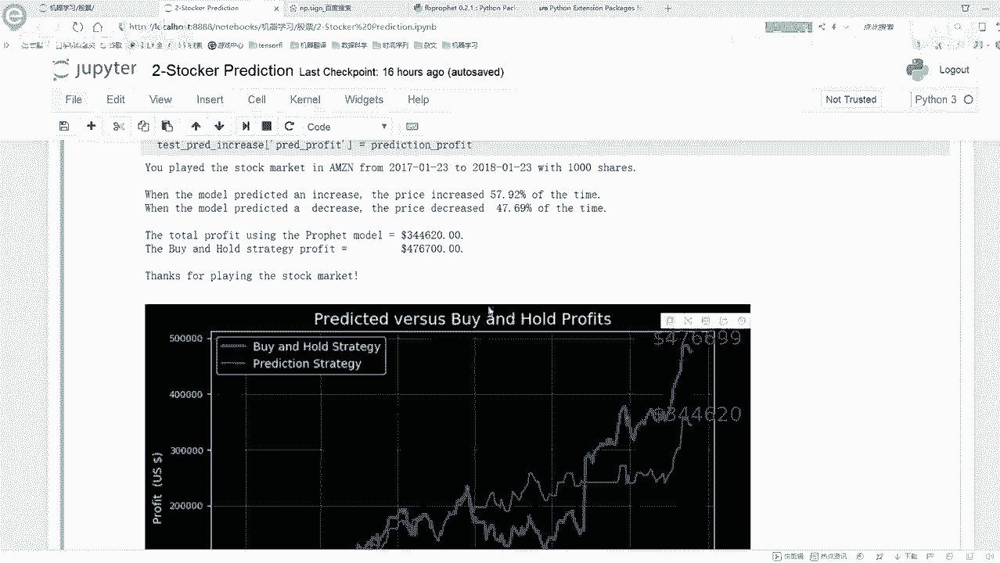

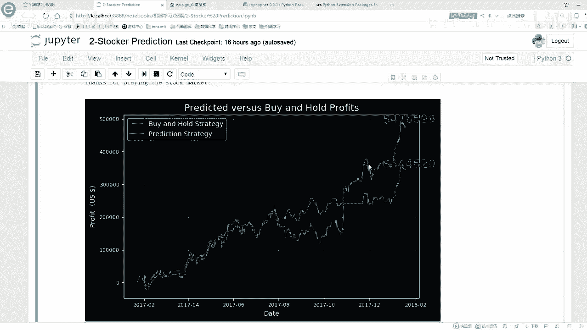

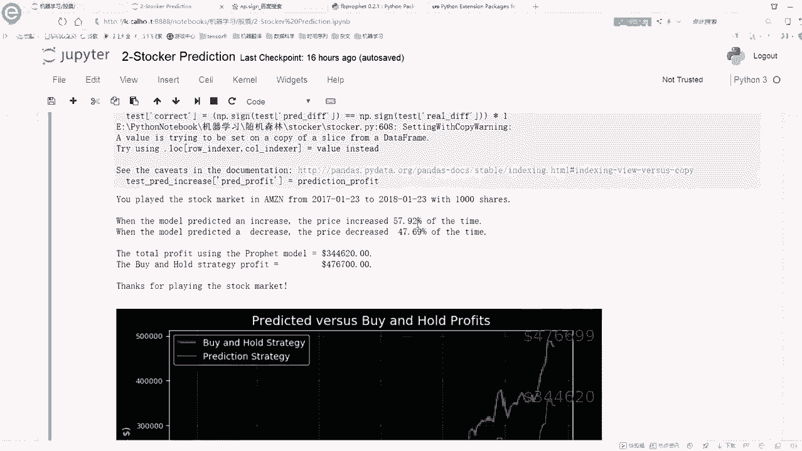

调整好参数的模型可以方便地预测未来任意天数的价格。只需指定 `periods` 参数即可。

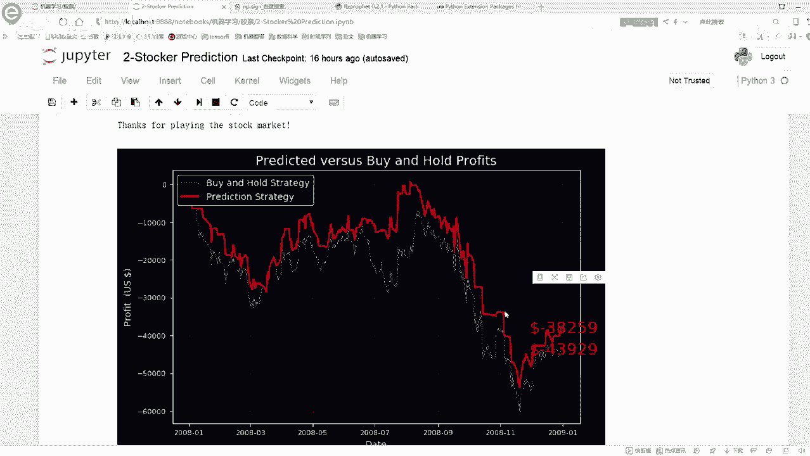

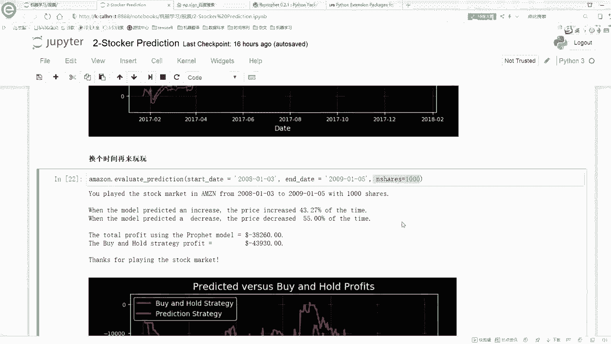

```python
# 预测未来10天
future = model.make_future_dataframe(periods=10)
forecast = model.predict(future)
# 输出预测结果，包括预测值(yhat)、预测区间(yhat_upper, yhat_lower)
print(forecast[['ds', 'yhat', 'yhat_upper', 'yhat_lower']].tail(10))
```

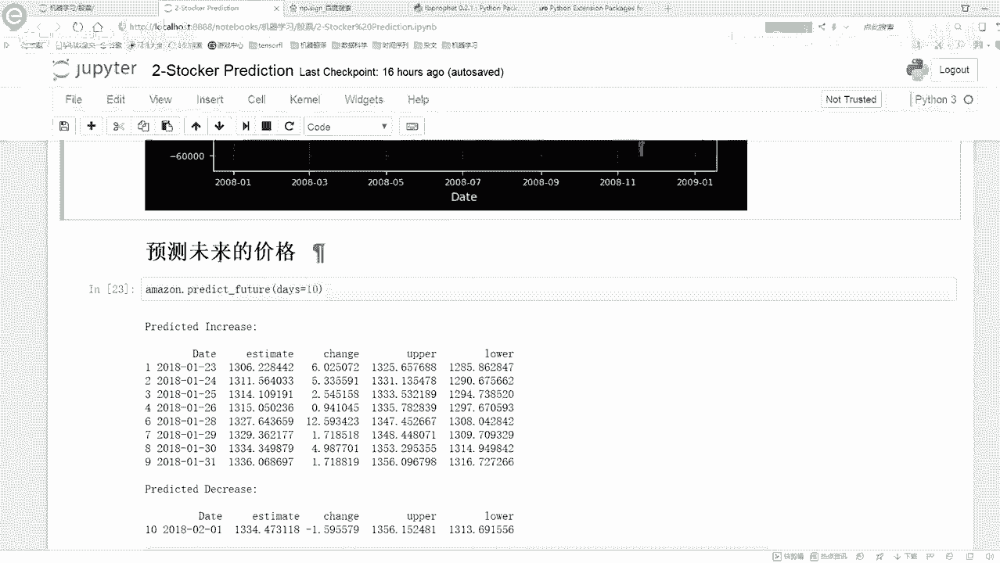

需要注意的是，预测的时间越远，模型的不确定性越大，预测区间也会越宽。

## 总结

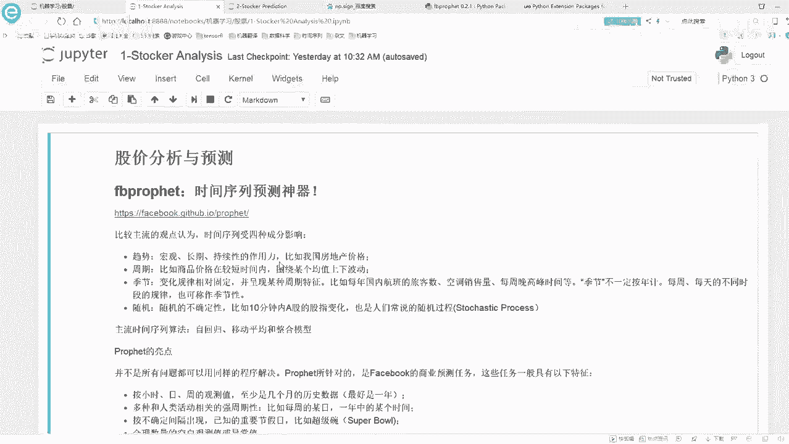

本节课中我们一起学习了Prophet模型的核心调参技巧。我们深入探讨了 `changepoint_prior_scale` 参数如何影响模型的拟合行为与预测性能，并通过实验对比和误差评估，找到了针对特定数据集的最优参数值。我们还演示了如何将预测结果应用于简单的策略模拟，并强调了金融预测的复杂性。要深入了解Prophet的每个参数和功能，强烈建议结合官方文档进行学习与实践。