# AI量化交易实战课程：第六章：期权交易基础与数据处理


## 概述
在本节课中，我们将学习期权交易的基础知识，并探讨如何构建用于期权研究和交易的Python类。我们将从获取和处理期权数据开始，逐步实现期权的定价、希腊字母计算以及隐含波动率的求解。

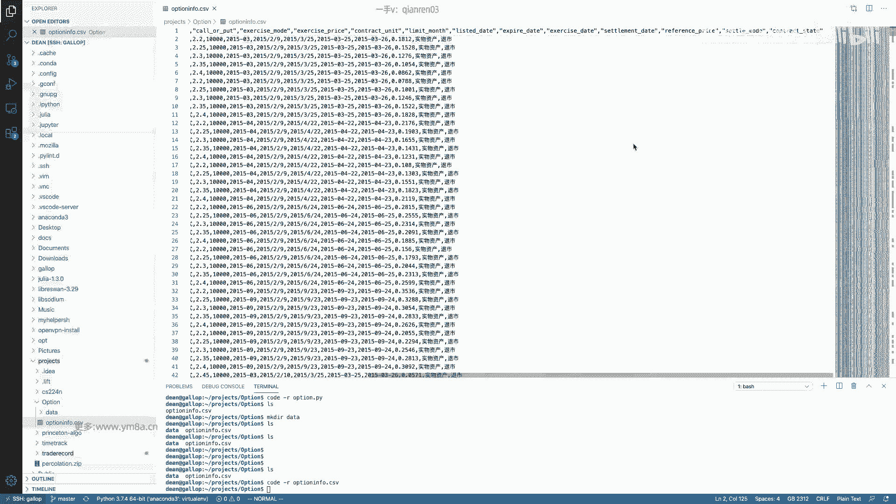

## 什么是期权？📈

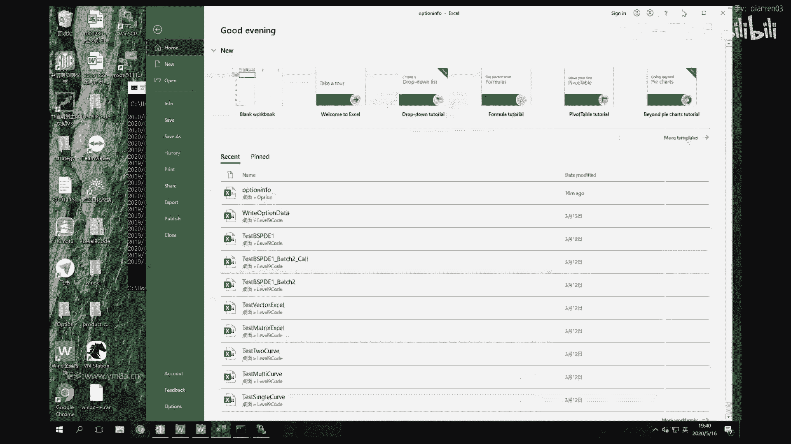

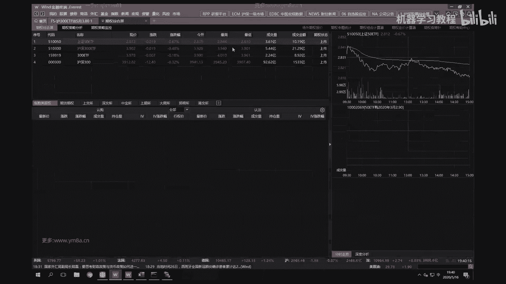

上一节我们介绍了特征组合，本节中我们来看看金融衍生品中一个重要的领域——期权。期权是一种赋予持有者在未来特定日期或之前，以特定价格买入或卖出标的资产权利的合约。

期权主要分为看涨期权和看跌期权。看涨期权赋予持有者买入的权利，而看跌期权赋予持有者卖出的权利。期权的价值由多个因素决定，包括标的资产价格、行权价、到期时间、无风险利率和波动率。

## 期权数据获取与处理

要进行期权研究，第一步是获取和处理数据。我们需要两类数据：期权合约的基本信息和市场行情数据。

以下是期权合约基本信息通常包含的字段：

*   **合约代码**：期权的唯一标识符。
*   **标的资产**：期权对应的基础资产，如ETF或指数。
*   **期权类型**：欧式或美式。
*   **行权价**：合约规定的买卖价格。
*   **合约乘数**：每张合约对应的标的资产数量。
*   **上市日**：合约开始交易的日期。
*   **到期日**：合约失效的日期。

市场行情数据则包括每个时间点的价格、买卖盘口等信息。对于ETF期权，其交易时间与股票市场一致。处理原始tick数据时，需要注意合成分钟数据的方法，并避免引入未来数据偏差。

## 构建期权定价类

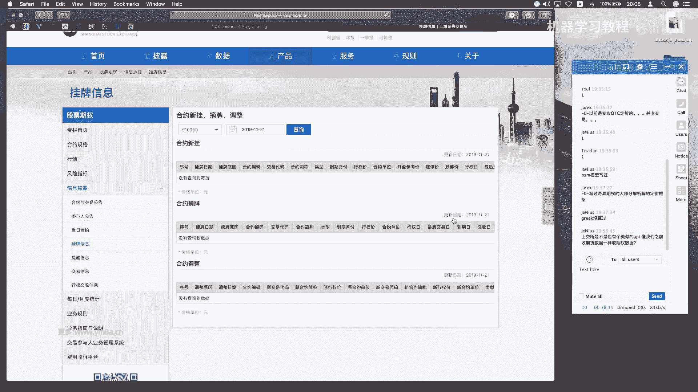

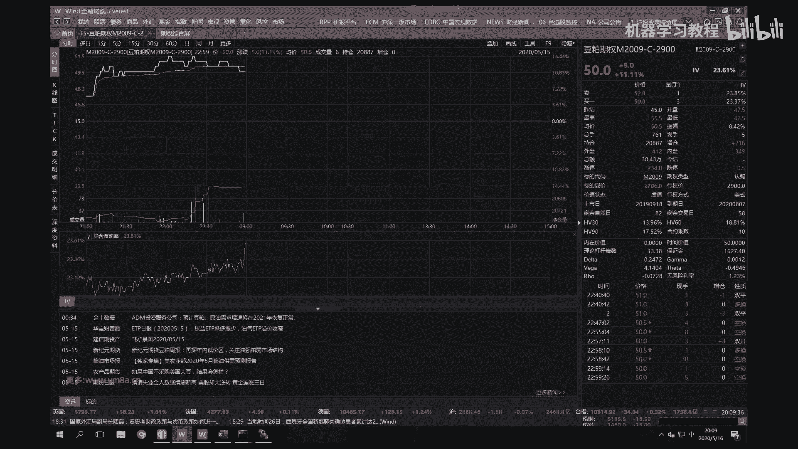

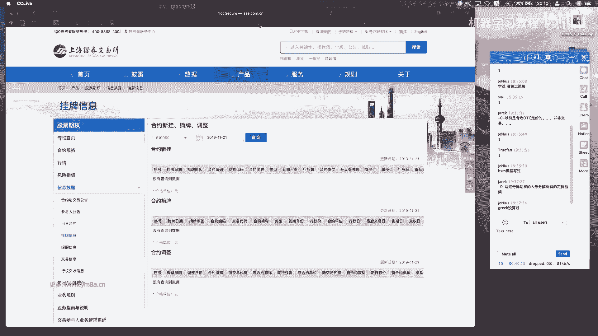

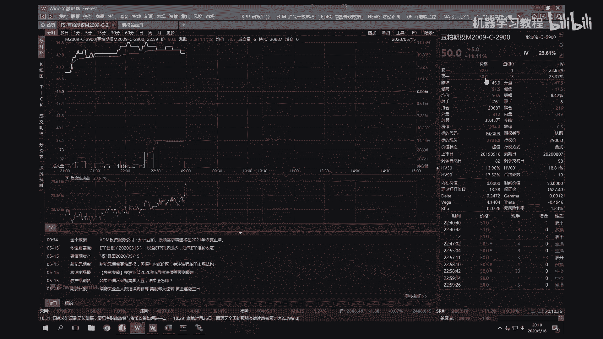

有了数据基础，接下来我们需要构建核心的计算工具。我们将创建一个`EuropeanOption`类，用于计算期权的理论价格和希腊字母。

首先，我们定义类的初始化方法，用于存储期权的基本参数。

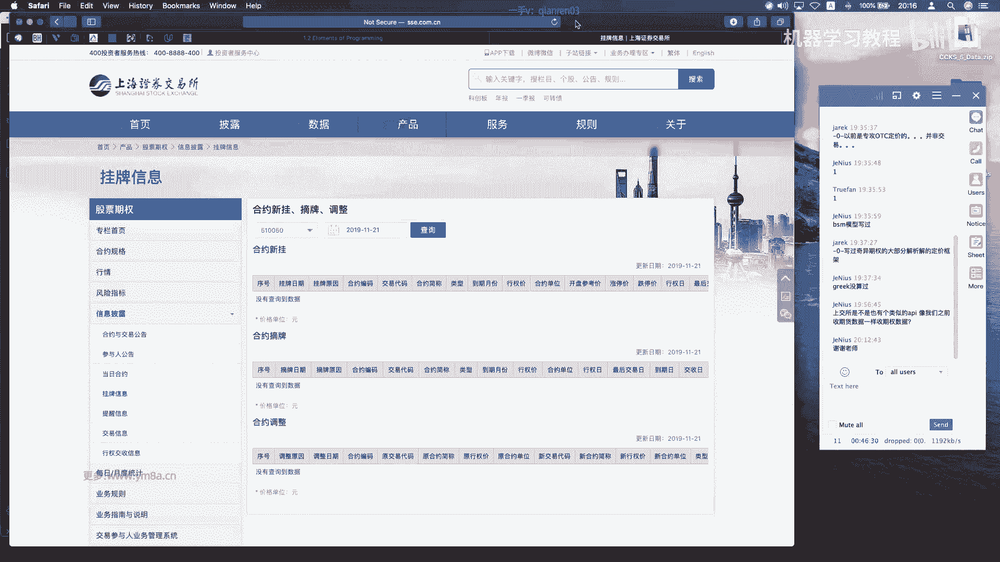


```python
class EuropeanOption:
    def __init__(self, S, K, T, sigma, r, option_type='call'):
        """
        初始化欧式期权
        :param S: 标的资产价格
        :param K: 行权价
        :param T: 到期时间（年）
        :param sigma: 波动率
        :param r: 无风险利率
        :param option_type: 期权类型，'call' 或 'put'
        """
        self.S = S
        self.K = K
        self.T = T
        self.sigma = sigma
        self.r = r
        self.option_type = option_type.lower()
        # 计算中间变量 d1 和 d2
        self.d1 = (np.log(self.S / self.K) + (self.r + 0.5 * self.sigma**2) * self.T) / (self.sigma * np.sqrt(self.T))
        self.d2 = self.d1 - self.sigma * np.sqrt(self.T)
```

接着，我们实现布莱克-斯科尔斯模型的定价公式。看涨期权的定价公式为：

**C = S * N(d1) - K * e^{-rT} * N(d2)**

其中，`N(·)`是标准正态分布的累积分布函数。

```python
    def price(self):
        """计算期权理论价格"""
        from scipy.stats import norm
        if self.option_type == 'call':
            price = self.S * norm.cdf(self.d1) - self.K * np.exp(-self.r * self.T) * norm.cdf(self.d2)
        elif self.option_type == 'put':
            # 看跌期权定价公式（由同学课后完成）
            price = self.K * np.exp(-self.r * self.T) * norm.cdf(-self.d2) - self.S * norm.cdf(-self.d1)
        else:
            raise ValueError("option_type 必须为 'call' 或 'put'")
        return price
```

## 计算希腊字母

希腊字母用于衡量期权价格对各种风险因素的敏感度。我们将实现`Delta`和`Gamma`的计算。

`Delta`衡量标的资产价格变动对期权价格的影响。看涨期权的`Delta`公式为：

**Δ = N(d1)**

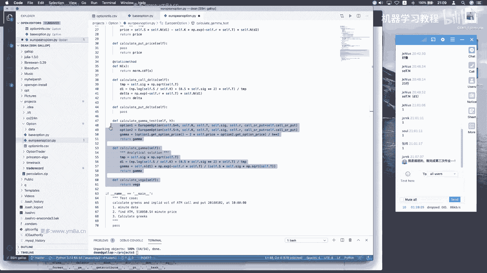

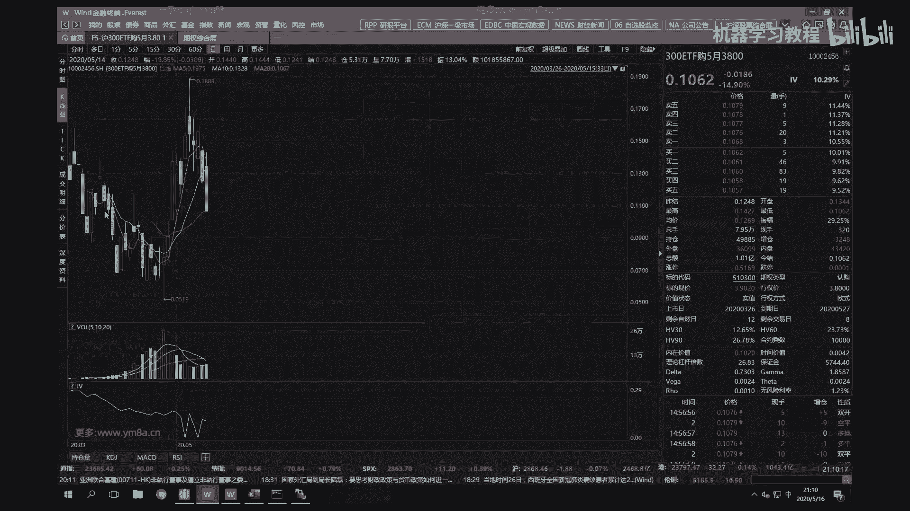

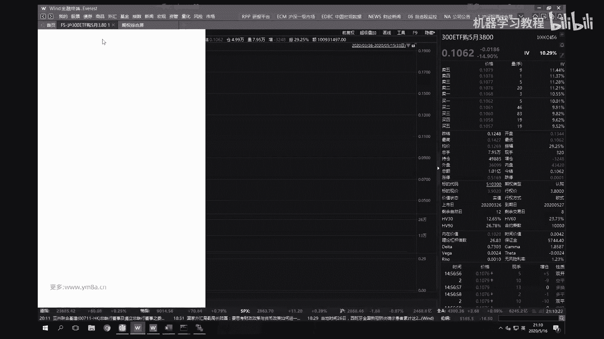

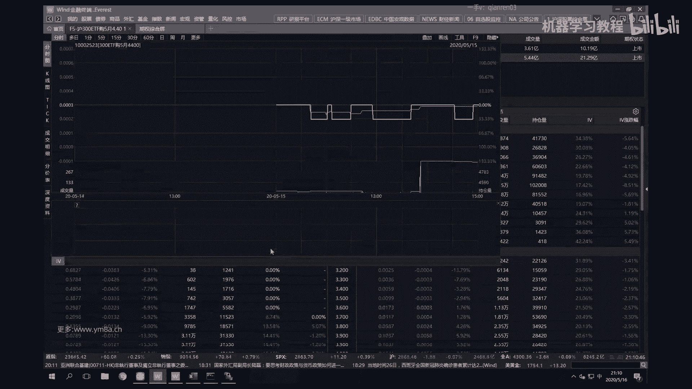

`Gamma`衡量`Delta`相对于标的资产价格的变化率，即标的资产价格变动的二阶导数。看涨和看跌期权的`Gamma`相同：

**Γ = N'(d1) / (S * σ * √T)**

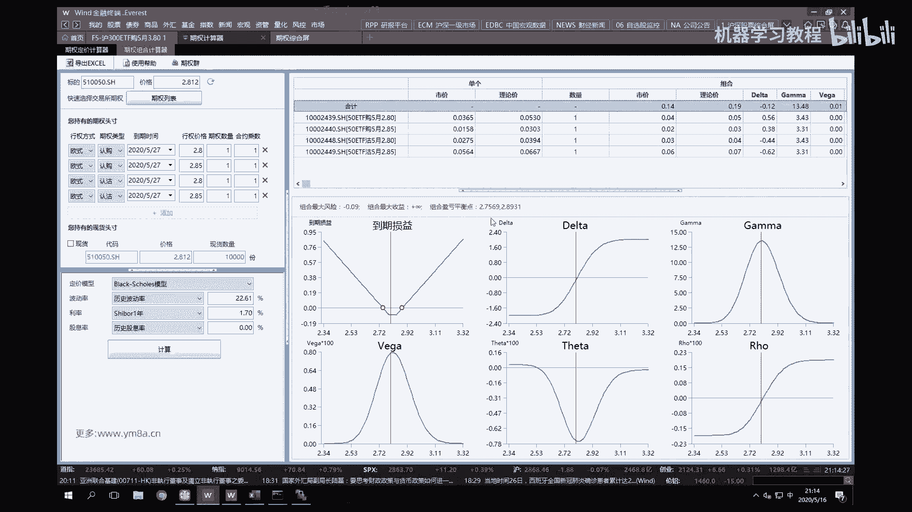

其中，`N'(·)`是标准正态分布的概率密度函数。

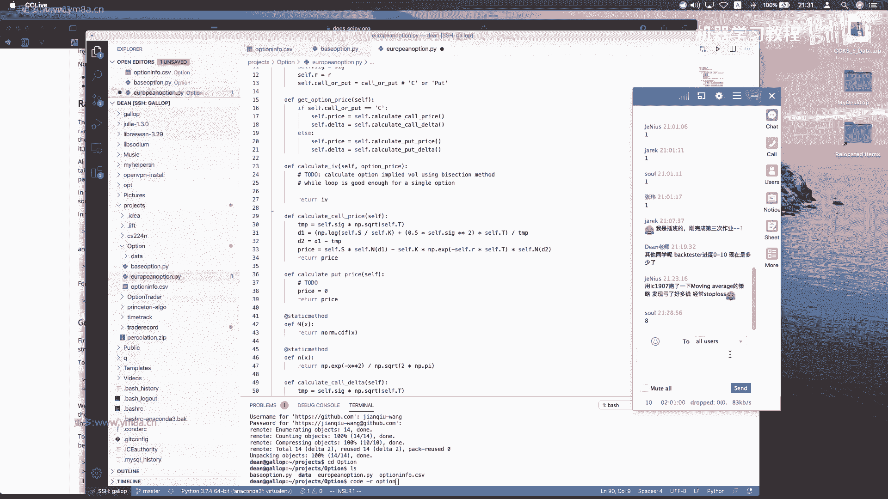

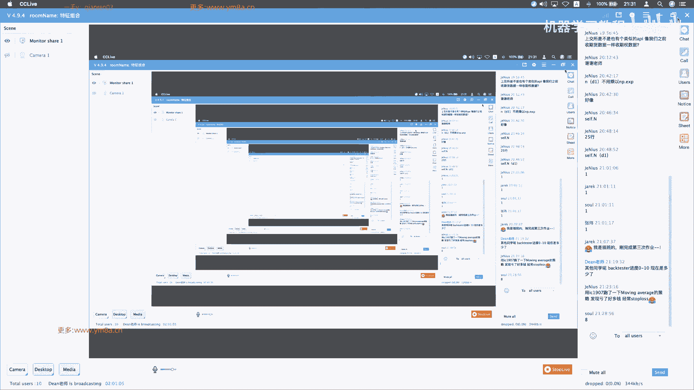

```python
    def delta(self):
        """计算期权的 Delta 值"""
        from scipy.stats import norm
        if self.option_type == 'call':
            delta = norm.cdf(self.d1)
        else: # put
            delta = norm.cdf(self.d1) - 1
        return delta

    def gamma(self):
        """计算期权的 Gamma 值"""
        from scipy.stats import norm
        # 标准正态分布的概率密度函数
        pdf_d1 = norm.pdf(self.d1)
        gamma = pdf_d1 / (self.S * self.sigma * np.sqrt(self.T))
        return gamma
```

## 计算隐含波动率

隐含波动率是将市场上观察到的期权价格代入定价模型后，反推出来的波动率。它反映了市场对未来波动率的预期。

由于定价公式无法直接反解出波动率，我们需要使用数值方法。这里介绍二分法。其核心思想是，在合理的波动率范围内（例如0.1%到1000%），不断缩小范围，直到模型计算出的价格与市场价格之差小于预设的容错值。

为了提高计算效率，当需要同时计算大量期权的隐含波动率时，建议采用向量化操作，并对所有合约统一执行固定次数的二分迭代，而不是为每个合约动态判断收敛。

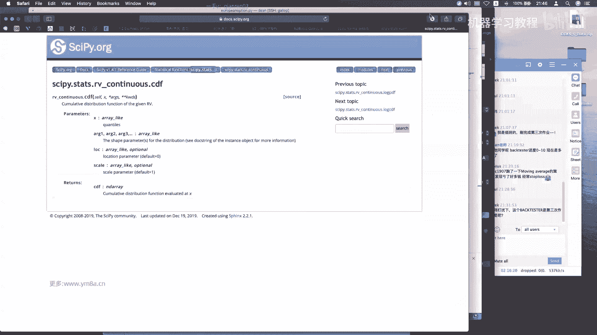

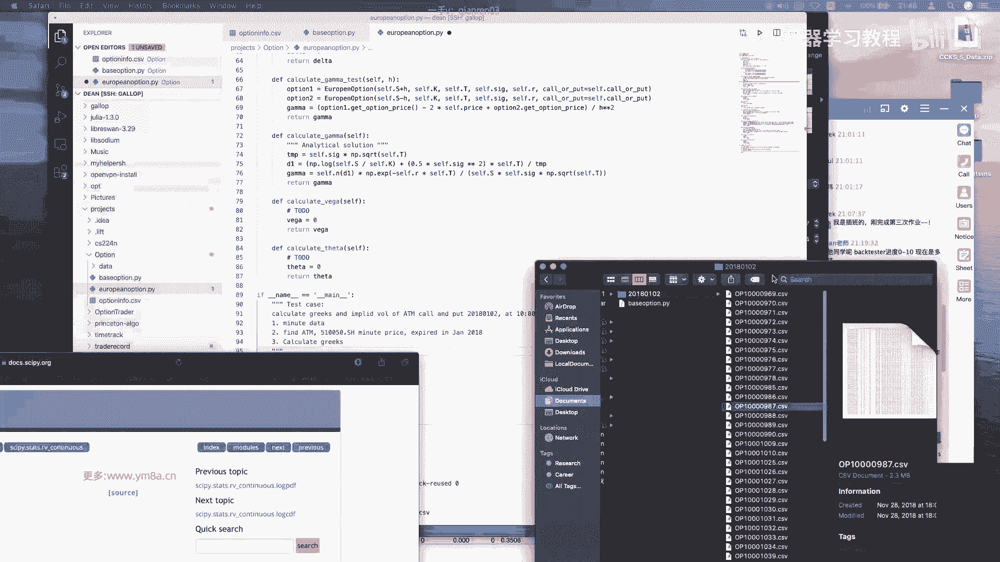

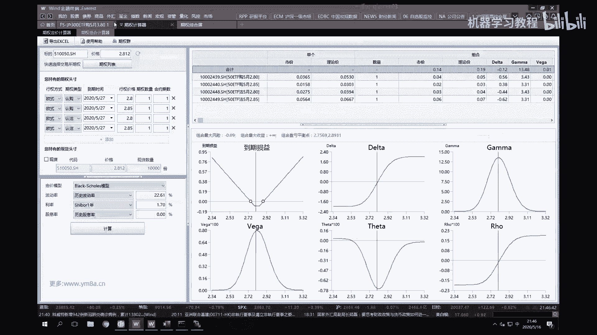

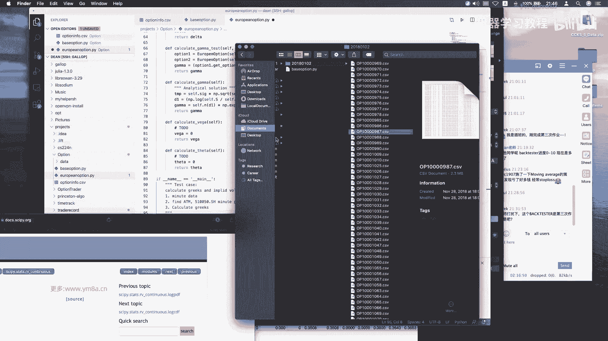

```python
    def implied_volatility(self, market_price, low=0.001, high=10.0, tolerance=1e-6, max_iterations=100):
        """
        使用二分法计算隐含波动率
        :param market_price: 观察到的市场价格
        :param low: 波动率搜索下限
        :param high: 波动率搜索上限
        :param tolerance: 价格容忍度
        :param max_iterations: 最大迭代次数
        :return: 隐含波动率
        """
        for i in range(max_iterations):
            mid = (low + high) / 2.0
            # 临时创建一个波动率为mid的期权对象来计算价格
            # 注意：这里需要根据实际类结构调整，可能需要复制当前对象并修改sigma
            temp_option = EuropeanOption(self.S, self.K, self.T, mid, self.r, self.option_type)
            mid_price = temp_option.price()
            
            if abs(mid_price - market_price) < tolerance:
                return mid
                
            # 判断搜索方向
            # 如果模型价格低于市场价格，说明波动率偏低，应向右搜索
            if mid_price < market_price:
                low = mid
            else:
                high = mid
                
        # 如果达到最大迭代次数仍未收敛，返回中间值
        return (low + high) / 2.0
        # 注意：对于生产环境，需要考虑未收敛情况的处理，例如抛出异常或记录日志。
```

## 数据处理与回测框架整合

将上述计算模块整合到量化研究流程中，是下一步的关键。我们需要：

1.  **历史数据处理**：遍历历史数据，为每个合约在每分钟（或所需频率）计算并保存价格、希腊字母和隐含波动率。建议将结果存入数据库（如MongoDB）以便快速查询。
2.  **整合回测系统**：修改之前构建的回测框架，使其能够接收和处理期权的“快照”数据（即某一时刻所有合约的梯形报价表）。策略逻辑需要基于整个期权市场的状态（如波动率曲面、各希腊字母暴露）来生成交易信号。
3.  **注意特殊事件**：在处理历史数据时，要特别注意合约分红事件。分红会导致合约乘数和行权价发生调整，需要根据交易所规则进行复权处理，以保证数据连续性。

## 总结

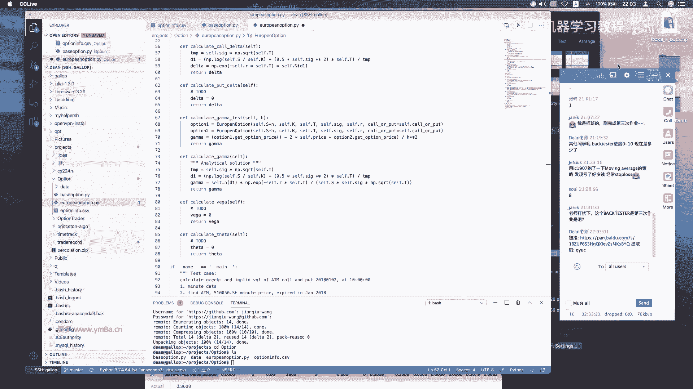

本节课中我们一起学习了期权交易的基础。我们从获取和处理期权数据开始，逐步构建了一个用于欧式期权定价和希腊字母计算的Python类，并探讨了使用二分法计算隐含波动率的原理。最后，我们讨论了如何将这些计算模块整合到更大的研究框架和回测系统中。掌握这些基础工具，是进一步探索期权波动率交易、套利策略和复杂投资组合管理的重要第一步。