# Kaggle竞赛Gresearch世界第三代码解读：P1：高频交易LightGBM调参与特征工程 🚀

## 概述
在本节课中，我们将解读Kaggle Gresearch加密货币预测竞赛中排名第三的公开解决方案代码。我们将重点关注其数据处理流程、LightGBM模型的关键参数设置以及核心的特征工程技巧。通过本次学习，你将理解如何构建一个高效的时间序列预测模型。

---

## 数据与库导入 📦

首先，代码导入了所有必要的Python库。这些库涵盖了数据处理、模型训练、进度显示和内存管理等多个方面。

以下是导入的库及其简要说明：

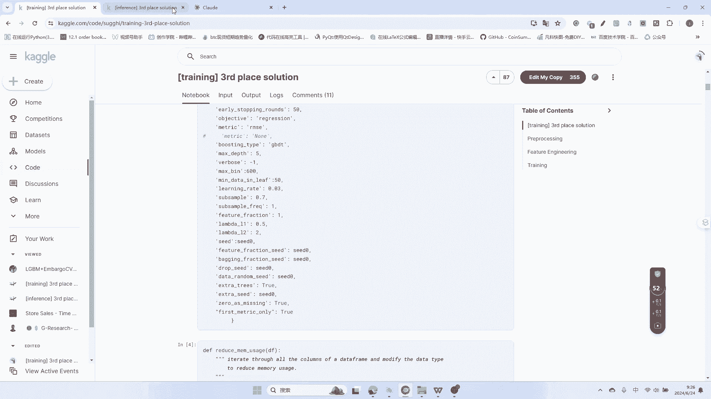

*   **数据处理与科学计算**：`pandas`, `numpy`
*   **可视化**：`matplotlib`, `seaborn`
*   **核心模型**：`lightgbm`
*   **竞赛数据接口**：`gresearch_crypto`
*   **时间与存储**：`datetime`, `pickle`
*   **内存与进度管理**：`gc` (垃圾回收), `tqdm` (进度条)

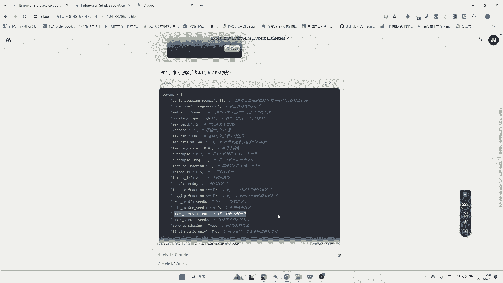

```python
import pandas as pd
import numpy as np
import matplotlib.pyplot as plt
import seaborn as sns
import lightgbm as lgb
from gresearch_crypto import *
import datetime
import pickle
import gc
from tqdm import tqdm
```

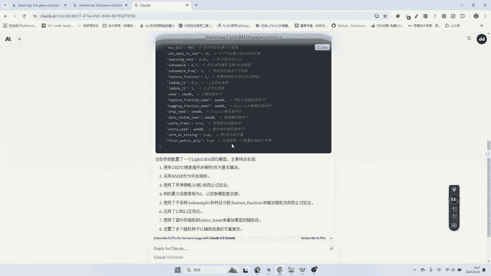

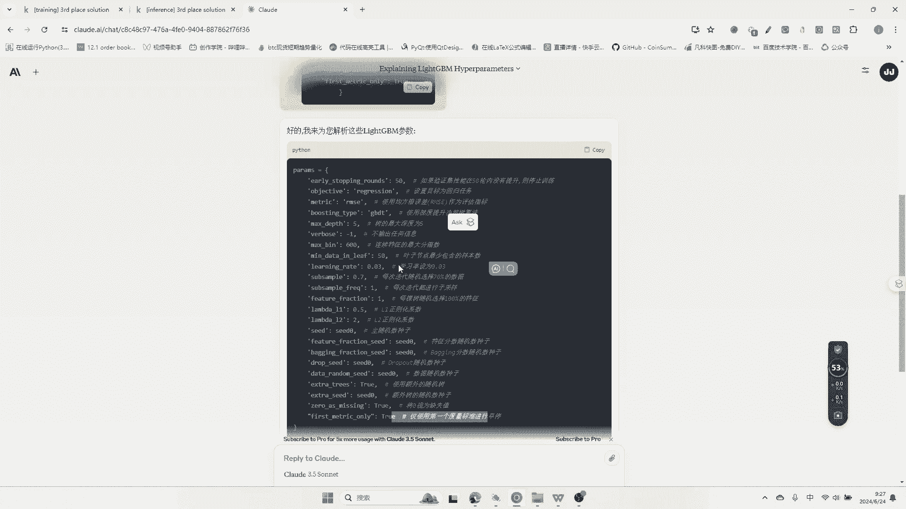

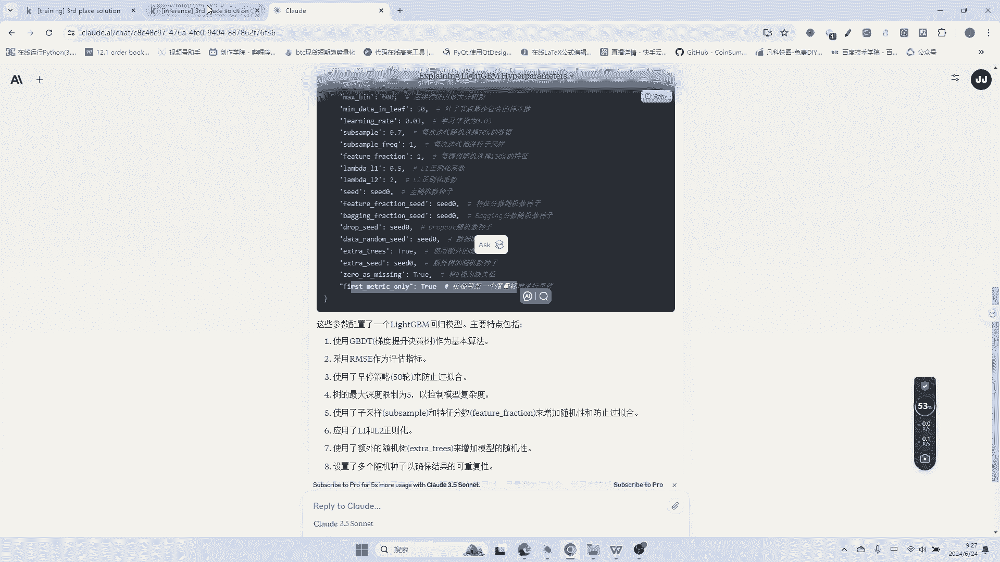

---

## 关键参数与配置 ⚙️

上一节我们介绍了代码的基础环境，本节中我们来看看模型训练和数据处理的关键配置。

代码设置了一系列重要参数，以确保实验的可重复性和模型的有效性。

*   **交叉验证**：使用 `TimeSeriesSplit`，设置 `n_splits=7`，确保时间序列数据在分割时不会发生信息泄露。
*   **随机种子**：`seed = 666`，固定随机性，使结果可复现。
*   **数据读取**：加载三个核心数据集：`train.csv`, `supplemental_train.csv`, `asset_details.csv`。
*   **Pandas显示设置**：调整`pandas`的显示选项，便于在Notebook中查看数据。
*   **特征工程窗口**：定义了用于计算滚动统计量的时间窗口（秒）：`[60, 300, 900]`，对应1分钟、5分钟和15分钟。

**核心的LightGBM参数**如下：
```python
params = {
    ‘objective‘: ‘regression‘,          # 回归任务
    ‘metric‘: ‘rmse‘,                   # 评估指标：均方根误差
    ‘boosting_type‘: ‘gbdt‘,            # 梯度提升决策树
    ‘max_depth‘: 5,                     # 树的最大深度
    ‘num_leaves‘: 50,                   # 叶子节点数，用于控制复杂度
    ‘learning_rate‘: 0.03,              # 学习率
    ‘subsample‘: 0.7,                   # 每次迭代随机采样70%的数据
    ‘colsample_bytree‘: 1.0,            # 每棵树使用100%的特征
    ‘reg_alpha‘: 0,                     # L1正则化系数
    ‘reg_lambda‘: 0,                    # L2正则化系数
    ‘n_jobs‘: -1,                       # 使用所有CPU核心
    ‘verbosity‘: -1,                    # 不输出训练信息
    ‘early_stopping_rounds‘: 50,        # 早停轮数：50轮无提升则停止
    ‘zero_as_missing‘: True,            # 将0视为缺失值
    ‘first_metric_only‘: True           # 仅使用第一个评估指标进行早停
}
```
这些参数共同作用，旨在控制模型复杂度、防止过拟合并提升训练效率。

---

## 内存优化与数据预处理 💾

在加载大规模数据时，内存管理至关重要。代码定义了一个函数 `reduce_memory_usage` 来优化 `DataFrame` 的内存占用。

其核心思想是：为每一列数据选择尽可能小的数据类型。例如，能用`int8`存储的整数就不用`int16`，能用`float16`存储的浮点数就不用`float32`。通过遍历每列数据的最大值和最小值，将其向下转换到最节省内存的数据类型。

应用此函数后，数据内存占用从约1.2GB减少到约484MB，显著提升了后续处理效率。

接着，代码合并了训练集和补充训练集，并对每个资产（`asset_id`，共14个）的数据进行单独处理，为后续的特征工程做准备。

---

## 核心特征工程 🛠️

特征工程是提升模型性能的关键。该方案的核心特征是计算**对数收益率**与其**滚动平均**的差值。

具体步骤如下：

1.  **前向填充**：对每个资产的收盘价序列中的缺失值进行前向填充，最多填充100个周期。
2.  **时间标签**：根据时间戳生成标志位，区分不同阶段的数据（如测试期）。
3.  **计算滞后特征**：
    *   对于每个预设的时间窗口 `lag` (例如60秒)。
    *   计算当前收盘价的对数值与 `lag` 期前收盘价对数值的差值。公式为：
        `log_return = log(close_t) - log(close_{t-lag})`
    *   计算该对数收益率在最近一个窗口（例如300秒）内的滚动平均值。
    *   生成新特征：`log_return - rolling_mean(log_return)`。这个特征反映了近期收益率相对于其短期均线的偏离程度，是有效的预测因子。

这种方法避免了使用未来数据（信息泄露），并且生成了大量有意义的特征，将原始数据的列数扩展到了约190列。

---

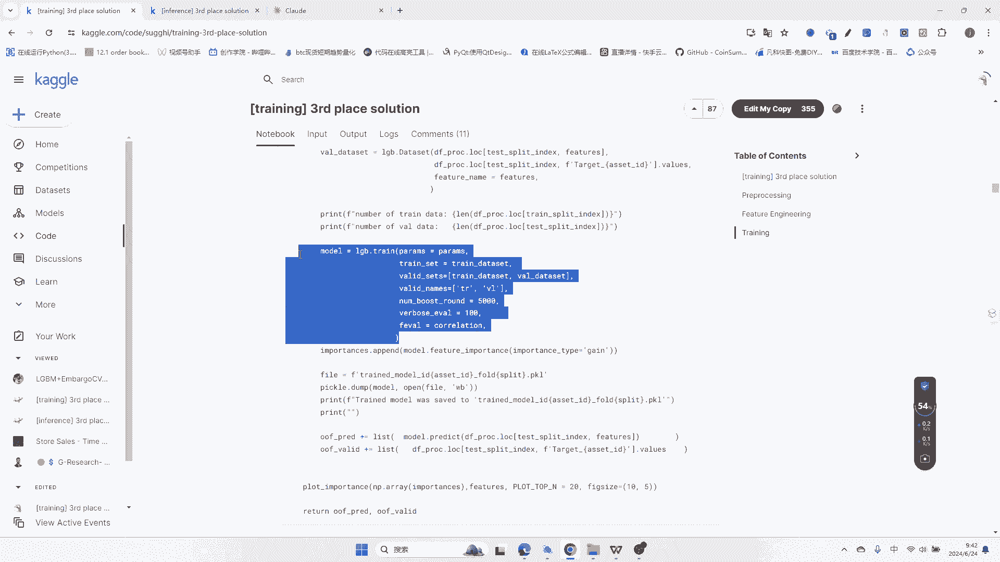

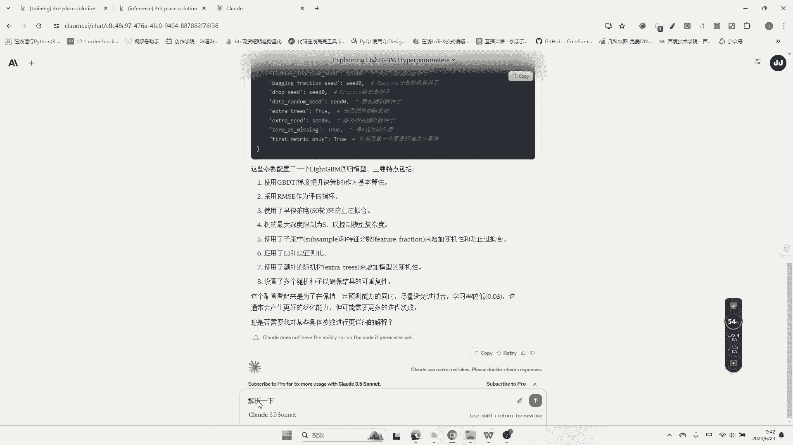

## 自定义评估指标与交叉验证 📊

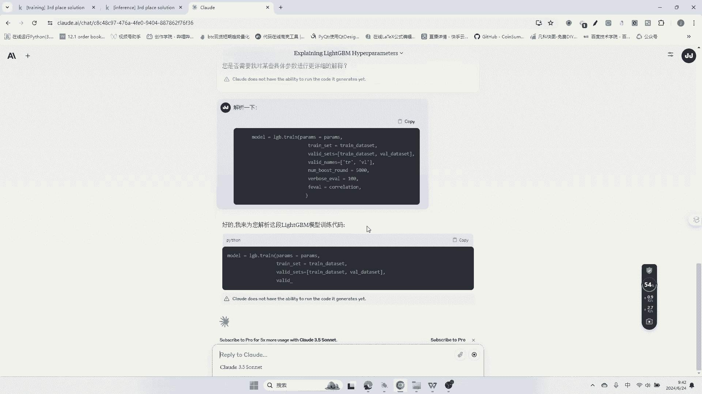

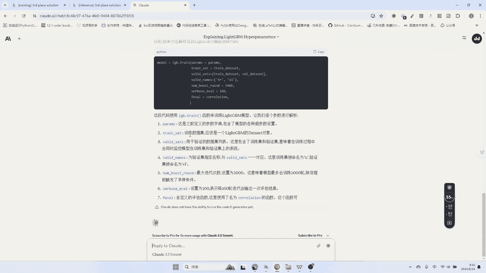

在模型训练中，代码使用了一个自定义的评估指标 `correlation`，它计算的是预测值与真实目标值之间的相关性。这个指标被集成到LightGBM的训练过程中，用于监控模型性能。

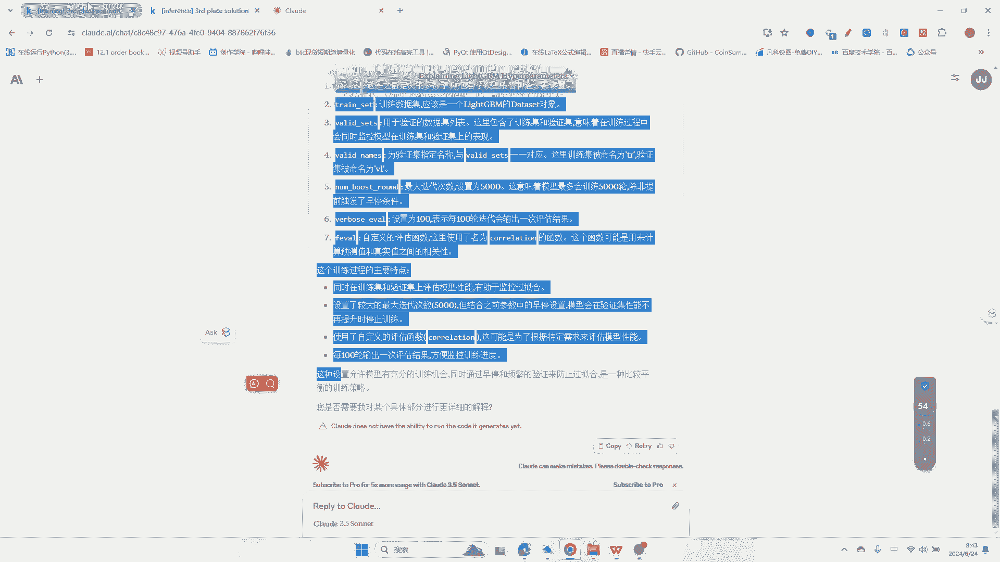

交叉验证采用了严格的时间序列分割方法 `get_time_series_cv`。对于每个资产：
*   将数据按时间顺序分为7折。
*   在分割时，会丢弃因计算滚动特征（如3750秒窗口）而产生的初始无效数据（NaN），确保训练集和验证集的纯净。
*   这种分割方式严格模拟了现实中的时间推移预测场景。

---

## 模型训练与结果分析 🚂

准备工作完成后，代码进入模型训练循环。对于14个资产中的每一个，都进行7折交叉验证。

训练过程的核心调用如下：
```python
model = lgb.train(
    params,
    train_set,
    valid_sets=[train_set, valid_set],
    num_boost_round=5000,
    callbacks=[lgb.log_evaluation(100)],
    feval=correlation # 使用自定义评估函数
)
```
*   `early_stopping_rounds=50` 会监控验证集上的 `correlation` 分数，如果连续50轮没有提升，则停止训练。
*   每训练100轮输出一次日志。
*   训练完成后，模型被保存为 `.pkl` 文件，同时记录特征重要性。

特征重要性分析显示，基于 `log_return - rolling_mean` 构建的特征（如 `log_return_60_roll_mean_300`）具有最高的增益（`importance_type=‘gain‘`），这证实了特征工程的有效性。

最终，通过加权平均所有资产的验证集预测结果，得到了一个整体的评估分数。

---

## 总结

本节课我们一起学习了Kaggle Gresearch竞赛世界第三解决方案的核心代码。我们重点剖析了以下几个部分：

1.  **环境与配置**：了解了必要的库、严格的时间序列交叉验证设置以及精心调参的LightGBM模型配置。
2.  **高效数据处理**：学习了通过数据类型向下转换来优化内存使用的方法。
3.  **核心特征工程**：掌握了构建“对数收益率与其滚动平均差值”这一强有效特征的具体步骤，这是该方案成功的关键。
4.  **模型训练流程**：理解了如何集成自定义评估指标、实施早停策略，以及按资产进行独立模型训练和评估的完整流程。

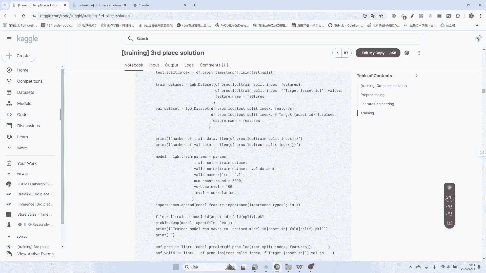

该方案为我们提供了处理金融时间序列数据的宝贵范例，特别是在特征构建、防止数据泄露和模型调优方面，具有很高的参考价值。