# Kaggle竞赛Gresearch预测目标：P1：高频交易目标计算详解 🎯

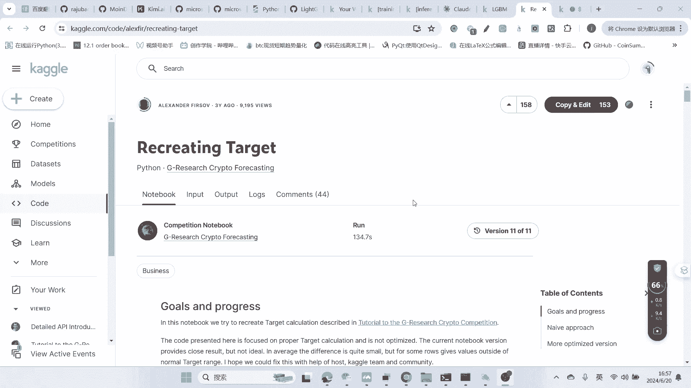

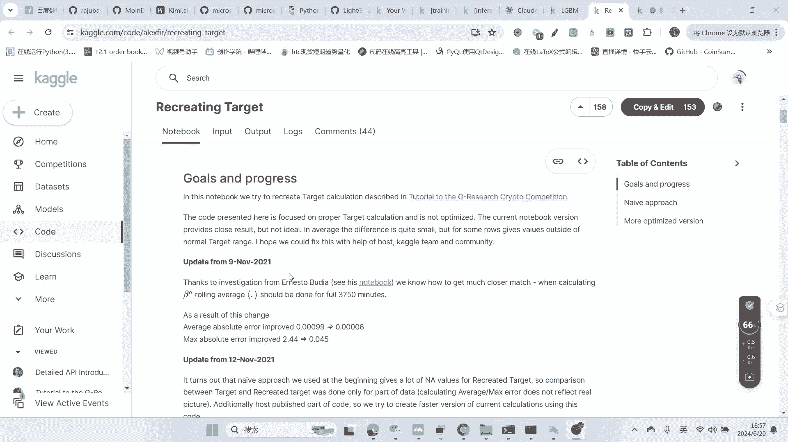

在本节课中，我们将学习如何计算Kaggle Gresearch竞赛中的核心预测目标。这个目标是一个经过市场风险调整后的未来对数收益率。我们将逐步解析其计算公式，并解读实现该计算的Python代码。

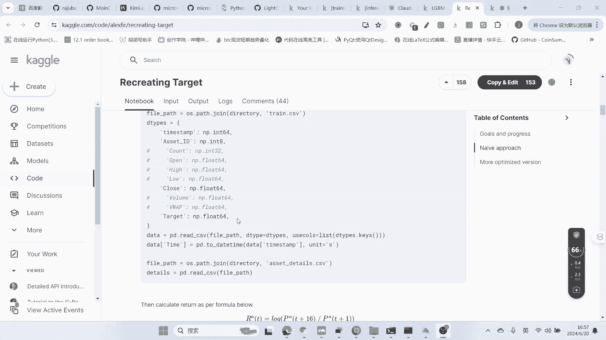

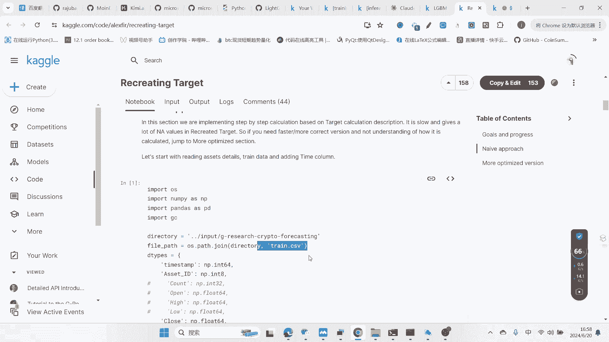

## 概述

Gresearch竞赛的目标是预测一个特定的金融指标。该指标本质上是单个资产在15分钟后的对数收益率，减去其基于市场组合的贝塔值调整后的部分。理解并准确计算这个目标是构建有效预测模型的第一步。

## 数据加载与预处理

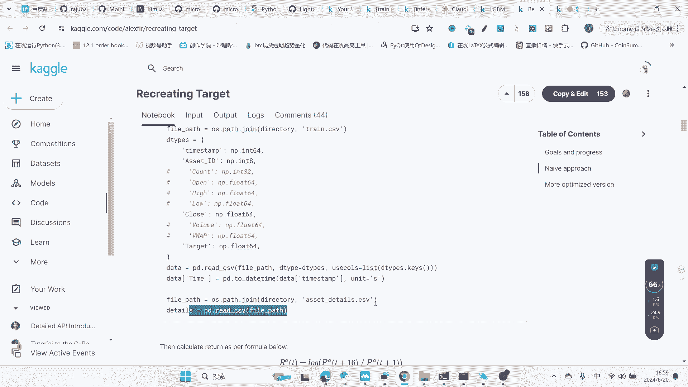

首先，代码需要加载并预处理原始数据。这一步为后续计算准备干净、格式正确的数据。

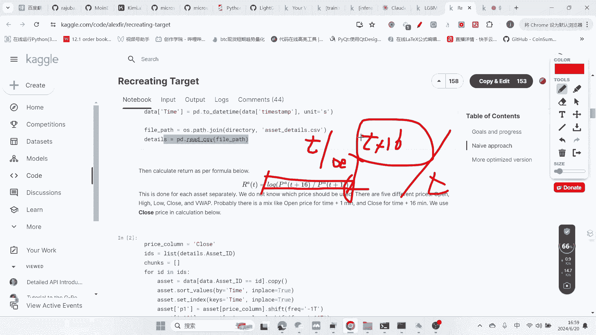

以下是数据加载与预处理的关键步骤：

1.  **读取数据**：从指定目录读取CSV格式的交易数据。
2.  **指定数据类型**：为节省内存，显式指定各列的数据类型。例如，时间戳`date_id`和`seconds_in_bucket`通常使用较小的整数类型（如`np.uint16`或`np.uint32`），而价格`close`使用浮点类型（如`np.float64`）。
3.  **加载资产权重**：读取资产详细信息文件，获取每个资产在计算市场组合时的对应权重`weight`。

经过这些步骤，我们得到了一个包含价格、时间戳和资产权重的`DataFrame`，为计算收益率做好了准备。

## 计算对数收益率 (log_return)

上一节我们准备好了数据，本节中我们来看看如何计算核心的第一步：单个资产在15分钟后的对数收益率。

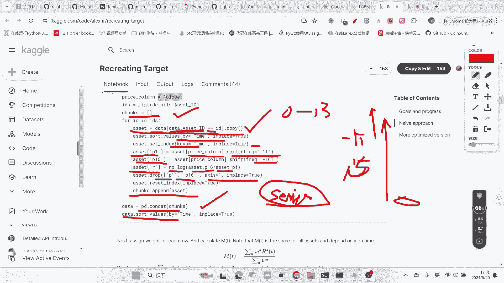

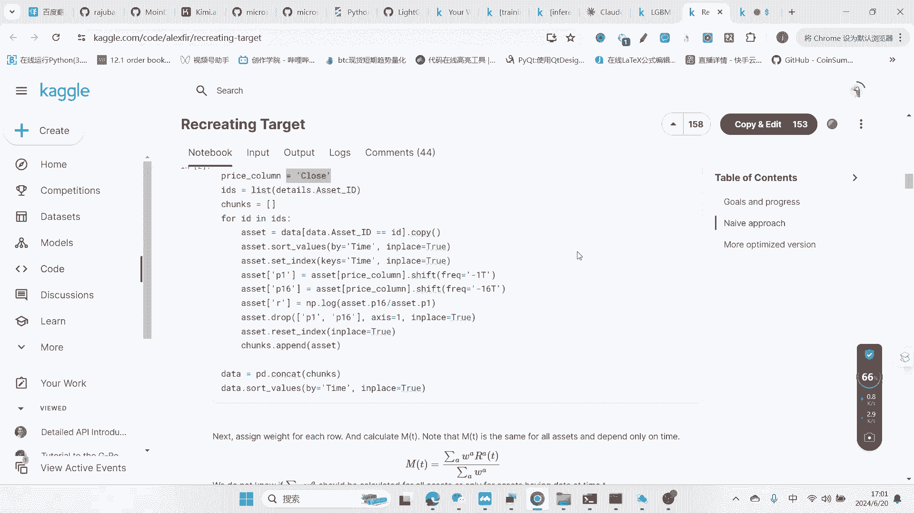

对数收益率的计算公式为：
**log_return = log( P_{t+16} / P_t )**
其中，`P_t`代表当前时刻的价格，`P_{t+16}`代表16个时间单位（即15分钟）后的价格。在代码中，这通过`shift(-16)`操作来实现。

以下是计算每个资产对数收益率的过程：

1.  遍历所有唯一的资产ID。
2.  对每个资产，筛选出其对应的数据行。
3.  将数据按时间排序并设置时间索引。
4.  使用`shift(-16)`获取未来第16个时间点的价格`P_{t+16}`。
5.  使用`shift(-1)`获取下一个时间点的价格`P_t`（作为当前价格的代理，用于对齐计算）。
6.  应用公式 `log(P_{t+16} / P_t)` 计算收益率。
7.  将每个资产的计算结果暂存，最后合并所有资产的数据。

计算完成后，我们得到了一个包含`log_return`列的新`DataFrame`。

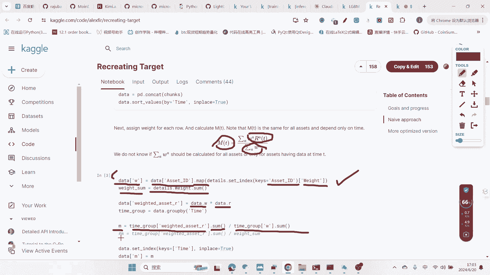

## 计算市场组合收益率 (M)

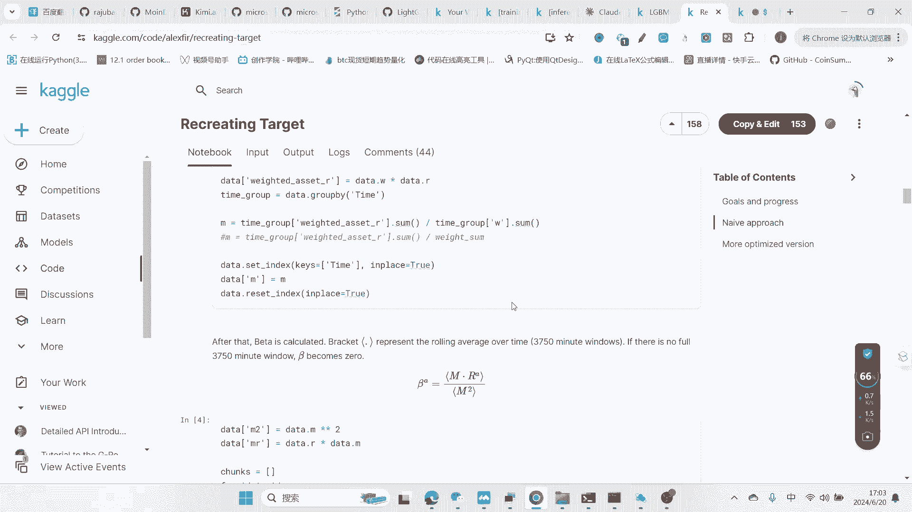

在得到单个资产的收益率后，我们需要计算整个市场组合的收益率`M`，它是所有资产收益率的加权平均。

市场组合收益率`M`的计算公式为：
**M = Σ (weight_i * return_i) / Σ (weight_i)**

以下是代码中的实现步骤：

1.  **映射权重**：将资产权重`weight`映射到主数据集的每一行。
2.  **计算加权收益**：创建一个新列，其值为资产的`weight`乘以它的`log_return`（即 `weight_i * return_i`）。
3.  **计算市场收益率**：对“加权收益”列按时间进行分组求和，再除以对应时间的“权重”列的总和。结果即为每个时间点的市场收益率`M`。

此步骤的结果是得到一个名为`M`的时间序列，代表了市场整体的收益率情况。

## 计算贝塔值 (Beta) 与最终目标 (Target)

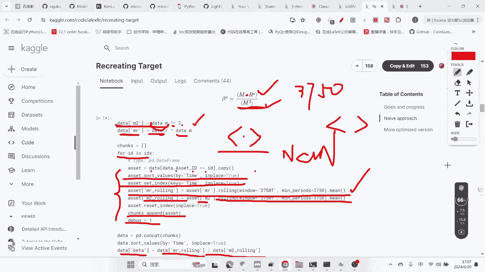

我们已经有了资产收益率`R`和市场收益率`M`。本节将计算资产的贝塔值，并最终得到预测目标。

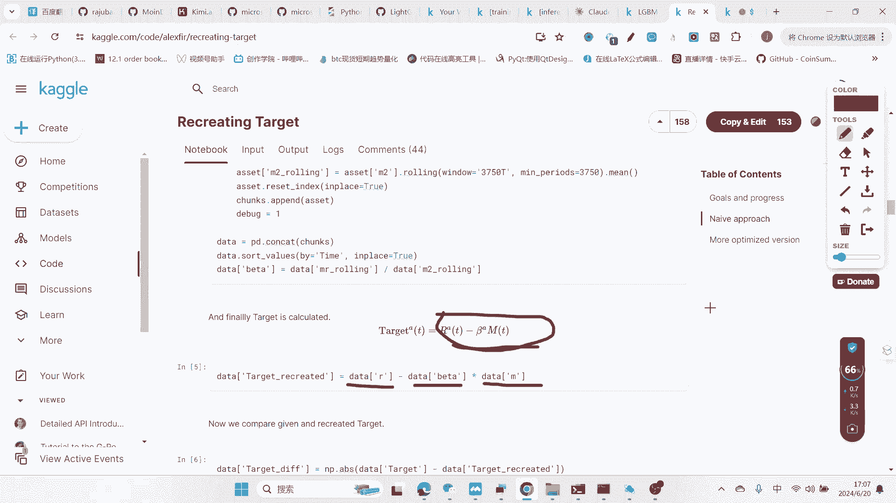

预测目标的完整计算公式为：
**Target = R - Beta * M**
其中，`Beta`衡量了资产收益对市场收益的敏感度，其计算公式为：
**Beta = Cov(R, M) / Var(M)**
在代码中，方差和协方差通过一个3750个时间窗口的滚动均值来估计。

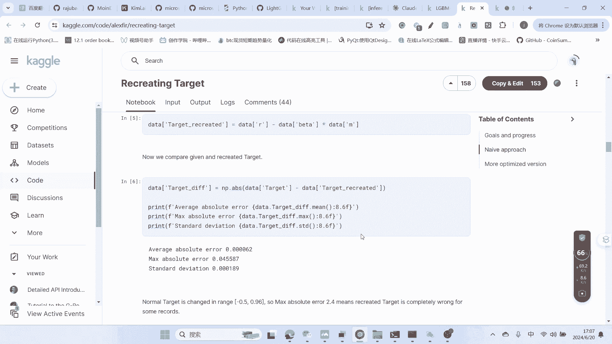

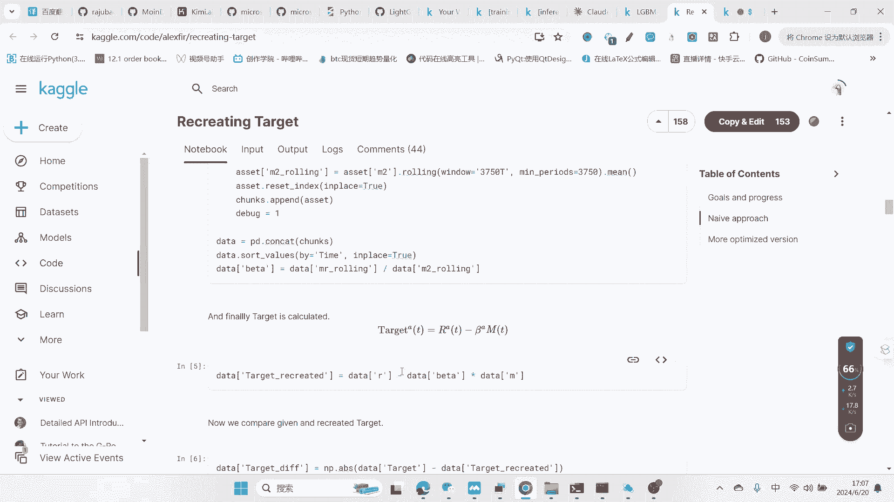

以下是计算贝塔值和最终目标的具体过程：

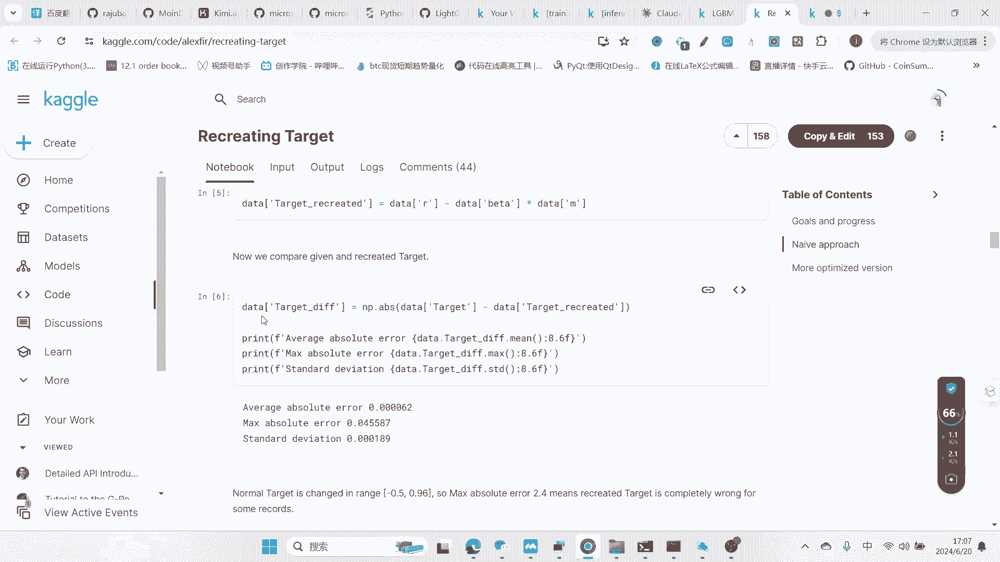

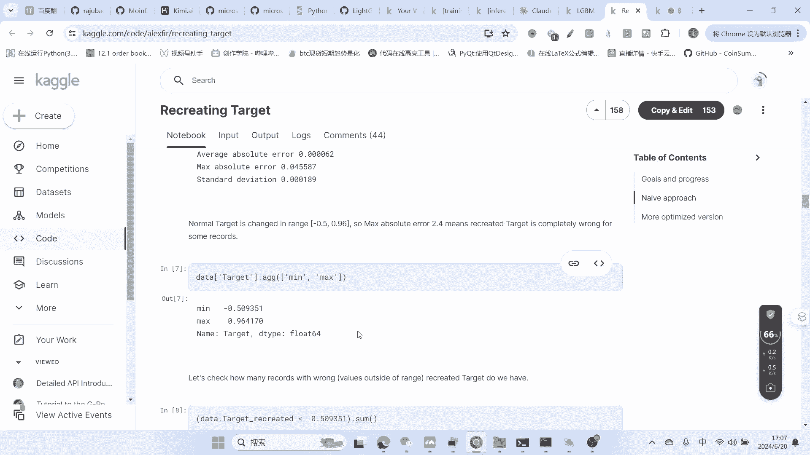

1.  **准备计算组件**：
    *   计算 `M * R`（协方差的分子部分）。
    *   计算 `M ** 2`（方差的分母部分）。
2.  **滚动计算**：对 `M*R` 和 `M**2` 分别进行窗口大小为3750的滚动平均计算，得到近似的滚动协方差`cov_rolling`和滚动方差`var_rolling`。
3.  **计算贝塔**：`Beta = cov_rolling / var_rolling`。为避免除零错误，代码中可能包含处理`var_rolling`为零情况的逻辑。
4.  **计算最终目标**：`Target = log_return - Beta * M`。

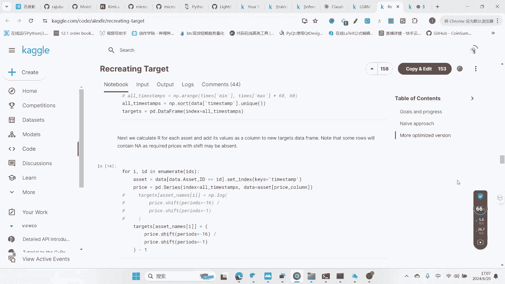

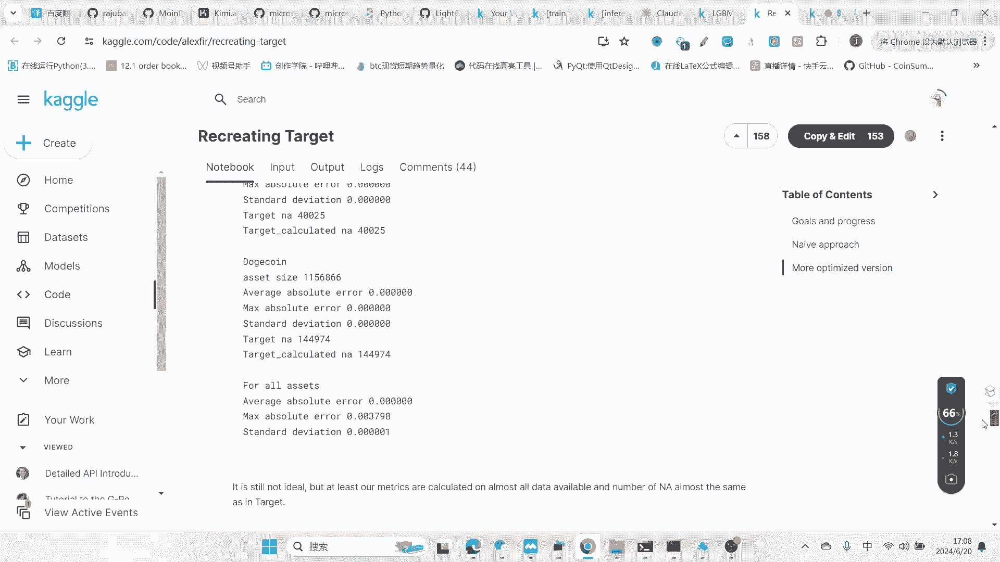

最终，我们得到了竞赛要求预测的目标列 `target`。这个值表示资产超越（或低于）市场整体表现的部分。

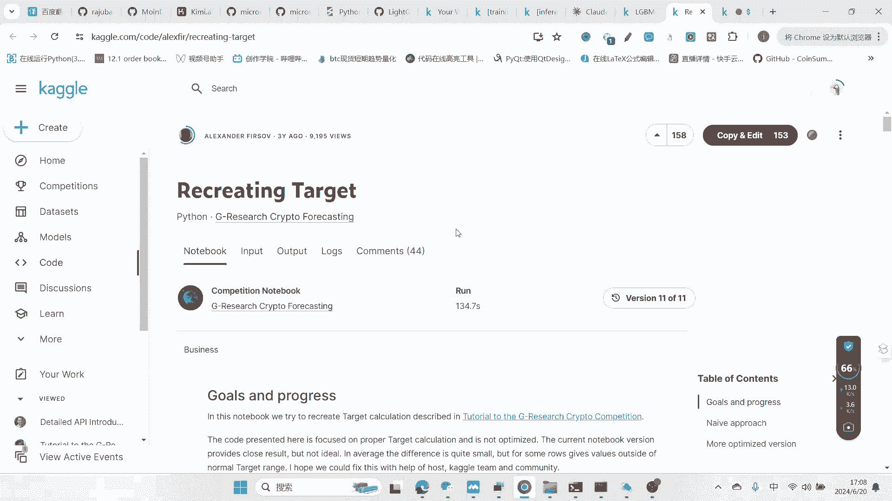

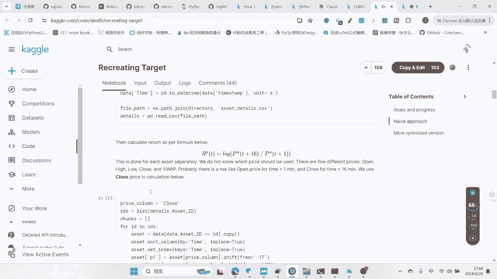

## 总结

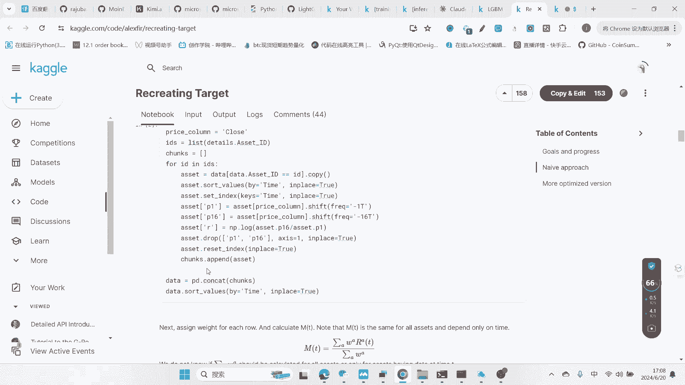

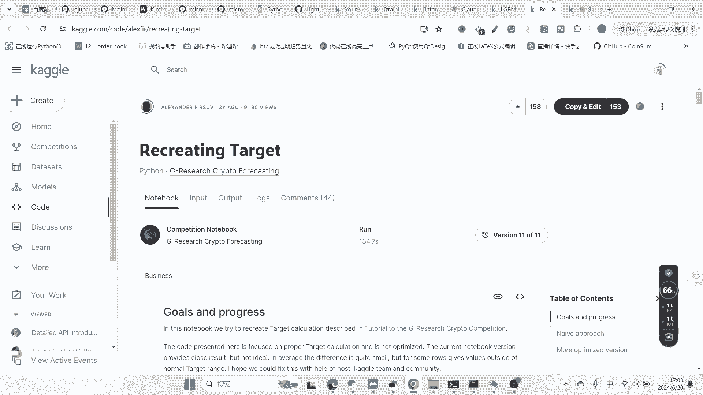

本节课中我们一起学习了Kaggle Gresearch竞赛预测目标的计算方法。我们分步解析了从原始数据开始，如何计算对数收益率、市场组合收益率、资产的贝塔系数，并最终合成预测目标`target`的完整流程。理解这个计算过程对于构建特征工程和训练模型至关重要，因为它明确了模型需要预测的金融概念本质——即经过风险调整后的超额收益。