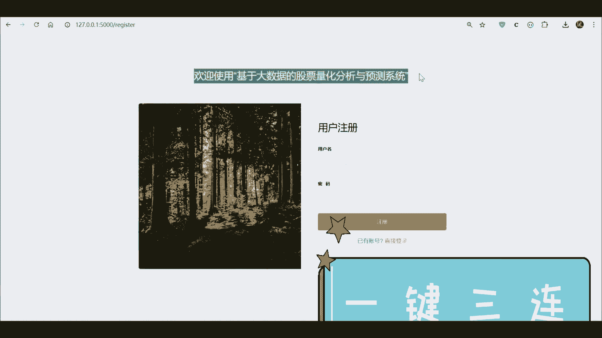
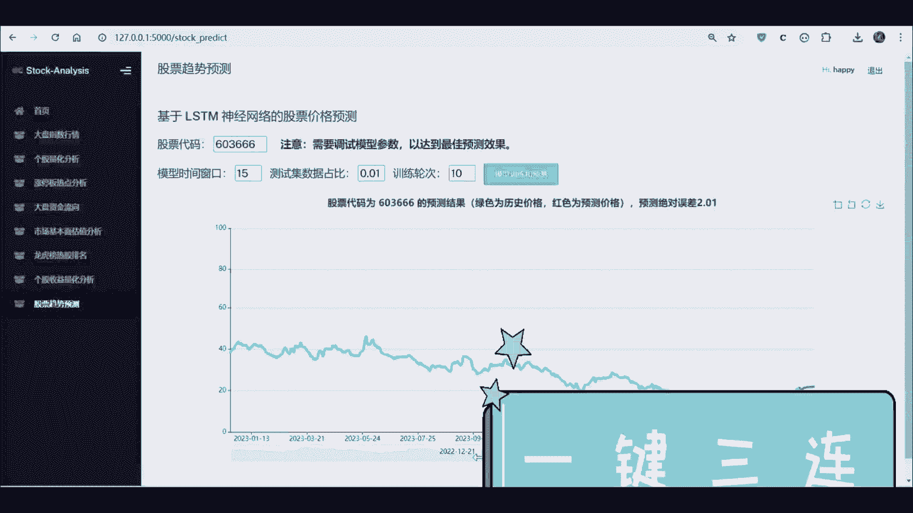

# 股票预测与分析：P1：项目概述与LSTM模型简介

在本节课中，我们将学习如何构建一个基于Python和LSTM（长短期记忆网络）的股票分析与预测系统。该系统将涵盖数据爬取、量化分析、可视化以及使用深度学习模型进行预测的全过程。

## 项目概述

本项目旨在开发一个综合性的股票分析平台。我们将从互联网上获取股票数据，对其进行处理和分析，并利用LSTM模型来预测未来的股价走势。整个系统将整合数据爬虫、大数据处理、可视化以及深度学习技术。



上一节我们介绍了项目的整体目标，本节中我们来看看实现这一目标所需的核心技术栈。

## 核心技术栈

以下是构建本系统所需的主要技术和工具：

*   **编程语言**：Python。因其丰富的数据科学和机器学习库而被选用。
*   **深度学习框架**：TensorFlow 或 PyTorch。两者都是构建和训练LSTM模型的强大工具。
*   **数据爬取**：使用如 `requests`、`BeautifulSoup` 或 `Scrapy` 等库从财经网站获取股票历史数据。
*   **数据处理与分析**：`Pandas` 和 `NumPy` 用于数据清洗、整理和计算。
*   **数据可视化**：`Matplotlib` 和 `Seaborn` 用于绘制股票走势图、技术指标图等。
*   **模型构建**：使用 `Keras`（基于TensorFlow）或 `PyTorch` 的 `nn` 模块来搭建LSTM神经网络。

## LSTM模型简介

在传统的神经网络中，信息通常单向传递，难以处理像股票价格这样的时间序列数据，因为股价未来的走势与过去的表现密切相关。为了解决这个问题，我们将使用循环神经网络（RNN）的一种特殊变体——长短期记忆网络（LSTM）。

LSTM通过引入“门”结构（遗忘门、输入门、输出门），能够有效地学习长期依赖关系，记住重要的历史信息并忽略不重要的信息，这使其非常适合用于序列预测任务，如股票价格预测。

其核心单元的状态更新可以用以下简化公式描述：

**公式**：
`Ct = ft * Ct-1 + it * Ĉt`
`ht = ot * tanh(Ct)`

其中：
*   `Ct` 是当前细胞状态。
*   `ft` 是遗忘门，决定从上一个状态 `Ct-1` 中丢弃哪些信息。
*   `it` 是输入门，决定哪些新信息 `Ĉt` 会被存储到细胞状态中。
*   `ot` 是输出门，基于当前细胞状态 `Ct` 决定输出什么信息 `ht`。

在代码中，使用Keras构建一个简单的LSTM层看起来像这样：

**代码**：
```python
from tensorflow.keras.models import Sequential
from tensorflow.keras.layers import LSTM, Dense

model = Sequential()
model.add(LSTM(units=50, return_sequences=True, input_shape=(time_steps, n_features)))
model.add(LSTM(units=50))
model.add(Dense(units=1)) # 输出一个预测值
```

## 系统工作流程

了解了核心模型后，我们来看一下整个系统是如何协同工作的。以下是项目实现的基本步骤：



1.  **数据获取**：编写爬虫程序，从雅虎财经、东方财富网等数据源获取股票的历史价格、成交量等数据。
2.  **数据预处理**：清洗数据（处理缺失值、异常值），进行特征工程（例如计算移动平均线、相对强弱指数等技术指标），并将数据归一化。
3.  **构建数据集**：将时间序列数据转换为监督学习问题。例如，用过去60天的数据来预测第61天的收盘价。
4.  **模型构建与训练**：搭建LSTM神经网络，使用历史数据对模型进行训练，让模型学习股价变化的模式。
5.  **预测与评估**：使用训练好的模型对未来的股价进行预测，并通过均方误差（MSE）、均方根误差（RMSE）等指标评估预测效果。
6.  **可视化展示**：将股票历史走势、技术指标、模型预测结果以及回测分析通过图表直观地展示出来。

本节课中我们一起学习了基于LSTM的股票预测分析项目的整体框架和核心技术。我们明确了项目的目标，介绍了所需的技术栈，重点讲解了LSTM模型为何适用于时间序列预测，并概述了系统从数据获取到结果可视化的完整工作流程。在接下来的课程中，我们将深入每个步骤，进行详细的实现。