# MLRUN：P1：机器学习平台介绍与基础使用 🚀

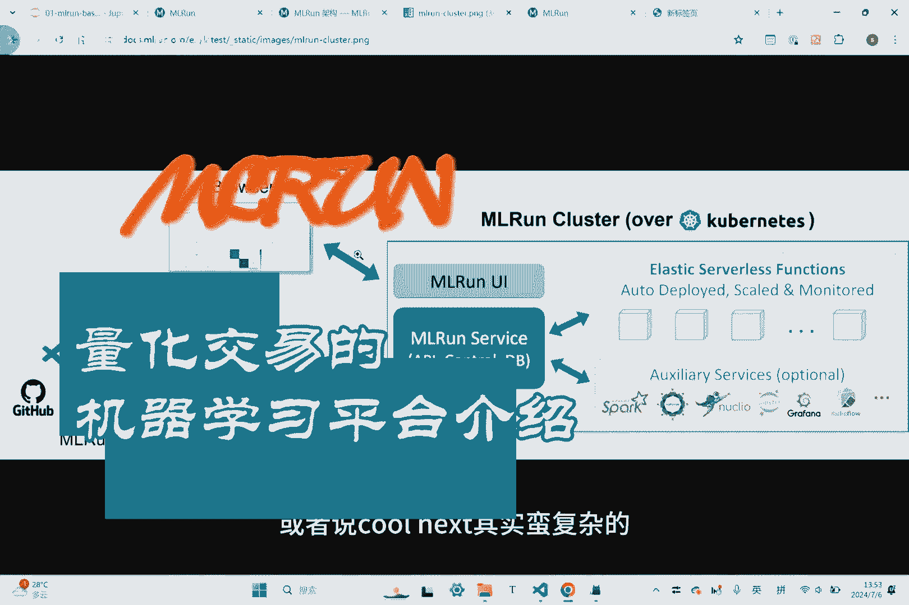

在本节课中，我们将学习一个名为MLRun的开源机器学习编排平台。我们将了解其核心架构、设计思路，并通过一个简单的端到端示例，演示如何使用它来管理机器学习项目的生命周期，包括数据处理、模型训练和部署。

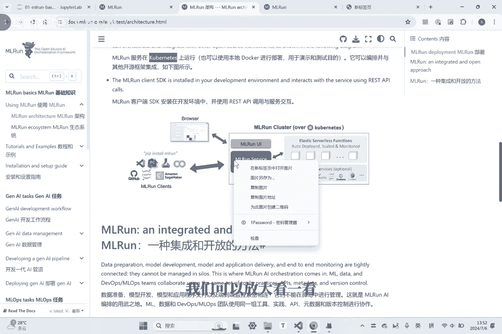

## 概述

MLRun是一个开源的AI编排平台，旨在为机器学习项目的整个生命周期提供快速构建和管理能力。它覆盖了从数据准备、模型训练到部署的全方位管理流程，显著减少了构建机器学习流水线所需的工作量。该工具既可以在本地计算机上使用，也支持云端部署。

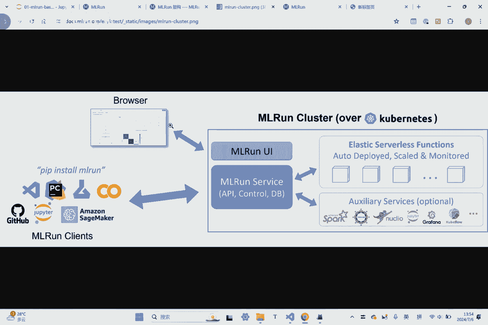

## 平台架构与设计思路

上一节我们介绍了MLRun的基本定位，本节中我们来看看它的核心架构与设计思路。

MLRun最初是一个社区驱动的开源项目。它的设计核心是将机器学习项目生命周期中的不同组件解耦，并通过自动化操作将它们串联起来。

其服务端可以运行在Kubernetes上，也支持Docker部署，但它与Kubernetes原生集成得更好。客户端则可以安装在开发环境中，并通过REST API进行调用。

以下是其架构的简要说明：
*   **服务端**：通过Service API、Control DB进行管理，下游连接Spark、Nuclio、Graph、Rubix、Fluid、Jupyter等组件，并具备弹性微服务函数、自动部署、扩容和监控能力。其基础建立在Kubernetes之上。
*   **客户端**：支持通过浏览器、VS Code、PyCharm、GitHub和Jupyter等工具进行交互。

对于初学者，在Kubernetes上部署可能会有压力。MLRun也提供了更简单的Docker Compose部署方式，方便本地快速启动和体验。

## 平台生态支持

了解了基础架构后，我们来看看MLRun所支持的丰富生态，这决定了它的适用范围和灵活性。

MLRun集成了大量主流的数据处理、事件源、执行框架和机器学习工具。

以下是其支持的部分生态组件：
*   **数据源**：对象存储文件、Pandas、Spark、Google BigQuery、Snowflake、Databricks、Redis、V3IO（MLRun公司自有服务）。
*   **事件源**：HTTP Run、Kafka以及自有事件源。
*   **执行框架**：Nuclio、Spark、MPI、Horovod、KubeJobs。
*   **开发环境**：PyCharm、VS Code、Jupyter、Colab。
*   **机器学习框架**：XGBoost、LightGBM、TensorFlow、Keras、PyTorch、ONNX。
*   **部署平台**：Kubernetes、Docker、Linux、NVIDIA、Azure ML、GitHub Actions。

## 实战演练：端到端机器学习流程

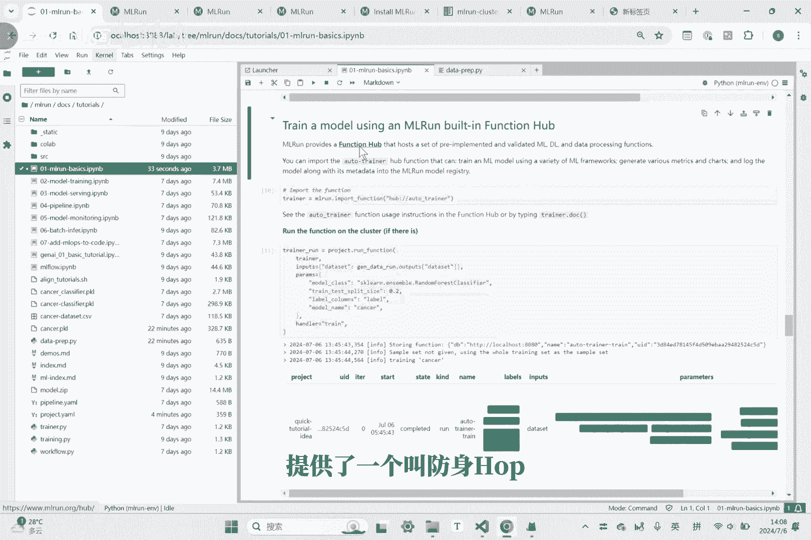

前面我们介绍了MLRun的架构和生态，本节我们将通过一个实际案例，手把手演示如何使用MLRun完成一个完整的机器学习任务。

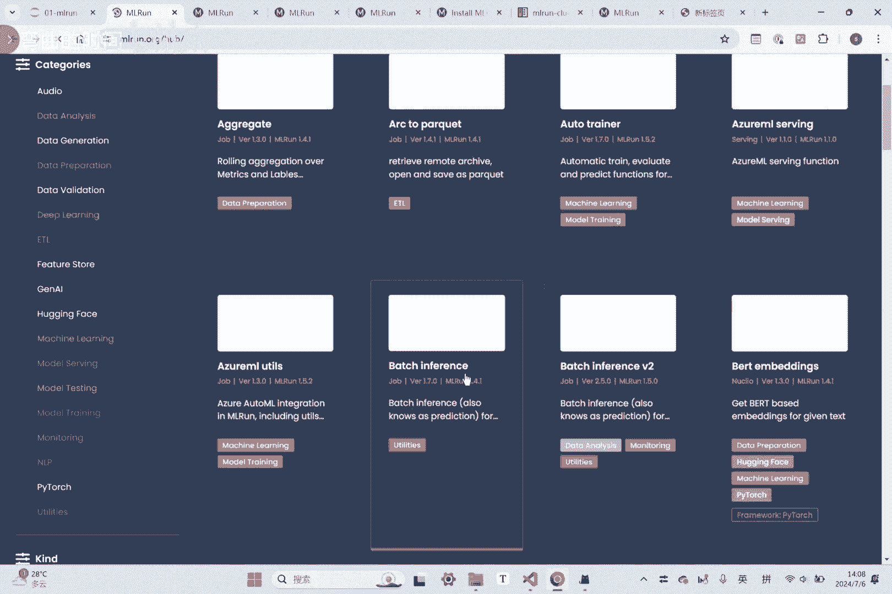

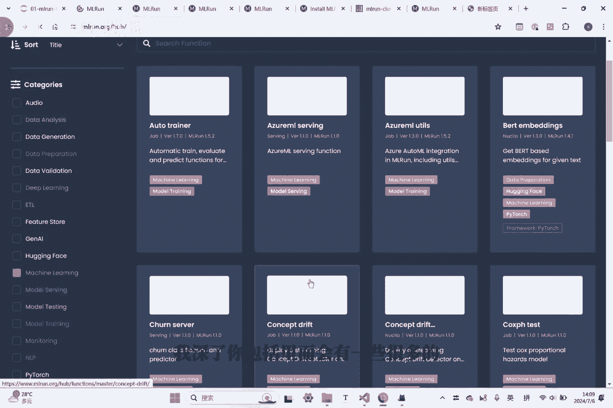

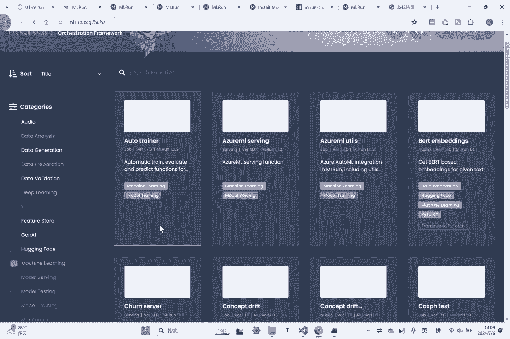

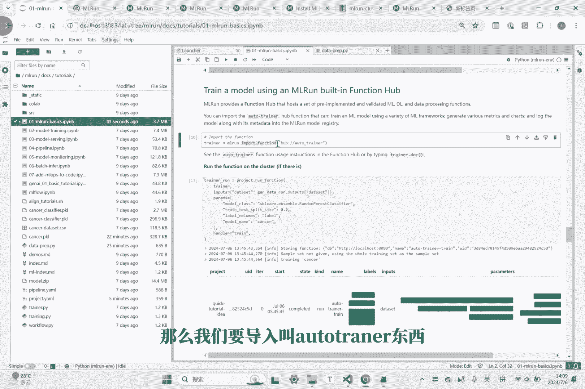

我们假设MLRun环境已经通过Docker Compose在本地安装完成。首先，我们需要创建一个项目（Project），这是所有工作的容器。

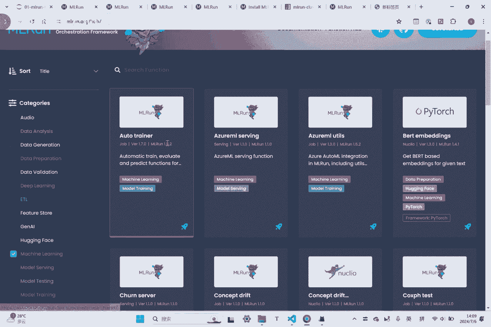

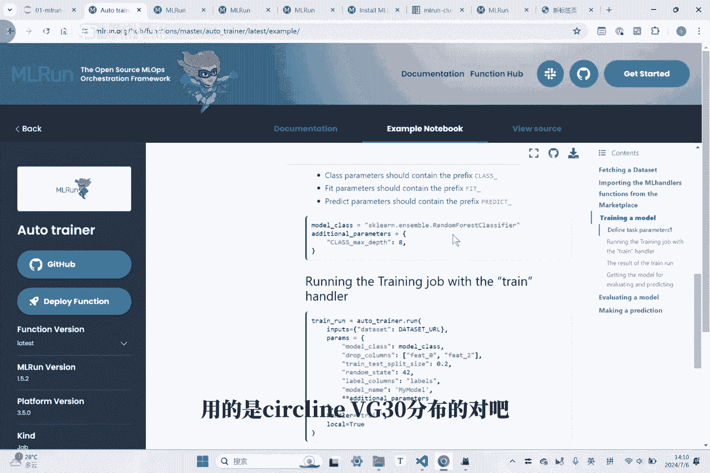

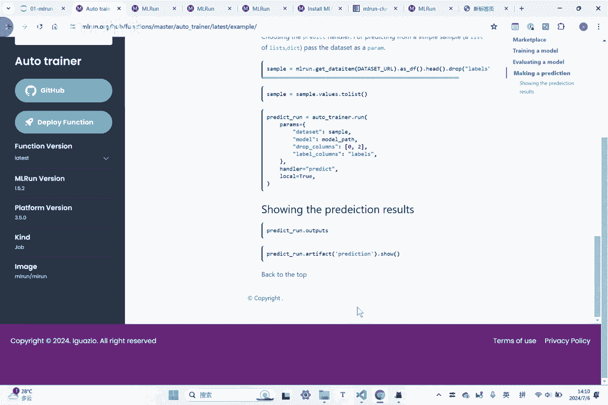

```python
import mlrun
# 创建或加载一个项目
project = mlrun.get_or_create_project(name="tutorial", context="./")
```

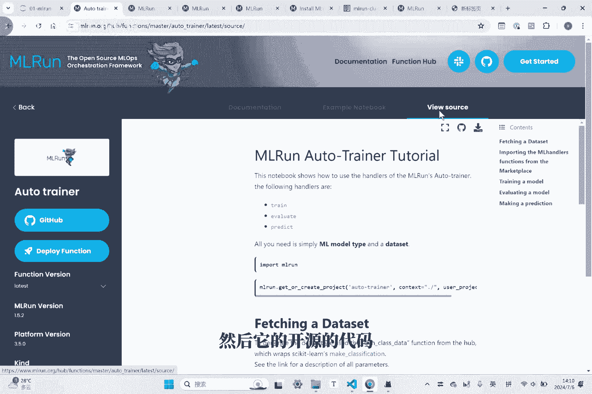

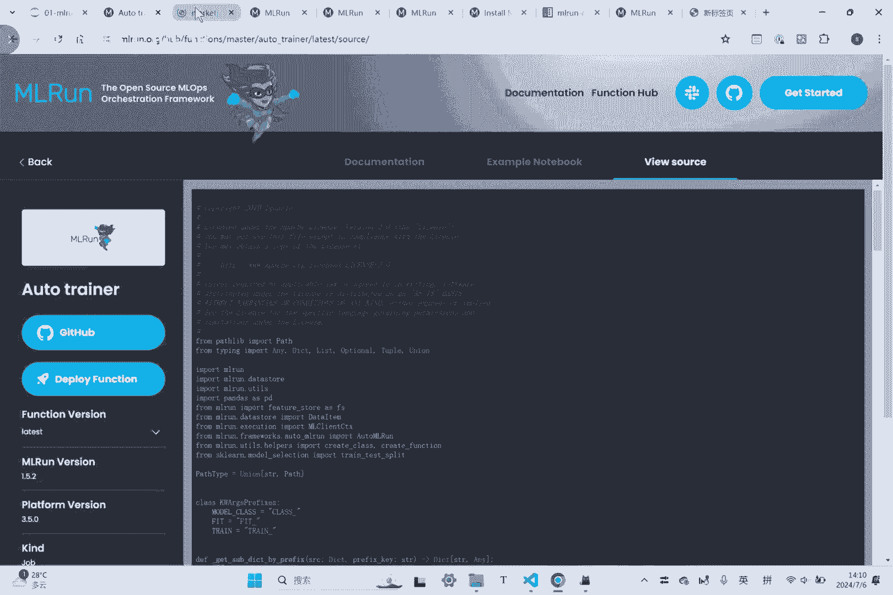

创建项目后，我们需要编写数据处理函数。以下代码读取经典的鸢尾花（Iris）数据集并进行简单处理。

```python
# 文件：preprocess_data.py
import pandas as pd
import mlrun

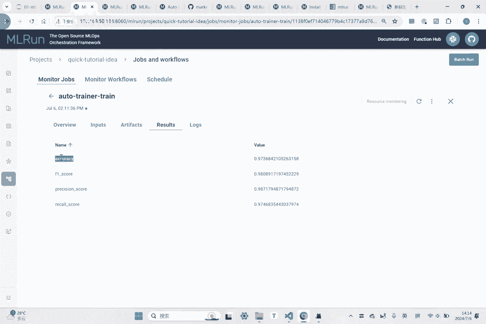

def prep_data(context, source_url):
    # 使用pandas读取数据
    df = pd.read_csv(source_url)
    
    # 此处可进行数据清洗、特征工程等操作
    # 例如，将目标列重命名为‘label’
    df.rename(columns={df.columns[-1]: "label"}, inplace=True)
    
    # 使用MLRun记录处理后的数据集
    context.log_dataset(key='dataset', df=df, format='parquet', index=False)
```

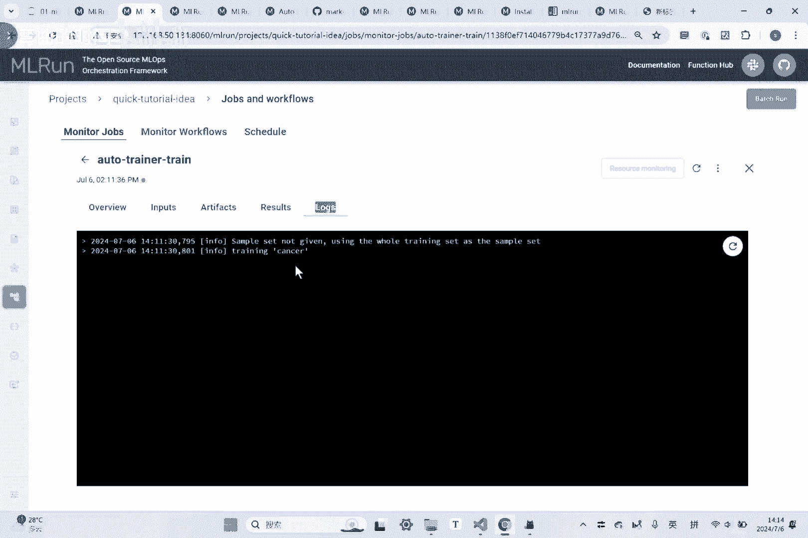

接下来，我们设置并运行这个函数。`set_function`方法将我们的代码与一个执行环境（如Docker镜像）关联起来。

```python
# 设置数据处理函数
prep_data_fn = mlrun.code_to_function(name="prep_data", kind="job", image="mlrun/mlrun")
# 运行函数，传入数据源URL
prep_data_run = project.run_function(prep_data_fn, inputs={"source_url": "https://archive.ics.uci.edu/ml/machine-learning-databases/iris/iris.data"})
```

运行完成后，我们可以在MLRun的Web UI（默认端口8060）中查看结果。UI会展示任务状态、执行日志、生成的数据集（`dataset`）及其统计信息，所有这些都是自动完成的。

现在，我们进行模型训练。MLRun提供了一个`Function Hub`，其中包含许多预置函数，例如`auto_trainer`。

```python
# 从Hub中加载自动训练函数
trainer = mlrun.import_function('hub://auto_trainer')
# 运行训练，指定之前生成的数据集和模型参数
train_result = project.run_function(trainer, inputs={"dataset": prep_data_run.outputs['dataset']}, params={"label_column": "label", "model_name": "iris_model"})
```

训练结束后，UI会展示模型评估指标（如准确率、F1分数）、混淆矩阵、特征重要性图表等。我们也可以通过SDK获取结果。

```python
print(train_result.outputs['accuracy'])
```

最后，我们可以将训练好的模型部署为实时预测API服务。

```python
# 创建部署函数
serving_fn = mlrun.code_to_function(name="serve-model", kind="serving", image="mlrun/mlrun")
# 为部署函数添加模型
serving_fn.add_model(model_name="iris-classifier", model_path=train_result.outputs['model'], class_name="mlrun.frameworks.sklearn.SklearnModelServer")
# 部署函数
project.deploy_function(serving_fn)
```
部署成功后，便可通过HTTP端点发送数据进行预测。

## 总结

本节课中我们一起学习了MLRun机器学习平台。我们从其作为开源编排平台的定位开始，了解了它通过解耦和自动化来管理ML生命周期的设计思路。接着，我们探索了其广泛的生态支持。最后，通过一个实战案例，我们体验了使用MLRun从数据预处理、模型自动训练到服务部署的完整流程。MLRun极大地简化了机器学习工程化的复杂度，让开发者能更专注于模型和算法本身。

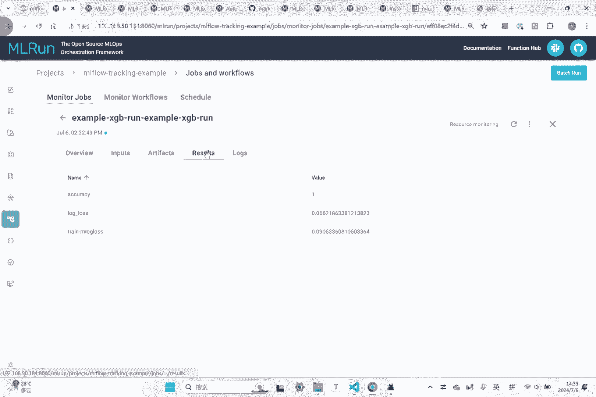

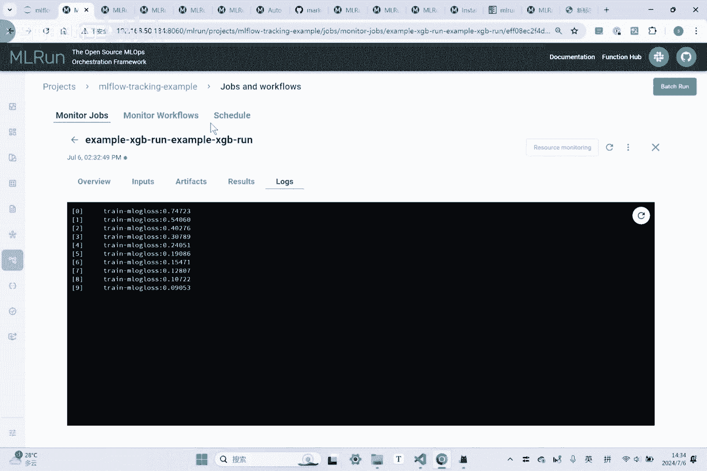

希望本教程能帮助你快速上手MLRun。下次再见！ 👋

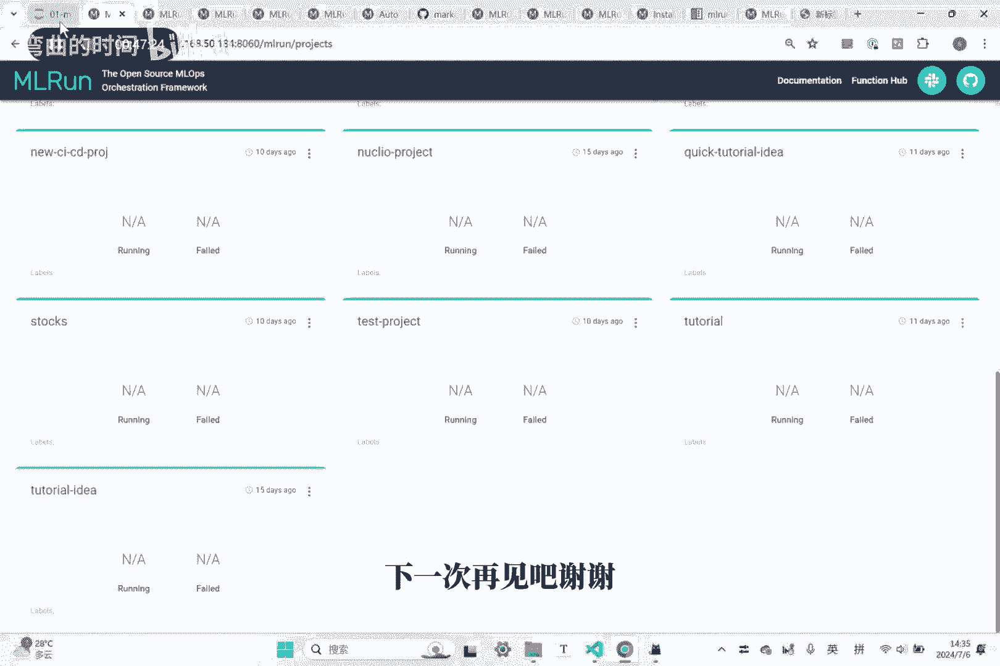

