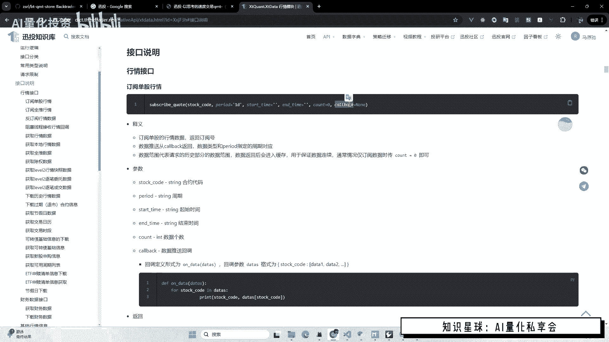
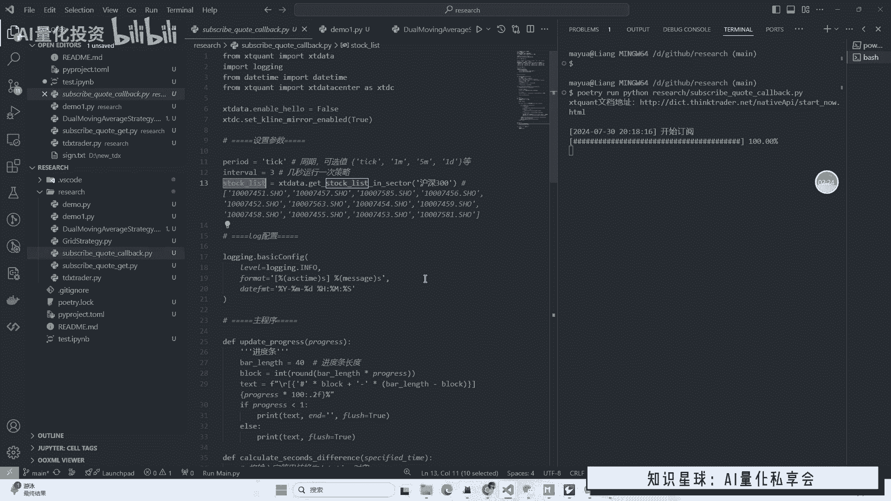
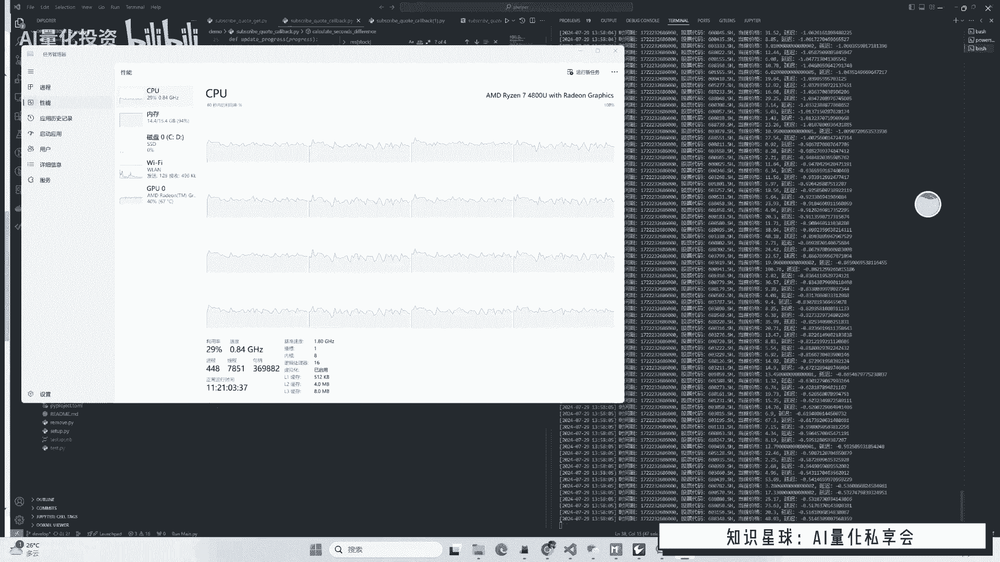
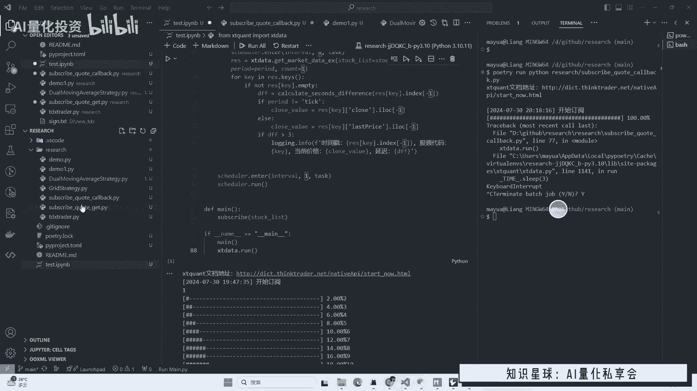
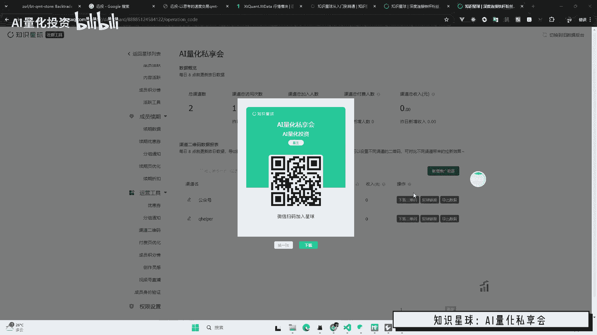

# MiniQMT订阅多股实时数据教程：P1：订阅模式与延迟分析 📊

## 概述
在本节课中，我们将学习如何使用MiniQMT订阅多只股票的实时数据。我们将重点介绍两种主要的订阅模式：回调函数模式和主动轮询模式，并分析数据延迟的成因与测试方法。本教程旨在帮助初学者理解订阅机制的核心概念，并提供可运行的代码示例。



---

## 订阅模式简介
上一节我们概述了课程内容，本节中我们来看看MiniQMT订阅实时数据的基本原理。订阅实时数据并非简单的顺序执行代码，它需要启动一个持续运行的服务来维持订阅，并通过另一个服务或回调函数来获取数据。这需要一定的编程技巧。

### 两种订阅方式
以下是两种实现订阅的核心方法：



1.  **回调函数模式**：基于接口内置的`callback`函数获取数据。每当有新数据从服务器返回时，该函数会自动触发。
2.  **主动轮询模式**：启动一个循环，定期（例如每3秒）向接口请求数据。

接下来，我们将通过两个具体例子来详细讲解这两种方法。



---

## 示例一：使用回调函数订阅数据 🔄
本示例演示如何使用回调函数模式订阅沪深300成分股的实时数据。

### 代码结构与讲解
以下是代码的核心部分和解释：

```python
# 必要的包引入
import time
from datetime import datetime
from xtquant import xtdata

# 订阅参数设置
period = '1m'  # 数据周期，例如‘1m’代表1分钟线
symbol_list = ['000001.SZ', '000002.SZ', ...]  # 此处应为完整的沪深300股票代码列表

# 定义回调函数
def on_data(dat):
    """
    回调函数，当订阅的股票有新的tick数据时被触发。
    dat: 包含股票代码、最新价、时间戳等信息的字典。
    """
    symbol = dat['symbol']
    new_price = dat['price']
    timestamp = dat['time']  # 数据时间戳
    # 计算数据延迟（当前系统时间 - 数据时间戳）
    delay = time.time() - timestamp
    print(f"股票 {symbol} 最新价: {new_price}, 数据时间: {timestamp}, 延迟: {delay:.2f}秒")

# 单股订阅函数（在循环中调用以实现多股订阅）
def subscribe_single(symbol):
    xtdata.subscribe(symbol, period, callback=on_data)

# 遍历股票列表，订阅所有股票
for symbol in symbol_list:
    subscribe_single(symbol)
    # 此处可加入进度条显示

# 阻塞主程序，保持订阅持续运行
xtdata.run()
```

**核心概念解释**：
*   **`xtdata.subscribe()`**：这是发起订阅的核心函数。`callback`参数指定了当数据更新时要执行的函数。
*   **`xtdata.run()`**：此函数会阻塞程序，使订阅服务在后台持续运行。没有它，脚本会立即结束，订阅也随之终止。

### 运行现象与注意事项
*   **运行状态**：启动后，程序会开始订阅股票，这需要一定时间。在交易时间内，`on_data`回调函数会每隔几秒被触发，打印出最新的行情数据和延迟。
*   **性能影响**：订阅的股票数量越多，CPU和网络带宽占用越高。极端情况下（如订阅全市场股票），可能导致系统卡顿，延迟增加。
*   **测试时间**：**必须在交易时间内测试**，收盘后服务器不会推送实时数据。

---

## 示例二：使用主动轮询获取数据 ⏱️
上一节我们介绍了回调函数模式，本节中我们来看看主动轮询模式。这种方法不依赖回调触发，而是定期查询所有已订阅股票的最新数据。

### 代码逻辑与差异
以下是轮询模式的核心逻辑：

```python
import time
from xtquant import xtdata

symbol_list = ['000001.SZ', '000002.SZ', ...]
period = '1m'

# 先订阅所有股票（轮询模式也需要先订阅）
for symbol in symbol_list:
    xtdata.subscribe(symbol, period)
    # 注意：这里没有传入callback参数

# 启动订阅服务（在后台运行）
xtdata.run()

# 主动轮询循环
while True:
    for symbol in symbol_list:
        # 获取指定股票的最新行情快照
        snapshot = xtdata.get_market_data([], [symbol], period=period, count=1)
        last_price = snapshot['close'].iloc[-1]
        last_time = snapshot['time'].iloc[-1]  # 获取最后一条数据的时间戳

        # 计算延迟
        delay = time.time() - last_time
        print(f"股票 {symbol} 最新价: {last_price}, 数据时间: {last_time}, 延迟: {delay:.2f}秒")
    
    # 每隔3秒轮询一次
    time.sleep(3)
```

**与回调模式的对比**：
*   **控制权**：轮询模式由你的代码控制获取数据的节奏（如每3秒一次），而非由数据更新事件触发。
*   **延迟计算**：在回调模式中，延迟计算是“实时”的，延迟通常很小甚至为负。在轮询模式中，你看到的是“上次查询时的数据延迟”，这个值会在0到你的轮询间隔（如3秒）之间波动。

### 延迟分析中的关键点
在分析打印出的延迟时，需要注意以下两点，它们可能导致延迟显示偏大：

1.  **无成交不更新**：对于交易不活跃的股票，可能连续多秒没有新成交。MiniQMT在没有新成交时不会推送新数据，导致本地时间戳停滞。轮询时，会发现该股票的“延迟”随时间增长，但这并非真实的数据传输延迟。
2.  **函数调用耗时**：`get_market_data()`函数本身需要时间执行。如果一次查询的数据量很大或股票很多，该函数的执行时间可能接近甚至超过轮询间隔，导致循环变慢，所有股票的延迟显示都会增大。

**订阅的本质**：MiniQMT订阅接口的本质是，每当服务器有新的成交数据时，就向客户端推送一次并触发回调。从数据传输角度看，这个时间戳本身是准时的。我们观测到的“延迟”往往是上述应用层逻辑造成的。

---

## 实践建议与总结 🎯
本节课中我们一起学习了MiniQMT的两种实时数据订阅模式，并深入探讨了数据延迟的成因。

### 核心建议
1.  **模式选择**：需要极低延迟且处理逻辑简单的策略，可选回调模式。需要集中处理或控制获取节奏的策略，可选轮询模式。
2.  **数据周期**：若非必要，尽量订阅`分钟线`而非`tick数据`，以降低系统负载和数据复杂度。
3.  **性能考量**：进行多股订阅时，请确保计算机性能充足，并尽量保持运行环境专一、稳定。
4.  **风险意识**：任何系统都可能存在数据丢失的风险（尽管不常见）。在实盘交易中，需要有相应的异常处理和数据校验机制。
5.  **环境管理**：在Jupyter Notebook等交互环境中测试订阅代码后，若想停止订阅，最稳妥的方法是**重启整个Notebook内核**，以确保所有后台订阅连接被清除。直接终止单元格运行可能无法彻底取消订阅。



### 总结
*   **回调模式**：由事件驱动，延迟低，但编程模型相对复杂。
*   **轮询模式**：由程序主动控制，逻辑直观，但观测延迟受轮询间隔和函数耗时影响。
*   **延迟分析**：需区分是网络传输延迟、数据无更新导致的“假延迟”，还是程序处理耗时带来的延迟。



通过理解这些概念并合理运用两种模式，你可以更高效、更稳定地使用MiniQMT构建自己的实时量化交易系统。