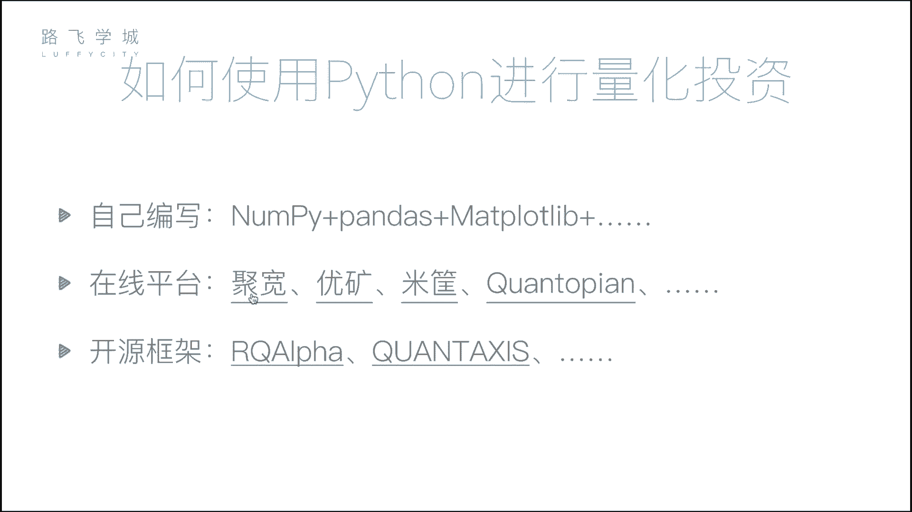
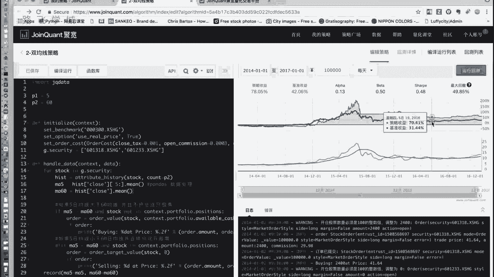
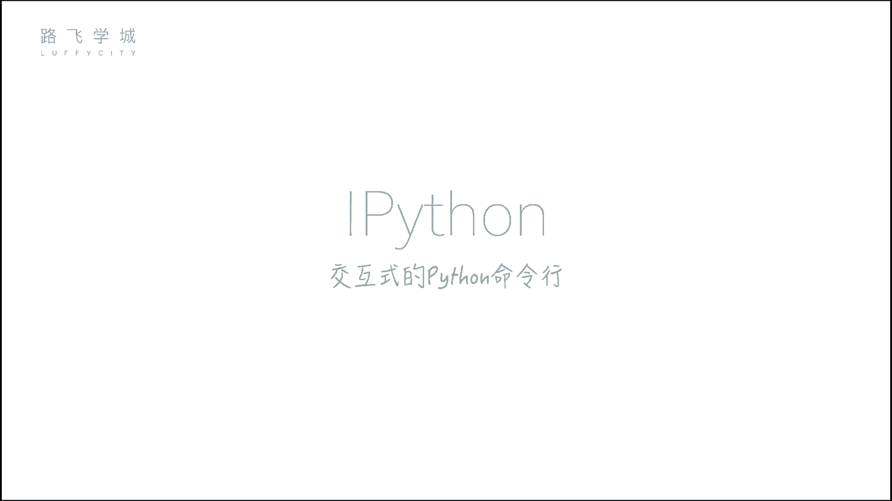
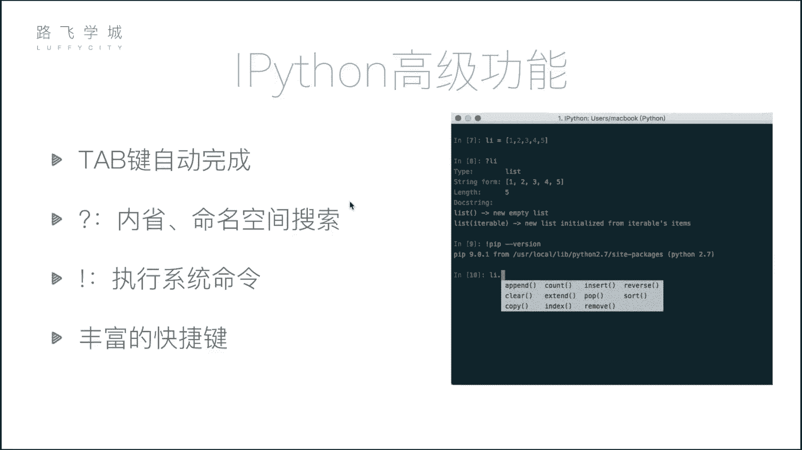
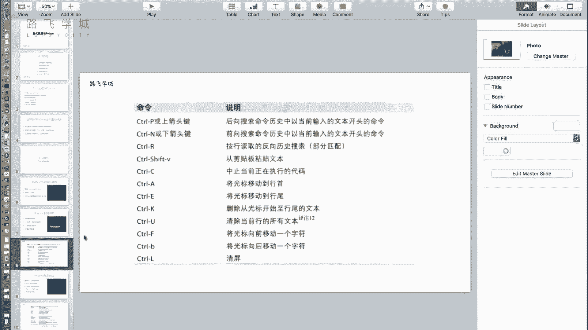

# 金融量化分析：P8：07 量化投资与Python及IPython初识 🚀💰

在本节课中，我们将要学习量化投资的基本概念，了解为何选择Python作为主要工具，并初步认识一个强大的交互式Python环境——IPython。

上一节我们介绍了量化投资的基本理念，本节中我们来看看如何利用Python及相关工具来实现它。

## 为什么要选择Python进行量化投资？

量化投资的核心是分析数据并据此做出决策。除了Python，市场上也存在其他可用于数据分析的工具。

以下是几种常见的工具对比：



*   **Excel**：无需编程，主要用于手工数据处理和基础分析。
*   **SAS/SPSS**：专业的统计分析软件，能进行标准化计算（如计算均值、生成图表），但同样不涉及编程。
*   **R语言**：一门专注于统计和数据分析的编程语言，可用于量化投资，但应用领域相对较窄。
*   **Python**：一门通用编程语言。其优势在于不仅能进行高效的数据分析，还能应用于Web开发、自动化脚本等多个领域，学习一门语言即可获得多方面的能力。

因此，Python因其强大的库生态和通用性，成为量化投资领域的首选工具。



## Python量化分析的核心模块

量化投资即分析数据从而得出决策的过程。Python拥有多个专门用于数据处理和科学计算的库，其中三个核心模块是：

1.  **NumPy**：用于进行高效的数组批量计算。其核心是`ndarray`多维数组对象。
    ```python
    import numpy as np
    arr = np.array([1, 2, 3, 4, 5])
    ```
2.  **Pandas**：核心数据分析库，提供了灵活高效的`DataFrame`（数据表）结构，便于进行数据清洗、转换和分析。
    ```python
    import pandas as pd
    df = pd.DataFrame({'A': [1, 2, 3], 'B': [4, 5, 6]})
    ```
3.  **Matplotlib**：用于数据可视化的库，可以将分析结果以图表形式直观展示。
    ```python
    import matplotlib.pyplot as plt
    plt.plot([1, 2, 3], [4, 5, 1])
    plt.show()
    ```

## 如何实践量化投资策略？

掌握了上述工具后，有两种主要方式实践量化投资：

1.  **自建框架**：使用NumPy、Pandas等库，从零开始搭建一个简单的量化投资框架。你可以下载股票数据，在框架内编写并回测自己的交易策略。
2.  **使用在线平台**：市场上存在许多成熟的量化交易平台。你只需在平台上编写策略的核心逻辑代码，平台会自动处理数据获取、回测和结果展示。

例如，在一个在线平台中，你在左侧编写策略代码，运行后右侧会生成策略收益曲线。这条曲线展示了该策略在历史数据上的表现，你可以直观地看到策略是盈利还是亏损，以及与大盘基准收益的对比。

## 强大的交互式工具：IPython





在深入学习上述模块前，我们先介绍一个能提升开发效率的工具——IPython。它是一个功能丰富的交互式Python命令行环境。

### 如何安装IPython？

对于已安装Python的用户，可以通过`pip`命令安装：
```bash
pip install ipython
```
建议使用国内镜像源（如豆瓣源）以加速下载：
```bash
pip install ipython -i https://pypi.douban.com/simple/
```
对于新手，推荐直接安装**Anaconda**发行版，它集成了Python、IPython以及我们将要学习的NumPy、Pandas、Matplotlib等所有科学计算库。

安装成功后，在命令行输入`ipython`即可启动。

### IPython的核心功能

与标准Python命令行相比，IPython提供了许多增强功能。

以下是几个提高效率的实用功能：

*   **Tab键自动补全**：输入变量名或函数的前几个字母后按`Tab`键，IPython会列出所有可能的补全选项。例如，定义一个列表`a = []`后，输入`a.ap`并按`Tab`，会自动补全为`a.append`。
*   **执行系统命令**：在IPython中可以直接执行一些系统命令，如`ls`（列出文件）、`pwd`（显示当前目录）。对于更复杂的命令，需要在命令前加上感叹号`!`，例如`!pip list`或`!ifconfig`。
*   **内省与帮助**：使用问号`?`可以查询对象的信息。例如，`a?`会显示列表`a`的详细信息；`a.append?`会显示`append`方法的文档字符串。使用双问号`??`可以查看函数或方法的源代码（如果可用）。
*   **丰富的快捷键**：IPython支持许多类似文本编辑器的快捷键，能大幅提升输入效率。



本节课中我们一起学习了量化投资为何选择Python，认识了三个核心数据分析库（NumPy, Pandas, Matplotlib）的用途，并初步掌握了能提升开发体验的交互式工具IPython的基本使用方法。接下来，我们将开始深入这些核心库的学习。