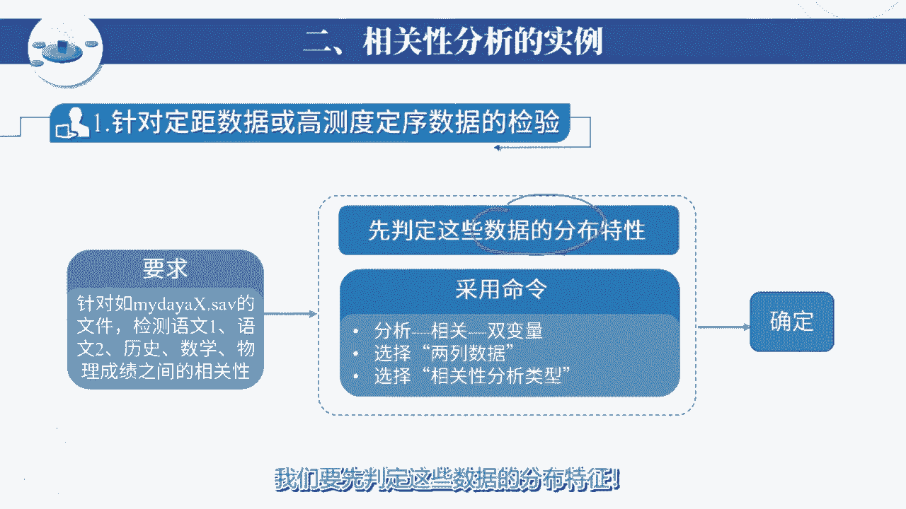
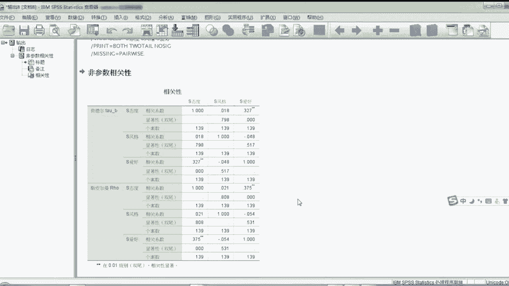

# SPSS数据分析及量化研究：P1：相关性分析操作与实例详解 📊

在本节课中，我们将学习如何使用SPSS进行相关性分析。我们将回顾不同数据类型适用的算法，并通过具体实例演示操作步骤，帮助大家掌握如何判断变量间的关联性。

## 算法回顾与选择

上一节我们介绍了相关性分析的各个算法。本节中我们来看看如何根据数据类型选择合适的算法。

以下是针对不同变量组合的相关性分析方法：

*   **两个高测度变量**：若两个变量都满足正态分布，使用**皮尔逊相关**。若有一个是非正态分布，则使用**斯皮尔曼相关**或**肯德尔相关**。
*   **一个低测度与一个高测度变量**：若高测度数据为正态分布，可借助**方差分析**判断低测度变量对高测度变量的影响是否显著。若高测度数据为非正态分布，则使用**独立样本的非参数检验**。
*   **两个低测度变量**：对于两个定类变量或定序变量，通常使用**基于交叉表的卡方检验**来完成相关性分析。

在SPSS的交叉表检验中，提供了多种相关性算法选项，分别适用于名义型（定类）变量、有序型（定序）变量以及区间标度（如“一低一高”）变量。

## 实例一：高测度数据的相关性检验

现在，我们来看一个具体的例子。假设我们需要检查语文一、语文二、历史、数学、物理成绩之间的相关性。这些数据均为高测度数据，但分布特征不同。

首先，我们需要判定这些数据的分布特征。已知语文一、语文二、历史为正态分布，而数学、物理为非正态分布。

操作步骤如下：
1.  在SPSS中，点击【分析】->【相关】->【双变量】。
2.  将变量选入分析框。
3.  对于正态数据（如语文一、语文二、历史），在“相关系数”中选择**皮尔逊**；对于非正态数据，可选择**斯皮尔曼**或**肯德尔**。
4.  点击【确定】生成结果。

结果解读：
*   **显著性（Sig.）**：若该值小于0.05，则认为两个变量之间存在显著相关性。
*   **相关系数**：用于判定相关性的强弱程度。系数越接近1或-1，相关性越强。

例如，在皮尔逊相关分析中，若得到语文一和语文二的显著性为0.138（>0.05），则说明二者不相关。而语文二和历史的显著性为0.000（<0.05），且相关系数为0.86（标有**），表明二者高度相关。

补充说明：
*   斯皮尔曼相关既适用于正态数据，也适用于非正态数据。而皮尔逊相关仅适用于正态分布的高测度数据。
*   在皮尔逊检验中，还可以输出变量的均值、标准差、有效样本数、叉积偏差和协方差矩阵，以便进行更深入的分析。

## 实例二：低测度定序数据的相关性检验

接下来，我们探讨如何对低测度的定序数据进行相关性检验。例如，检查学习态度、认知风格和爱好之间的相关性。

在SPSS中，字符串变量默认被视为定类（名义型）变量。但像“学习态度”（很不好、不好、一般、积极）和“认知风格”（场独立型、偏场独立型、偏场依存型、场依存型）这类变量，本身具有顺序逻辑，可以转化为定序变量。

操作步骤如下：
1.  **数据编码**：首先，需要对这些字符串变量进行科学的数值化编码，将其转化为定序变量。例如，将“很不好”编码为1，“不好”编码为2，以此类推。
2.  **执行分析**：编码完成后，点击【分析】->【相关】->【双变量】。
3.  **选择算法**：将编码后的变量选入，在“相关系数”中选择**肯德尔tau-b**或**斯皮尔曼**。
4.  **解读结果**：点击【确定】后，根据输出的显著性判断变量间是否相关。

例如，分析可能显示“态度”与“爱好”之间存在显著相关性（Sig. < 0.05），但相关系数可能不高。而“态度”与“风格”之间可能不相关（Sig. > 0.05）。通常，肯德尔与斯皮尔曼方法得出的结论基本一致。

## 实例三：定类数据的独立性检验（卡方检验）

最后，我们来看针对纯定类数据（或值域很小的定序数据）的相关性分析，这通常称为独立性检验。例如，检测性别、专业和爱好之间的相关性。

对于性别、专业、籍贯这类不易转化为有明确顺序的定序变量的数据，我们使用基于交叉表的卡方检验。

操作步骤如下：
1.  在SPSS中，点击【分析】->【描述统计】->【交叉表】。
2.  将行变量和列变量分别选入对应框（例如，将“性别”放入行，“专业”放入列）。
3.  点击【统计量】按钮，勾选【卡方】和【相关性】下的所需系数（如Phi和Cramer‘s V，适用于名义变量）。
4.  点击【继续】->【确定】生成结果。

结果解读：
*   主要查看“卡方检验”表中的**显著性（Sig.）**。若小于0.05，则拒绝原假设，认为行变量与列变量之间存在显著关联（即不独立）。
*   “对称度量”表中的**Phi系数**或**Cramer‘s V系数**可用于衡量关联的强度。

## 总结

本节课中我们一起学习了SPSS中三种主要的相关性分析方法：
1.  **高测度数据**：根据正态性选择皮尔逊相关或斯皮尔曼/肯德尔相关。
2.  **低测度定序数据**：先将数据科学编码为定序变量，再使用肯德尔或斯皮尔曼相关进行分析。
3.  **定类数据**：使用基于交叉表的卡方检验进行独立性检验。

关键是根据变量的类型和分布特征，选择正确的分析工具，并正确解读显著性（p值）和相关系数以得出结论。