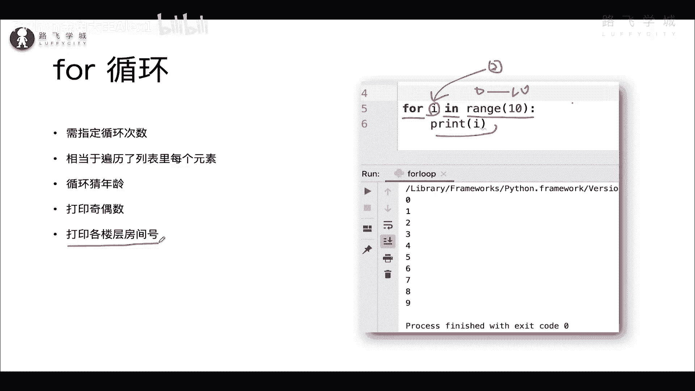
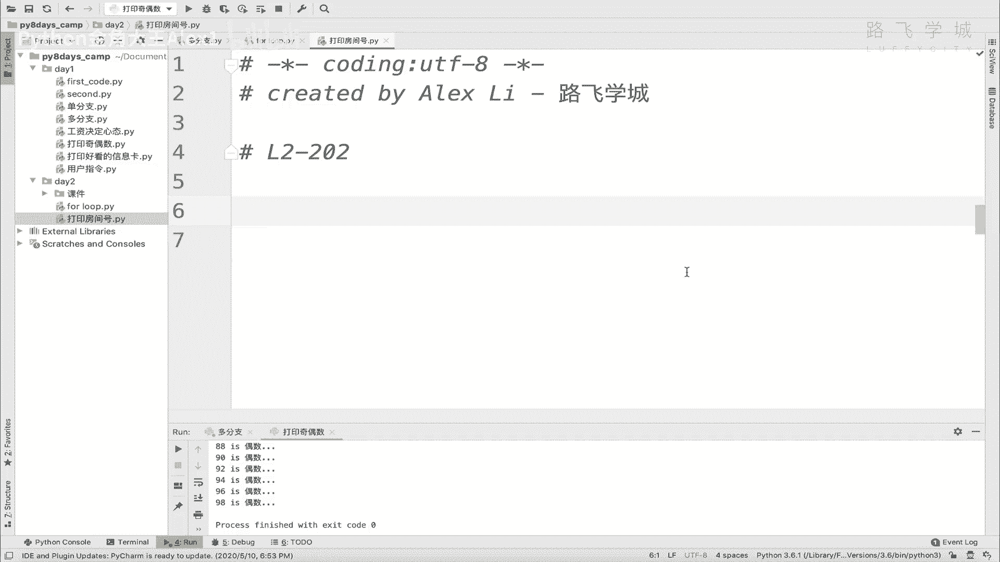
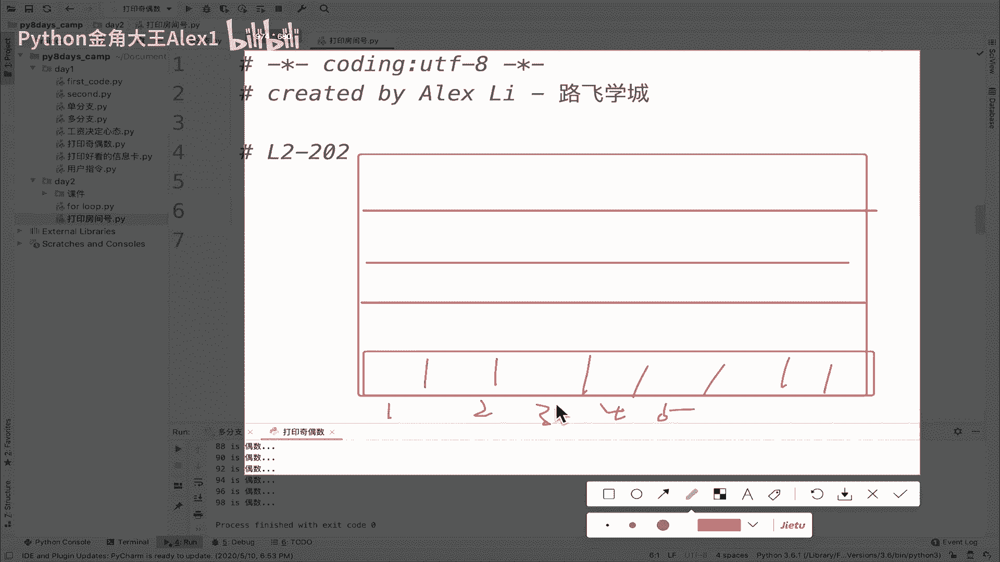
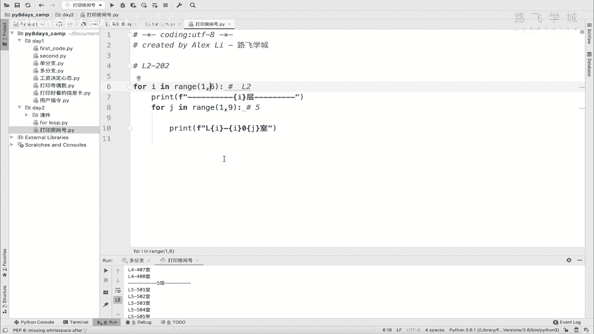

# Python数据分析实战：P21：02 循环嵌套 🏢



## 概述
在本节课中，我们将学习Python编程中一个非常实用的概念——**循环嵌套**。我们将通过一个具体的项目需求，即“打印一栋楼所有楼层的房间号”，来理解并掌握如何使用循环嵌套来解决实际问题。

---



## 需求分析
我们的目标是打印一栋楼所有楼层的房间号。假设这栋楼有5层，每层有8个房间。打印的格式应为：`L{楼层号}{房间号}`，例如，第二层的第三个房间应打印为 `L203`。

为了实现这个需求，我们需要依次处理每一层，并且在每一层内部，再依次处理该层的每一个房间。这自然引出了**循环嵌套**的概念：一个大的外层循环负责遍历楼层，一个小的内层循环负责遍历该楼层的房间。



## 循环嵌套的概念
循环嵌套是指在一个循环体内部，再包含另一个完整的循环结构。外层循环每执行一次，内层循环都会完整地执行一遍。

其基本结构可以用以下伪代码表示：
```python
for 外层变量 in 外层序列:
    # 外层循环体
    for 内层变量 in 内层序列:
        # 内层循环体
        # 执行具体操作
```

## 实现打印房间号
上一节我们介绍了循环嵌套的基本概念，本节中我们来看看如何用它来解决我们的楼层房间号打印问题。

以下是实现步骤：
1.  外层循环：使用 `for` 循环遍历每一层（例如1到5层）。
2.  内层循环：在外层循环的每次迭代中，再使用一个 `for` 循环遍历该层的每一个房间（例如1到8号房间）。
3.  打印格式：在内层循环中，组合外层循环的楼层变量和内层循环的房间变量，按照 `L{楼层}{房间}` 的格式进行打印。

需要注意，为了避免变量冲突，外层循环和内层循环应使用不同的临时变量名，例如 `i` 和 `j`。

以下是完整的实现代码：
```python
# 假设楼有5层，每层有8个房间
for floor in range(1, 6):          # 外层循环：遍历1到5层
    print(f"--- 第{floor}层 ---")   # 打印楼层分隔，便于观察
    for room in range(1, 9):       # 内层循环：遍历1到8号房间
        # 打印房间号，格式为 L楼层房间号，房间号用两位数表示
        print(f"L{floor}{room:02d}")
```

运行这段代码，你将看到类似如下的输出：
```
--- 第1层 ---
L101
L102
...
L108
--- 第2层 ---
L201
L202
...
L208
...
--- 第5层 ---
L501
...
L508
```

## 核心要点与总结
本节课中我们一起学习了循环嵌套。我们通过“打印楼层房间号”这个生动的例子，理解了其工作原理：**外层循环控制大的维度（楼层），内层循环处理该维度下的细节（房间）**。

循环嵌套是编程中的强大工具，常用于处理多维数据，如遍历表格的行与列、生成组合等。需要注意的是，嵌套层数越多，循环总次数会呈指数级增长（例如，两层循环次数是 `n * m`），可能影响程序效率。在实际应用中，通常嵌套两到三层即可满足大部分需求。



请花几分钟时间，在不看代码的情况下，尝试自己默写出这个程序，以加深理解。掌握循环嵌套，将为后续学习更复杂的数据处理和算法打下坚实基础。