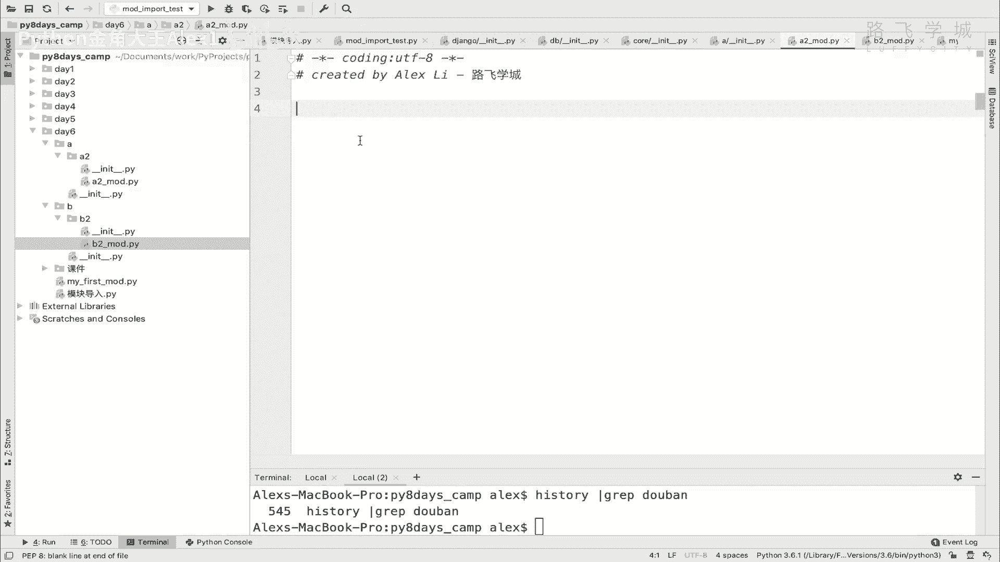
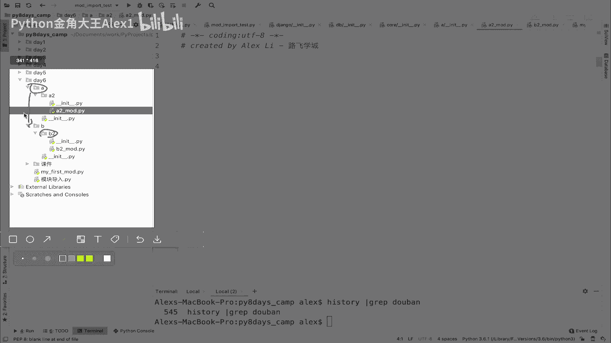
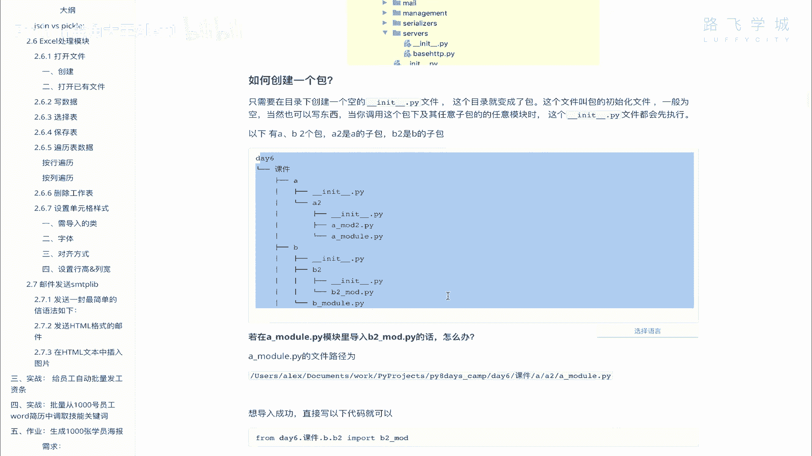

# Python编程：04：包的使用 📦

## 概述
在本节课中，我们将要学习Python中“包”的概念及其使用方法。包是组织和管理大型项目代码的有效方式，它允许我们将相关的模块分组到不同的目录中，从而使项目结构更加清晰、易于维护。

---

## 什么是包？🤔
上一节我们介绍了模块，本节中我们来看看包。包本质上是一个包含Python模块的目录。当项目变得复杂，拥有成百上千个代码文件时，将所有文件放在同一个目录下会显得非常混乱。为了方便管理，我们可以引入包的概念。

你可以根据业务逻辑或功能的不同，将代码文件分类存放在不同的目录下。每个这样的目录就可以被称为一个“包”。例如，在一个游戏项目中，可能有负责声音的包、负责图片的包和负责游戏等级的包。

观察一个典型的Python项目（如Django框架），你会发现它由许多目录组成，每个目录都是一个包，目录下可能还有子包和模块文件。这种层级结构使得代码管理变得非常方便。

## 如何创建一个包？🛠️
了解了包的概念后，我们来看看如何自己创建一个包。创建一个包非常简单，只需在一个空目录下创建一个名为 `__init__.py` 的文件，该目录就会自动被Python识别为一个包。

`__init__.py` 文件可以是空的，也可以包含一些初始化代码。它的存在是区分普通目录和Python包的关键。在大多数集成开发环境（IDE）中，你可以直接选择创建“Python Package”，它会自动生成这个文件。

以下是创建包的步骤：
1.  在项目中新建一个目录。
2.  在该目录下创建一个名为 `__init__.py` 的文件。

## 包的导入与使用 🔗
创建好包之后，代码需要在不同的包之间互相调用。本节中我们来看看如何实现跨包的导入。



假设我们创建了如下结构的包和模块：
```
项目根目录/
├── A/
│   ├── __init__.py
│   └── A2/
│       ├── __init__.py
│       └── a2_module.py
└── B/
    ├── __init__.py
    └── B2/
        ├── __init__.py
        └── b2_module.py
```
现在，我们想在 `a2_module.py` 中导入 `b2_module.py` 模块。由于它们位于不同的包路径下，我们需要使用点号（`.`）来表示包的层级关系。



导入的关键在于Python的 `sys.path` 环境变量，它决定了解释器搜索模块的路径。通常，项目的根目录会被包含在 `sys.path` 中。

因此，在 `a2_module.py` 中，我们可以这样导入：
```python
# 从项目根目录开始，通过点号进入B包，再进入B2子包，最后导入b2_module模块
from B.B2 import b2_module
```
如果直接使用 `from B2 import b2_module` 会报错，因为解释器在 `A2` 目录下找不到 `B2`。必须从两者共同的父级目录（即项目根目录）开始指定路径。

## `__init__.py` 文件的作用 ⚙️
上一节我们提到 `__init__.py` 文件用于标识一个目录为包，本节中我们深入了解一下它的另一个重要作用：初始化。

当导入一个包或其子模块时，该包（以及其父包）下的 `__init__.py` 文件会被自动执行。执行顺序是从最外层的父包开始，逐层向内。

例如，当我们执行 `from B.B2 import b2_module` 时：
1.  首先会执行 `B/__init__.py` 文件。
2.  然后会执行 `B/B2/__init__.py` 文件。

这个特性非常有用。我们可以在 `__init__.py` 文件中编写一些初始化代码，例如设置包级别的变量、导入子模块以简化外部调用，或者执行一些必要的环境检查。只要用户导入了这个包，这些初始化操作就会自动完成。

## 总结
本节课中我们一起学习了Python包的核心知识。我们首先了解了包是用于组织模块的目录结构。然后，我们学习了通过创建 `__init__.py` 文件来定义一个包。接着，我们实践了如何使用点号路径语法实现跨包的模块导入。最后，我们探讨了 `__init__.py` 文件的初始化执行特性及其应用场景。



掌握包的使用，能够帮助你构建结构清晰、易于维护的中大型Python项目。建议大家根据课程示例，自己创建具有层级结构的包并练习互相导入，以加深理解。