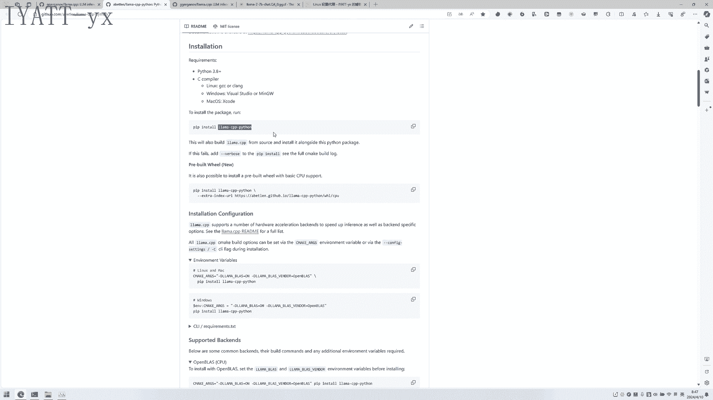
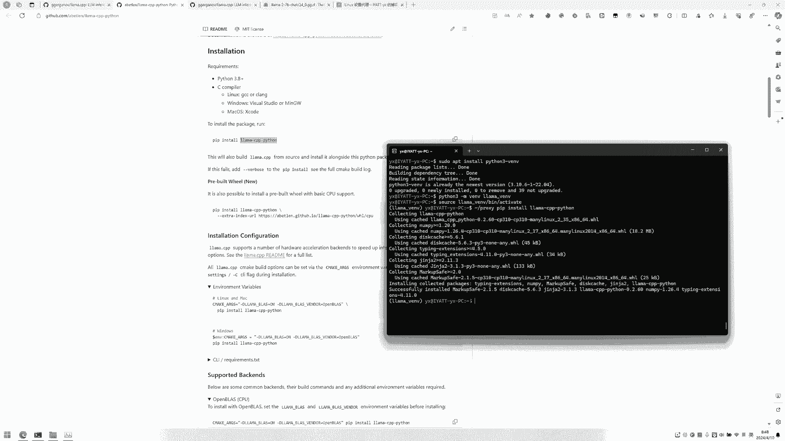
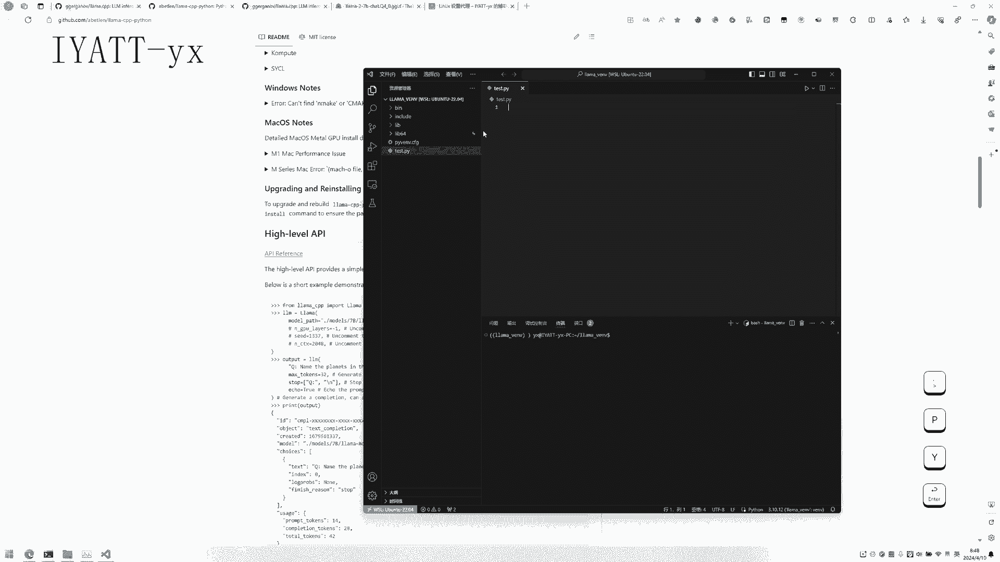
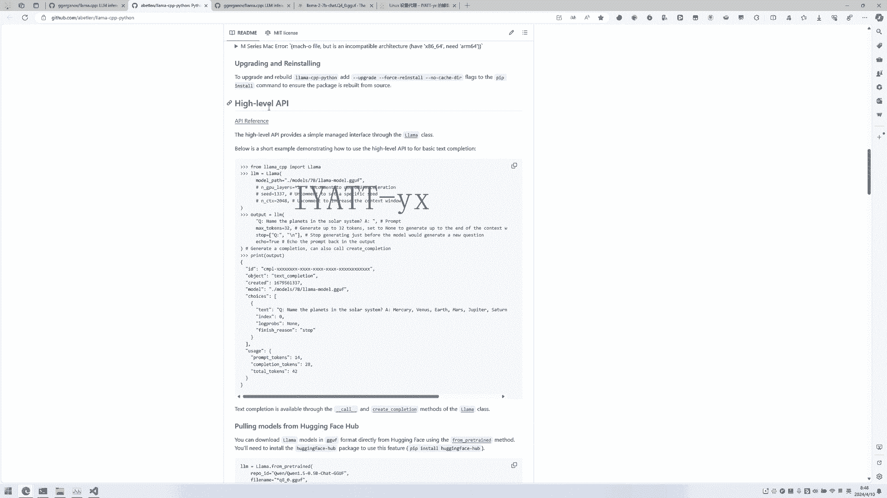
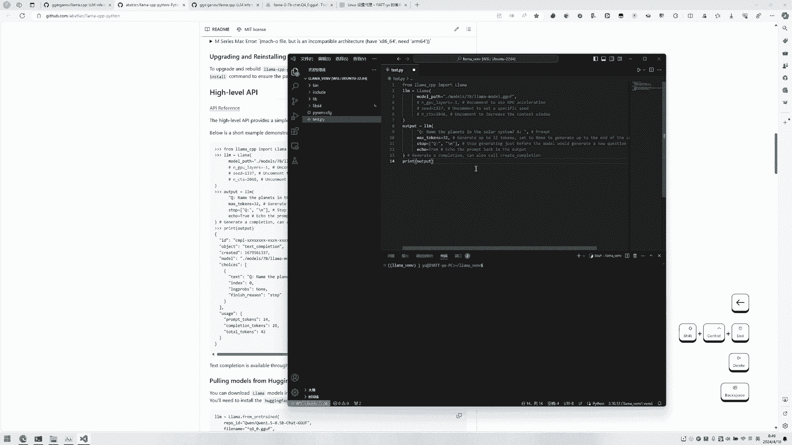
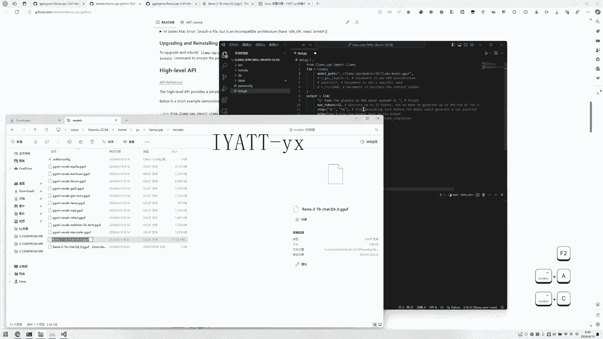
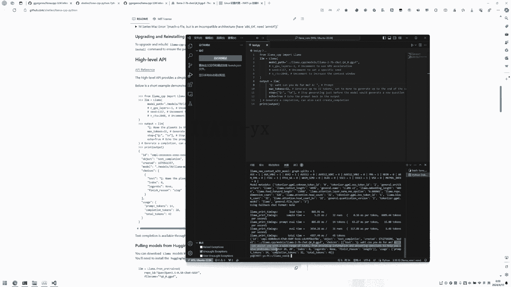
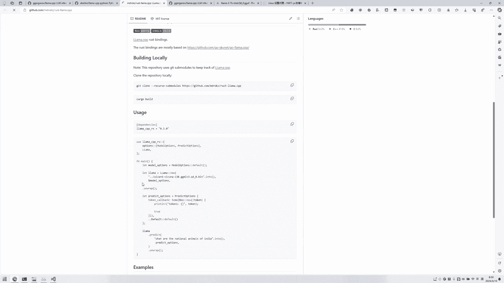

# Python 使用 Llama 演示：P1：环境配置与基础使用 🐍

在本教程中，我们将学习如何使用 Python 绑定来调用 Llama.cpp 项目中的大语言模型。我们将从环境配置开始，逐步完成一个简单的问答演示。

## 概述



本教程将指导你完成以下步骤：安装必要的 Python 库、配置虚拟环境、设置模型路径，并运行一个基础的高层 API 示例来与大模型进行交互。

---

## 安装 Python 绑定库

首先，需要安装 Llama.cpp 项目的 Python 绑定库。官方项目提供了多种语言的绑定支持，我们这里使用 Python 版本。请按照其说明进行安装。



建议使用虚拟环境以隔离项目依赖。在 Linux 系统下，默认可能未安装虚拟环境模块。使用 `venv` 可以创建一个独立的 Python 环境。

以下是创建和激活虚拟环境的步骤：

1.  创建名为 `llama` 的虚拟环境：
    ```bash
    python3 -m venv llama
    ```
2.  激活虚拟环境：
    ```bash
    source llama/bin/activate
    ```
3.  在激活的虚拟环境中，安装 `llama-cpp-python` 库。可以使用国内镜像源加速安装，或通过代理进行：
    ```bash
    pip install llama-cpp-python
    ```

---



## 配置开发环境与代码

上一节我们配置好了 Python 环境，本节中我们来看看如何编写代码。我们将使用 VS Code 进行编辑和演示。官方提供了示例代码可供参考。



首先，在 VS Code 中打开项目目录，并将解释器设置为虚拟环境中的 Python。然后，创建一个新的 Python 源文件。

将官方提供的高层 API 示例代码复制到新创建的文件中。该示例原本在交互式环境中演示，我们需要移除提示符箭头（如 `>>>` 和 `...`）使其成为可执行的脚本。



接下来，需要修改代码中的模型路径。模型路径应指向你下载的模型文件。假设你的目录结构如下，且当前 Python 文件位于 `llama-project` 目录内：

```
llama-project/
├── llama.cpp/   # Llama.cpp 项目目录
│   └── models/  # 模型存放目录
│       └── your-model.bin
└── your_script.py # 你的 Python 脚本
```

那么，模型路径应设置为：
```python
model_path = "../llama.cpp/models/your-model.bin"
```

---



## 运行示例与提问

在正确设置模型路径后，就可以运行示例脚本了。该示例会向大语言模型传递一个问题，并获取其回答。

以下是示例的核心代码逻辑：
```python
from llama_cpp import Llama
llm = Llama(model_path="./models/your-model.bin")
output = llm("Q: What can you do? A: ", max_tokens=32, stop=["Q:", "\n"], echo=True)
print(output)
```
执行这段代码，你将看到按照指定格式传递的问题以及模型生成的回答。



对于其他编程语言（如 Go、Node.js 等）的绑定，使用方法类似，均可参考其各自的官方说明文档。

---



## 总结

本节课中，我们一起学习了使用 Python 调用 Llama.cpp 大模型的基础流程。我们完成了虚拟环境的创建、依赖库的安装、模型路径的配置，并成功运行了一个简单的问答示例。掌握了这些步骤，你就具备了使用 Python 与大语言模型进行基础交互的能力。