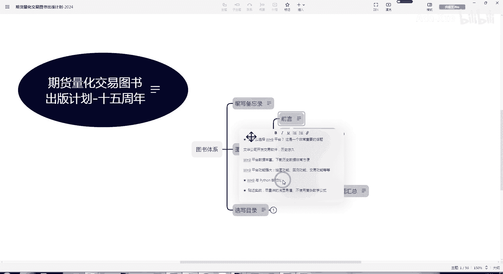
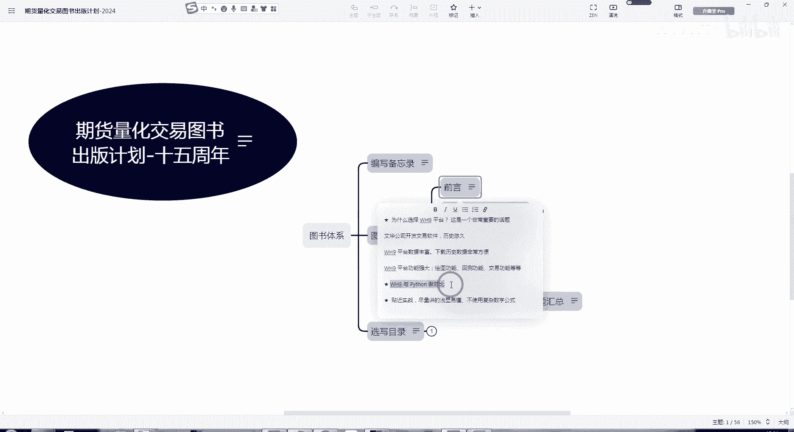

# Python与WH9量化平台对比分析：P1：语言特性与平台定位

在本节课中，我们将对通用编程语言Python与专业量化交易平台WH9进行初步对比分析。我们将从语言特性、应用领域和平台定位等角度出发，帮助初学者理解两者在量化交易开发中的不同角色与特点。

## 通用性与专业性对比

上一节我们介绍了本课程的分析框架，本节中我们来看看Python与WH9在通用性与专业性上的根本区别。

Python是一种**通用编程语言**，其设计目标并非专门针对某一特定领域。这意味着开发者可以利用Python及其庞大的生态系统，构建几乎任何类型的软件项目。

以下是Python典型的一些应用场景：
*   开发网络应用与网站后端。
*   进行数据科学分析与机器学习建模。
*   编写游戏或桌面应用程序。
*   实现自动化脚本与系统管理工具。

由于其通用性，在量化交易领域使用Python的好处很多，例如可以利用丰富的第三方库（如`pandas`、`numpy`）进行灵活的数据处理和策略研发。核心的数据处理操作常通过类似 `dataframe['close'].pct_change()` 这样的代码来完成。

然而，正因为Python不是专用的量化交易平台语言，其“坏处”在于：要实现一个完整的、可用于实盘交易的量化系统，开发者需要从数据接口、回测引擎、风险控制到订单执行等各个环节“自己一点点的去写”。尽管目前存在许多开源库和模块来简化这一过程，但构建一个稳定、高效的交易系统仍然需要投入大量的开发与维护成本。

## WH9的平台优势

了解了Python的通用性特点后，我们转向WH9。WH9是一个**成熟的、专用的量化交易平台**。

与从零开始搭建系统不同，在WH9上进行策略开发更像是一种“二次开发”。平台已经提供了稳定的数据源、高效的回测框架、实盘交易接口以及风险监控等基础设施。开发者可以更专注于策略逻辑本身，而非底层系统的实现，这大大降低了量化交易的技术门槛和开发周期。

本节课中我们一起学习了Python与WH9在平台定位上的核心差异：Python作为通用语言，提供了极高的灵活性和强大的生态系统，但需要自行构建交易系统的各个环节；而WH9作为专业量化平台，提供了开箱即用的基础设施，允许开发者在其成熟框架上进行高效地策略研发与部署。理解这一根本区别，是选择合适工具进行量化投资的第一步。