# Python在量化交易风险管理中的实务应用：P1：课程概述与核心概念 🐍


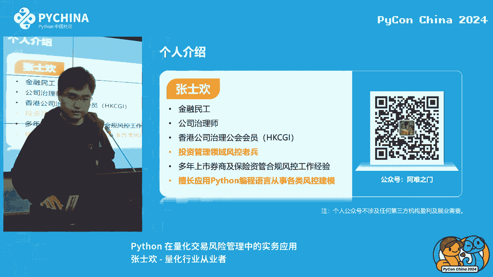

在本节课中，我们将学习Python在量化交易风险管理中的核心应用场景、必备工具库以及一个关键的风险计量模型。课程内容将帮助初学者理解风险管理的基本框架和Python在其中扮演的角色。

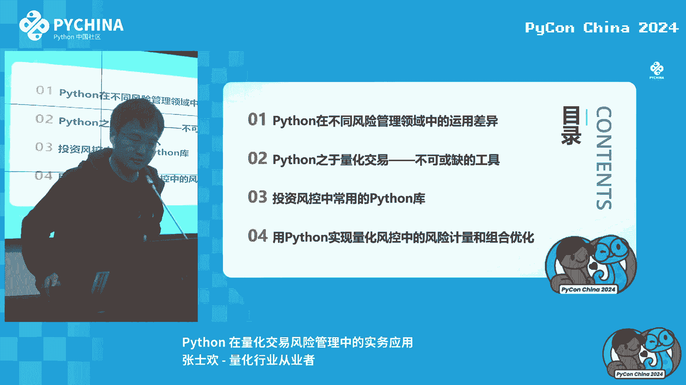

## Python在不同风险管理领域中的运用差异 📊

上一节我们介绍了课程的整体框架，本节中我们来看看Python在金融风险管理不同领域中的应用有何不同。

风险管理主要分为市场风险、信用风险、操作风险等。Python的应用深度在这些领域各不相同。

以下是Python在不同风险领域的主要应用情况：

*   **市场风险**：主要涉及基金（公募/私募）和券商。其核心是依据经典金融学模型（如有效市场假说、投资组合理论、期权定价模型）进行建模和分析。Python在此领域是**必备技能**。
*   **信用风险**：主要涉及银行和保险机构。其核心工作是评估借款人的违约概率，例如信用卡额度审批、企业贷款评估。在此领域，Python的应用存在差异：
    *   **企业信贷**：通常使用**打分卡模型**，基于企业财务报表（资产负债表、利润表等）的各项指标进行人工评分。由于违约样本少，数据量小，Python的机器学习应用有限。
    *   **个人/零售信贷**：面对海量客户数据，非常适合使用Python的机器学习库（如scikit-learn）构建分类模型，以高效区分“好客户”与“坏客户”。

因此，有志于从事金融风险管理，若偏向二级市场交易机构，应重点学习市场风险相关的Python建模；若偏向银行信贷业务，则应关注信用风险中的机器学习应用。

## Python是量化交易不可或缺的工具 ⚙️

了解了风险管理的不同领域后，我们聚焦到量化交易本身。本节将探讨为何Python在此领域如此重要。

量化交易不等于高频交易。它本质上是 **“因子投资方法论”+“程序化交易”**。

*   **因子**：代表市场的某种风格或特征，例如市值因子、价值因子、动量因子。甚至自定义的价量指标（如5分钟波动率）也可作为因子。
*   **策略生成**：现代技术（如AI）可以辅助生成简单的策略代码。例如，一个基于“小市值选股”的策略，其核心逻辑用代码表示可能如下：
    ```python
    # 示例：筛选市值小于50亿元的股票
    target_stocks = [stock for stock in all_stocks if stock.market_cap < 5_000_000_000]
    ```
    但实际生产环境的策略需要考虑更多复杂因素，如交易成本、冲击成本等。
*   **交易执行**：面对成百上千的股票，人工下单不现实。必须依赖程序化交易软件（如券商提供的专业系统）自动执行策略。这些系统的核心编程语言通常就是**Python**。

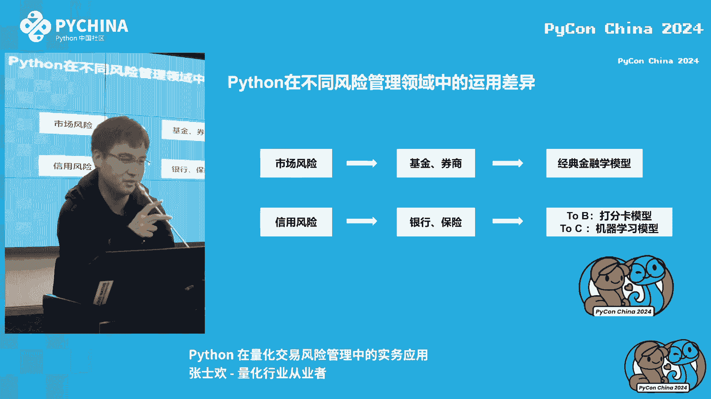

因此，从策略研究（因子计算、回测）到交易执行，Python贯穿了整个量化交易流程，是不可或缺的工具。

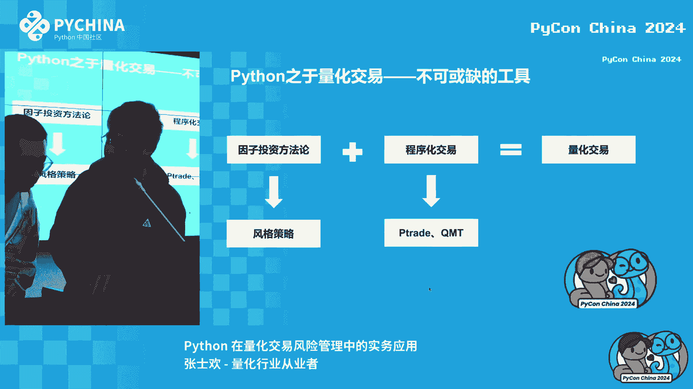


## 投资风控中常用的Python库 📦

上一节我们明确了Python在量化交易中的核心地位，本节中我们来看看实践中具体会用到哪些Python工具库。

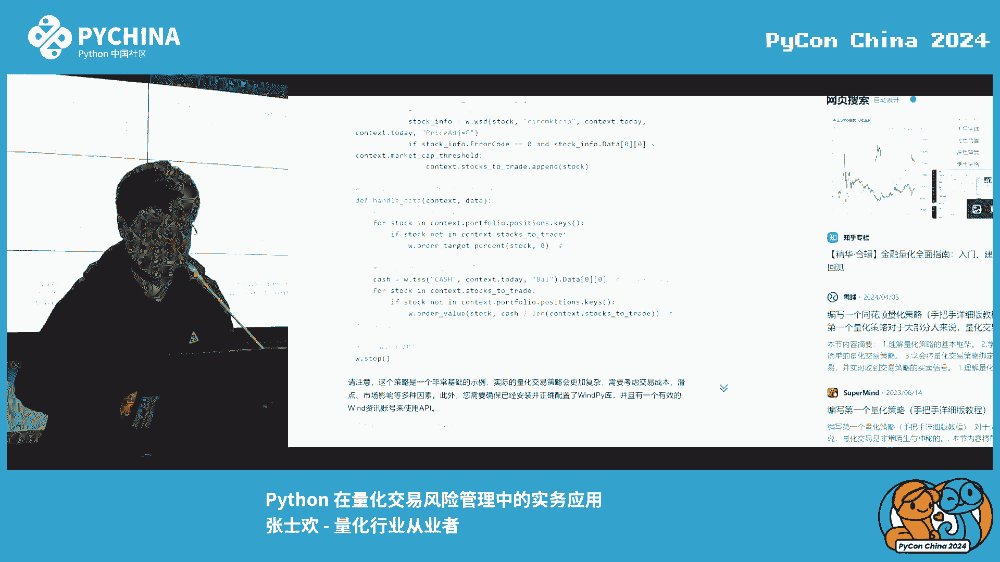

在量化风控工作中，以下几个库最为常用：

以下是风控工作中核心的Python库及其用途：

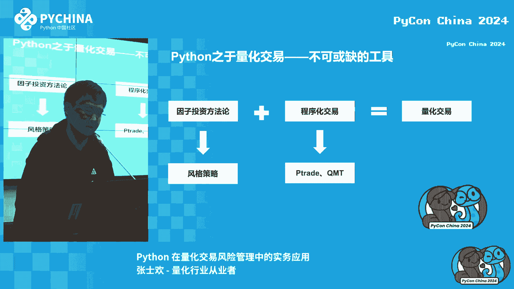

*   **`WindPy`**：用于连接万得（Wind）金融数据库，获取股票、基本面、宏观等专业数据。
*   **`pandas`**：核心数据处理库，可进行数据清洗、转换、分析，如同操作Excel表格或数据库。
*   **`numpy`** & **`scipy.stats`**：进行数值计算和统计建模。例如，计算投资组合的风险价值（VaR）。基于正态分布假设，计算95%置信度下一天的VaR公式近似为：
    `VaR = portfolio_value * z_score * portfolio_volatility`
    其中，`z_score` 可通过 `scipy.stats.norm.ppf(confidence_level)` 获取。
*   **`scikit-learn`**：机器学习库。在信用风险中用于构建分类模型；在量化领域也可用于因子研究与回归分析。
*   **`matplotlib`** / **`seaborn`**：数据可视化库，用于将分析结果生成图表和报告。

## 用Python实现量化风控中的风险计量：Barra模型 🧮

掌握了基础工具后，我们进入实战环节。本节将介绍一个在量化风控中至关重要的多因子风险模型——Barra模型。

Barra模型是一个多因子风险模型，它将资产的收益率分解为一系列因子收益的线性组合，加上特质性收益。其核心公式可表示为：

`R_i = ∑ (β_i,k * F_k) + ε_i`

其中：
*   `R_i`：资产i的收益率
*   `β_i,k`：资产i对第k个因子的暴露度（因子载荷）
*   `F_k`：第k个因子的收益率
*   `ε_i`：资产i的特质性收益率（无法被因子解释的部分）

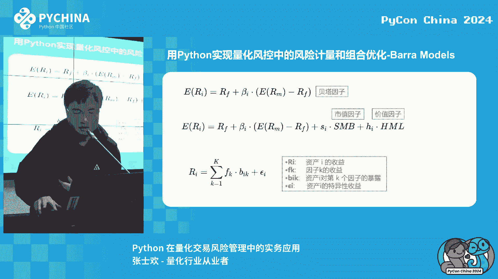

Barra模型包含了多个风格因子（如市值、价值、动量等）和行业因子。

构建和应用Barra模型是一个系统性的工程，主要步骤包括：

1.  **因子暴露度计算**：根据定义计算每只股票在各个底层因子上的暴露值。
2.  **数据处理**：进行去极值、标准化、中性化（如对行业中性化）等处理。
3.  **因子收益率估计**：通常采用**横截面回归**方法，估计每个因子在特定时间点的收益率。
    ```python
    # 示例：简化的横截面回归思路 (使用statsmodels)
    import statsmodels.api as sm
    # factor_exposure 为因子暴露度矩阵， returns 为股票收益率向量
    model = sm.OLS(returns, factor_exposure).fit()
    factor_returns = model.params # 得到的回归系数即为因子收益率估计值
    ```
4.  **风险与绩效归因**：得到因子收益率和暴露度后，可以分析投资组合的风险来源和收益归因。
    *   **风险归因**：组合风险多大程度上由某个因子暴露导致。
    *   **绩效归因**：组合超额收益有多少可以归因于某个因子收益。

在实际风控工作中，风控人员可以：
*   **监控因子暴露**：确保投资组合在特定因子（如市值、行业）上的暴露不超过限制。
*   **提供优化建议**：例如，当价值因子未来预期收益为负时，建议基金经理降低对价值因子的暴露。
*   **理解收益来源**：将基金经理的超额收益分解，判断是来自因子选择、行业配置还是个股选择。

## 总结与推荐 📚

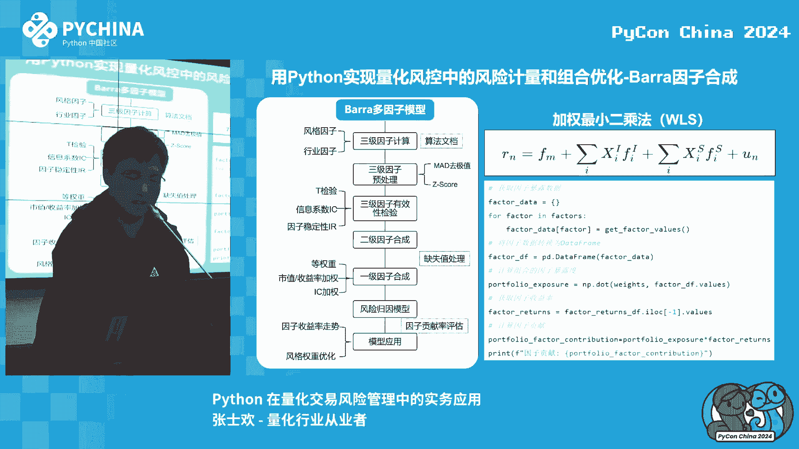

本节课中我们一起学习了Python在量化交易风险管理中的核心应用。我们从风险管理领域的差异讲起，明确了Python在市场风险和零售信用风险中的关键作用。随后，我们阐述了Python作为量化交易从策略到执行的全流程工具的必要性，并介绍了`pandas`、`numpy`、`scikit-learn`等核心库。最后，我们深入探讨了Barra多因子模型，理解了如何用它进行风险计量、归因和组合优化。

对于希望进一步学习的同学，可以参考以下书籍：
*   **量化投资**：《因子投资：方法与实践》- 石川
*   **风险管理**：《风险管理与金融机构》- 约翰·赫尔
*   **信用风险**：《智能风控实践指南》- 郑江等

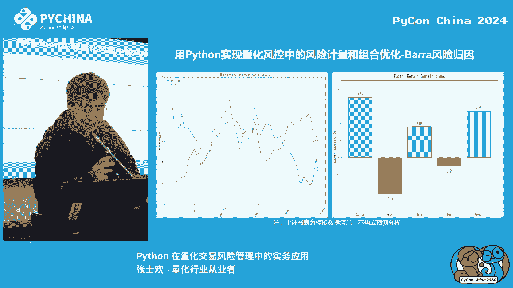

---

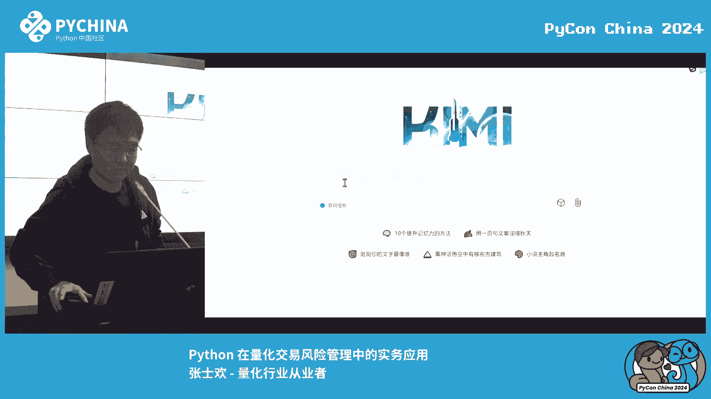

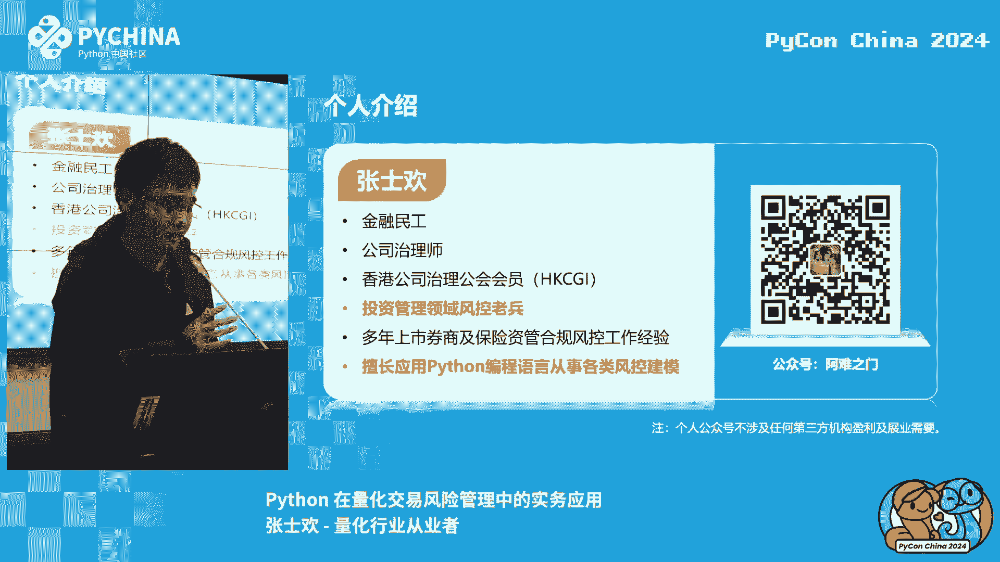

*注：本教程根据公开演讲内容整理，侧重于知识点的梳理与传达，已去除原口语化表达，并按照要求进行结构化呈现。*