# 计算机毕业设计：P1：项目概述与核心技术栈介绍 🚀

在本节课中，我们将要学习一个综合性的计算机毕业设计项目。该项目结合了Python编程、大语言模型、数据可视化与量化交易等多个领域，目标是构建一个功能完整的股票分析、预测与推荐系统。

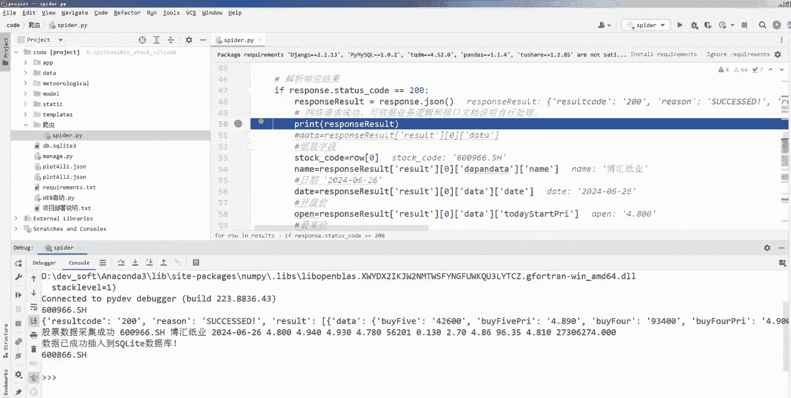

## 项目概述

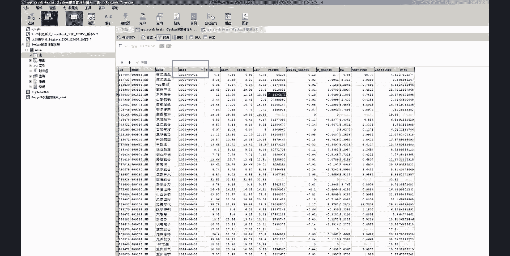

该项目旨在开发一个集股票数据爬取、分析、可视化、预测与推荐于一体的智能系统。系统将利用现代数据科学和人工智能技术，为股票投资决策提供数据支持。

上一节我们介绍了项目的整体目标，本节中我们来看看项目将涵盖哪些核心功能模块。

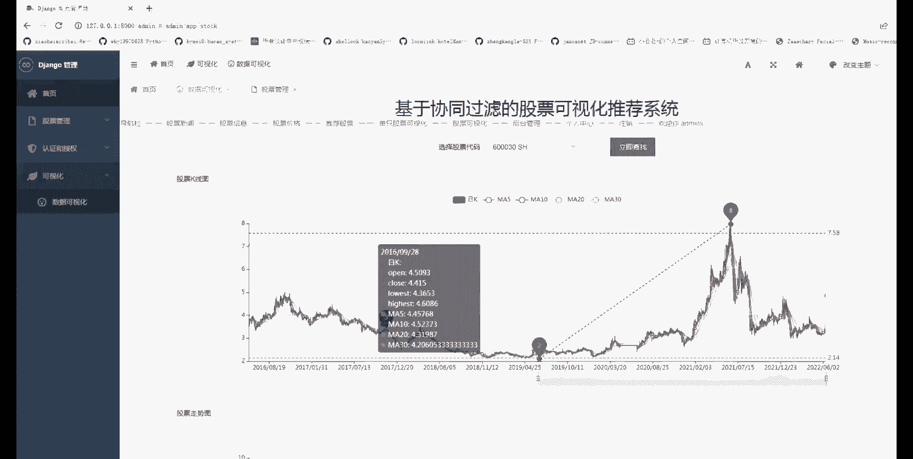

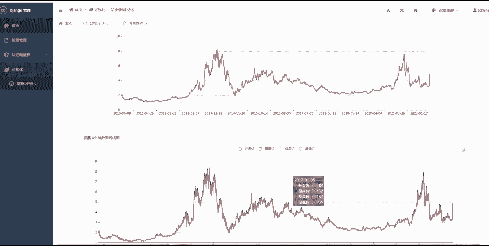

## 核心功能模块

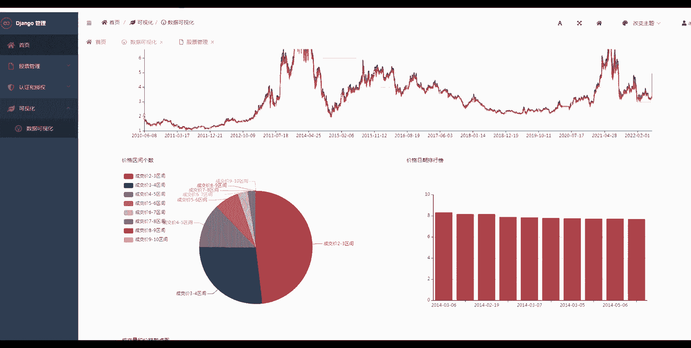

以下是本系统计划实现的主要功能：

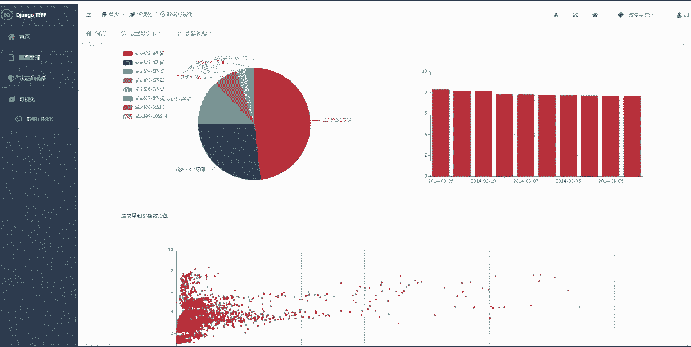

*   **股票数据爬虫**：自动从网络获取实时或历史的股票数据。
*   **股票数据分析**：对获取的数据进行清洗、统计和初步分析。
*   **股票数据可视化**：将分析结果以图表形式展示，例如绘制K线图。
*   **股票价格预测系统**：利用机器学习或深度学习模型预测股票未来走势。
*   **基于大模型的股票推荐系统**：结合大语言模型的推理能力，生成股票投资建议。
*   **量化交易策略回测**：对制定的交易策略进行历史数据模拟，评估其有效性。

## 核心技术栈

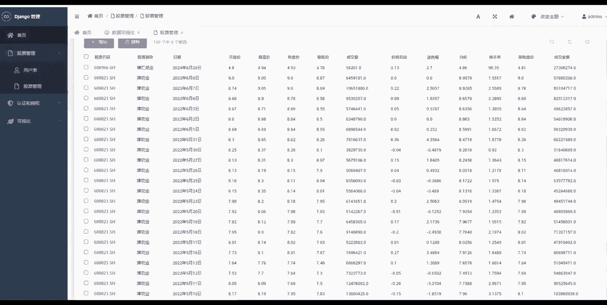

为了实现上述功能，本项目将依赖一系列关键技术工具和库。

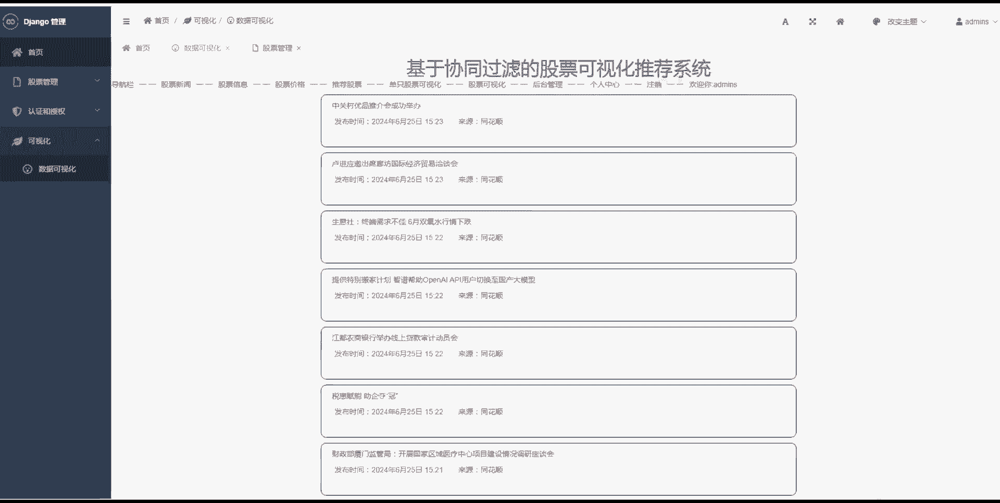

上一节我们列出了系统功能，本节中我们来看看支撑这些功能的具体技术。

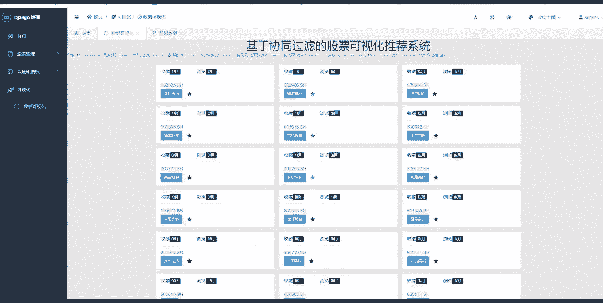

以下是项目将使用的主要技术组件：

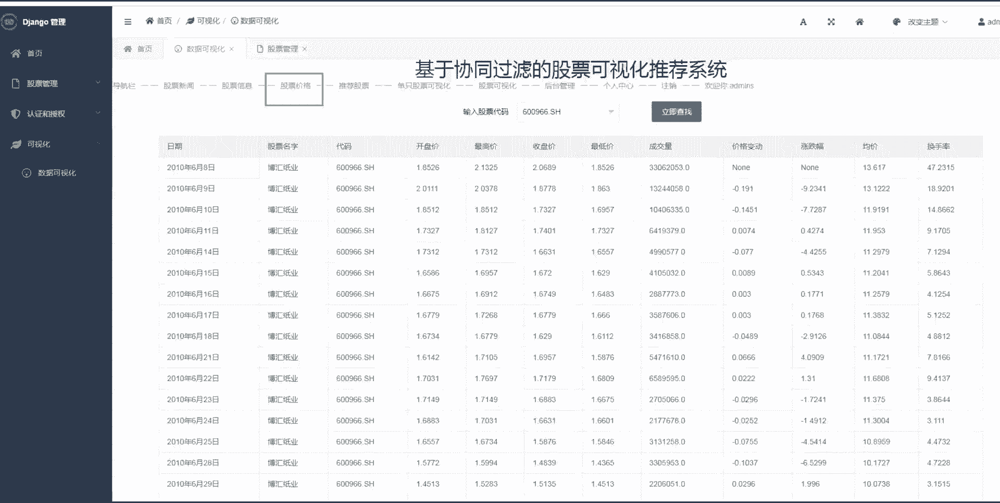

*   **编程语言**：**Python**。因其丰富的数据科学生态系统而成为首选。
*   **数据爬取**：`requests`, `BeautifulSoup`, `Scrapy` 等库。
*   **数据处理与分析**：`pandas`, `numpy`。
*   **数据可视化**：`matplotlib`, `seaborn`, 以及专门用于金融图表的 `mplfinance` 或 `plotly`。
    *   例如，绘制K线图的代码片段可能类似于：
        ```python
        import mplfinance as mpf
        mpf.plot(data, type='candle', style='charles', title='Stock K-line Chart')
        ```
*   **预测模型**：`scikit-learn` 用于传统机器学习模型；`tensorflow` 或 `pytorch` 用于构建深度学习模型。
    *   一个简单的线性回归预测公式可以表示为：`y_pred = w * x + b`
*   **大模型集成**：通过API调用（如OpenAI GPT, 文心一言等）或本地部署开源模型来获取分析建议。
*   **Web框架（可选）**：`Flask` 或 `Django`，用于构建系统前端界面或API服务。

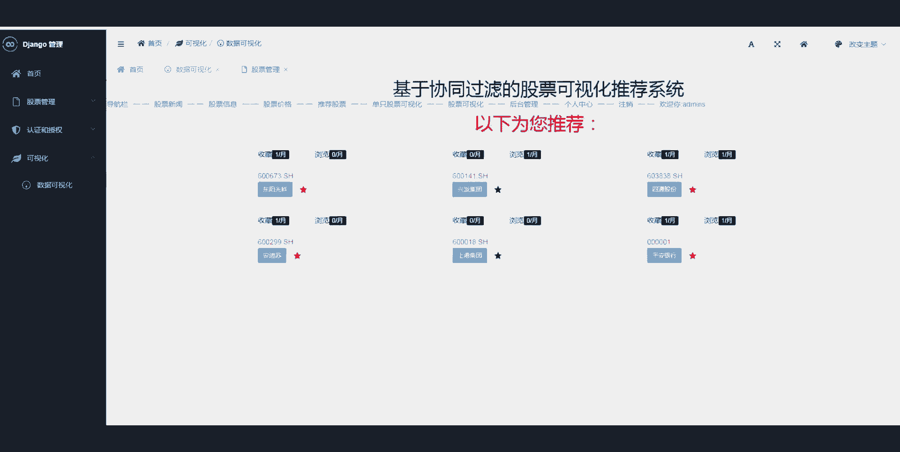

## 学习路径与目标

对于初学者而言，本项目的学习路径可以从理解每个独立模块开始，逐步进行集成。


通过完成本项目，你将能够：

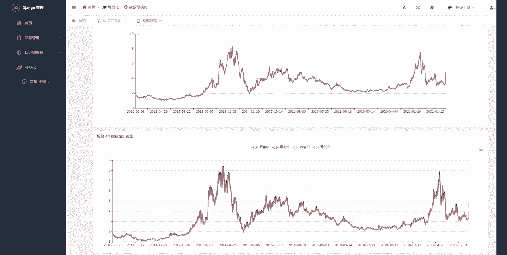

1.  掌握金融数据获取与处理的全流程。
2.  学会应用机器学习模型解决实际的时序预测问题。
3.  了解如何将大语言模型能力接入具体应用场景。
4.  实践从数据到洞察，再到策略验证的完整数据分析闭环。
5.  获得一个可作为毕业设计或作品集的综合性项目经验。

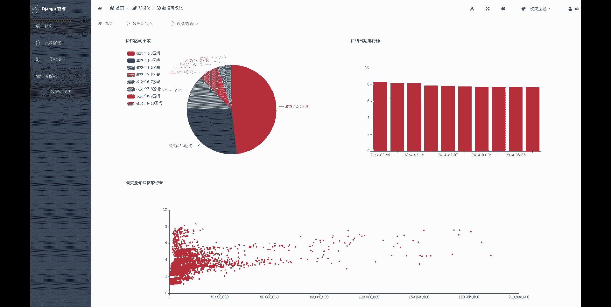

本节课中我们一起学习了“Python+大模型股票推荐系统”项目的整体蓝图、核心功能模块以及所需的技术栈。这是一个融合了数据工程、人工智能和金融知识的实践项目，为后续深入每个技术细节打下了基础。