# 计算机毕业设计：P1：基于Python与大模型的股票系统开发概述 📈

在本节课中，我们将要学习如何构建一个综合性的股票分析系统。该系统将结合Python编程、大语言模型、数据可视化与量化交易等多个技术领域，旨在为计算机专业毕业设计提供一个完整的项目范例。

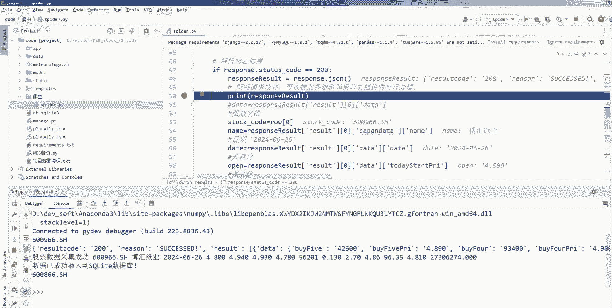

## 系统核心功能模块

上一节我们介绍了项目的整体目标，本节中我们来看看该系统包含哪些核心功能模块。

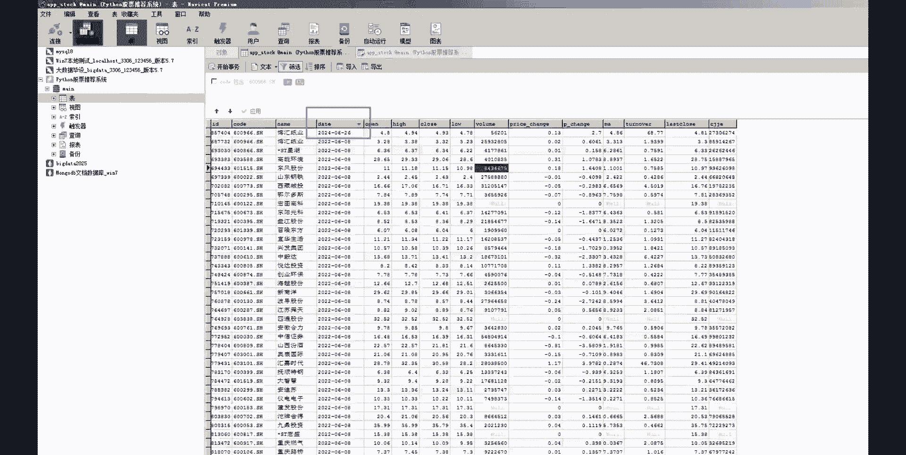

以下是该系统计划实现的六大核心功能：

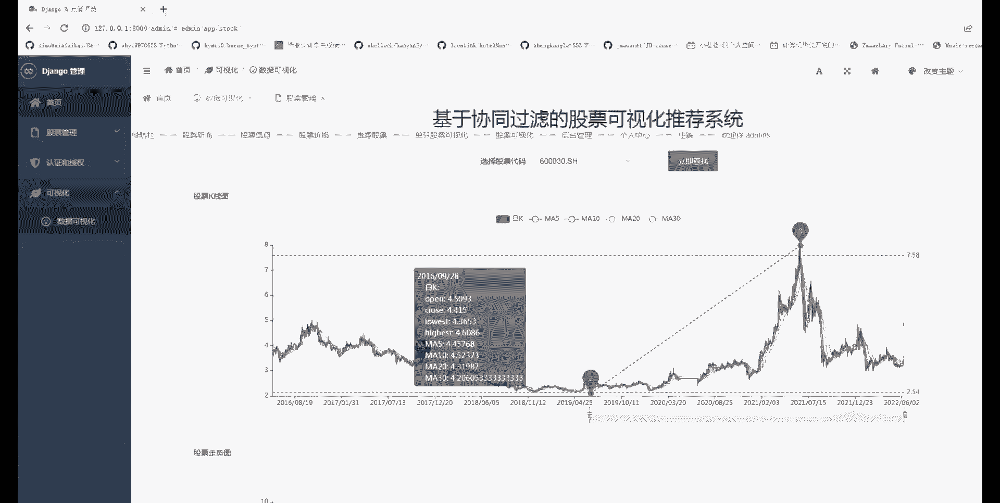

1.  **股票数据爬虫**：自动从网络获取实时或历史的股票交易数据。
2.  **股票数据分析**：对获取的数据进行清洗、处理与基础统计分析。
3.  **股票可视化（K线图等）**：使用图表库（如Matplotlib, Plotly）绘制K线图、趋势线等，直观展示数据。
4.  **基于大模型的股票预测与推荐**：集成大语言模型（LLM）分析市场情绪、新闻舆情，或利用其生成能力辅助预测与推荐。
5.  **量化交易策略系统**：实现基于特定算法（如均值回归、动量策略）的自动化交易信号生成。
6.  **大数据处理与存储**：应对海量金融数据，涉及高效存储与计算方案。

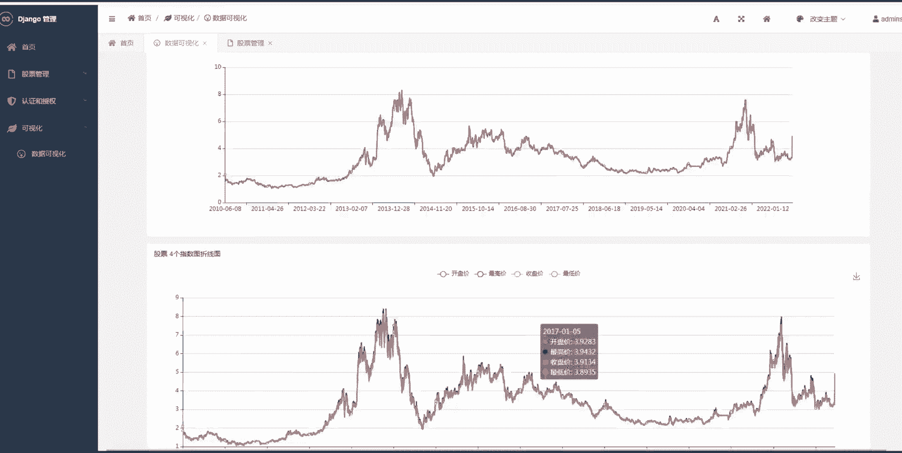

## 技术栈与工具选择

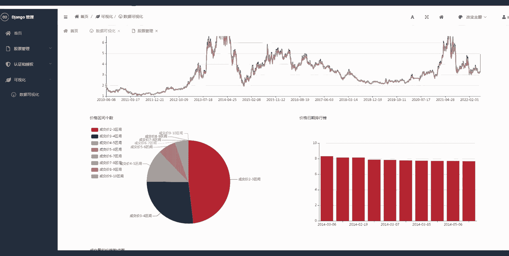

了解了功能模块后，我们需要为其选择合适的实现工具。

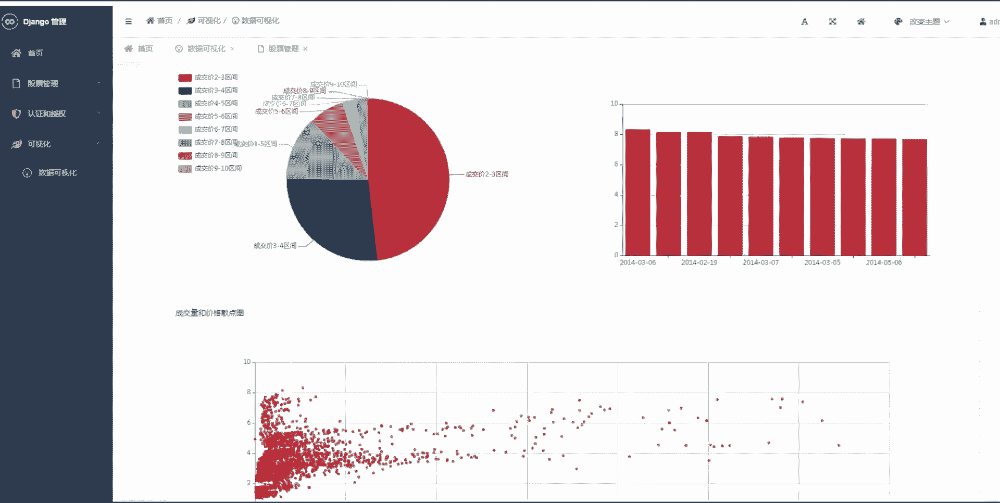

以下是构建本系统可能用到的主要技术栈：

*   **编程语言**：Python。因其在数据分析、机器学习和网络爬虫领域的强大生态。
*   **数据爬取**：`requests`, `BeautifulSoup`, `Scrapy`, 或金融数据API（如`akshare`, `yfinance`）。
*   **数据处理与分析**：`Pandas`, `NumPy`。
*   **数据可视化**：`Matplotlib`, `Seaborn`, `Plotly`， 以及专门的金融图表库如`mplfinance`。
    ```python
    # 示例：使用mplfinance绘制K线图
    import mplfinance as mpf
    mpf.plot(data, type='candle', style='charles', title='Stock Price')
    ```
*   **大模型应用**：OpenAI API、国内大模型API、或开源LLM（如ChatGLM, LLaMA）的本地部署。
*   **量化交易框架**：`Backtrader`, `Zipline`, 或自行实现策略逻辑。
*   **数据存储**：MySQL, PostgreSQL（关系型），或`MongoDB`（非关系型），用于存储结构化数据与元数据。

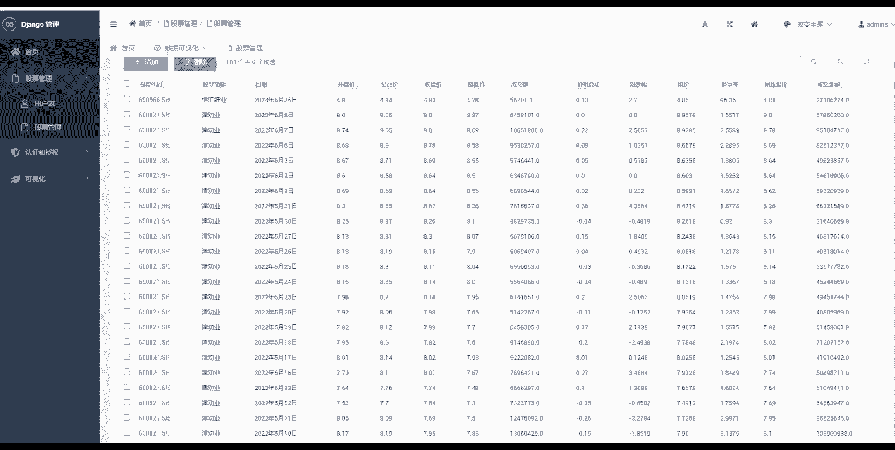

## 项目开发流程简述

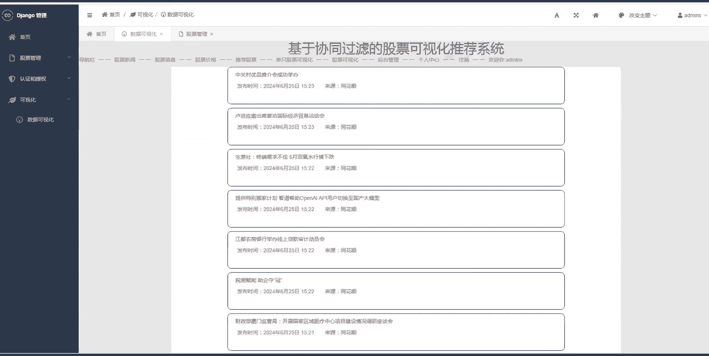

选定了技术工具，接下来我们梳理大致的开发流程。

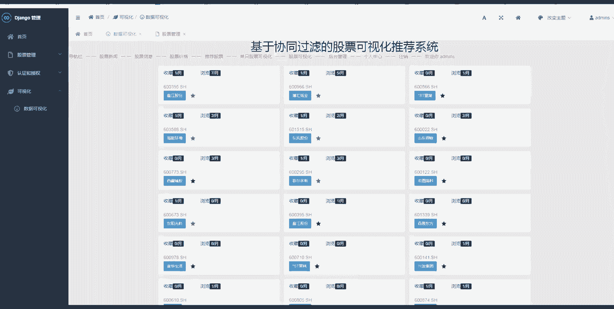

一个合理的开发流程可以保证项目有序推进。以下是建议的步骤：

1.  **需求分析与设计**：明确系统边界、功能细节，设计数据库结构和系统架构。
2.  **数据获取层开发**：实现稳定可靠的股票数据爬虫或接口调用模块。
3.  **数据存储层构建**：设计并创建数据库表，编写数据入库与查询逻辑。
4.  **核心分析模块实现**：开发数据分析、指标计算与可视化功能。
5.  **大模型集成**：将大模型API或本地模型接入系统，用于文本分析、预测或报告生成。
6.  **量化策略回测**：在历史数据上验证交易策略的有效性。
7.  **系统集成与测试**：将各模块整合，进行系统测试与优化。
8.  **前端展示（可选）**：可使用`Flask`, `Django`或`Streamlit`搭建Web界面。

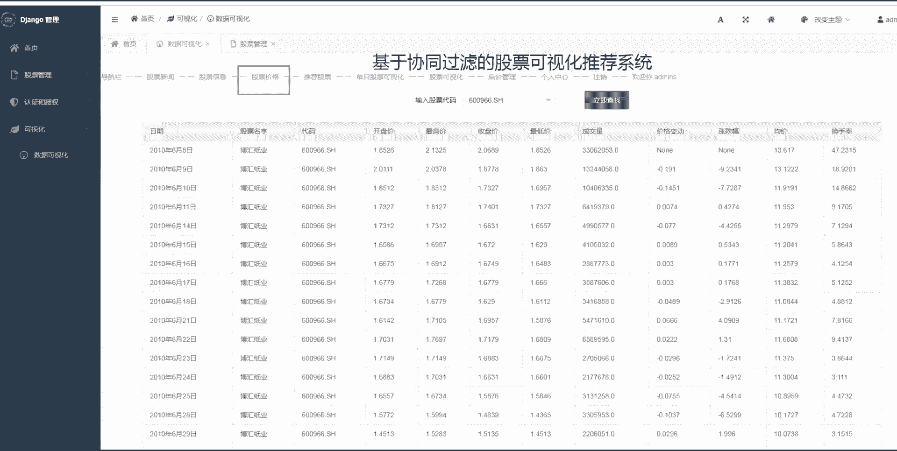

## 学习路径与难点

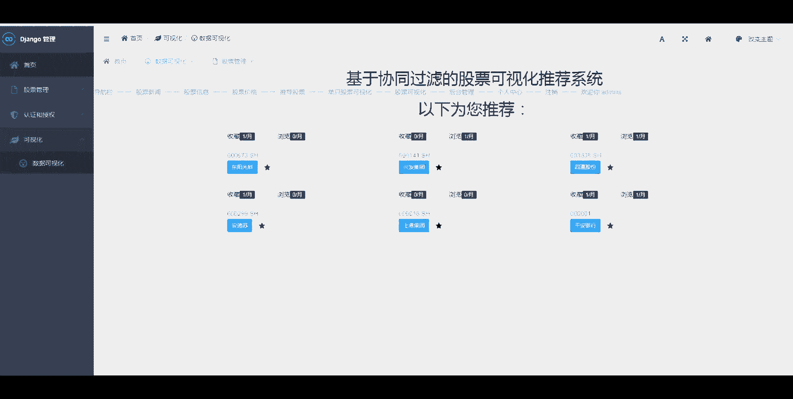

对于初学者，按部就班地学习是成功的关键。

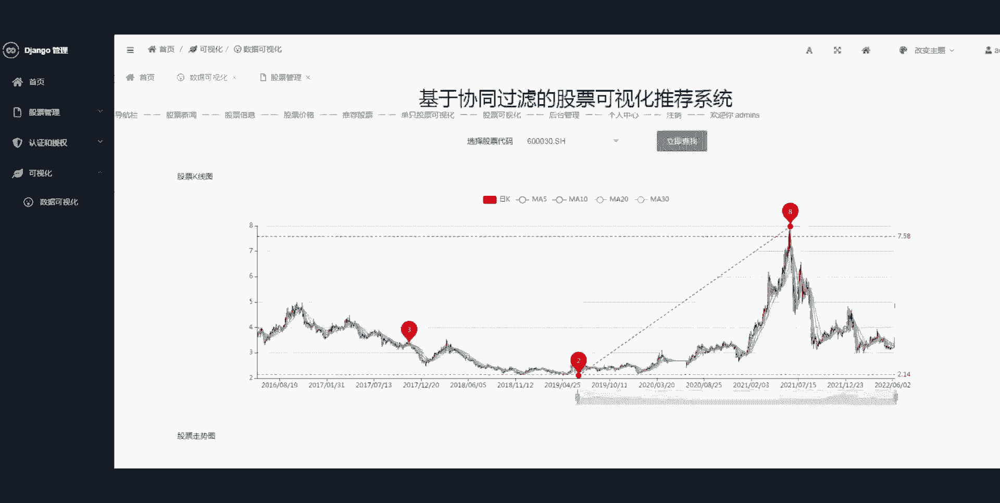

以下是针对初学者的学习建议和可能遇到的难点：

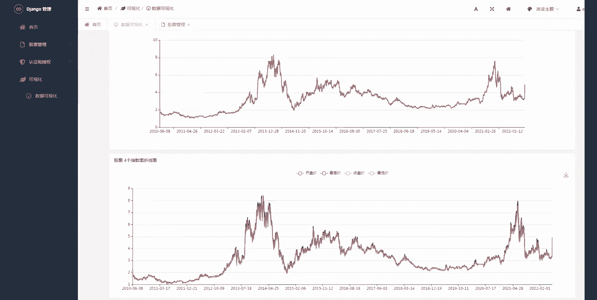

*   **建议学习路径**：
    *   首先巩固Python基础。
    *   然后学习`Pandas`进行数据处理。
    *   接着掌握一种数据可视化库。
    *   之后学习基本的网络爬虫技术。
    *   最后再接触量化交易概念和大模型API调用。
*   **潜在难点**：
    *   **数据质量**：金融数据可能存在缺失、异常，清洗工作至关重要。
    *   **预测不确定性**：股票预测极具挑战性，大模型更多用于辅助分析与信息整合，而非精确预测。
    *   **系统复杂度**：模块多，集成时需要良好的代码结构和设计模式。
    *   **回测陷阱**：量化策略回测需避免过拟合和幸存者偏差。

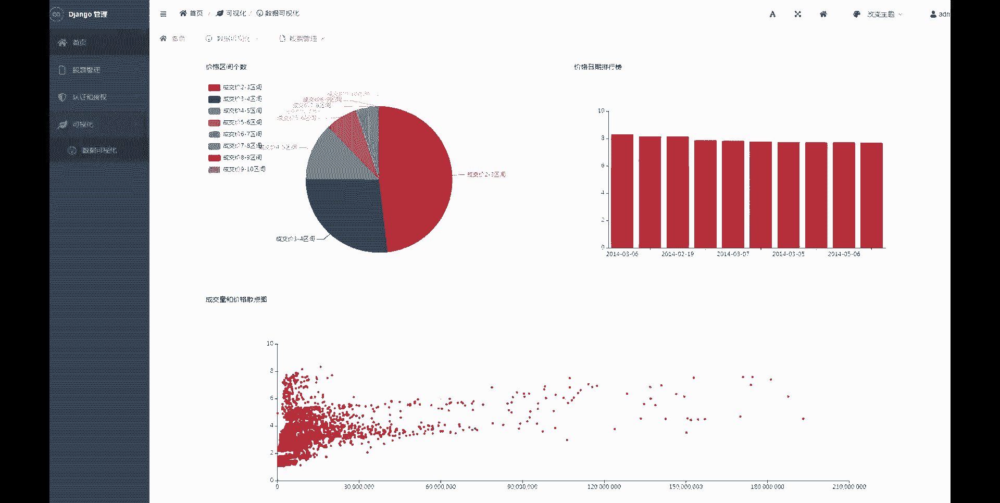

## 总结

本节课中我们一起学习了如何规划一个“Python+大模型股票推荐与预测系统”的毕业设计。我们从项目概述出发，明确了六大核心功能模块，探讨了所需的技术栈与工具，简述了开发流程，并为初学者提供了学习路径指引。记住，这是一个复杂的综合项目，建议从核心的数据获取与处理模块开始，逐步迭代，最终集成所有高级功能。