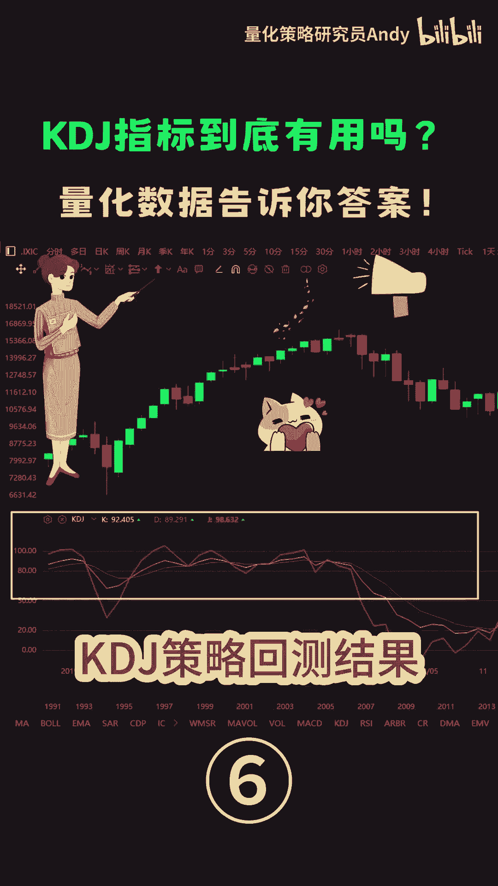
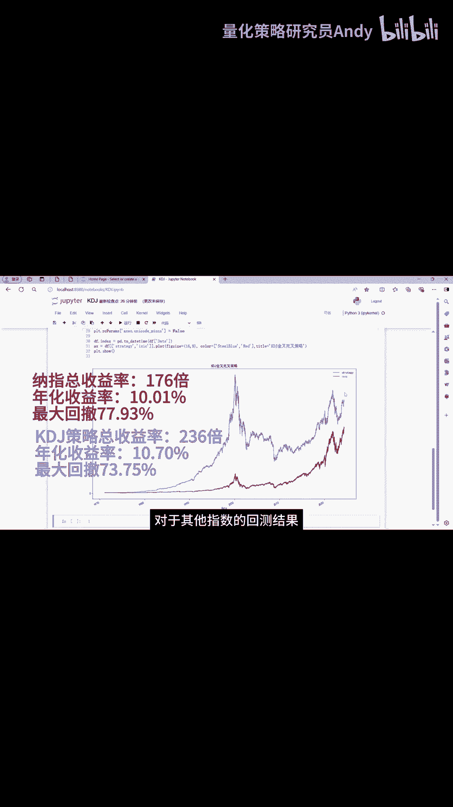

# Python代码回测KDJ指标策略：P1：基础策略构建与回测分析



在本节课中，我们将学习如何使用Python构建一个基于KDJ指标金叉与死叉的简单交易策略，并对纳斯达克指数进行历史回测。我们将分析该策略的收益率、年化收益以及最大回撤等关键绩效指标。

## 策略逻辑与信号构建

上一节我们介绍了KDJ指标的基本概念，本节中我们来看看如何将其转化为具体的交易信号。

我们定义一列`KDJ_cross`，用来判断金叉和死叉。金叉通常指K线自下而上穿越D线，视为买入信号；死叉则指K线自上而下穿越D线，视为卖出信号。

以下是基于金叉与死叉构建交易信号的核心逻辑：

```python
# 假设已有K值和D值的时间序列数据：df[‘K’], df[‘D’]
df[‘KDJ_cross’] = 0  # 初始化信号列
# 生成金叉（信号为1）与死叉（信号为-1）信号
df.loc[ (df[‘K’].shift(1) < df[‘D’].shift(1)) & (df[‘K’] > df[‘D’]), ‘KDJ_cross’ ] = 1
df.loc[ (df[‘K’].shift(1) > df[‘D’].shift(1)) & (df[‘K’] < df[‘D’]), ‘KDJ_cross’ ] = -1
```

## 回测结果分析

根据上述交易信号计算策略的收益率，并运行完整的回测代码后，我们得到以下结果。

图中红色的曲线代表纳斯达克指数自发布以来53年的历史走势。其总收益率为176倍，年化收益率为10.01%，期间最大回撤为77.93%。

图中蓝色的曲线代表KDJ金叉死叉策略的收益率曲线。该策略的总收益率达到了236倍，年化收益率为10.07%。

## 策略绩效评估

然而，这个策略在2000年互联网泡沫以及2008年金融危机期间，累计最大回撤达到了73.75%。

从以上数据可以看出，KDJ指标简单的金叉、死叉策略并没有获得显著的超额收益，反而出现了巨大的回撤。当然，同期纳斯达克指数的回撤更大。

总体来看，这个策略仅比指数表现稍微好一点点。对于其他指数的回测结果也是大同小异。



## 总结

本节课中我们一起学习了如何用Python代码实现KDJ指标的金叉死叉交易策略，并对其进行了历史回测分析。我们发现，这个基础策略虽然长期能略微跑赢指数，但同样会承受巨大的回撤风险，并未产生显著的阿尔法收益。这为我们后续优化策略提供了明确的方向。