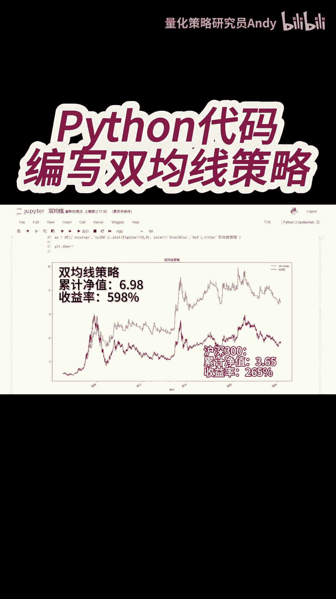
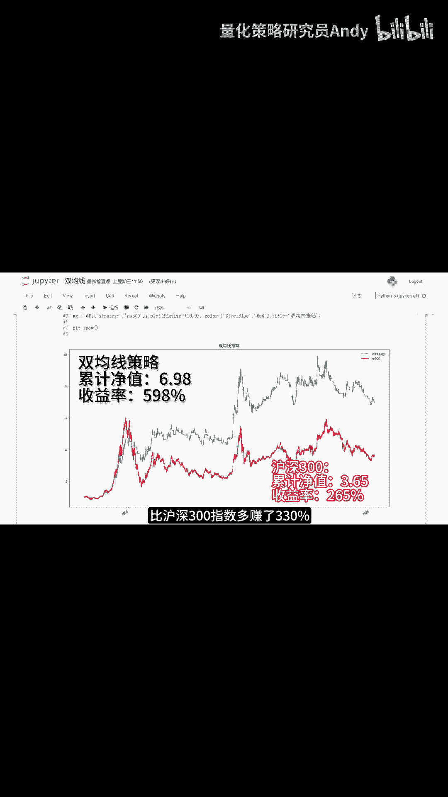

# Python量化交易入门：P1：双均线策略构建与回测 📈

在本节课中，我们将学习如何使用Python构建一个经典的双均线交易策略。我们将获取沪深300指数的历史数据，计算其短期和长期移动平均线，并根据两条均线的交叉关系生成买卖信号，最后对策略的收益表现进行回测和可视化分析。

## 数据获取与处理



首先，我们需要获取沪深300指数的历史每日收盘价数据。这是构建任何基于价格策略的基础。

```python
# 示例代码：获取数据（此处为示意，实际需使用如akshare、tushare等库）
# close_prices = get_hs300_close_prices()
```

## 计算移动平均线

上一节我们获取了基础价格数据，本节中我们来看看如何计算策略的核心指标：移动平均线。我们将采用简单移动平均的计算方法。

*   **简单移动平均计算公式**：`SMA = (P1 + P2 + ... + Pn) / n`
    *   其中 `P` 代表每个交易日的收盘价，`n` 代表计算平均的周期数。

我们将分别计算5日移动平均线（短期均线）和20日移动平均线（长期均线）。

```python
# 示例代码：计算移动平均线
ma_short = close_prices.rolling(window=5).mean()  # 5日均线
ma_long = close_prices.rolling(window=20).mean() # 20日均线
```

## 生成交易信号

计算出两条均线后，我们需要根据它们的相对位置关系来生成交易信号。以下是信号生成的核心逻辑：

1.  当短期均线（5日）从下方上穿长期均线（20日）时，产生**买入**信号。
2.  当短期均线（5日）从上方下穿长期均线（20日）时，产生**卖出**信号。

为了实现这一点，我们先计算两条均线的差值。

```python
# 示例代码：计算均线差值并生成信号
ma_diff = ma_short - ma_long
# 当差值由负转正（上穿）时，标记为买入信号1
# 当差值由正转负（下穿）时，标记为卖出信号-1
```

## 策略回测与绩效分析

有了交易信号，我们就可以模拟策略的历史交易，计算其每日的收益和资产净值曲线，并与基准（此处为沪深300指数本身）进行比较。

以下是回测流程的关键步骤：
*   初始化仓位状态和资产净值。
*   遍历每一个交易日，根据信号决定买入或卖出。
*   计算策略每日的收益率和累计净值。
*   计算基准（沪深300）的收益率和累计净值。

```python
# 示例代码：策略回测核心循环（示意）
# for date in trading_days:
#     if signal[date] == 1:  # 买入信号
#         position = 1
#     elif signal[date] == -1: # 卖出信号
#         position = 0
#     # 计算当日策略收益 = 仓位 * 指数收益率
#     strategy_return[date] = position * index_return[date]
#     # 更新策略净值
#     strategy_net_value[date] = strategy_net_value[date-1] * (1 + strategy_return[date])
```

## 结果可视化与解读

最后，我们将策略的净值曲线与沪深300指数的净值曲线绘制在同一张图中进行直观对比。


运行回测代码后，我们可以得到上图。图中红色曲线代表沪深300指数从2005年至今的净值曲线，其累计净值约为3.65，意味着收益率为265%。

图中蓝色曲线代表我们的双均线策略净值曲线，其累计净值达到6.98，意味着收益率为598%。

**结论**：在这个历史回测周期内，双均线策略的收益率（598%）显著超过了沪深300指数本身的收益率（265%），超额收益约为330%。




---

本节课中我们一起学习了双均线策略的完整构建流程，包括数据获取、指标计算、信号生成、回测验证以及结果可视化。这是一个入门级的趋势跟踪策略，演示了量化交易策略从构思到回测的基本步骤。请注意，本例仅为教学演示，实际投资中需考虑更多因素，如交易成本、滑点以及策略的过拟合风险等。