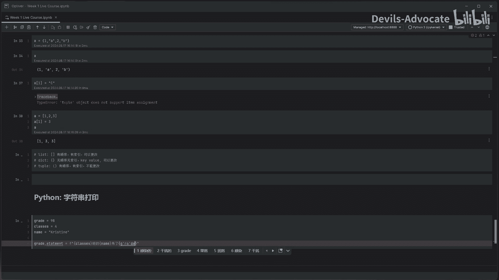
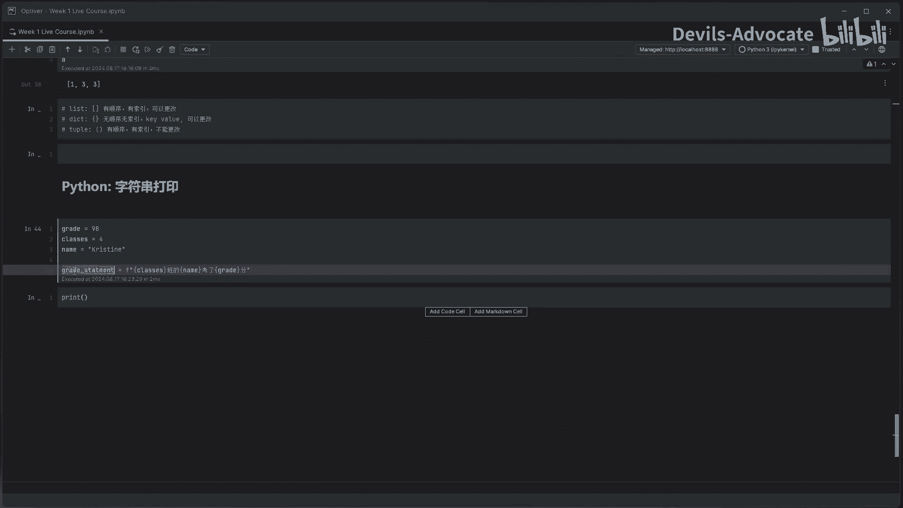
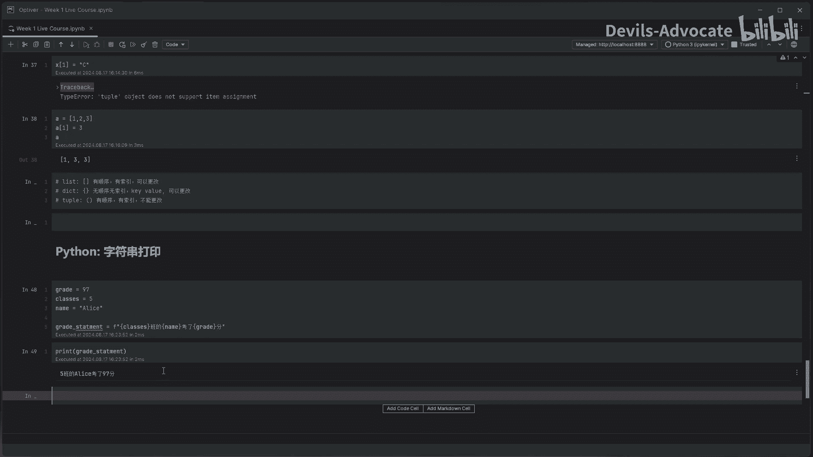

量化交易Python入门之数据分析【1/4】：1：字符串打印模板 📝

在本节课中，我们将学习如何使用Python的字符串格式化功能，通过模板来动态生成文本。这是一种非常实用的技巧，尤其适用于需要根据数据变化自动生成报告或文档的场景。

上节课我们介绍了字典和元组这两种数据结构。本节中，我们来看看如何利用字符串模板，将数据灵活地嵌入到文本中。

### 核心概念：f-string 格式化

Python提供了一种简洁的字符串格式化方法，称为f-string。其基本语法是在字符串前加上字母 `f`，然后在字符串内部用花括号 `{}` 包裹变量名或表达式。程序运行时，花括号内的内容会被其对应的值替换。

**公式/代码示例**：
```python
name = "Christine"
grade = 98
statement = f"{name} 考了 {grade} 分"
print(statement)
```
执行以上代码，将输出：`Christine 考了 98 分`。

### 实践步骤

以下是创建一个简单成绩报告模板的步骤：

首先，我们定义几个变量，分别存储学生姓名、班级和成绩。
```python
grade = 98
class_num = 4
name = "Christine"
```



接着，我们使用f-string语法创建一个字符串模板。在字符串前添加 `f`，并将变量放入花括号 `{}` 中。
```python
statement = f"{class_num} 班的 {name} 考了 {grade} 分"
```

最后，使用 `print()` 函数输出格式化后的字符串。
```python
print(statement)
```
运行结果将是：`4 班的 Christine 考了 98 分`。



### 动态更新数据

这种方法的优势在于，当底层数据发生变化时，我们无需手动修改文本，只需更新变量的值即可。

例如，将成绩改为97，姓名改为“Alice”：
```python
grade = 97
name = "Alice"
statement = f"{class_num} 班的 {name} 考了 {grade} 分"
print(statement)
```
此时，输出会自动更新为：`4 班的 Alice 考了 97 分`。

本节课中我们一起学习了如何使用Python的f-string进行字符串格式化。通过定义变量和创建模板，我们可以轻松地根据数据生成动态文本，这为后续处理如研究报告等需要重复套用格式的任务打下了基础。



下节课，我们将介绍Python中日期和时间的概念及其处理方法。