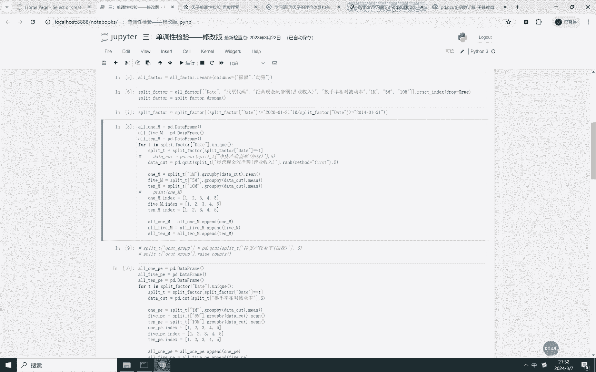
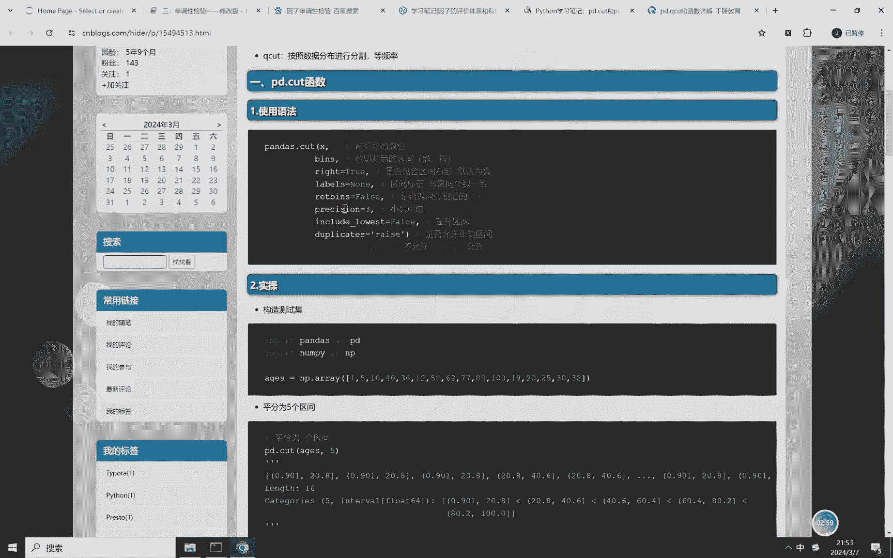
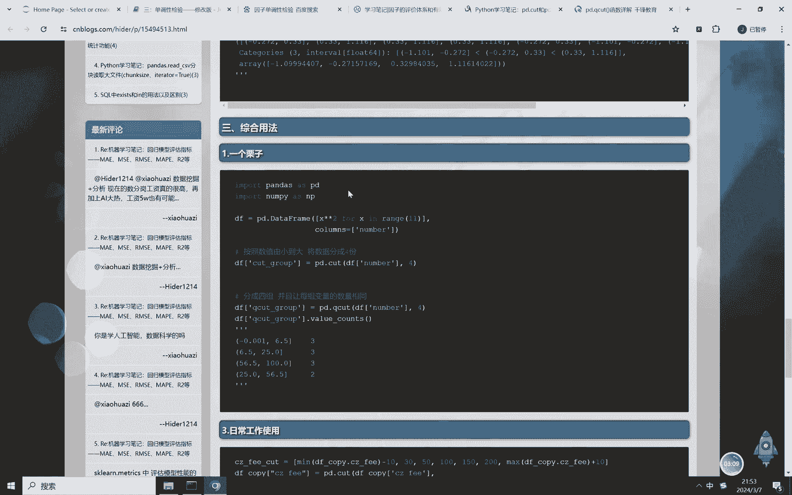
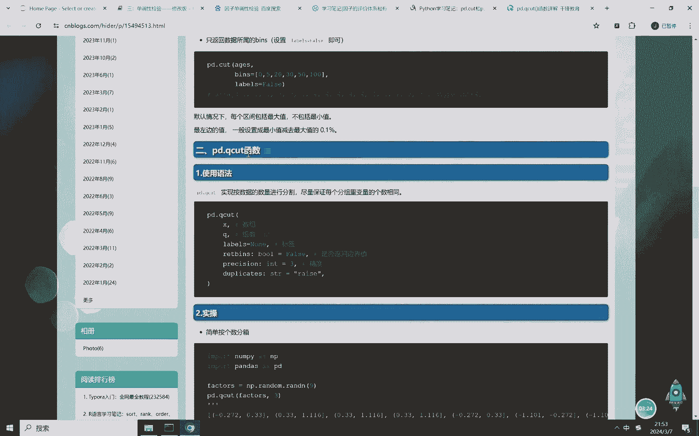
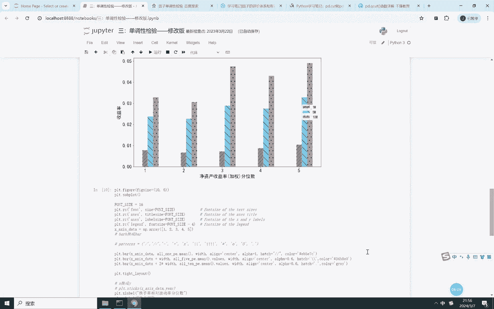

# Python多因子量化选股全流程：P2：因子单调性检验 📊

在本节课中，我们将学习因子分析中的一个重要环节——**因子单调性检验**。我们将理解其概念，并通过代码实践掌握如何使用`pandas`的`qcut`函数进行分组，以检验因子与未来收益率之间是否存在单调关系。

## 概述

上一节我们介绍了数据处理的基础步骤。本节中，我们来看看如何评估一个因子的有效性。核心方法是**因子单调性检验**，即检验因子值的大小是否与股票的未来收益率存在单调递增或递减的关系。

## 什么是因子单调性检验？

因子单调性检验，是将股票按其因子值从小到大进行排序并分组，然后统计每组在未来特定时期的平均收益率，观察收益率是否随因子值呈现单调变化。

理想情况下，我们希望看到因子值越大（或越小），其对应的未来平均收益率也越高，这被称为**单调性特征**。但市场关系可能是非线性的，例如，只有中间范围的因子值对应较高收益。单调性检验是识别有效因子的第一步。

## 代码核心：使用 `pd.qcut` 进行分组

以下是进行分组检验的核心步骤。唯一需要重点理解的函数是`pandas`库中的`pd.qcut`。



**核心函数公式/代码**：
```python
# 使用 pd.qcut 进行等频分组
factor_group = pd.qcut(factor_series, q=5, labels=False)
# q=5 表示分为5组
# labels=False 返回组别编号（0,1,2,3,4）
```





`pd.qcut` 与 `pd.cut` 的区别在于：
*   `pd.qcut`: **等频分组**。尽量保证每个分组内的股票数量相同。
*   `pd.cut`: **等宽分组**。根据因子值的数值范围进行均等划分。

在因子分析中，通常使用`pd.qcut`进行等频分组，以避免某些组别股票数量过少。



## 检验流程与结果解读

在代码中，我们对处理好的因子数据（如经营现金流净额、换手率波动率）进行以下操作：

1.  **分组**：在每个时间截面（T时刻），使用`pd.qcut`将股票按因子值分为5组。
2.  **计算收益**：分别计算每组股票在未来一个月、三个月、五个月、十个月的平均收益率。
3.  **可视化分析**：将各组的平均收益率绘制成柱状图。

以下是可能观察到的两种结果：
*   **单调递增**：因子值越大的组，未来平均收益率越高（正相关）。
*   **单调递减**：因子值越大的组，未来平均收益率越低（负相关）。

例如，在示例中：
*   **经营现金流净额**因子呈现**正相关**的单调递增关系。
*   **换手率波动率**因子呈现**负相关**的单调递减关系。

## 总结

本节课我们一起学习了**因子单调性检验**。我们掌握了其核心概念，即检验因子与未来收益是否存在单调关系，并重点学会了使用`pd.qcut`函数对因子进行等频分组的方法。这是评价因子有效性的基础步骤。

下一节课，我们将深入探讨更精确的因子评价指标：**IC值（信息系数）与IR值（信息比率）分析**。



---
*注：本教程涉及的完整代码与数据可在相关资源处获取。*