# Python数据分析与金融量化实战：P1：01 数据分析秘笈介绍 📊

在本节课中，我们将要学习数据分析的基本概念、核心作用以及课程的整体规划。我们将了解数据分析如何从看似杂乱的数据中提炼价值，并探讨其在商业决策和金融量化等领域的应用。

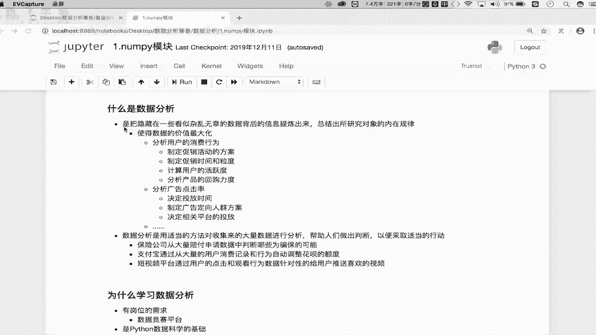

## 什么是数据分析？

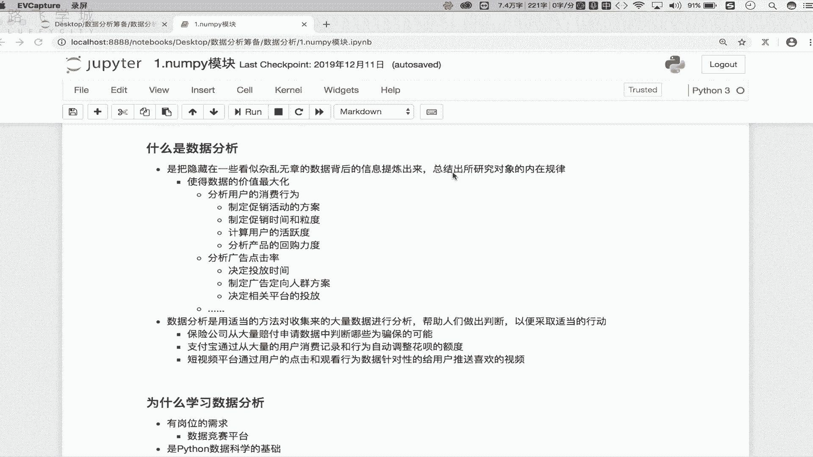

数据分析是指从看似杂乱无章且量级庞大的数据中，提炼出有价值的信息，并总结出这些数据内部规律的过程。

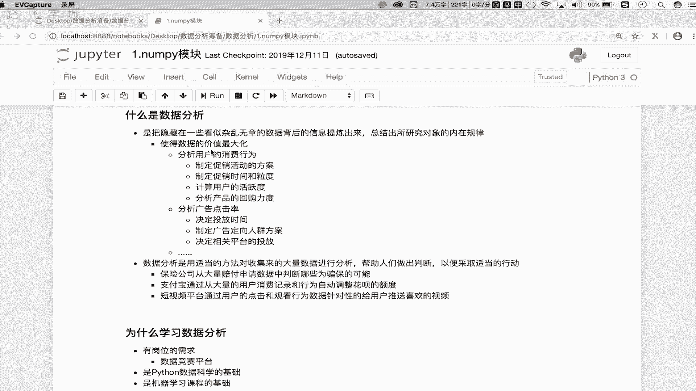

其核心作用在于**将数据的价值最大化**，主要体现在提升综合收入和利润上。各行各业都可以通过数据分析技能，让原始数据产生最大的效益。

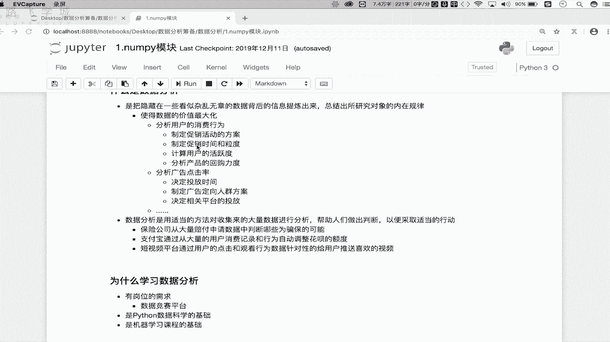

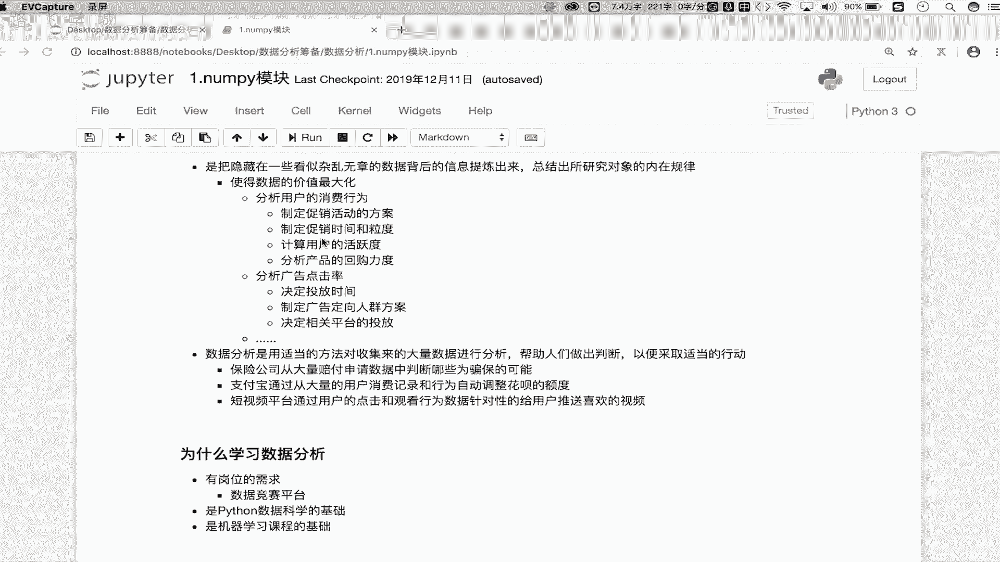

## 数据分析的作用与意义

上一节我们介绍了数据分析的基本概念，本节中我们来看看它的具体作用。

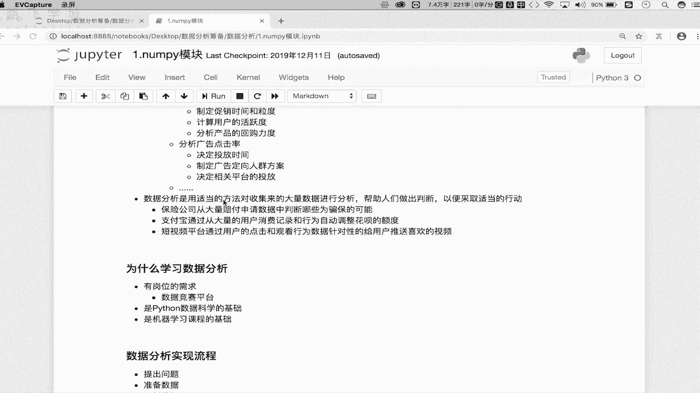

数据分析使用适当的方法对收集来的大量数据进行分析，最终得出的结论可以帮助人们做出精准判断，并采取合适行动，从而保证价值和利润的最大化。

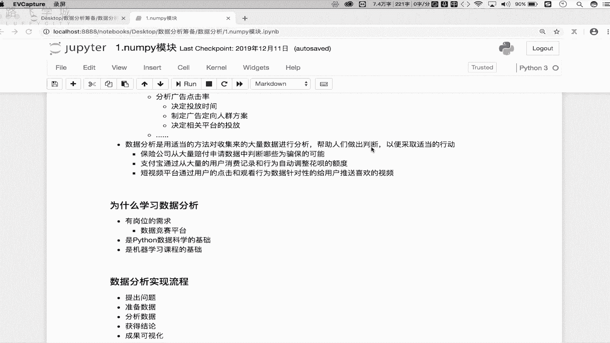

以下是数据分析在实际中的几个应用案例：

*   **分析用户消费行为**：商家可以基于历史消费记录，分析用户消费习惯、回购能力等，从而制定更有效的促销活动方案、确定促销时间和力度。
*   **优化广告投放**：广告商可以分析用户观看和点击广告的历史行为数据，从而决定广告的投放平台、内容、时长和播放策略，以更精准地触达目标人群。
*   **识别保险欺诈**：保险公司可以从大量历史赔付申请数据中，分析并精准判断出潜在的骗保行为。
*   **制定信用额度**：如支付宝花呗，通过分析用户的大量消费记录和行为数据，为不同用户设定差异化的信用额度。
*   **实现精准推送**：短视频或资讯平台通过分析用户的长期观看行为数据，了解用户喜好，为用户画像，从而实现内容的个性化推荐。

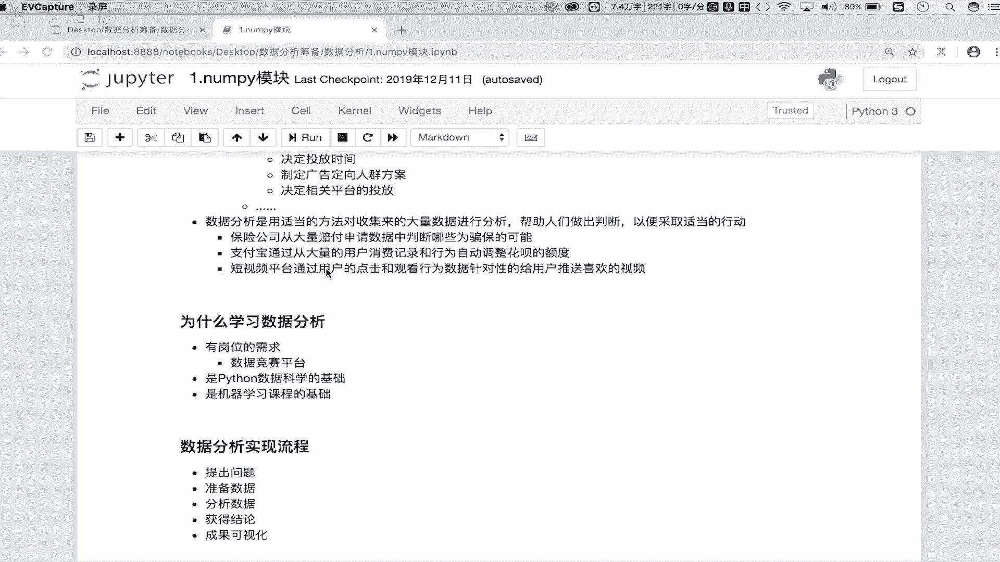

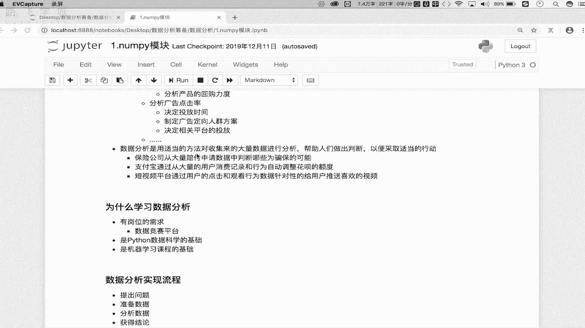

## 为什么学习数据分析？

了解了数据分析的作用后，我们来看看学习它的必要性。

以下是学习数据分析的三个主要原因：

1.  **岗位需求广泛**：数据分析岗位不仅在互联网行业需求旺盛，在金融、零售、制造等传统行业也同样存在大量需求。企业需要专业人才分析数据，以辅助决策并实现价值最大化。
2.  **Python数据科学的基础**：Python在数据分析和机器学习领域具有强大优势。其数据分析框架集成了大量数学和科学计算模块，是进行数据运算和分析的重要基础。
3.  **机器学习课程的基础**：数据分析是转向机器学习领域的必备基础。扎实的数据分析能力能为后续学习机器学习提供良好的铺垫。

## 数据分析的基本流程

明确了学习动机，接下来我们了解数据分析的标准工作流程。

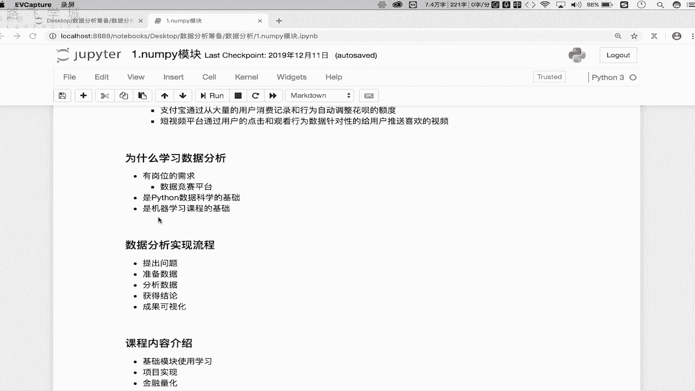

数据分析的实现通常遵循以下五个步骤：

1.  **提出问题**：明确需要分析解决的具体问题。
2.  **准备数据**：通过内部获取、购买或网络爬虫等方式，收集与问题相关的数据。
3.  **分析数据**：运用数据分析相关的模块和技能，对数据进行处理和分析。
4.  **获得结论**：从分析结果中提炼出有价值的结论和洞察。
5.  **结果可视化**：使用图表（如散点图、直方图、折线图）将分析结论直观地展示出来。

## 本课程内容规划

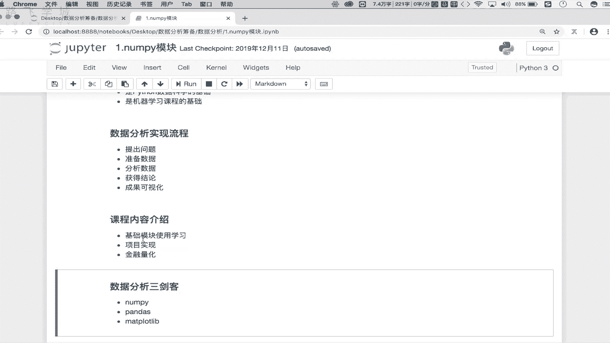

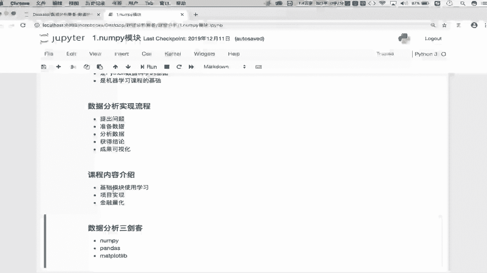

最后，我们来了解一下本课程的整体学习路径。

整个课程将分为三大部分进行：

*   **第一部分：基础模块学习**：系统讲解Python数据分析核心模块（如NumPy, Pandas）的使用，包括模块导入、工具类、方法及属性。这是后续所有实战的基石。
*   **第二部分：企业实战项目**：将基础技能应用于真实的企业需求项目中。从制定分析需求开始，到使用所学模块分析数据、得出结论，并最终利用可视化工具展示成果，完整模拟企业数据分析工作流程。
*   **第三部分：金融量化入门**：探讨数据分析在金融量化领域的落地应用。我们将学习如何结合数据分析技能制定科学的股票交易策略（例如双均线策略、小市值策略），了解如何通过量化方法辅助投资决策。

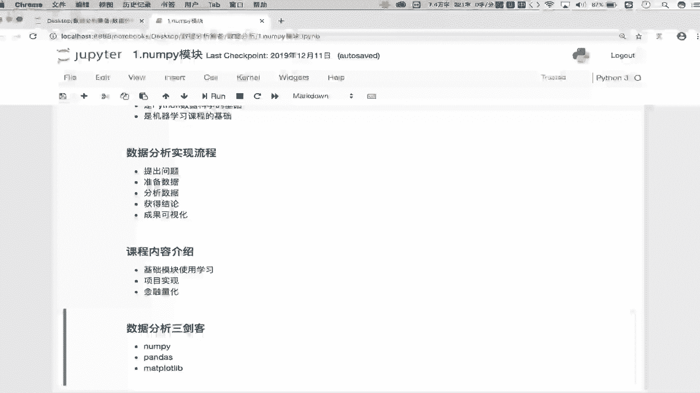

本节课中我们一起学习了数据分析的定义、核心价值、学习必要性、标准工作流程以及本课程的整体架构。从下一节课开始，我们将正式进入Python数据分析基础技能的学习。