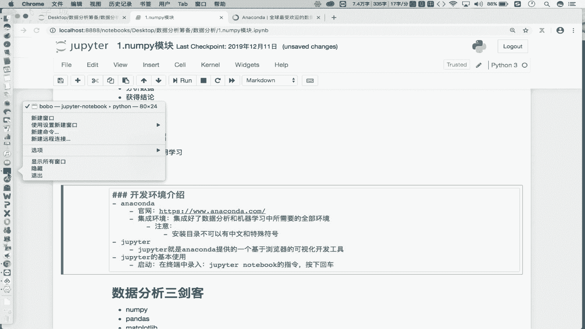
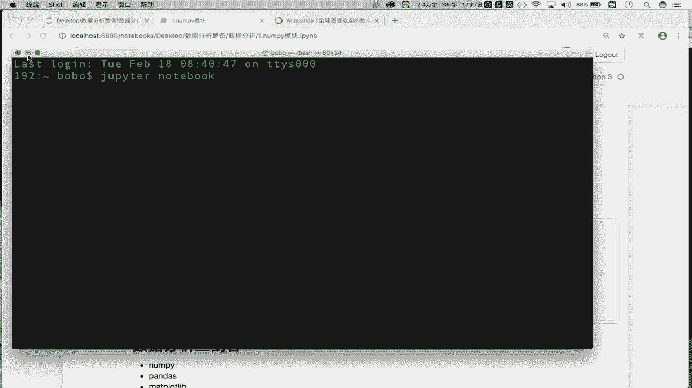

# Python数据分析与金融量化实战：P2：02 修炼前的准备-环境搭建 🛠️

在本节课中，我们将学习如何搭建数据分析所需的开发环境。我们将介绍核心工具Anaconda和Jupyter Notebook，并详细讲解其安装与基本使用方法。

---

## Anaconda：集成环境介绍与安装

上一节我们对数据分析进行了初步介绍。本节中，我们来看看数据分析所对应的开发环境搭建流程。

首先，我们需要安装一个名为 **Anaconda** 的集成环境。Anaconda是一个集成了数据分析和机器学习所需全部环境的软件包。这意味着，安装好Anaconda后，我们就拥有了进行数据科学开发工作的基础环境。

以下是Anaconda的安装步骤：
1.  访问Anaconda官网，根据你的操作系统（Windows、macOS或Linux）下载对应的安装包。
2.  运行下载好的安装包，按照提示进行“下一步”安装。
3.  在安装过程中，**安装目录不能包含中文或特殊符号**，建议安装在某个磁盘的根目录下。

详细的图文安装流程，可以参考课程提供的Word文档。

---

## Jupyter Notebook：可视化开发工具

安装好Anaconda后，我们就拥有了开发环境。接下来，我们需要一个可视化的工具来编写和运行代码。这个工具就是 **Jupyter Notebook**，它是Anaconda提供的一个基于浏览器的开发工具。

Jupyter Notebook无需单独安装，Anaconda安装完成后即可使用。

### 启动与界面

以下是启动Jupyter Notebook的方法：
1.  打开终端（或命令提示符）。
2.  输入命令 `jupyter notebook` 并按下回车。
3.  系统会自动启动默认浏览器，并打开Jupyter的主界面，该界面显示的是你当前目录下的文件结构。

### 创建与使用笔记本

在Jupyter主界面，我们可以创建新的文件来进行编程。

以下是创建新笔记本的步骤：
1.  点击页面右上角的 **“New”** 按钮。
2.  在下拉菜单中选择 **“Python 3”**。这将创建一个新的、后缀为 `.ipynb` 的源代码文件（也称为“笔记本”）。
3.  创建后，可以为文件重命名。

在笔记本中，内容被组织在一个个独立的 **单元格（Cell）** 中。每个单元格可以编写代码或文本，并独立运行。

### 单元格的两种模式

单元格有两种主要模式，用于不同目的：

*   **Code模式**：用于编写和运行Python代码。
*   **Markdown模式**：用于编写格式化的笔记、说明文字。

你可以通过单元格上方的下拉菜单切换模式。在Markdown模式的单元格中，可以使用Markdown语法（如 `# 标题`）来排版，运行单元格后即可渲染出格式化的文本。

---

## 常用快捷键 🎹

熟练使用快捷键可以极大提升在Jupyter Notebook中的工作效率。以下是核心的快捷键操作：

*   **添加单元格**：在当前选中单元格的上方插入，按 **`A`**；在下方插入，按 **`B`**。
*   **删除单元格**：选中单元格后，按 **`X`**。
*   **切换单元格模式**：选中单元格后，按 **`M`** 切换为Markdown模式；按 **`Y`** 切换回Code模式。
*   **运行单元格**：按 **`Shift + Enter`** 运行当前单元格，并跳转到下一个单元格。
*   **代码自动补全**：在输入代码时，按 **`Tab`** 键可以触发自动补全建议。
*   **查看帮助文档**：将光标放在某个函数或方法名上，按 **`Shift + Tab`** 可以快速查看其帮助文档。

---

## 总结

本节课中，我们一起学习了数据分析环境的搭建。

1.  我们首先介绍了 **Anaconda**，它是一个集成了数据科学所需全部工具和库的软件包，并通过“下一步”安装方式完成部署。
2.  接着，我们学习了Anaconda自带的 **Jupyter Notebook** 开发工具，掌握了如何启动它、创建笔记本文件、以及使用两种模式（Code和Markdown）的单元格。
3.  最后，我们熟悉了一系列提高效率的 **快捷键**，例如使用 `A/B` 添加单元格、`Shift+Enter` 运行代码等。

环境搭建是万里长征的第一步。现在，你的开发环境已经准备就绪，接下来我们将正式进入数据分析的代码实战世界。