# Python数据分析数据清洗，金融量化投资分析与股票交易实战：P4：04 numpy数组属性 📊

在本节课中，我们将要学习NumPy数组的一些常用属性。上一节我们介绍了NumPy数组的方法，本节中我们来看看数组的属性，它们能帮助我们快速获取数组的形状、维度、大小和数据类型等信息。


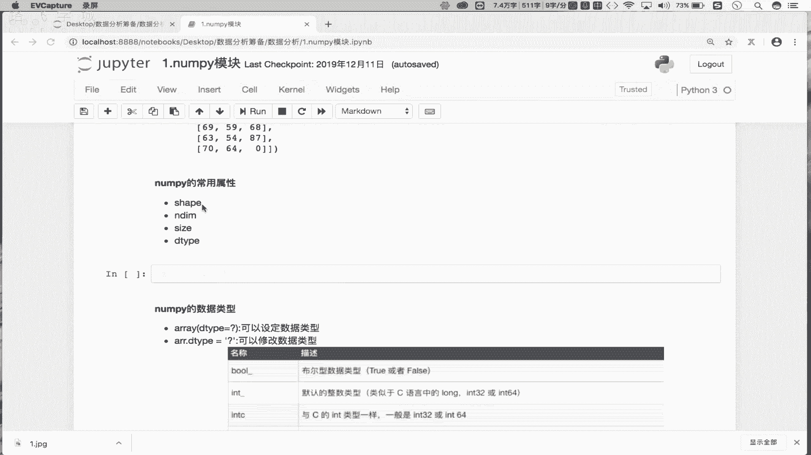

## 创建示例数组


首先，我们创建一个示例的二维NumPy数组，以便后续演示属性。

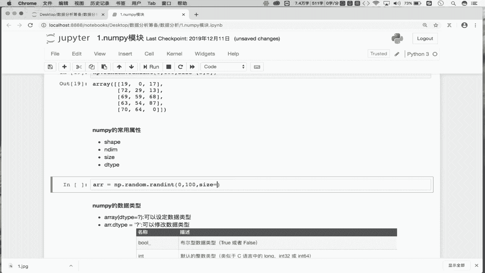


```python
import numpy as np
ar = np.random.randint(0, 100, size=(5, 6))
```
这段代码创建了一个5行6列的二维数组`ar`，其中的元素是0到100之间的随机整数。


## 常用数组属性


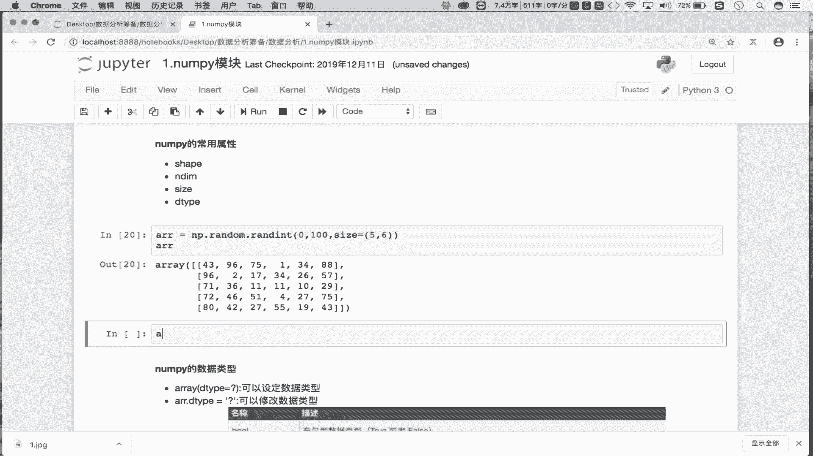

以下是NumPy数组的几个核心属性，它们提供了关于数组结构的基本信息。

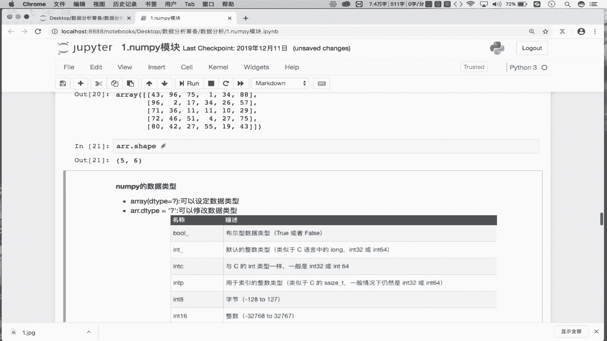

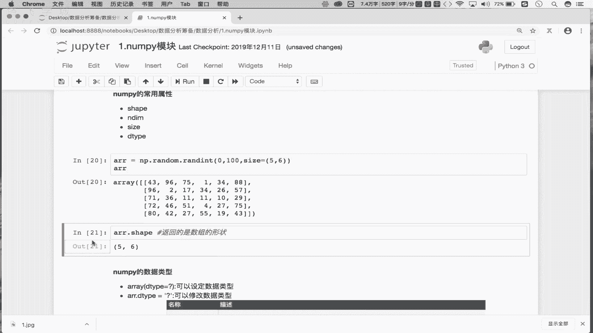

### 1. shape 属性


`shape`属性返回一个元组，表示数组在每个维度上的大小（即形状）。

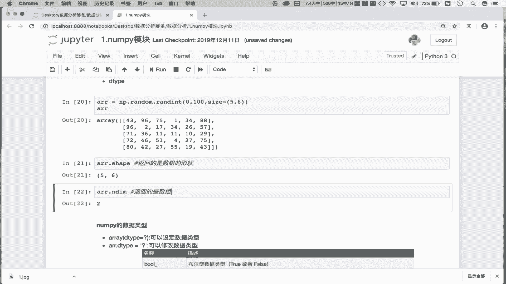

```python
ar.shape
```
对于我们的数组`ar`，`ar.shape`将返回`(5, 6)`，表示这是一个5行6列的数组。


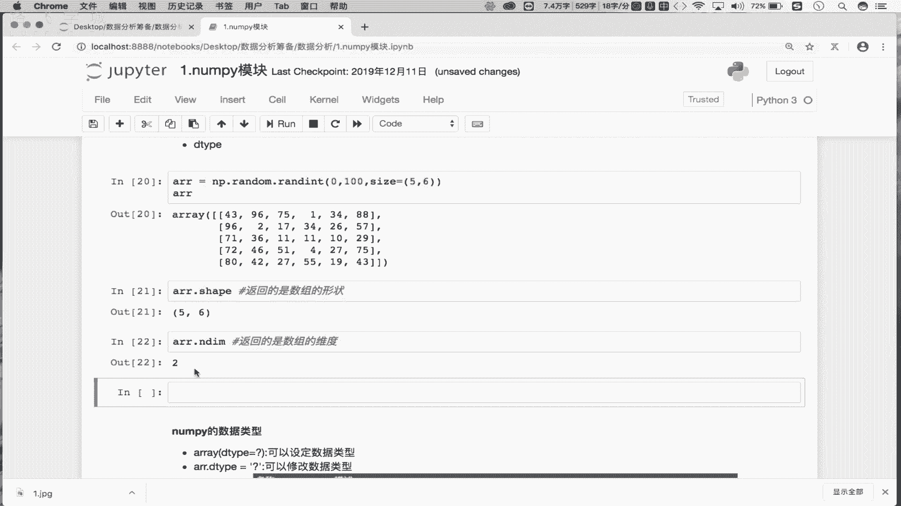

### 2. ndim 属性

`ndim`属性返回一个整数，表示数组的维数。

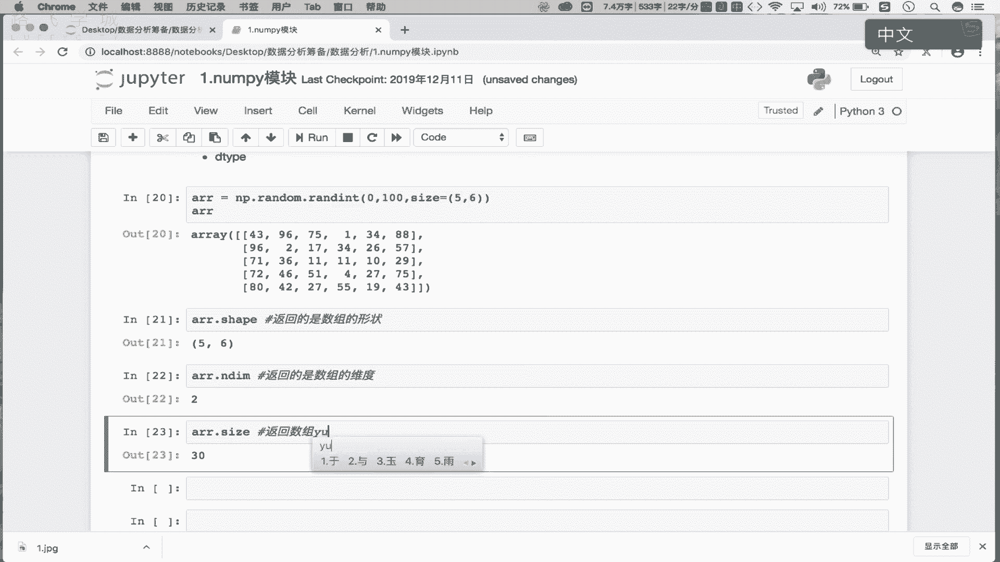

```python
ar.ndim
```
对于二维数组`ar`，`ar.ndim`将返回`2`。


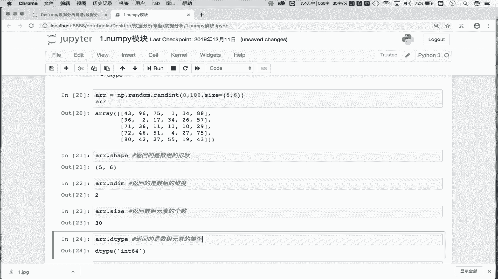

### 3. size 属性

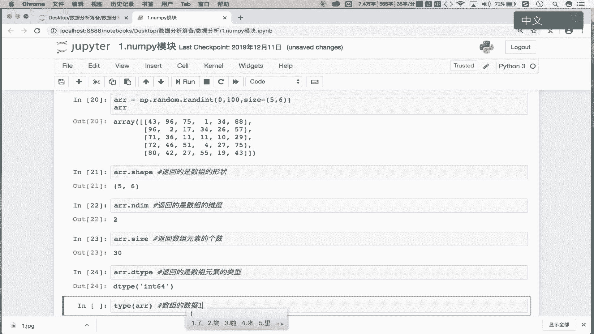

`size`属性返回一个整数，表示数组中元素的总个数。

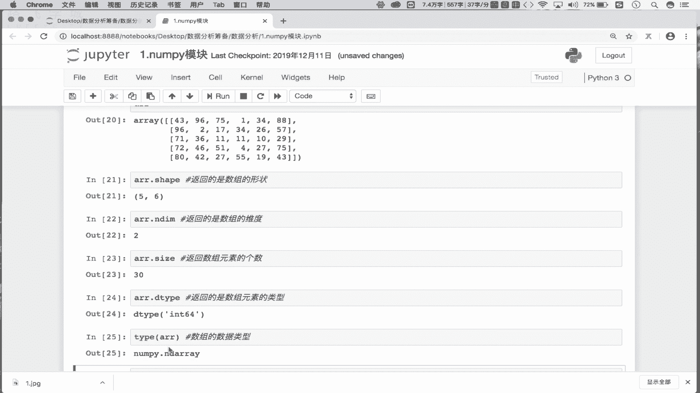

```python
ar.size
```
对于5行6列的数组`ar`，`ar.size`将返回`30`（即5*6的结果）。


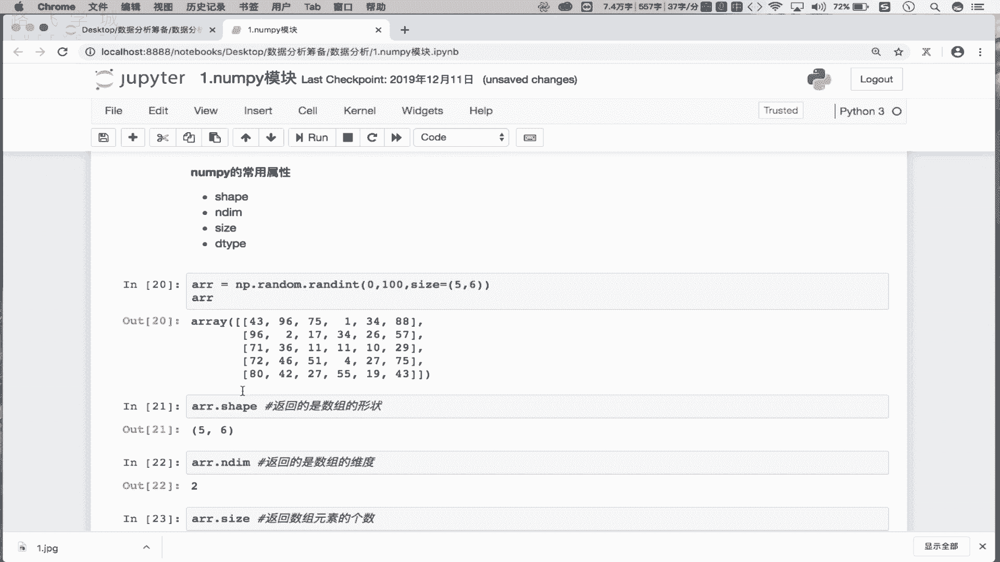


### 4. dtype 属性

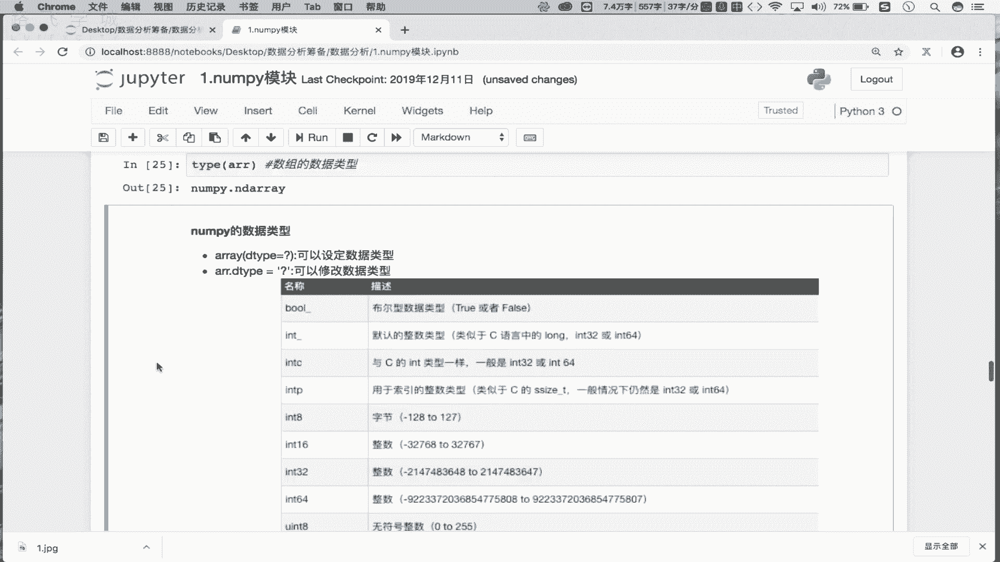

`dtype`属性返回数组中元素的数据类型。

```python
ar.dtype
```
对于由随机整数构成的数组`ar`，`ar.dtype`通常会返回`int64`，表示64位整数类型。


## 理解数组类型

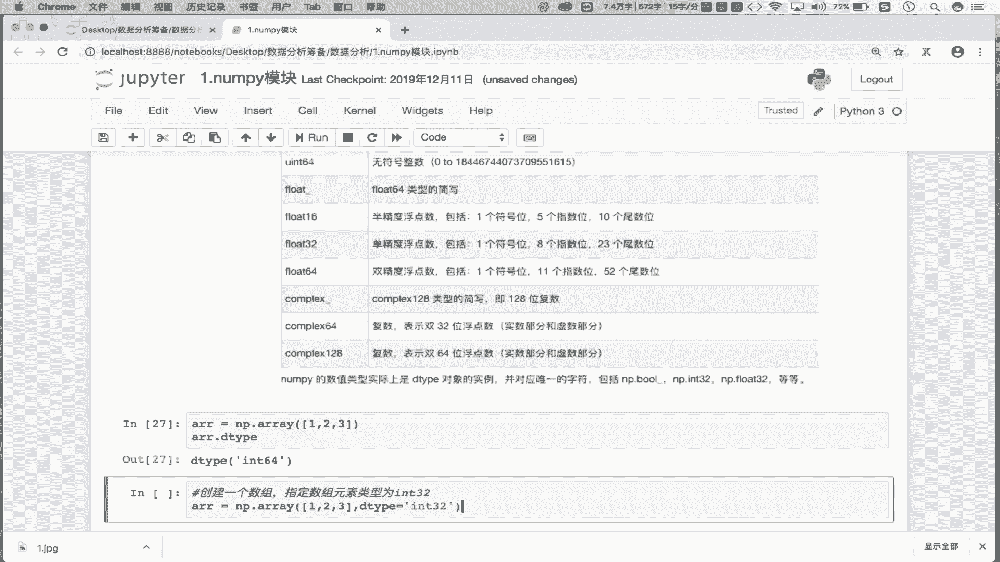

需要区分数组本身的类型和数组元素的类型。`type(ar)`查看的是数组对象本身的类型，而`ar.dtype`查看的是数组中存储的元素的数据类型。

```python
type(ar)   # 返回 <class 'numpy.ndarray'>
ar.dtype   # 返回 dtype('int64')
```
`numpy.ndarray`是NumPy数组的数据类型。


## 指定与修改数据类型

在创建数组时，我们可以使用`dtype`参数来指定数组元素的数据类型。

```python
ar2 = np.array([1, 2, 3], dtype='int32')
ar2.dtype  # 返回 dtype('int32')
```
此外，我们还可以通过给`dtype`属性赋值来修改现有数组的元素数据类型。


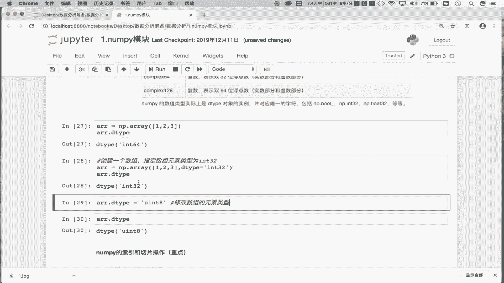

```python
ar2.dtype = 'uint8'
ar2.dtype  # 返回 dtype('uint8')
```
这里，`int32`表示每个元素占用32位内存，而`uint8`表示无符号8位整数（即1个字节）。


## 数据类型的重要性


指定合适的数据类型对于管理内存至关重要。例如，一个包含500万个元素的数组，如果使用默认的`int64`类型，将占用大量内存。通过将其元素类型改为`uint8`，可以显著减少内存占用，这在处理大规模数据时非常有用。


本节课中我们一起学习了NumPy数组的四个核心属性：`shape`、`ndim`、`size`和`dtype`。我们了解了如何获取数组的形状、维度、大小和元素类型，并学习了如何在创建时指定或后续修改数组的数据类型以优化内存使用。掌握这些属性是高效进行数据操作和分析的基础。