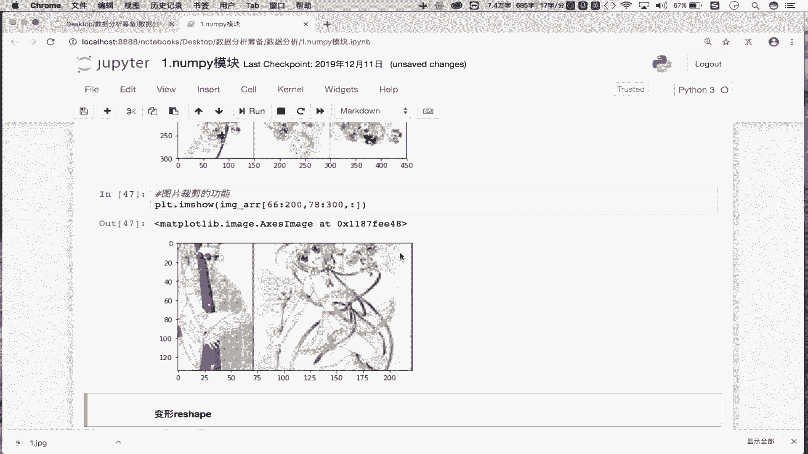

# Python数据分析数据清洗，金融量化投资分析与股票交易实战：P5：05 numpy炸天之索引和切片

## 概述
在本节课程中，我们将学习NumPy模块中索引和切片的核心操作。索引和切片是获取数组数据的强大工具，在NumPy中，它们的用法比在普通列表中更加灵活和强大。我们将从基础索引开始，逐步深入到切片、数组反转，并最终应用这些知识进行图片的裁剪与翻转操作。

## 索引操作 🔍
上一节我们介绍了NumPy数组的创建。本节中，我们来看看如何获取数组中的特定数据。NumPy数组的索引操作与Python列表的索引操作原理相同。

以下是索引操作的基本用法：
*   创建一个5行6列的随机数组：`arr = np.random.randint(1, 100, size=(5, 6))`
*   通过索引获取单行数据：`arr[1]` 返回下标为1的行数据。
*   通过索引获取多行数据：`arr[[1, 3, 4]]` 返回下标为1、3、4的行数据。

## 切片操作 ✂️
索引用于获取单个或多个特定元素，而切片则用于获取一个连续的数据区域。NumPy的切片语法非常强大。

以下是切片操作的基本规则：
*   切出数组的前两行：`arr[0:2]`。中括号内放置的是行切片。
*   切出数组的前两列：`arr[:, 0:2]`。逗号`,`用于分隔不同维度，左侧是行切片，右侧是列切片。
*   切出前两行的前两列：`arr[0:2, 0:2]`。这结合了行切片和列切片。

## 数组反转操作 🔄
切片操作的一个高级应用是实现数组的反转，即倒序排列数组元素。

以下是实现数组反转的方法：
*   将数组的行倒置：`arr[::-1]`。这会使第一行变为最后一行，最后一行变为第一行。
*   将数组的列倒置：`arr[:, ::-1]`。这会使第一列变为最后一列，最后一列变为第一列。
*   将整个数组的所有元素倒置：`arr[::-1, ::-1]`。这等价于同时进行行倒置和列倒置。

## 实战应用：图片处理 🖼️
理解了索引和切片，特别是反转操作后，我们可以将其应用于实际的图片处理中。一张图片在NumPy中可以被表示为一个三维数组（高度、宽度、颜色通道）。


以下是图片处理的应用示例：
*   **读取并显示图片**：
    ```python
    import matplotlib.pyplot as plt
    image_arr = plt.imread(‘1.jpg’)
    plt.imshow(image_arr)
    ```
*   **图片左右翻转（列倒置）**：`plt.imshow(image_arr[:, ::-1, :])`。对第二个维度（宽度/列）进行倒置。
*   **图片上下翻转（行倒置）**：`plt.imshow(image_arr[::-1, :, :])`。对第一个维度（高度/行）进行倒置。
*   **图片局部裁剪**：`plt.imshow(image_arr[66:200, 78:300, :])`。通过对行和列维度进行切片，可以截取图片的任意矩形区域。




## 总结
本节课中我们一起学习了NumPy中索引与切片的核心操作。我们掌握了如何使用索引获取单行或多行数据，如何使用灵活的切片语法获取数据的子集，以及如何利用切片实现数组的行、列乃至整体反转。最后，我们将这些知识应用于图片的翻转与裁剪，直观地展示了NumPy索引与切片功能的强大与实用。这些操作是后续进行数据筛选、清洗和变换的基础。