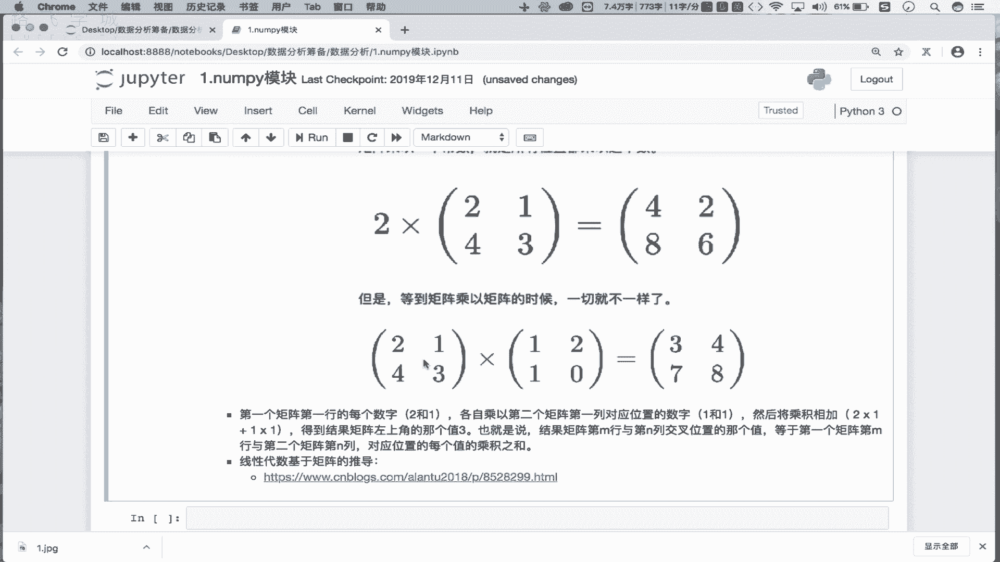
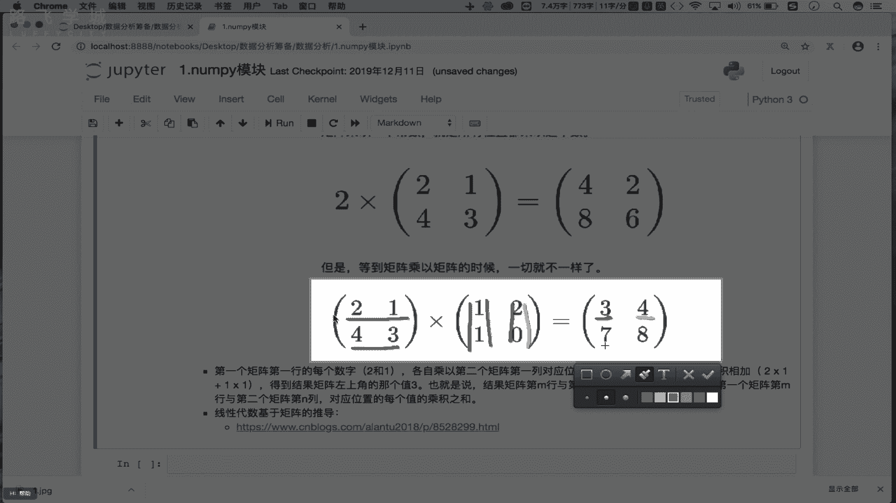
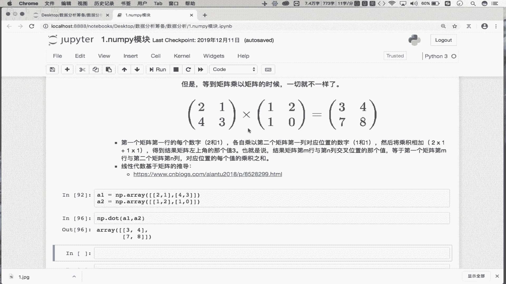
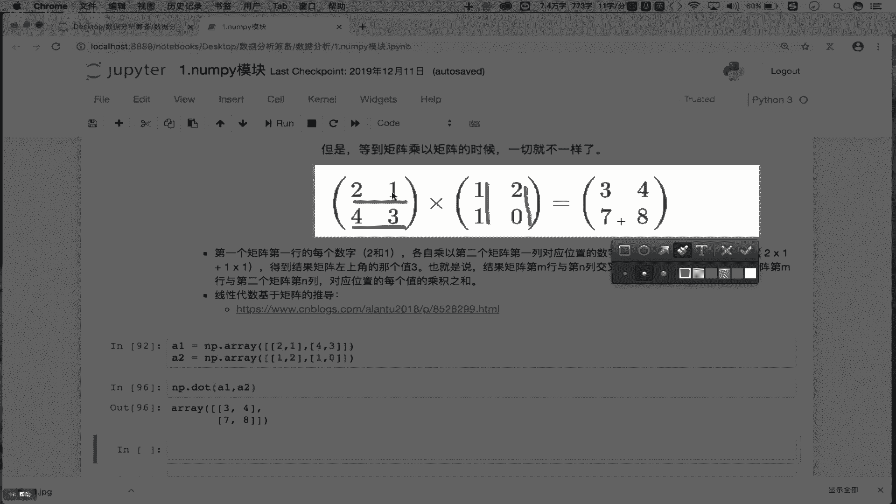
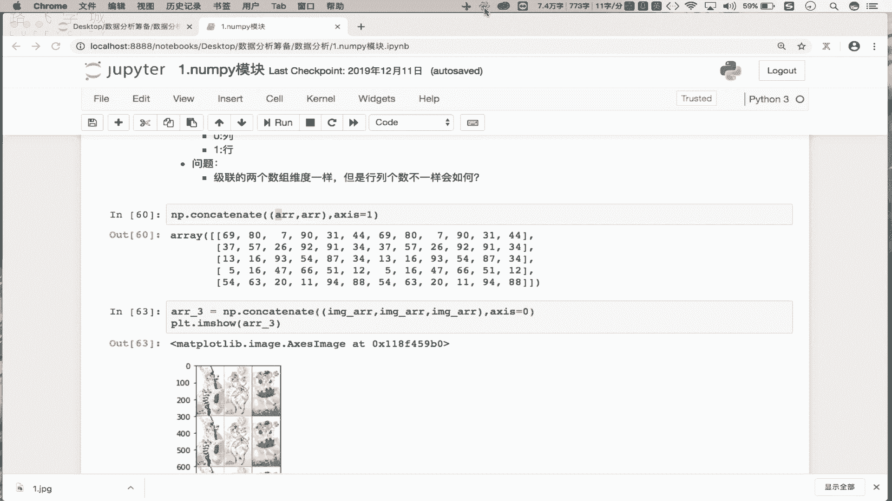

# Python数据分析数据清洗，金融量化投资分析与股票交易实战：P6：06 统计&聚合&矩阵操作 📊

在本节课中，我们将要学习NumPy模块中关于数组形状变换、拼接、聚合运算、常用数学与统计函数，以及矩阵操作的核心知识。这些内容是进行高效数值计算和数据分析的基础。

## 数组形状变换 🔄

上一节我们介绍了数组的索引与切片，本节中我们来看看如何改变数组的形状。形状变换指的是在不改变数组数据的前提下，重新排列其维度结构。

原始数组 `arr` 是一个五行六列的二维数组。

```python
import numpy as np
arr = np.arange(30).reshape(5, 6)
print(arr.shape)  # 输出: (5, 6)
```

我们可以使用 `reshape` 方法将其变形。例如，将二维数组变形成一维数组：

```python
arr_reshaped = arr.reshape(30)
print(arr_reshaped.shape)  # 输出: (30,)
```

变形操作要求新形状的总元素数量必须与原数组一致。一维数组也可以变形成多维数组：

```python
arr_1d = np.arange(30)
arr_2d = arr_1d.reshape(2, 15)  # 变形成2行15列
arr_2d_another = arr_1d.reshape(6, 5)  # 变形成6行5列
```

## 数组拼接 🔗

接下来，我们学习如何将多个数组拼接在一起。拼接操作可以将数组沿指定轴向（横向或纵向）连接起来。

以下是使用 `np.concatenate` 函数进行拼接的方法：

```python
# 创建两个相同的二维数组
arr1 = np.arange(30).reshape(5, 6)
arr2 = np.arange(30, 60).reshape(5, 6)

# 沿轴向0（纵向，列方向）拼接
result_axis0 = np.concatenate((arr1, arr2), axis=0)
print(result_axis0.shape)  # 输出: (10, 6)

# 沿轴向1（横向，行方向）拼接
result_axis1 = np.concatenate((arr1, arr2), axis=1)
print(result_axis1.shape)  # 输出: (5, 12)
```

拼接操作要求参与拼接的数组在非拼接轴上的维度必须一致。例如，制作图片三宫格就是一种常见的拼接应用。

**问题**：如果两个维度相同的数组，其行数或列数不同，能否进行拼接？结果会如何？建议读者自行尝试。

## 聚合操作 📉

聚合操作是指对数组中的元素进行统计计算，如求和、求平均值、找最大值和最小值等。

以二维数组 `arr` 为例：

```python
arr = np.arange(30).reshape(5, 6)

# 计算所有元素的和
total_sum = arr.sum()
print(total_sum)

# 计算每一列的和（沿轴向0）
col_sum = arr.sum(axis=0)
print(col_sum)

# 计算每一行的和（沿轴向1）
row_sum = arr.sum(axis=1)
print(row_sum)

# 求所有元素的最大值、最小值、平均值
max_val = arr.max()
min_val = arr.min()
mean_val = arr.mean()
print(max_val, min_val, mean_val)

# 求每一行的最大值
row_max = arr.max(axis=1)
print(row_max)
```

## 常用数学函数 ➗

NumPy提供了丰富的数学函数，可以对数组中的每个元素进行数学运算。

以下是一些常用函数的示例：

```python
arr = np.arange(30).reshape(5, 6)

# 计算正弦值
sin_arr = np.sin(arr)
print(sin_arr)

# 计算余弦值
cos_arr = np.cos(arr)

# 四舍五入
rounded = np.around(3.14159, decimals=2)  # 保留两位小数
print(rounded)  # 输出: 3.14

# 对整数进行四舍五入到十位
rounded_int = np.around(1234, decimals=-2)
print(rounded_int)  # 输出: 1200
```

## 常用统计函数 📈

在数据分析中，统计函数至关重要，尤其是标准差和方差，它们用于衡量数据的离散程度。

以下是常用统计函数的应用：

```python
arr = np.array([1, 2, 3, 4, 5, 100])  # 一组数据

# 计算最大值与最小值的差（极差）
range_val = np.ptp(arr)
print(range_val)  # 输出: 99

# 计算标准差
std_dev = arr.std()
print(std_dev)

# 计算方差
variance = arr.var()
print(variance)
```

**标准差公式**：
`σ = sqrt( Σ (xi - μ)² / N )`
其中，`σ` 是标准差，`xi` 是每个数据点，`μ` 是数据的均值，`N` 是数据点的数量。



**方差公式**：
`Var = Σ (xi - μ)² / N`
方差就是标准差的平方。标准差和方差越大，说明数据点越分散。

## 矩阵操作 ⬛

最后，我们学习矩阵的基本操作，重点是矩阵的乘法。在NumPy中，矩阵可以视为二维数组。

首先，创建矩阵并进行转置操作：



```python
# 创建一个3x3的单位矩阵
identity_matrix = np.eye(3)
print(identity_matrix)

# 创建一个普通矩阵
matrix_a = np.array([[1, 2], [3, 4]])
print(matrix_a)

# 矩阵转置（行变列，列变行）
matrix_a_t = matrix_a.T
print(matrix_a_t)
```

矩阵乘法的规则是：第一个矩阵的行与第二个矩阵的列对应元素相乘后求和。使用 `np.dot` 函数或 `@` 运算符进行计算。

```python
# 定义两个矩阵
A = np.array([[2, 1], [4, 3]])
B = np.array([[1, 2], [1, 0]])



# 矩阵乘法
C = np.dot(A, B)
# 或者使用 C = A @ B
print(C)
# 输出:
# [[3 4]
#  [7 8]]
```

计算过程解析：
*   `C[0,0] = 2*1 + 1*1 = 3` (A的第一行 点乘 B的第一列)
*   `C[0,1] = 2*2 + 1*0 = 4` (A的第一行 点乘 B的第二列)
*   `C[1,0] = 4*1 + 3*1 = 7` (A的第二行 点乘 B的第一列)
*   `C[1,1] = 4*2 + 3*0 = 8` (A的第二行 点乘 B的第二列)



---

本节课中我们一起学习了NumPy模块的几个核心部分：
1.  **数组形状变换**：使用 `reshape` 方法改变数组维度。
2.  **数组拼接**：使用 `np.concatenate` 沿指定轴合并数组。
3.  **聚合操作**：对数组进行求和、求均值、找最值等统计计算。
4.  **数学与统计函数**：应用如 `sin`, `cos`, `around` 等数学函数，以及计算 `std`（标准差）和 `var`（方差）等统计指标。
5.  **矩阵操作**：重点是理解并使用 `np.dot` 进行矩阵乘法运算。



掌握这些操作是进行科学计算、数据分析和后续机器学习的基础。