# Python数据分析与金融量化投资：P8：02 Series的进化之DataFrame 📊

在本节课中，我们将要学习Pandas中一个核心的数据结构——DataFrame。我们将了解它是什么、如何创建它，并掌握其基本属性。


## 什么是DataFrame？

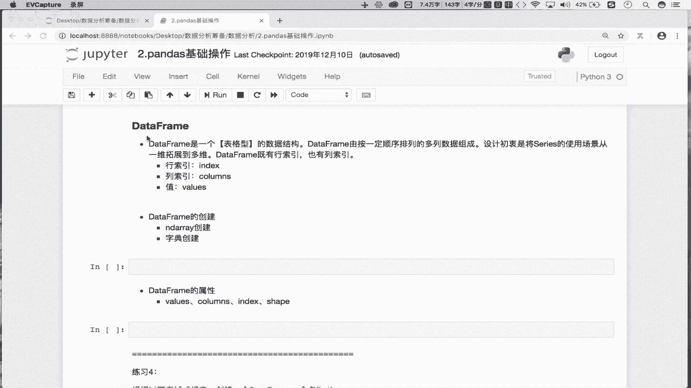

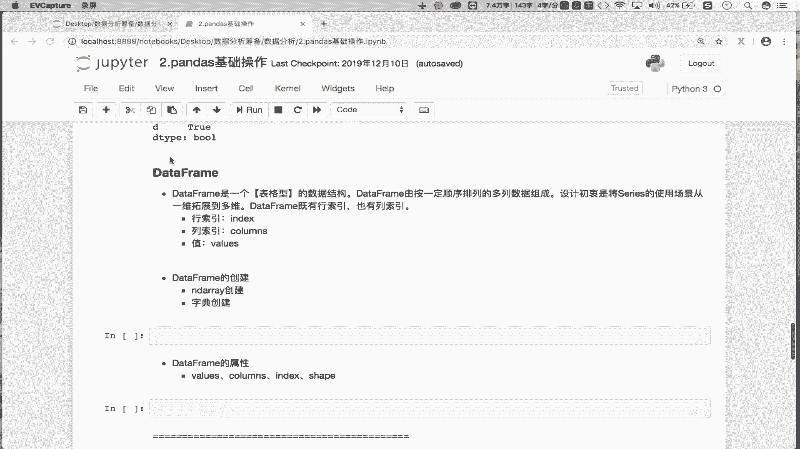


在上一节我们介绍了Series，它是一个一维的数据结构。DataFrame由Series组成，那么DataFrame应该是一个几维的数据结构呢？


通过上节课的演示，我们知道一列数据表示一个一维的Series。如果有多个Series组合在一起，就会形成多列。多列数据组合在一起，就形成了一个表格型的数据结构。表格型的数据结构是二维的，由行和列组成。

因此，DataFrame是一个表格型的数据结构。它的设计初衷是将Series的使用场景从一维拓展到二维。Series只有一种索引（行索引），而DataFrame是二维的，因此拥有两种不同形式的索引：行索引和列索引。这意味着DataFrame的组成元素有三个：行索引、列索引以及由行列索引所定位的值。

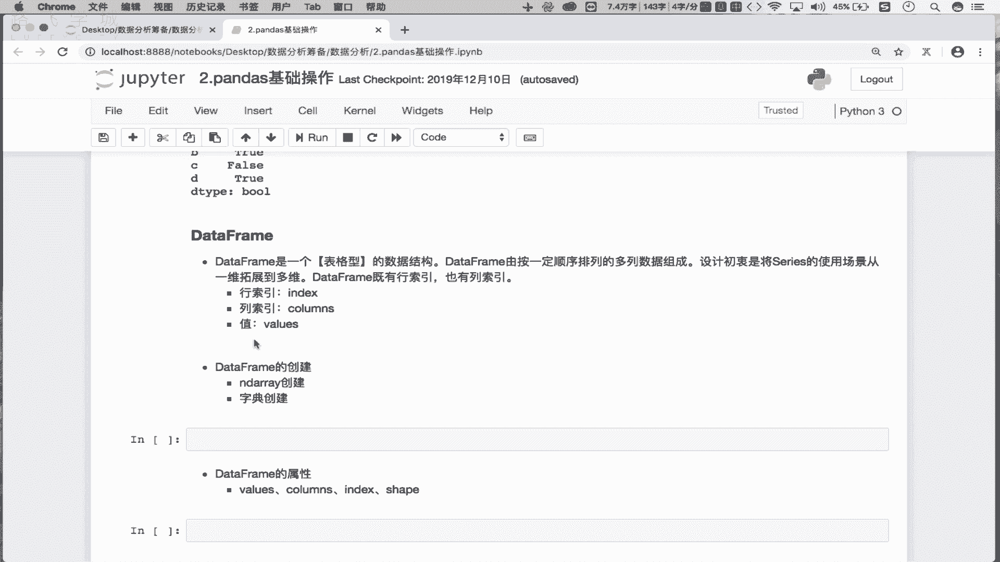

你可以将DataFrame完全理解为MySQL数据库中的一张表，它就是一个由行和列组成的表格型数据结构。

## 如何创建DataFrame？


了解了DataFrame是什么之后，我们来看看如何创建它。

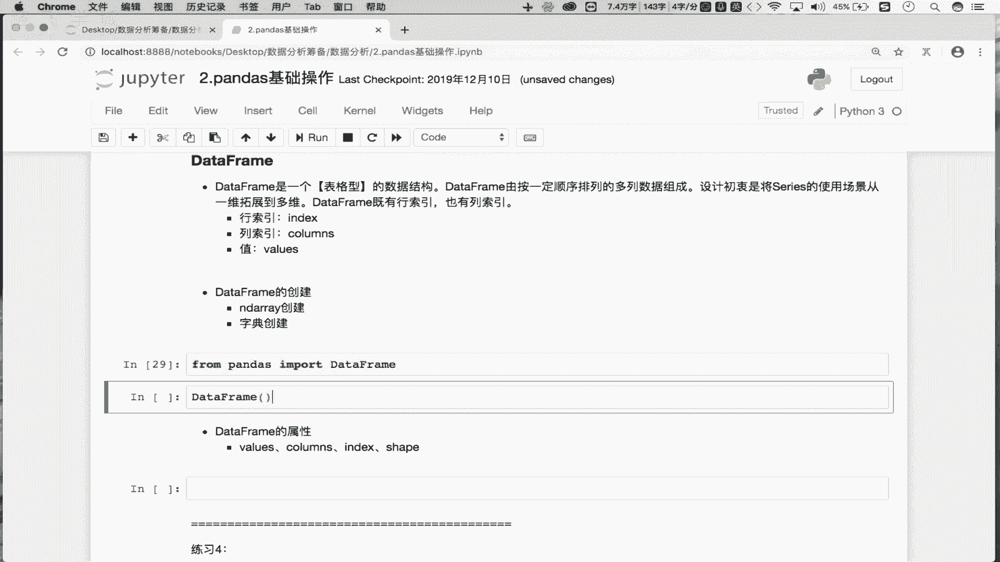

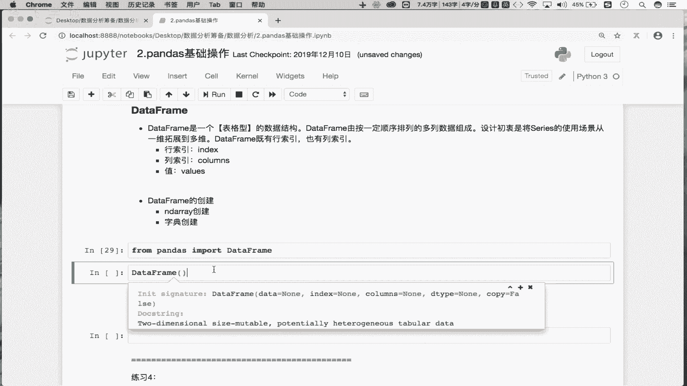

首先，我们需要从pandas库中导入DataFrame这个类。

```python
from pandas import DataFrame
```


接下来，我们使用DataFrame的构造方法进行创建。构造方法的主要参数有：
*   `data`: 数据源，是一个二维的数据源。
*   `index`: 行索引。
*   `columns`: 列索引。
*   `dtype`: 元素的数据类型。


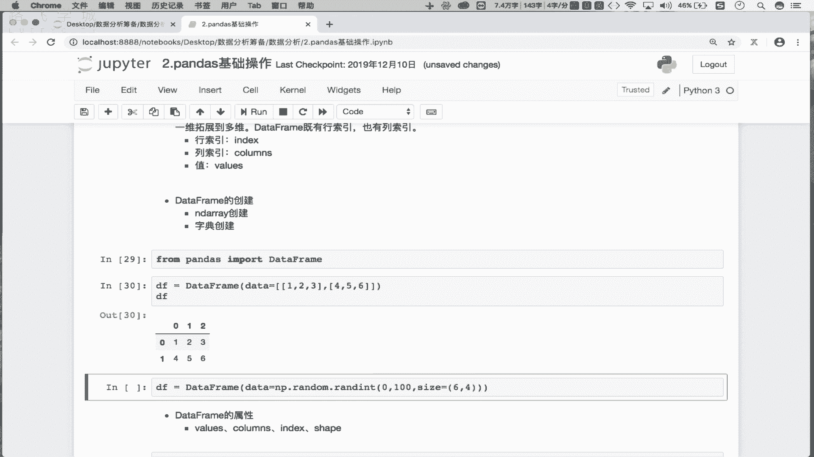


以下是几种常见的创建方式：

### 1. 使用二维列表创建

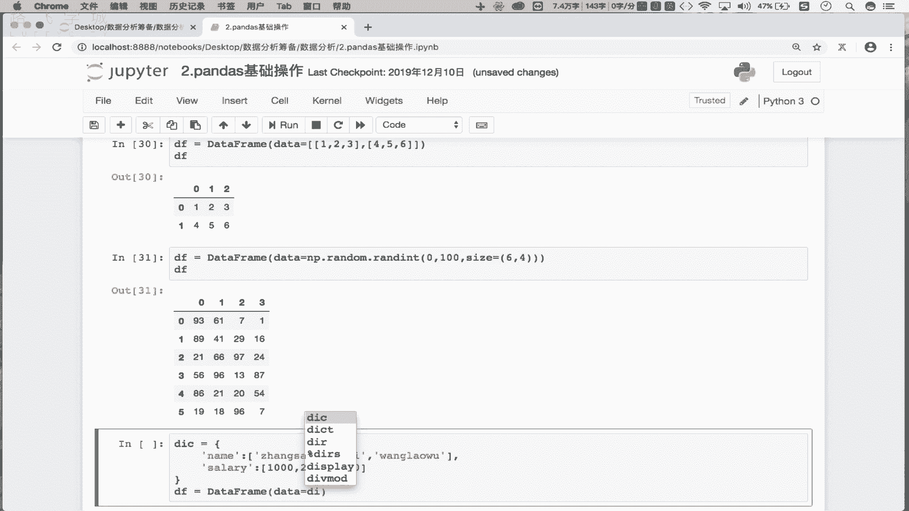

```python
data = [[1, 2, 3], [4, 5, 6]]
df = DataFrame(data)
print(df)
```
这种方式会创建一个两行三列的表格型数据结构。

### 2. 使用NumPy数组创建

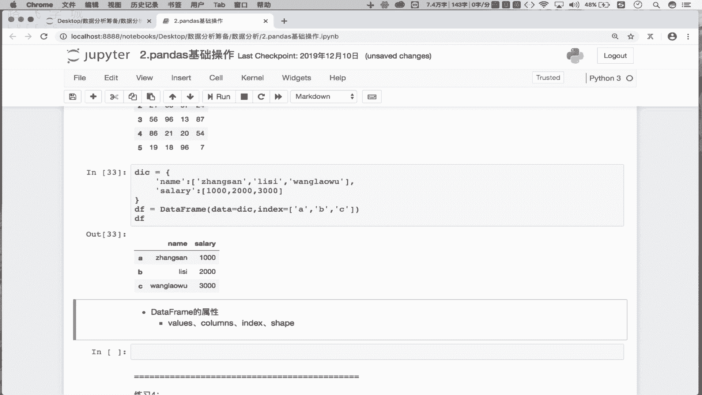


```python
import numpy as np
data = np.random.randint(0, 100, size=(6, 4))
df = DataFrame(data)
print(df)
```
这会返回一个六行四列的表格型数据结构。

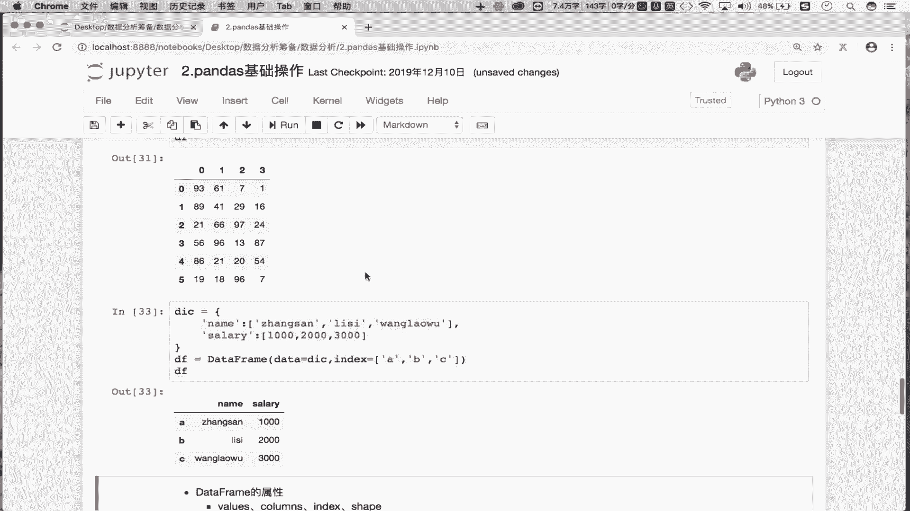

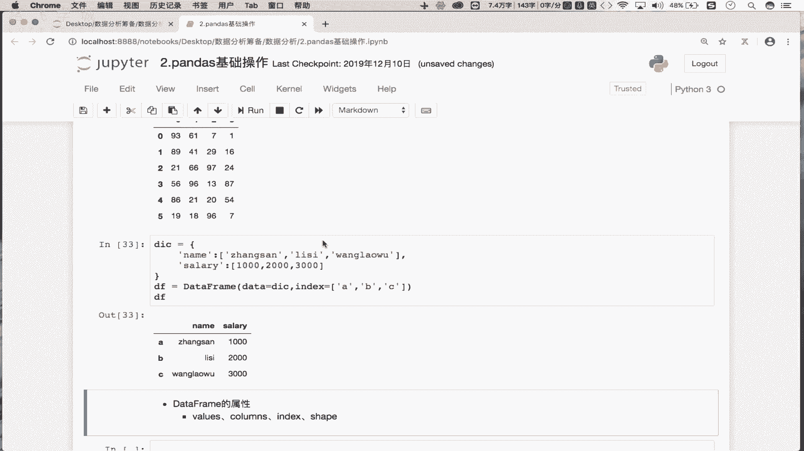

### 3. 使用字典创建


```python
data = {
    ‘name‘: [‘张三‘, ‘李四‘, ‘王五‘],
    ‘salary‘: [10000, 20000, 30000]
}
df = DataFrame(data)
print(df)
```
使用字典创建DataFrame时，字典的键（key）会自动成为DataFrame的列索引。此时行索引默认使用隐式索引（0, 1, 2...）。

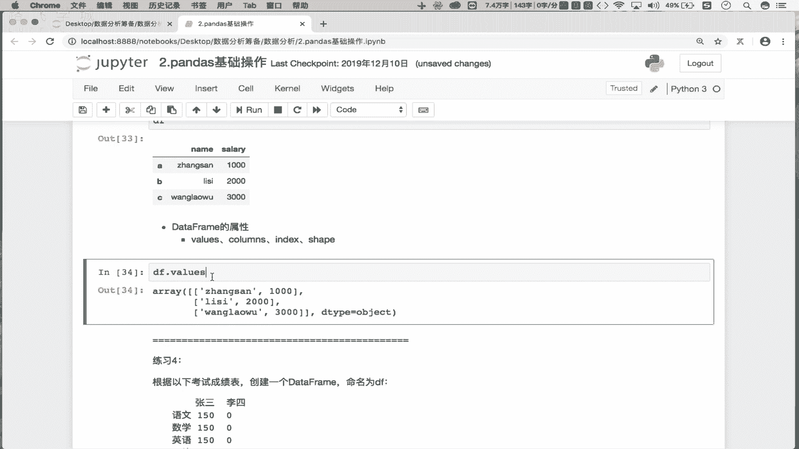

如果你想指定行索引，可以这样做：
```python
df = DataFrame(data, index=[‘A‘, ‘B‘, ‘C‘])
print(df)
```
这样，DataFrame的行列索引都变成了显示索引。


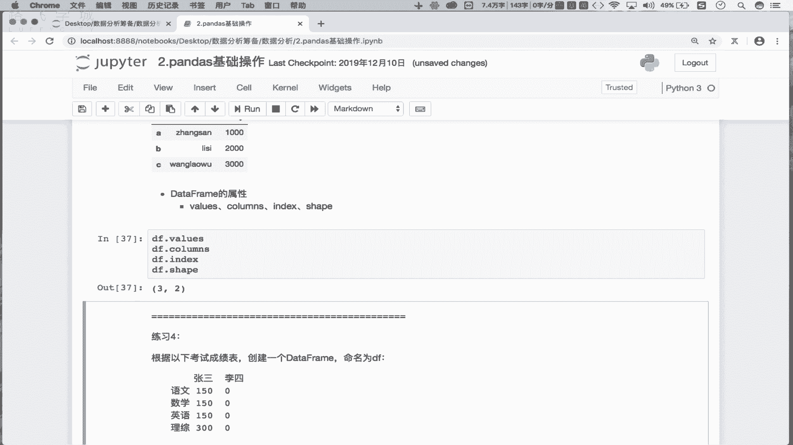

通过以上三种方式，我们就可以创建出二维的表格形式的数据结构——DataFrame。


## DataFrame的常用属性

下面我们来看一下DataFrame常用的属性，这些属性与Series类似，但有其二维特性。


```python
# 假设df是我们用字典创建的那个DataFrame
print(df.values)    # 返回DataFrame存储的二维形式的数据（通常是NumPy数组）
print(df.columns)   # 返回列索引
print(df.index)     # 返回行索引
print(df.shape)     # 返回形状（行数， 列数）
```


需要注意的是，DataFrame不能直接使用`.dtype`属性查看整个表格的数据类型。这是因为DataFrame的每一列可以存储不同类型的数据（例如一列是字符串，另一列是整数）。你只能取出其中的某一行或某一列（它们是一个Series），然后查看该Series的数据类型。

## 实战练习

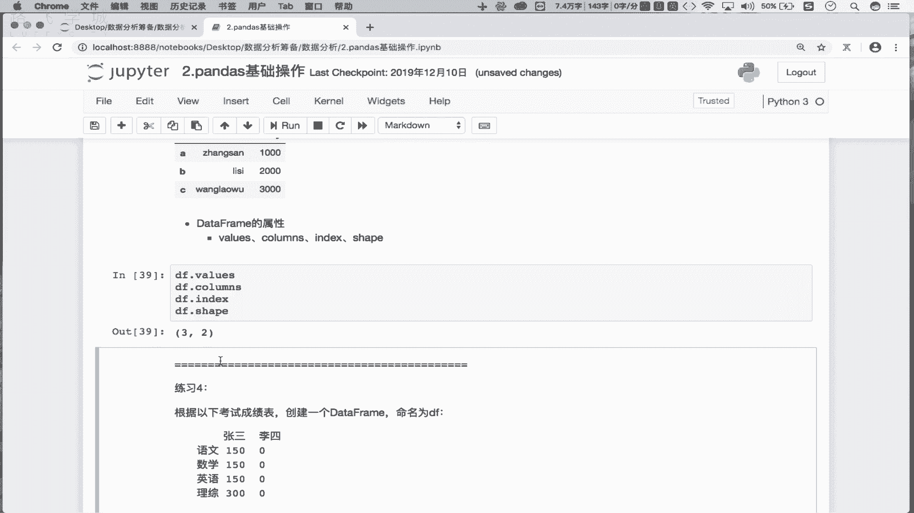


现在，我们来看一个练习：需要创建一个如下形式的DataFrame，它由四行两列组成。

|       | 张三 | 李四 |
| :---- | :--- | :--- |
| 语文  | 150  | 140  |
| 数学  | 150  | 148  |
| 英语  | 150  | 146  |
| 理综  | 150  | 142  |


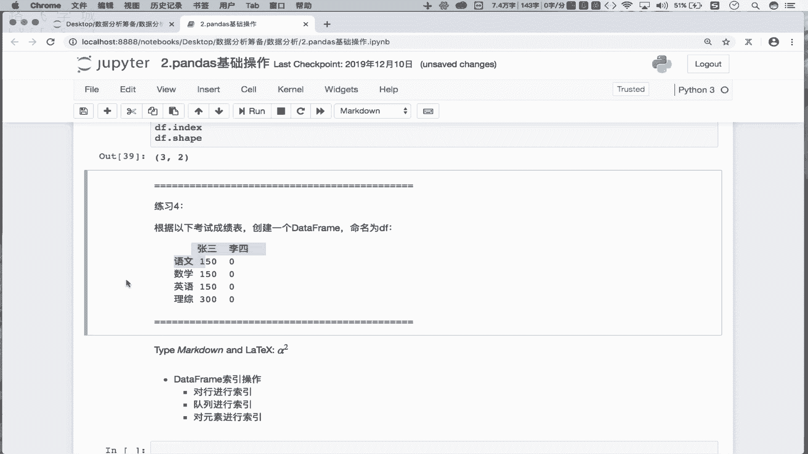

这个练习使用字典作为数据源最为方便，因为字典的键可以直接作为列索引。

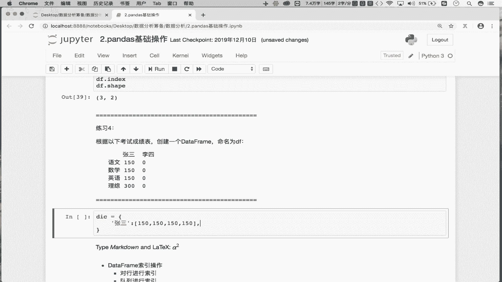

```python
data = {
    ‘张三‘: [150, 150, 150, 150],
    ‘李四‘: [140, 148, 146, 142]
}
df = DataFrame(data, index=[‘语文‘, ‘数学‘, ‘英语‘, ‘理综‘])
print(df)
```

使用字典创建DataFrame更加灵活和便捷。如果使用NumPy数组，则需要手动声明显示的行索引和列索引。


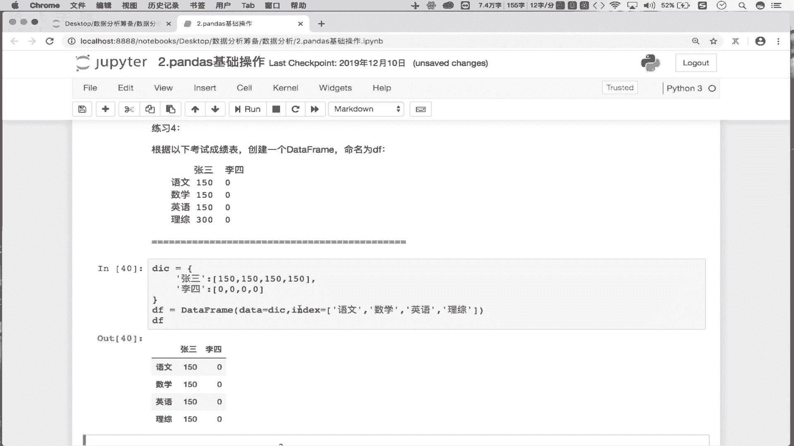

## 总结


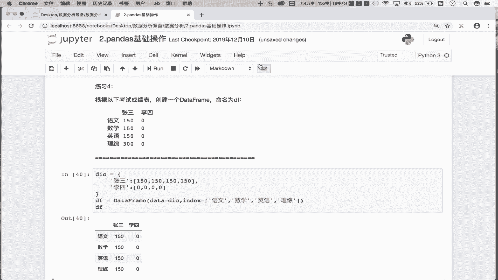

本节课中我们一起学习了Pandas的核心数据结构DataFrame。我们了解到DataFrame是一个二维的表格型数据结构，由行索引、列索引和值三部分组成。我们掌握了使用二维列表、NumPy数组和字典来创建DataFrame的方法，并熟悉了其基本属性，如`.values`、`.columns`、`.index`和`.shape`。理解DataFrame是进行后续数据分析和操作的基础。