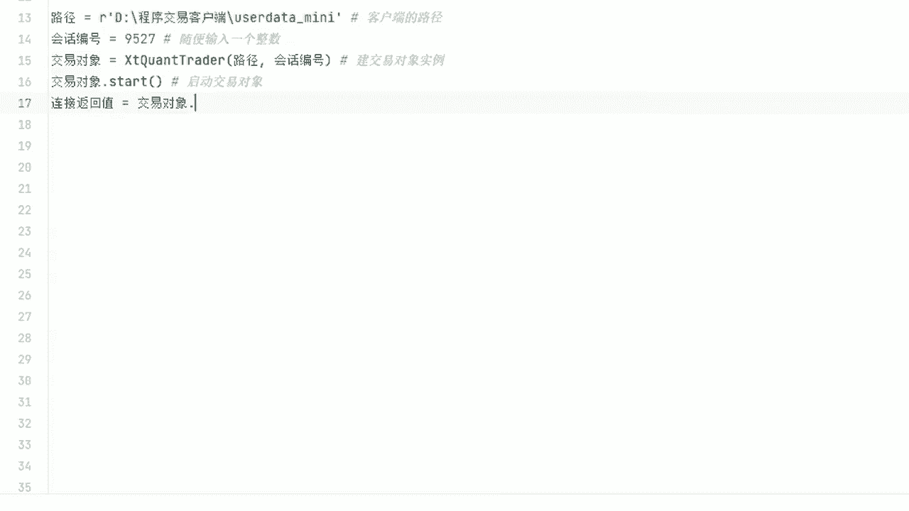
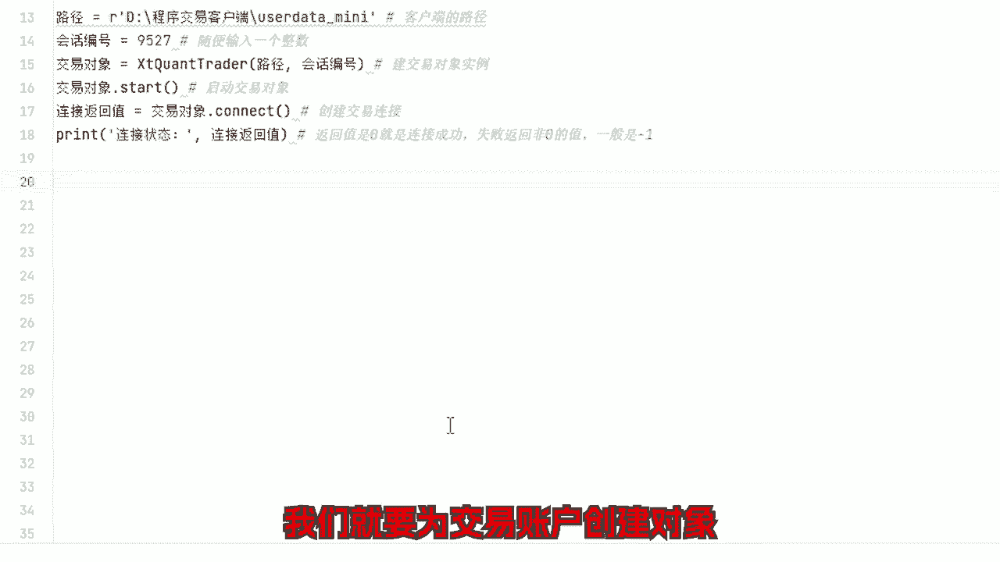
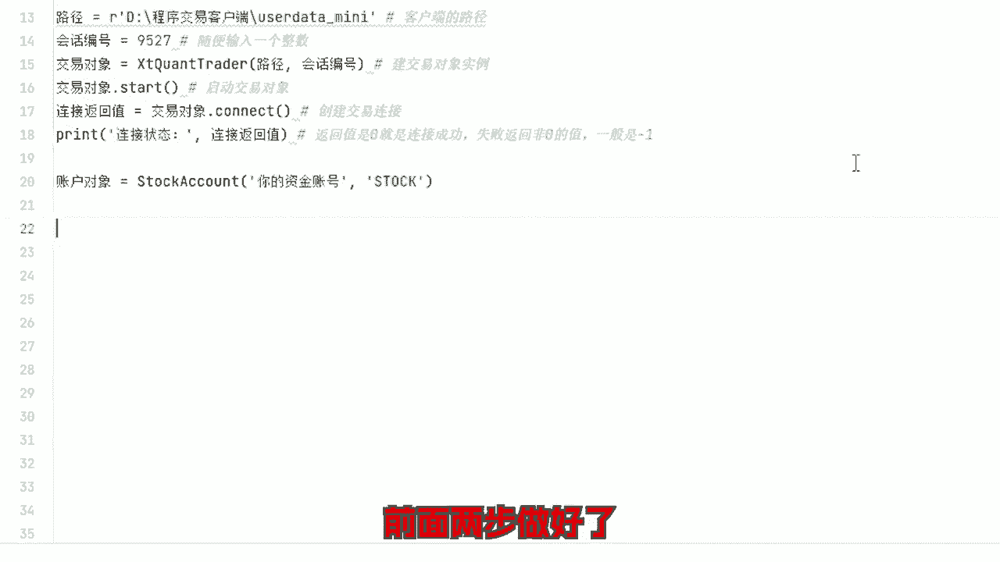
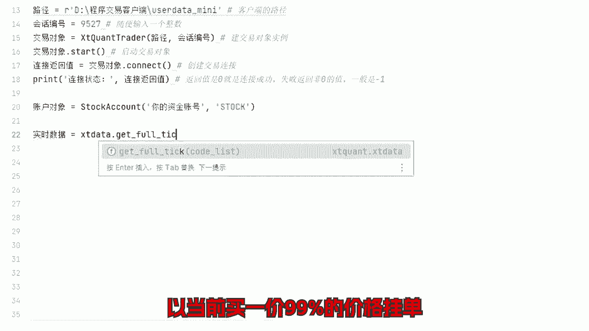
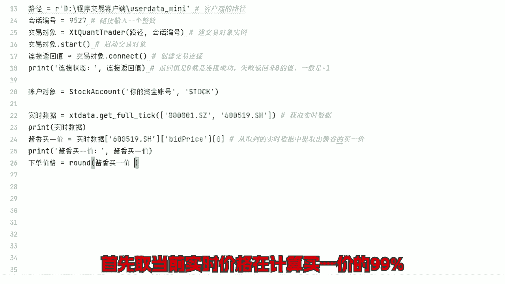
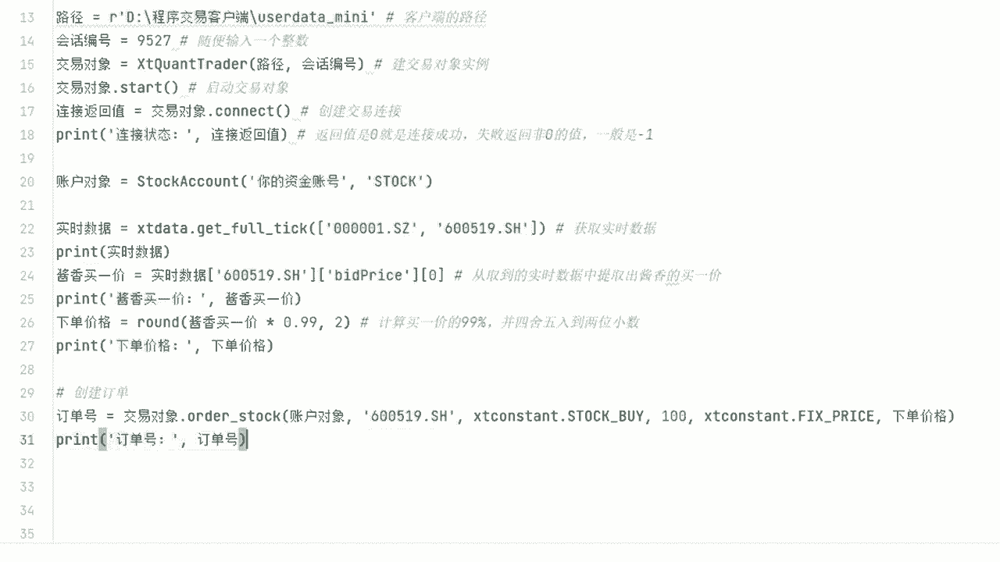
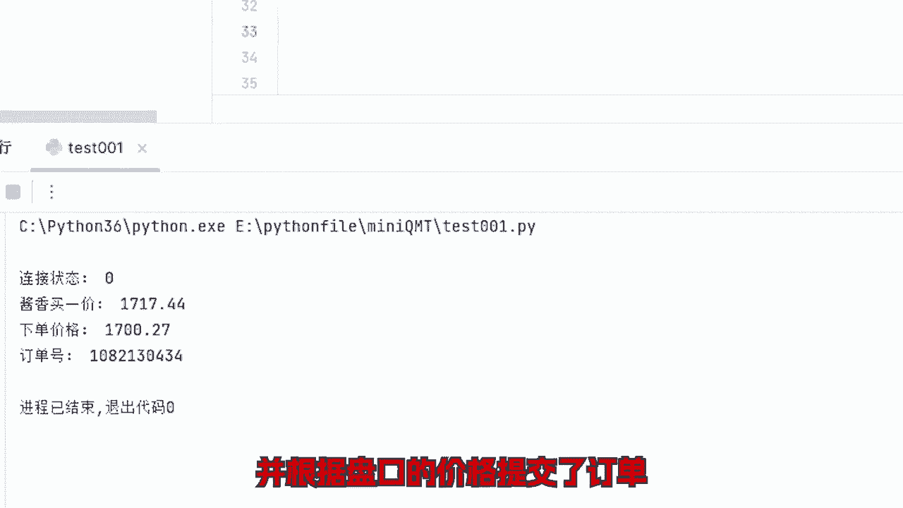
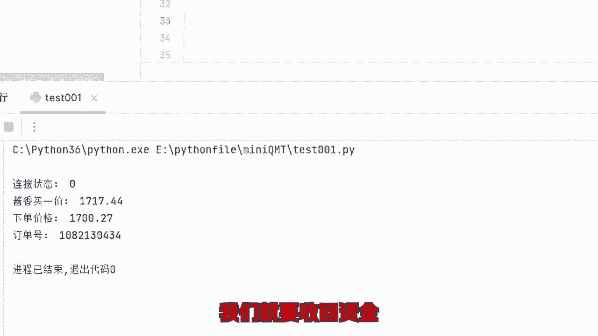
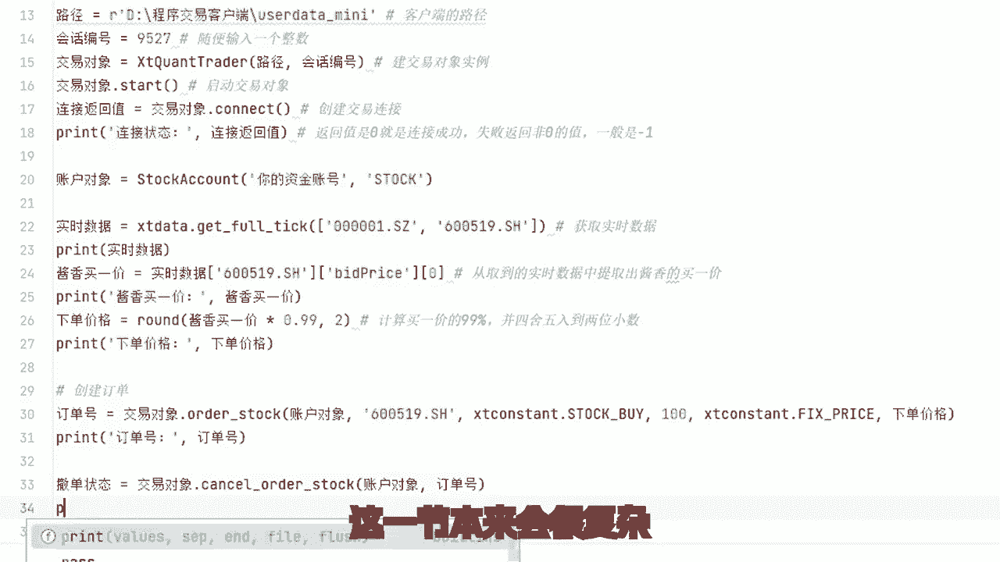

# Python炒股自动化：4：通过接口向交易所发送订单

在本节课中，我们将学习如何通过券商提供的API接口，以编程方式向交易所发送订单。这是实现程序化交易的核心步骤，涉及建立连接、创建账户对象、提交订单以及管理订单状态。

上一节我们介绍了如何获取市场数据，本节中我们来看看如何利用这些数据执行实际的交易操作。

## 概述

实现股票的程序化自动化交易，通常需要向券商申请API接口权限。整个过程可以简化为三个主要步骤：获取数据、提交订单、查询账户状态。我们已经讲解了数据获取，本节课将重点介绍提交订单的程序实现。

## 申请与选择接口

交易中获取数据有许多公开的方法和模块，甚至可以获取到第三方的实时数据。但这些数据可能存在缺陷，只能凑合使用。相比之下，提交订单（即下单）操作必须使用券商提供的接口权限。

目前部分券商支持个人投资者申请API接入，并提供多种接入方式。本教程后续的接口示例均基于此类适合个人账户、申请门槛较低的方式。**请务必不要使用第三方外挂程序**，原因包括但不限于：存在严重的延迟和错误风险、资金安全性无法保障，以及最重要的——此类行为可能违法违规。

## 建立交易连接

与之前直接获取数据不同，使用交易接口需要先与交易服务器建立连接。以下是建立连接的示例代码：



```python
# 示例：建立与交易服务器的连接
trade_connection = establish_trade_connection(api_key, api_secret, endpoint)
```

建立连接这一步通常比较稳定，一般不会出错。连接成功后，我们需要为交易账户创建一个对象。



## 创建交易账户对象

创建账户对象的目的是让交易所识别订单是由哪个账户发出的。账户类型通常默认为 `STARK`，表示股票账户，同时也可能支持期权、期货、港股通等。



```python
# 示例：创建交易账户对象
account = create_trade_account(trade_connection, account_id='您的账户ID', account_type='STARK')
```

完成以上两步后，我们就可以开始进行下单操作了。



## 提交买入订单

假设你现在想买入一手“家乡科技”的股票，并希望以当前买一价格的99%进行挂单。以下是实现步骤：



首先，获取该股票的当前实时价格。

```python
# 示例：获取实时价格
current_price = get_realtime_price('家乡科技')
```



接着，计算买一价格的99%作为我们的挂单价格。



```python
# 公式：挂单价格 = 买一价 * 0.99
order_price = current_price * 0.99
```

然后，以计算出的价格提交买入订单。



```python
# 示例：提交买入订单
order_response = place_order(account, symbol='家乡科技', price=order_price, quantity=100, side='BUY')
```

至此，我们已成功创建交易连接，并根据盘口价格提交了订单。目前订单处于挂单等待成交的状态。



## 撤销订单

如果市场走势与预期不符，我们需要撤回资金以等待下一次机会。这时就需要撤销之前提交的订单。

```python
# 示例：撤销指定订单
cancel_order_response = cancel_order(account, order_id=order_response['order_id'])
```

本节内容本可以非常复杂，但为了让新手更直观、更容易理解，我们进行了大幅简化。实际操作过程绝不可能如此简单，但作为初学者，现阶段可以严格按照示例代码进行测试，让程序成功运行起来，获得正向反馈，这有助于维持学习动力。

目前不必纠结于所有细节。将来遇到具体问题时，自然有相应的解决方案。只要理解了程序的基本原理，你就知道如何提出问题。在当今大模型辅助以及相关交流社群中，总能找到答案。只要你愿意，编写复杂的交易策略并非难事。

## 总结

本节课中我们一起学习了通过券商API接口发送订单的完整流程，包括：
1.  建立与交易服务器的连接。
2.  创建交易账户对象以标识身份。
3.  获取实时价格并计算挂单价格。
4.  提交买入订单。
5.  在必要时撤销订单。

理解这些基础操作是迈向自动化交易的第一步。对股票量化与程序化自动交易感兴趣的朋友，可以关注后续内容。如有任何相关问题，也欢迎留言讨论。