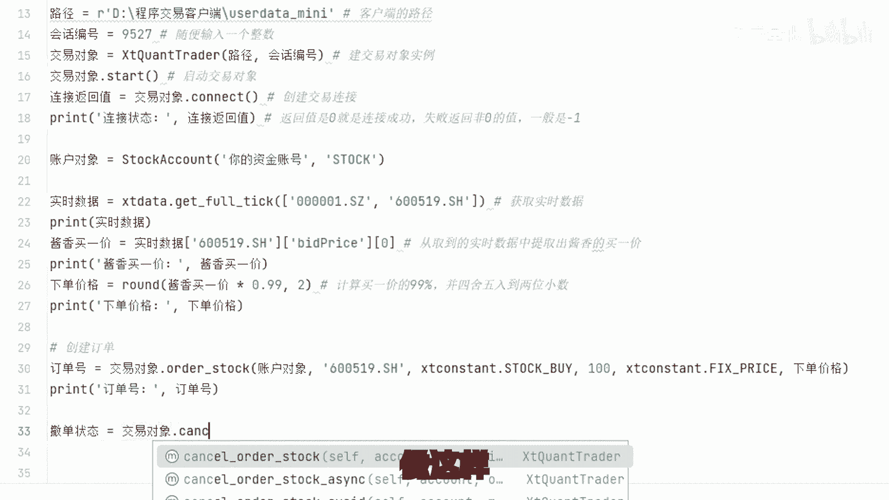

# Python炒股自动化：4：通过接口向交易所发送订单 - P1

## 概述
在本节课中，我们将要学习如何通过券商提供的API接口，向交易所发送订单。这是实现程序化自动交易的核心步骤之一。我们将从建立连接开始，逐步讲解如何创建交易账户对象、提交买入订单以及撤销订单。

## 建立交易连接
上一节我们介绍了如何获取市场数据，本节中我们来看看如何与交易系统建立连接。与直接获取数据不同，交易操作需要先与券商的交易服务器建立安全连接。

建立连接的代码如下：
```python
# 此处为建立交易连接的示例代码
trade_connection = create_trade_connection(api_key, api_secret, server_url)
```
此步骤通常很稳定，连接成功后即可进行后续操作。


## 创建交易账户对象
连接建立后，我们需要创建一个交易账户对象。这个对象用于标识你的账户，确保交易所知道订单来自哪个账户。

账户类型默认为 `stock`，表示A股交易。该接口通常也支持期权、期货、港股通等其他品种。

## 提交买入订单
前面两步做好了就可以开始下单了。例如，假设你想买入一只股票（如“示例科技”），并以当前买一价的99%作为委托价格挂单，等待成交。

以下是实现此操作的关键步骤：
1.  **获取实时价格**：首先获取该股票的当前实时买一价。
2.  **计算委托价格**：将买一价乘以0.99，得到我们的目标买入价。
3.  **提交订单**：使用交易接口，以计算出的价格和指定的数量提交买入订单。

其核心逻辑可以用以下伪代码表示：
```
current_bid_price = get_real_time_price(stock_code)
order_price = current_bid_price * 0.99
submit_buy_order(stock_code, order_price, quantity)
```

## 撤销订单
现在我们成功创建了交易连接，并根据盘口价格提交了订单。订单目前处于挂单等待成交的状态。如果市场走势与预期不符，我们需要撤回资金以等待下一次机会，这时就需要撤销订单。

撤销订单的操作相对直接，通常只需要提供订单的编号即可。



## 总结
本节课中我们一起学习了程序化交易中下单的基本流程。我们了解到，与获取数据不同，交易需要专用的券商API接口权限。核心步骤包括：**建立交易连接**、**创建账户对象**、**计算价格并提交订单**以及**撤销订单**。对于初学者，建议先严格按照示例代码跑通整个流程，获得正反馈。在实际操作中会遇到更多细节问题，但只要理解了基本原理，就可以借助大模型工具或相关社区找到解决方案。复杂的策略是在此基础上逐步构建的。