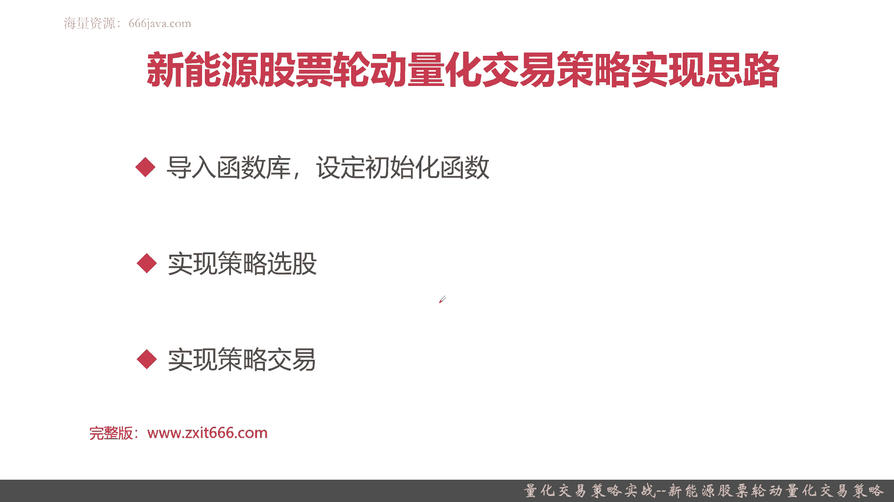
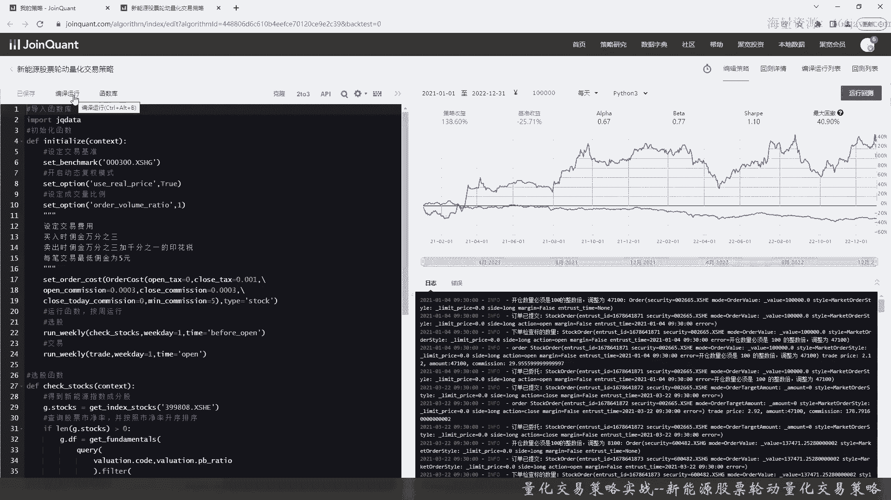
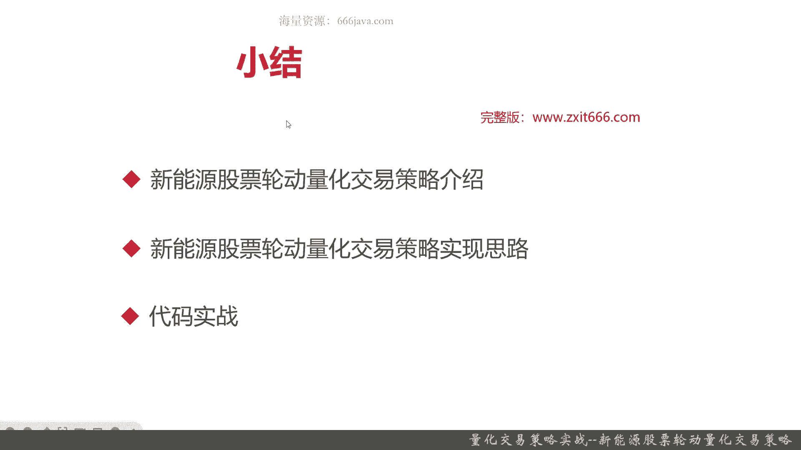

# 基于Python的股票分析与量化交易入门到实践 - P62：13.7：量化交易策略实战--新能源股票轮动量化交易策略 🚀

在本节课中，我们将学习如何基于宏观经验和行业热点，设计并实现一个新能源股票轮动量化交易策略。我们将从策略原理、实现思路到代码实战，完整地走一遍流程。

## 策略背景与原理

上一节我们介绍了基于技术指标的交易策略，本节中我们换一个思路，通过经验和宏观信息来设计策略。

新能源股票轮动策略的基础是**热点板块**。在股市中，热点板块指的是当前市场上交投活跃、成交量较大、板块内个股收益明显高于市场平均水平的板块。新能源板块就属于这样的热点板块，其内部股票更迭频繁，普遍收益较高。

股票价格受宏观和行业因素影响。量化交易策略的本质，是将成功的投资思想和经验进行量化实现。例如，有投资者通过关注新闻联播来把握宏观政策对市场的影响，从而获得高收益。这背后的逻辑是，国家政策会对特定行业（如新能源、人工智能、芯片）产生倾斜，从而在股票市场上形成热点。

该策略的原理源于成功的投资经验，可以概括为以下两点：
1.  **始终持有新能源指数成份股中市净率最低的股票，每周检查一次。**
2.  **若发现有新的新能源股票的市净率低于原有持仓股票，则进行换仓。**

第一句话是选股逻辑：选择最能代表新能源板块（即指数成份股）且投资前景较好（市净率最低）的股票。第二句话是换仓逻辑：该策略以周为单位运行，属于中长线策略，核心在于根据市净率指标动态调整持仓，而非频繁的短线交易。

## 策略实现思路

理解了策略原理后，我们来看看如何用代码实现它。整体实现框架与常见的量化策略类似，但侧重点有所不同。

以下是实现该策略的主要步骤：

1.  **导入库与初始化**：导入必要的Python库（如`backtrader`），并设置初始资金、基准、交易费用等参数。
2.  **实现策略选股函数**：核心是编写一个函数，能够获取新能源指数成份股，并从中筛选出市净率最低的股票作为备选股票池。这对应了原理中的第一句话。
3.  **实现策略交易函数**：编写交易逻辑，按周频率检查当前持仓股票的市净率是否仍为最低。如果不是，则卖出当前持仓，买入新的市净率最低的股票。这对应了原理中的第二句话。



这个策略的实现重点在于选股，交易逻辑相对直接。它属于长线策略，因此回测时我们使用周线数据。

## 代码实战环节

现在，让我们进入代码实战部分，将上述思路转化为具体的Python代码。

首先，我们需要导入必要的库并完成策略的初始化设置。

```python
# 示例代码结构示意
import backtrader as bt



class NewEnergyRotationStrategy(bt.Strategy):
    params = (
        ('printlog', False),
    )

    def __init__(self):
        # 初始化：设定基准、交易费用等
        self.benchmark = '000300.SH'  # 沪深300作为基准
        self.commission_info = ... # 设置交易佣金和印花税
        # 获取新能源指数成份股的逻辑（此处需调用相应数据接口）
        self.new_energy_stocks = self.get_index_constituents('399808') # 中证新能源指数
```

接下来，我们实现核心的选股函数。这个函数需要每周执行一次。

```python
    def check_stocks(self):
        # 每周执行的选股函数
        # 1. 获取当前新能源成份股列表
        current_constituents = self.get_index_constituents('399808')
        # 2. 获取这些股票的市净率(PB)数据
        pb_data = get_fundamentals(current_constituents, 'pb')
        # 3. 找出市净率最低的股票
        target_stock = pb_data.idxmin()
        return target_stock
```

最后，我们实现交易逻辑，在每周的特定时间点，根据选股结果决定是否调仓。

```python
    def next(self):
        # 判断是否为调仓日（例如，每周第一个交易日）
        if not self.is_rebalance_day:
            return

        # 调用选股函数，得到本期目标股票
        target_stock = self.check_stocks()
        # 获取当前持仓
        current_holdings = self.getpositions()

        # 如果目标股票不在当前持仓中，则执行换仓
        if target_stock not in current_holdings:
            # 卖出所有现有持仓
            for stock in current_holdings:
                self.sell(data=stock)
            # 买入目标股票
            self.buy(data=target_stock)
```

使用2021年1月1日至2022年12月31日的数据进行回测，该策略取得了约**128%**的总收益，年化收益约56%，夏普比率1.10。同期沪深300指数下跌约25%。策略的超额收益非常显著，达到221%。然而，策略的最大回撤也高达**40%**，这表明其虽然收益高，但波动和风险也较大，需要投资者有较强的长期持有心态。

## 本章小结 🎯

本节课我们一起学习了新能源股票轮动量化交易策略。

这个策略的核心思想是追踪并长期持有政策扶持的热点板块（如新能源），通过板块的整体成长获利，属于一种价值投资思路。其具体原理是：每周检查并持有新能源指数成份股中市净率最低的股票，并在发现更低市净率的成份股时进行换仓。

在实现上，我们遵循了量化策略的一般框架：导入库、初始化、实现选股函数、实现交易逻辑。本策略的特殊之处在于使用周线频率（`run_weekly`）和侧重于选股而非择时。

回测结果显示，该策略在特定时间段内能产生显著的超额收益，但也伴随着较大的回撤。这提醒我们，任何策略都需要结合市场环境审慎使用，并做好风险管理。



感兴趣的读者可以尝试用代码实现该策略，并在不同时间段进行回测，以更深入地理解其表现和适用条件。