# GitHub Weekly 精选：第49期 📰

在本教程中，我们将一起学习第49期《GitHub Weekly》中介绍的五个优秀开源项目。我们将了解每个项目的核心功能、技术特点以及它们能解决什么问题。内容涵盖量化投资、浏览器开发、前端性能优化、运维监控和系统构建等多个领域。

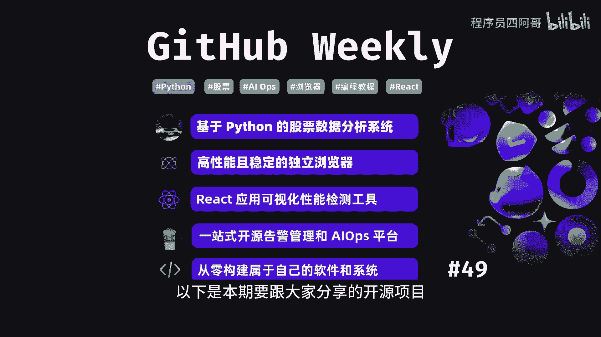

## 开源项目精选：49：基于Python的股票数据分析系统 📈

上一节我们介绍了本期的学习目标，本节中我们来看看第一个项目：一个功能全面的量化投资工具。

**In Stock** 是一个基于Python的综合性量化投资系统。它能够抓取每日股票和ETF的关键数据，计算各种股票指标，识别K线形态，并提供多种选股策略。

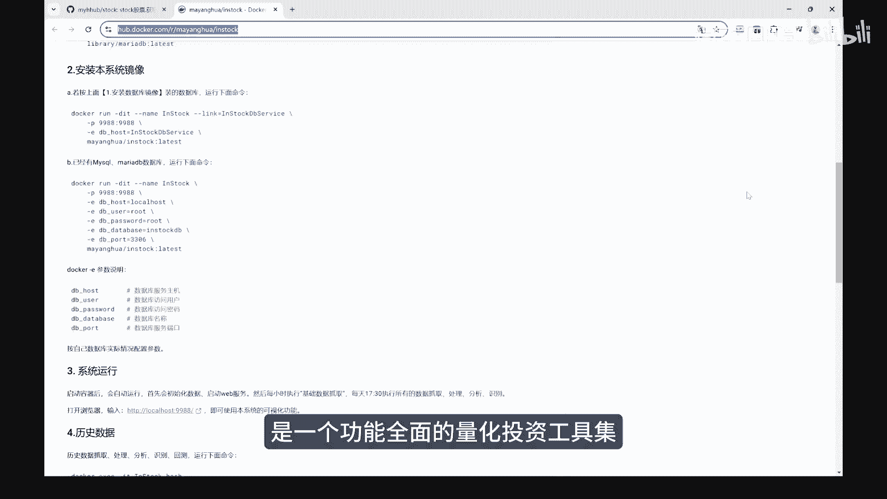

该系统不仅包含每日股票数据、资金流向、分红配送等信息，还基于 `talib` 和 `pandas` 等库计算超过30种技术指标，并能精准识别61种K线形态。同时，项目提供了Docker镜像，方便用户快速安装和部署。

以下是该系统的核心功能列表：
*   **数据抓取**：自动获取股票与ETF的每日关键数据。
*   **指标计算**：利用 `talib` 库计算多种技术指标，例如移动平均线（MA）、相对强弱指数（RSI）等。
*   **形态识别**：自动识别数十种经典的K线组合形态。
*   **策略提供**：内置多种选股策略，辅助投资决策。
*   **便捷部署**：提供Docker镜像，简化安装流程。

## 开源项目精选：49：高性能且稳定的独立浏览器 🌐

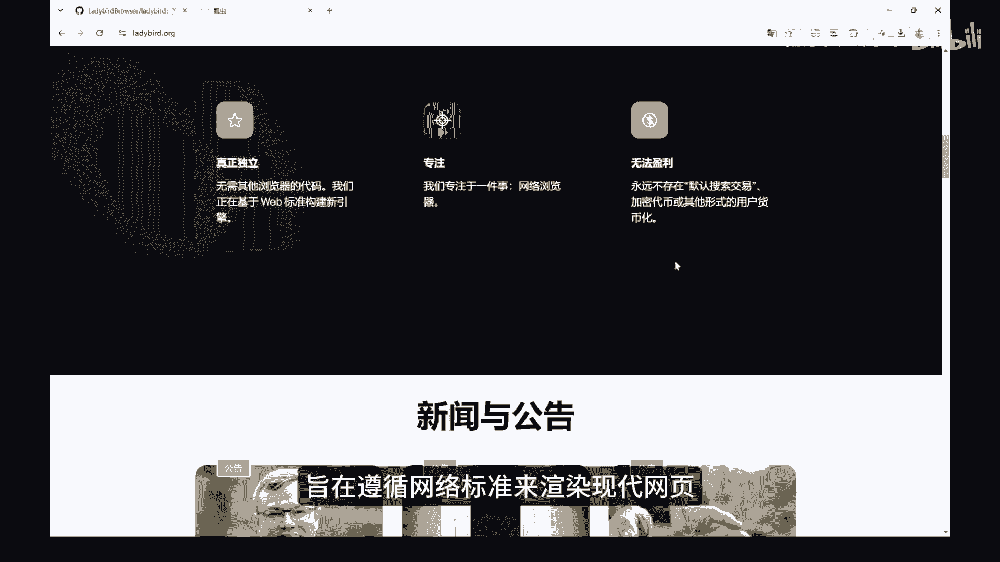

在了解了数据分析工具后，我们转向基础软件领域。本节介绍一个从头开始构建的独立浏览器项目。

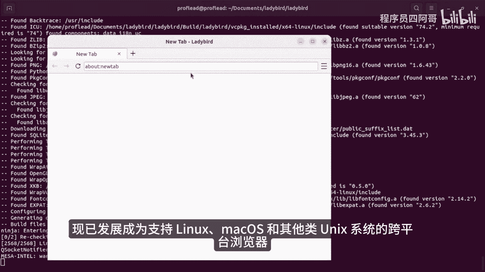

**Ladybird** 是一个独立的开源浏览器项目，由一个非营利组织支持。它旨在遵循网络标准来渲染现代网页，并提供高性能、稳定性和安全性的浏览体验。

该项目起源于SerenityOS操作系统的HTML查看器，现已发展成为支持Linux、macOS和其他类Unix系统的跨平台浏览器。Ladybird以其独立性为特色，不依赖于现有的浏览器引擎代码，而是从头构建其渲染引擎。

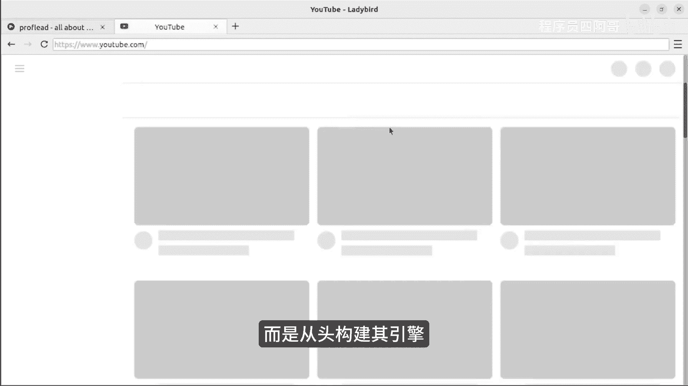

以下是Ladybird浏览器的技术特点：
*   **独立引擎**：不基于Chromium或Gecko，完全自主开发。
*   **编程语言**：主要使用C++进行开发。
*   **核心库**：集成了一系列精心设计的库，如LibWeb和LibJS，以覆盖完整的Web技术栈。
*   **跨平台**：支持Linux、macOS等操作系统。

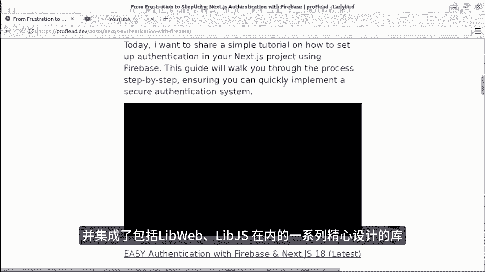

## 开源项目精选：49：React应用可视化性能检测工具 ⚡

从底层浏览器转向前端开发，性能优化是永恒的话题。本节介绍一个能帮助React开发者轻松定位性能问题的工具。

**React Scan** 是一个React性能检测工具。它能够自动检测并以可视化的界面方式，显示React应用程序中可能导致性能问题的组件。

它通过直观的视觉反馈，帮助开发者识别导致不必要的重复渲染的组件，并且无需手动更改应用程序代码，从而极大地简化了性能检测和优化的过程。

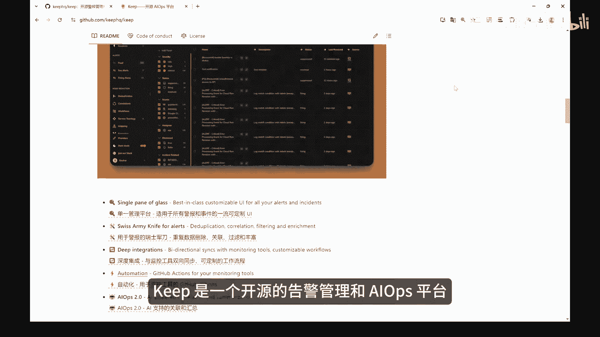

## 开源项目精选：49：开源告警管理和AIOps平台 🚨

接下来，我们将视角转向运维和开发运维（DevOps）领域。一个高效的告警管理平台对于系统稳定性至关重要。

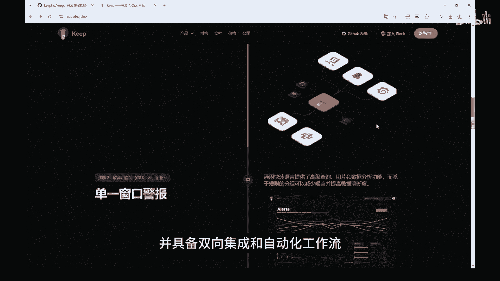

**Keep** 是一个一站式的开源告警管理和AIOps平台。它通过提供一个统一的界面来管理来自不同来源的所有告警和事件，支持告警去重、丰富、过滤和关联，并具备双向集成和自动化工作流能力。

Keep支持与多种监控工具、数据库和通信平台集成，可有效降低警报噪音，优化运营效率。除了优化告警管理流程，Keep还通过集成AI技术，提升了告警处理的智能化和准确性。

## 开源项目精选：49：从零构建自己的软件和系统教程 🛠️

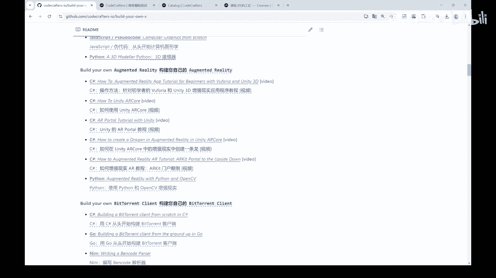

最后，我们来看一个能极大提升开发者对技术底层原理理解的项目集合。学习构建轮子是掌握技术的最佳途径之一。

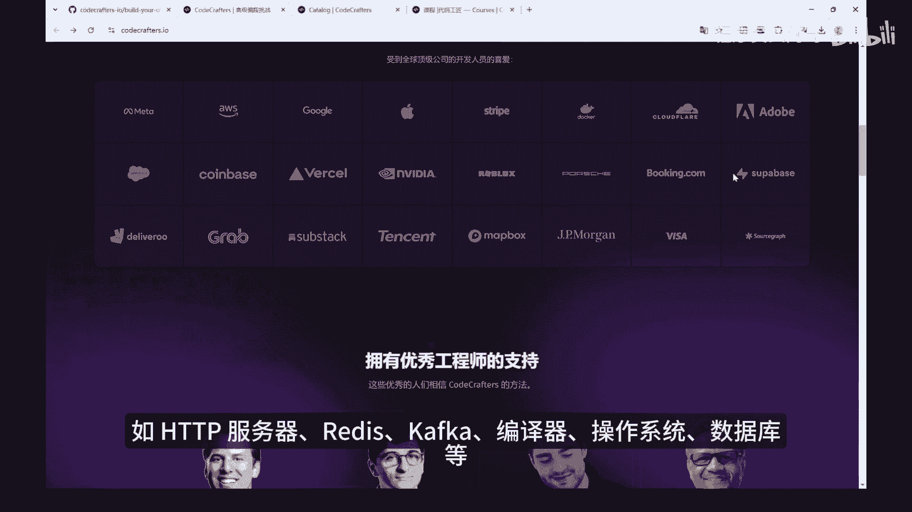

**“Build Your Own X”** 项目收集了一系列涉及各个技术领域的实践教程，旨在帮助开发者从零开始，构建各种技术工具和系统。

教程涵盖如何构建HTTP服务器、Redis、Kafka、编译器、操作系统、数据库等。通过亲自动手实现，开发者可以深入理解这些技术的核心原理，从而提升编程和系统设计能力。

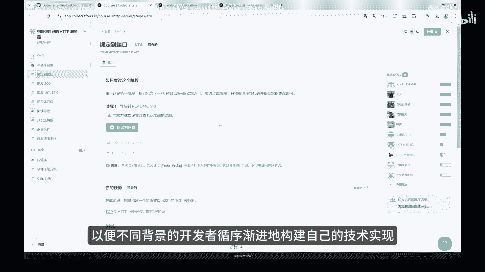

以下是该教程集合的主要特点：
*   **覆盖广泛**：包含从应用到系统层的多种项目，如 `HTTP Server`、`Redis`、`Database`。
*   **语言多样**：教程涵盖了Rust、Go、Python、JavaScript、Java等多种编程语言。
*   **步骤详尽**：提供了循序渐进的构建步骤，适合不同技术背景的开发者学习。

---

本节课中我们一起学习了第49期《GitHub Weekly》的五个精选开源项目。我们从一个用于股票数据分析的Python量化系统开始，接着探索了一个完全独立开发的C++浏览器引擎，然后了解了一个可视化React性能检测工具，之后介绍了一个统一管理告警的AIOps平台，最后学习了一个通过“造轮子”来深入理解计算机系统的教程集合。这些项目横跨数据分析、基础软件、前端开发、运维管理和系统学习等多个维度，为开发者提供了宝贵的工具和学习资源。