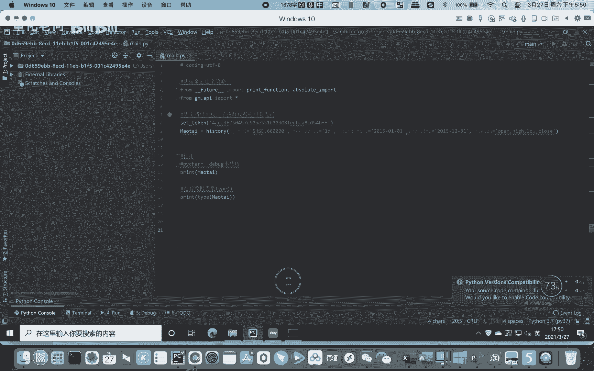
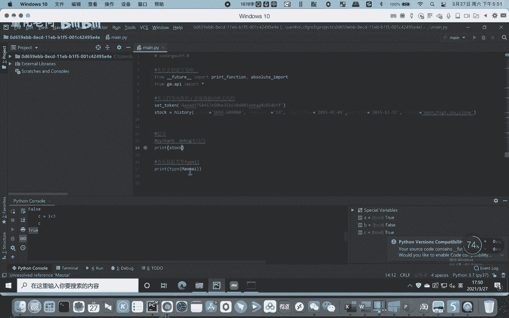
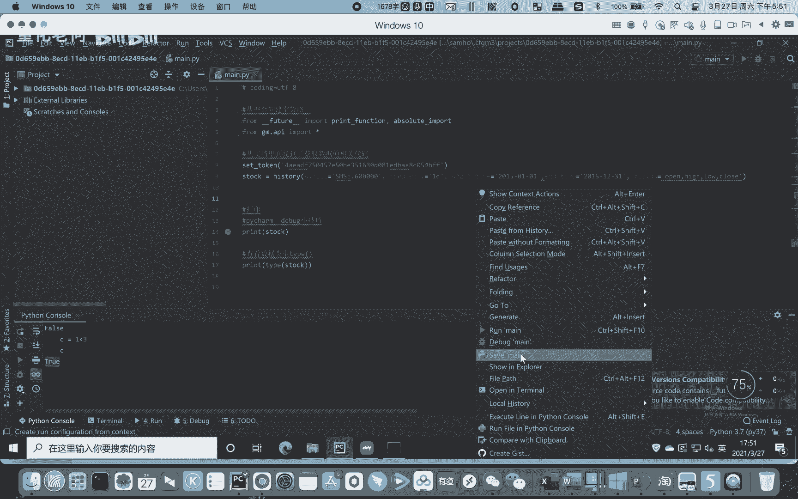
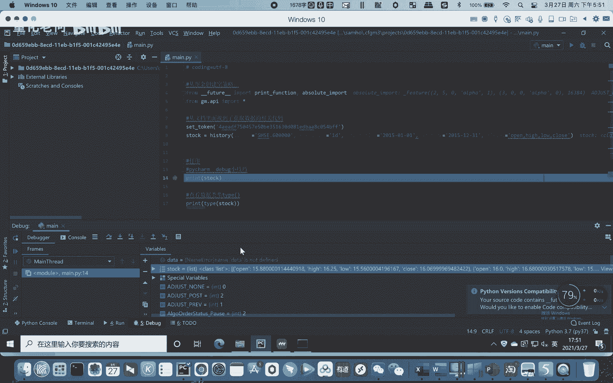
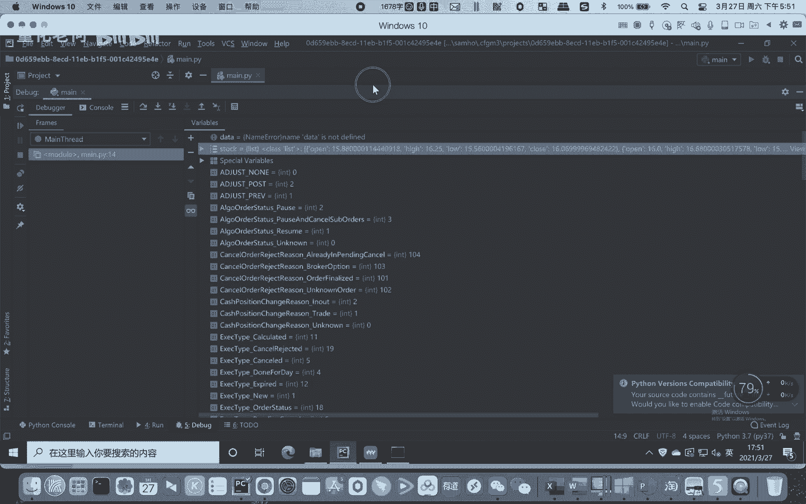
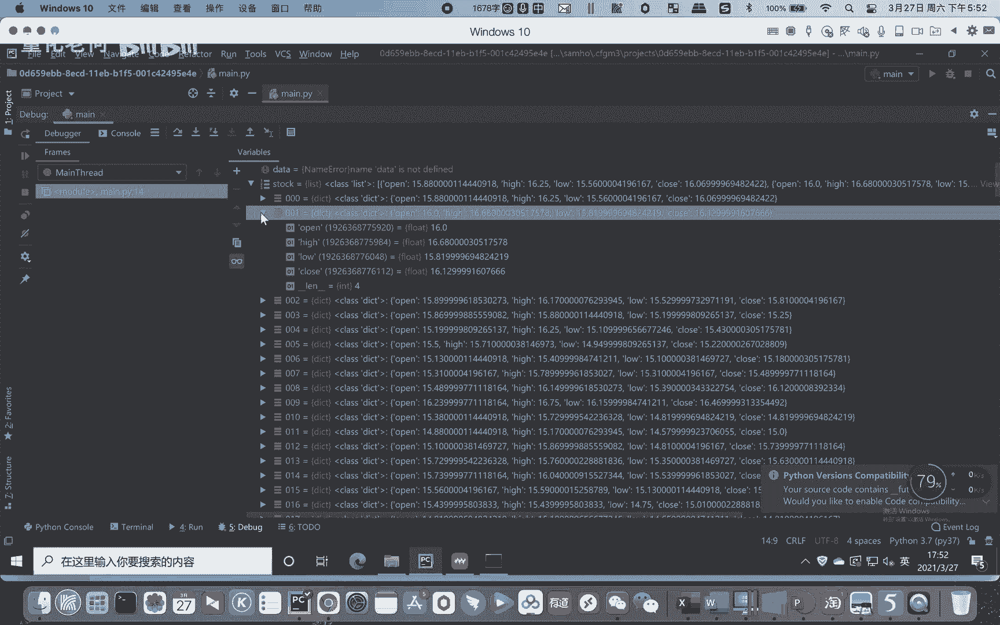

# Python股票实战课程：204：数据类型和结构与量化交易的关系

在本节课中，我们将要学习Python基本数据类型和数据结构与量化交易实践之间的具体联系。理解这些基础知识是编写有效交易策略的基石。

上一节我们介绍了Python的基本数据类型和数据结构。本节中我们来看看它们在实际的量化交易代码中是如何应用的。

## 基础是策略的根基

学习基础数据类型和数据结构看似枯燥，但它们是为后续策略编写打下的地基。只有充分了解这些基础，编写策略代码时才会更加得心应手。

为了说明这一点，我们回到一个实际的代码实例中。

例如，在显示的代码中，我们先设置一个断点。

设置断点后，我们右键选择“Debug”进行调试。

我们希望查看某个变量的类型，可以右键选择“Add to Watches”。

可以看到，这里获取到的历史行情数据是一个变量。我们将其展开查看。

首先，变量`stock_data`中存放的是一个**列表**。这个列表包含200多个元素，对应一年的历史数据。

以下是列表中每个元素的结构：
*   每个元素都是一个**字典**。
*   每个字典包含四个键（key）：`open`（开盘价）、`high`（最高价）、`low`（最低价）、`close`（收盘价）。
*   每个键对应的值都是**浮点型**（float）数字，例如 `15.88`。

这个例子清晰地展示了基础数据结构（列表、字典）和数据类型（浮点数）如何组织真实的金融数据。如果不掌握这些，后续的Python代码将无法编写和理解。

因此，这些内容是我们学习的坚实基础。

## 学习建议与重点

何老师讲解的内容，在提供的基础代码和小甲鱼老师的视频中有更详细的阐述。小甲鱼的视频讲解全面细致，而何老师的视频则侧重于提炼重点，就像期末考试前划重点一样。

以下是本阶段学习的核心要点：
*   列表用于存储一系列有序的数据项，例如多根K线。
*   字典用于存储键值对，非常适合表示一根K线的各个维度（开盘价、最高价等）。
*   浮点型用于精确表示价格等金融数据。

各位同学务必认真完成作业和闯关题，巩固这些最常用的知识。

本节课中我们一起学习了数据类型和数据结构在量化交易中的具体应用。我们看到，列表和字典如何组织K线数据，浮点数如何表示价格。牢固掌握这些基础，是迈向成功策略开发的第一步。