# Python股票实战课程：205：流程控制 🚦

在本节课中，我们将要学习Python编程中的核心概念——流程控制。流程控制是指通过特定的语句来改变代码的执行顺序，使其不再仅仅是简单的从上到下运行。这主要包括**循环**和**分支**语句，它们能让我们处理重复性任务和根据不同条件做出决策。

## 循环语句 🔄

上一节我们介绍了流程控制的基本概念，本节中我们来看看循环语句。循环用于重复执行一段代码，直到满足特定条件为止。Python中主要有两种循环：`for`循环和`while`循环。

### for循环

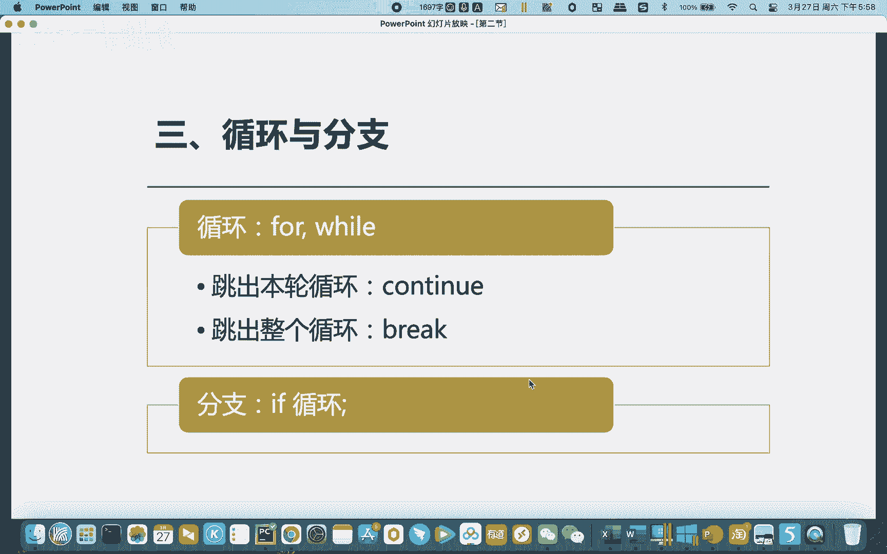

`for`循环通常与列表等数据结构结合，用于遍历其中的每一个元素。

以下是`for`循环的基本语法示例：

```python
list1 = [1, 2, 3, 4, 5, 6, 7, 8, 9, 10]
for i in list1:
    print(i)
```
这段代码会依次打印出列表`list1`中的每一个数字。

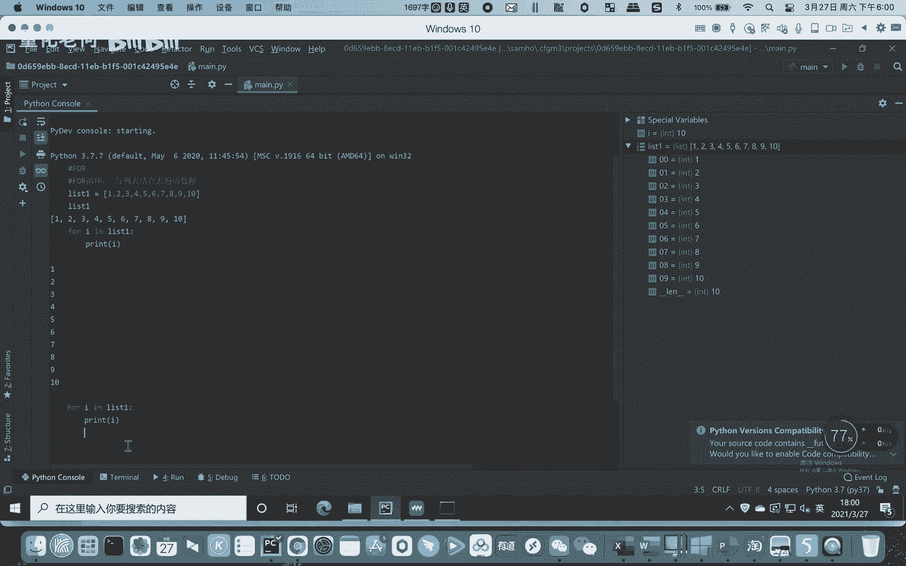

### while循环

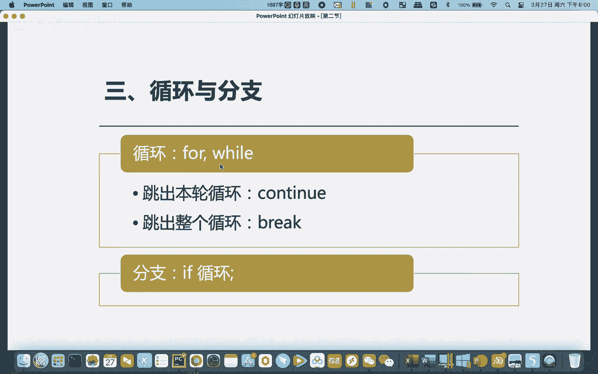

`while`循环则是在满足某个条件时，持续执行循环体内的代码。它更侧重于限定循环的次数或范围。

以下是`while`循环的基本语法示例：

```python
i = 0
while i < 10:
    print(i)
    i += 1  # 等同于 i = i + 1
```
这段代码会打印从0到9的数字。当`i`的值达到10时，不满足`i < 10`的条件，循环终止。

## 流程控制关键字 🎯

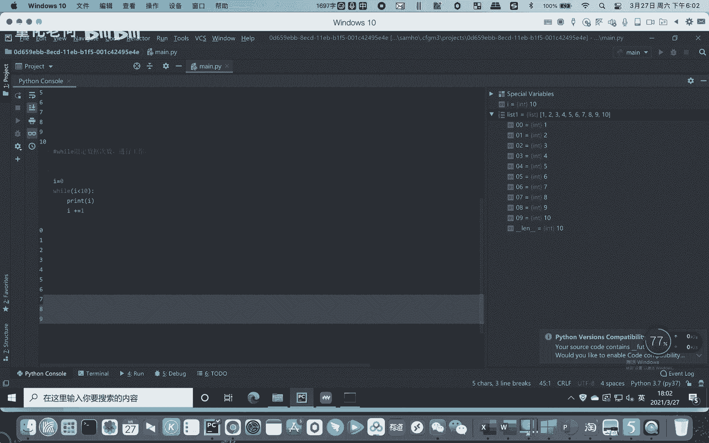

在循环过程中，我们有时需要更精细地控制流程，例如提前结束某次循环或整个循环。Python提供了`continue`和`break`关键字来实现这一点。


### continue 语句

`continue`用于跳过本轮循环中剩余的代码，直接开始下一轮循环。

以下是一个使用`continue`的例子：

```python
i = 0
while i < 10:
    if i == 5:
        i += 1
        continue
    print(i)
    i += 1
```
这段代码会打印0到9的数字，但会跳过数字5。

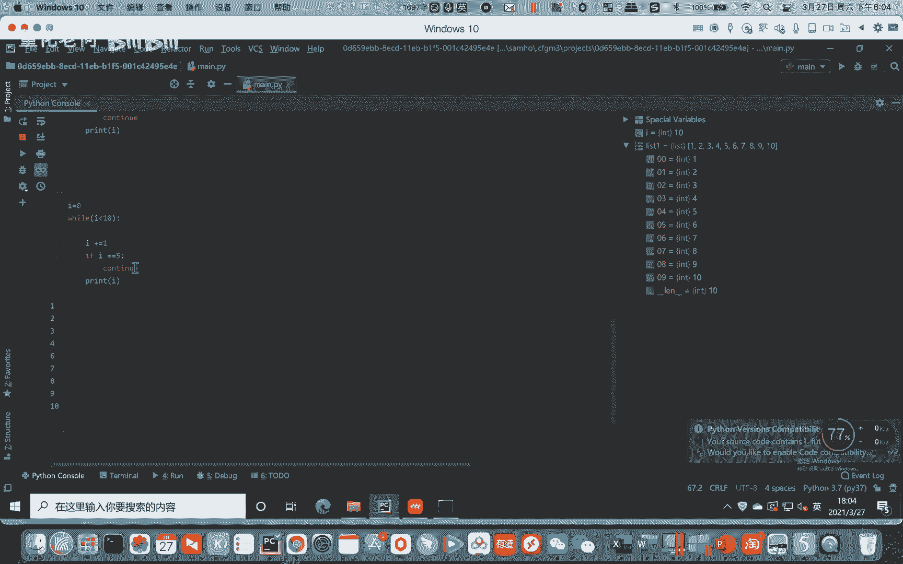

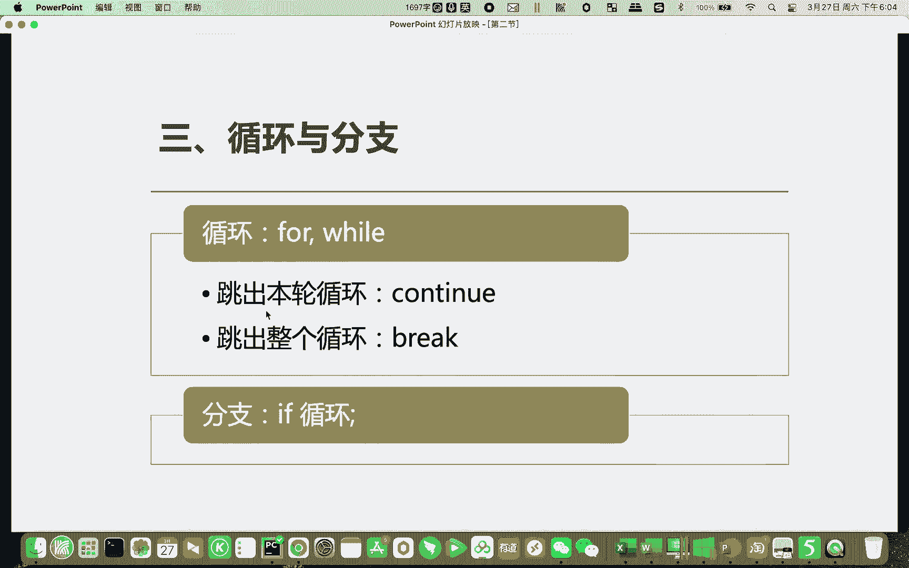

### break 语句

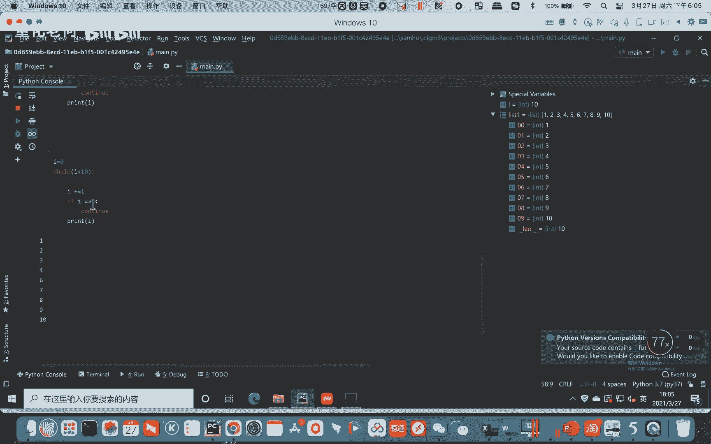

`break`用于立即终止整个循环，无论循环条件是否仍然满足。

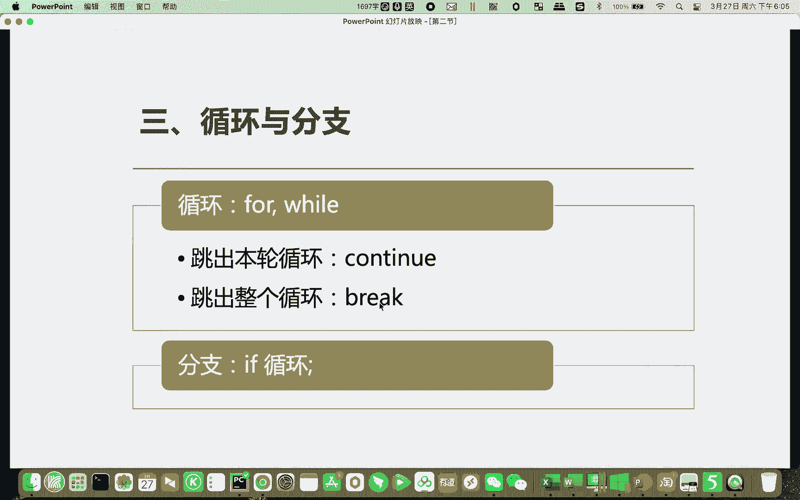

以下是一个使用`break`的例子：

```python
i = 0
while i < 10:
    if i == 5:
        break
    print(i)
    i += 1
```
这段代码只会打印0到4的数字。当`i`等于5时，遇到`break`语句，整个`while`循环被终止。

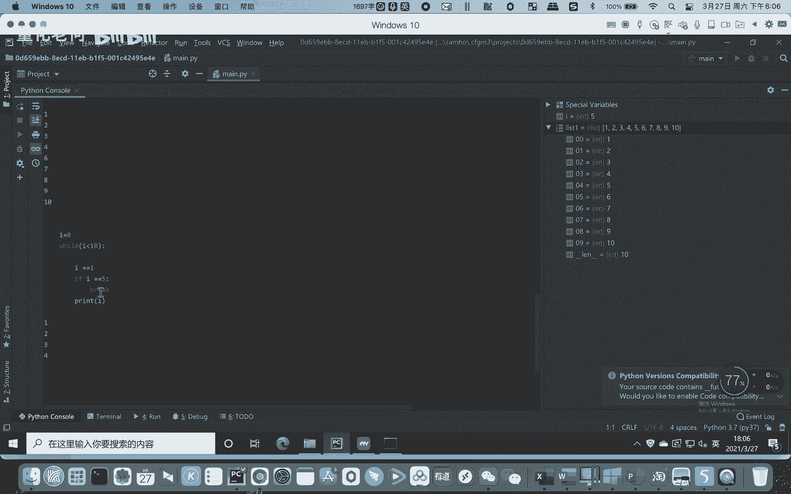

## 分支语句 🛤️

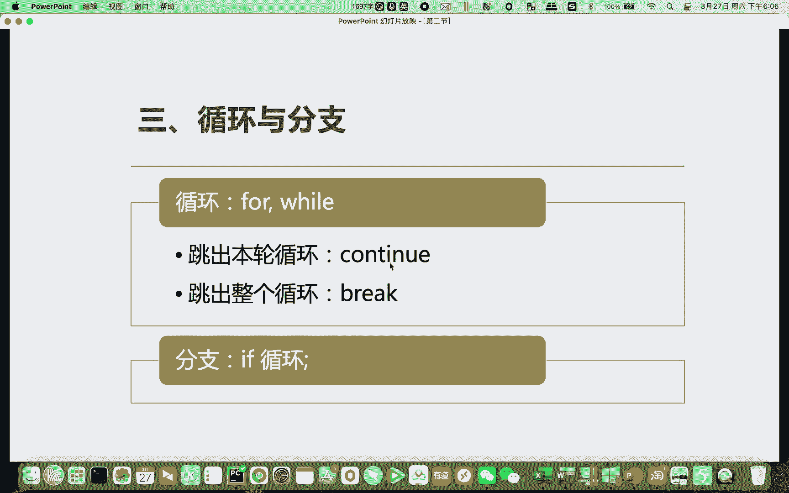

上一节我们介绍了如何控制循环，本节中我们来看看分支语句。分支语句（`if`语句）允许程序根据不同的条件执行不同的代码块，这是实现决策逻辑的核心。

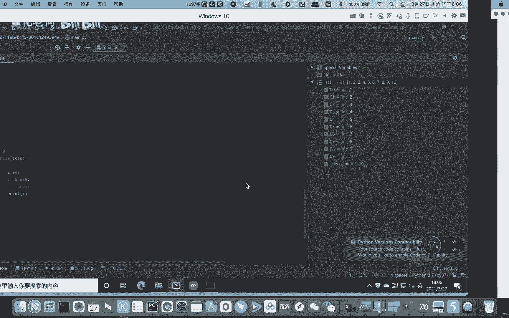

### 基本 if-else 结构

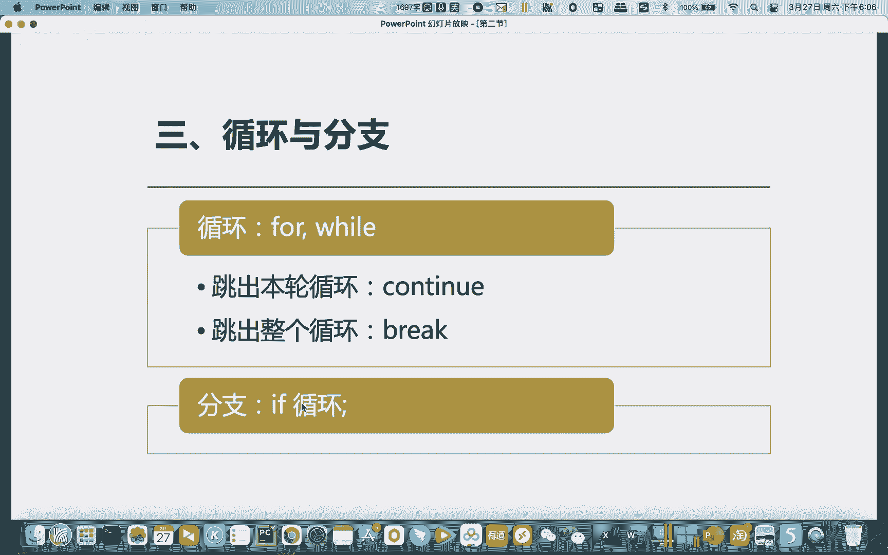

最基本的`if`语句包含一个条件判断和一个`else`（否则）分支。

以下是基本结构的示例：

```python
a = 10
if a == 0:
    print(“a等于零”)
else:
    print(“a不等于零”)
```
因为`a`的值为10，不满足`a == 0`的条件，所以程序会执行`else`分支，打印“a不等于零”。

### 多重条件判断 (elif)

当存在多个条件需要判断时，可以使用`elif`（else if的缩写）来添加更多的分支。

以下是多重条件判断的示例：

```python
a = 3
if a == 0:
    print(“a等于零”)
elif a == 1:
    print(“a等于一”)
else:
    print(“a不等于零，也不等于一”)
```
程序会按顺序检查每个条件。`a`等于3，既不等于0也不等于1，因此最终执行`else`分支。你可以根据需要添加任意多个`elif`分支。

## 动手闯关 💪

现在，让我们运用所学的循环和分支知识来解决一个实际问题。

**任务**：
给定一个列表 `list1 = [1, 2, 3, 4, 5, 6, 7, 8, 9, 10, 11, 12, 13]`，请利用循环和分支语句，找出并打印出列表中所有能被3整除的数值。

**提示**：
- 你需要遍历列表（使用循环）。
- 对每个元素，判断它除以3的余数是否为0（使用`if`语句和取模运算符`%`）。
- 如果余数为0，则打印该数字。

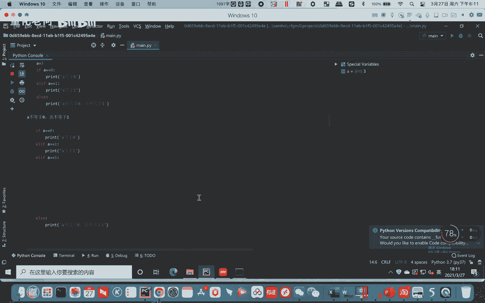

## 总结 📝

本节课中我们一起学习了Python流程控制的核心内容：
1.  **循环语句**：包括用于遍历的`for`循环和基于条件重复的`while`循环。
2.  **流程控制关键字**：`continue`用于跳过本轮循环，`break`用于终止整个循环。
3.  **分支语句**：使用`if`、`elif`和`else`来根据条件执行不同的代码路径，实现程序决策。

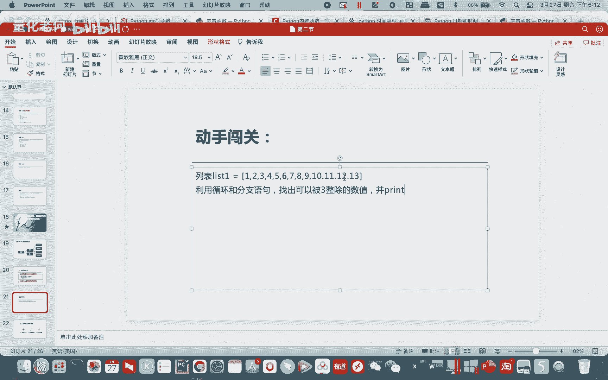

掌握这些流程控制结构是编写复杂、灵活程序的基础。请务必完成动手闯关练习来巩固理解。