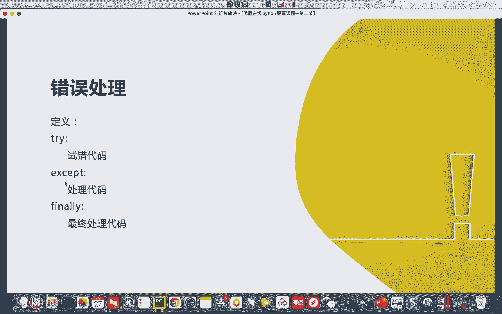
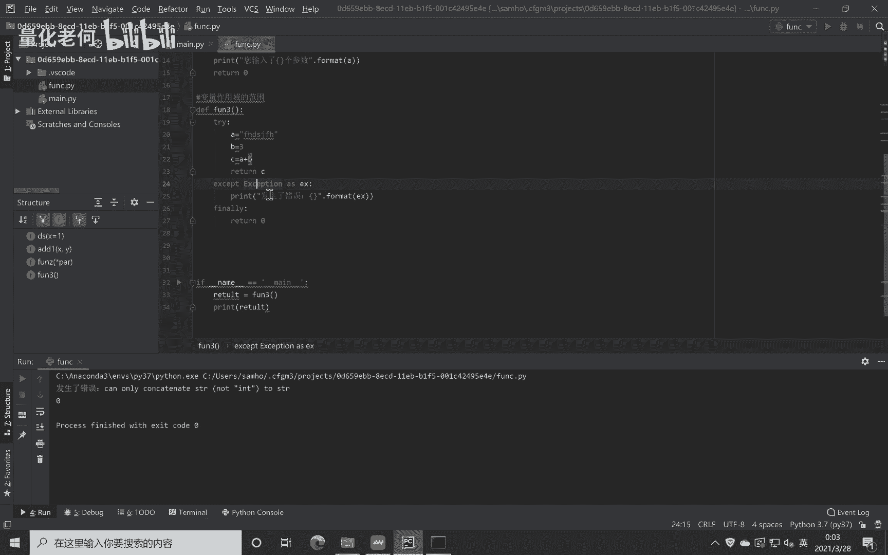
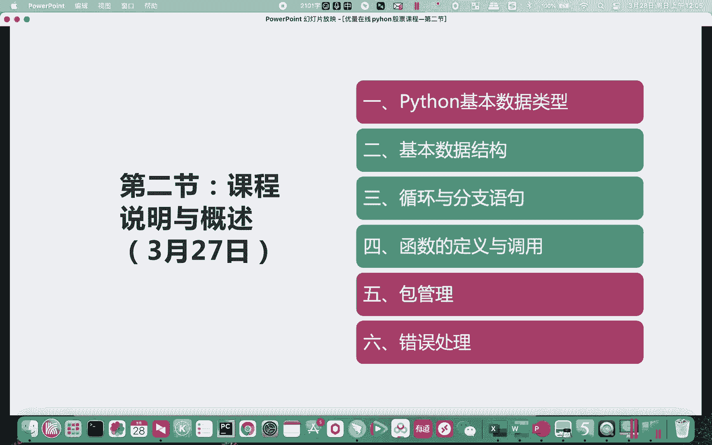
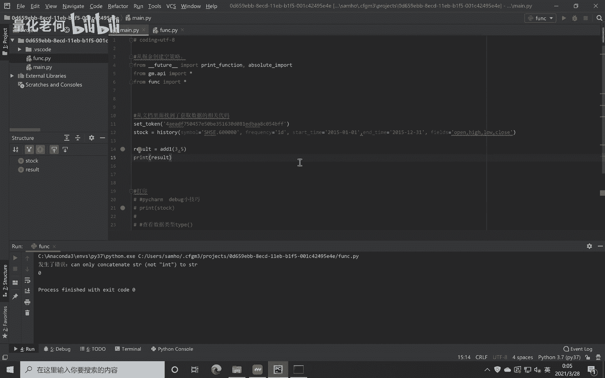

# Python股票实战课程：P1：错误处理 🐍

在本节课中，我们将要学习Python编程中一个非常实用的概念：错误处理。当代码运行时，难免会遇到各种意外情况导致程序出错。通过错误处理，我们可以让程序在遇到错误时，按照我们预设的方式优雅地处理，而不是直接崩溃。这对于编写稳定、健壮的量化交易策略至关重要。

上一节我们介绍了函数和逻辑控制，本节中我们来看看如何让我们的代码更加“坚固”，能够应对运行时的各种异常。

## 错误处理的基本结构



Python中使用 `try...except...finally` 结构来处理错误。其核心思想是：尝试运行一段可能出错的代码，如果出错，则执行异常处理代码，最后无论是否出错，都可以选择执行一段收尾代码。

以下是其基本语法格式：

```python
try:
    # 尝试执行的代码块
    pass
except Exception as e:
    # 如果try中的代码出错，则执行这里的代码块
    # `e` 变量包含了具体的错误信息
    pass
finally:
    # 无论是否出错，最终都会执行的代码块（可选）
    pass
```

## 一个简单的错误处理示例

让我们通过一个具体的例子来理解错误处理是如何工作的。假设我们有一个函数，它试图将一个字符串和一个数字相加，这显然会导致类型错误。

首先，我们定义一个会出错的函数 `func3`：

```python
def func3():
    A = "你好"  # 这是一个字符串
    B = 123     # 这是一个整数
    C = A + B   # 尝试将字符串和整数相加，这里会出错
    return C
```

如果不加错误处理，直接调用这个函数，程序会报错并停止运行。

```python
result = func3()
# 运行结果：TypeError: can only concatenate str (not “int”) to str
```

现在，我们使用 `try...except` 来捕获并处理这个错误：

```python
try:
    result = func3()
except Exception as e:
    print(“发生了错误：{}”.format(e))
    result = None
```

运行这段代码，你会发现控制台不再显示刺眼的红色错误信息，而是打印出我们预设的提示：“发生了错误：can only concatenate str (not “int”) to str”。程序得以继续运行，并且我们将 `result` 设置为了 `None`。

如果 `try` 块中的代码没有错误，那么 `except` 块将被跳过，程序正常执行。例如，将 `B` 也改为字符串：

```python
def func3():
    A = “你好”
    B = “123”  # 现在B也是字符串
    C = A + B  # 字符串可以拼接
    return C

try:
    result = func3()
    print(result)  # 输出：你好123
except Exception as e:
    print(“发生了错误：{}”.format(e))
```



## finally 关键字的作用

`finally` 块中的代码，无论 `try` 块中的代码是否出错，最终都会被执行。它通常用于执行一些清理工作，比如关闭文件、释放网络连接等。

```python
def func3():
    A = “你好”
    B = 123
    C = A + B
    return C

try:
    result = func3()
except Exception as e:
    print(“发生了错误：{}”.format(e))
finally:
    print(“这段代码无论如何都会执行。”)
    # 例如，这里可以强制返回一个默认值
    result = 0

print(“最终结果：”, result)
```

在这个例子中，即使发生了错误，程序也会执行 `finally` 块，将 `result` 设置为 0，并打印出提示信息。



## 错误处理在量化实战中的重要性

在量化交易策略开发中，错误处理尤为重要。我们的代码常常需要：
*   从网络获取实时数据（可能因网络波动失败）。
*   进行复杂的数值计算（可能产生溢出或除零错误）。
*   与交易API交互（可能因订单状态异常出错）。



如果不进行错误处理，任何一个意外都可能导致整个策略程序崩溃，在实盘交易中这是不可接受的。通过 `try...except`，我们可以：
1.  **记录错误**：将错误信息保存到日志，便于后续排查。
2.  **执行备用方案**：当主要数据源失效时，切换到备用数据源。
3.  **保证策略连续性**：即使某个信号计算失败，也能跳过当前周期，等待下一次计算，而不是让整个策略停止。

## 关于面向对象编程的说明

有些有编程经验的同学可能会问，课程中为何没有讲解面向对象编程（OOP）。这里做一个简要说明：

本课程立足于**实战**和**快速上手**。在掘金量化平台上进行策略开发，平台本身提供了一套简洁的机制（例如使用 `context` 对象）来在不同函数间传递和共享数据，这避免了编写复杂的面向对象代码的必要性。

我们的目标是让大家掌握**必需且够用**的知识，以顺利开展后续的策略开发工作。因此，课程内容进行了精简，略去了在当下场景中非必须的面向对象部分。如果大家对Python的面向对象编程感兴趣，可以参考课程资料中推荐的其他基础教程进行学习。

## 课后作业与总结

本节课中我们一起学习了Python错误处理的核心机制 `try...except-finally`。我们了解了它的基本语法，通过示例看到了它如何捕获并处理运行时错误，并探讨了它在保证量化策略健壮性方面的重要作用。

以下是本讲的课后作业，请同学们完成：
1.  **第一关**：编写一个函数，模拟从列表中获取一个不存在的索引，使用错误处理来捕获 `IndexError`，并打印友好的提示信息。
2.  **第二关**：编写一个函数，接受用户输入的两个数字并进行除法运算，使用错误处理来捕获可能发生的 `ZeroDivisionError`（除零错误）和 `ValueError`（输入非数字）。
3.  **第三关**：模拟一个数据获取函数，该函数有20%的几率随机抛出异常。使用错误处理，当异常发生时，返回一个默认值（如 `None` 或 `-1`），并确保无论是否异常，都打印“数据获取尝试结束”。

请将你的代码或完成截图整理好，备注姓名，发送至指定邮箱。我会逐一检查大家的作业。


掌握错误处理，是你从编写“玩具代码”迈向开发“工业级”程序的关键一步。希望大家认真练习，我们下周再见！