# Python股票实战课程：302a：策略驱动模式详解 🚀

在本节课中，我们将学习掘金量化平台中策略编写的核心基础——驱动模式。我们将了解三种主要的策略驱动方式：定时驱动、事件驱动以及它们的结合模式。通过实例代码和调试演示，你将掌握如何编写和运行不同类型的量化策略。

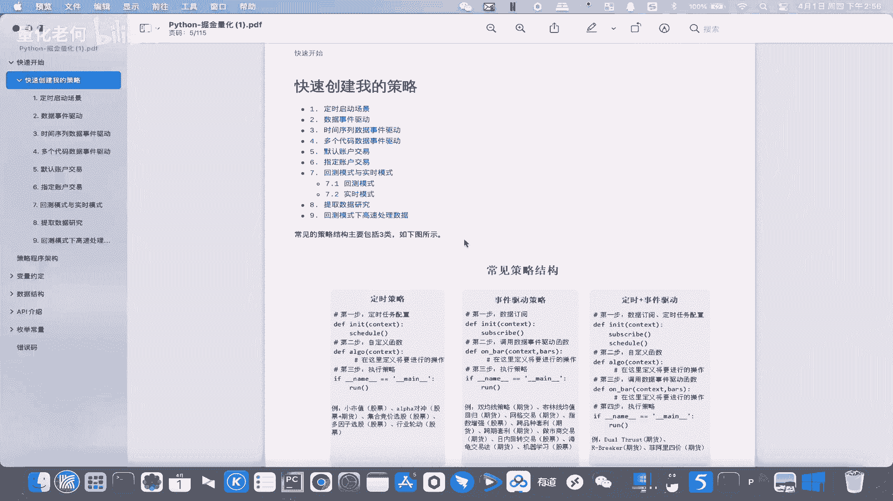

---

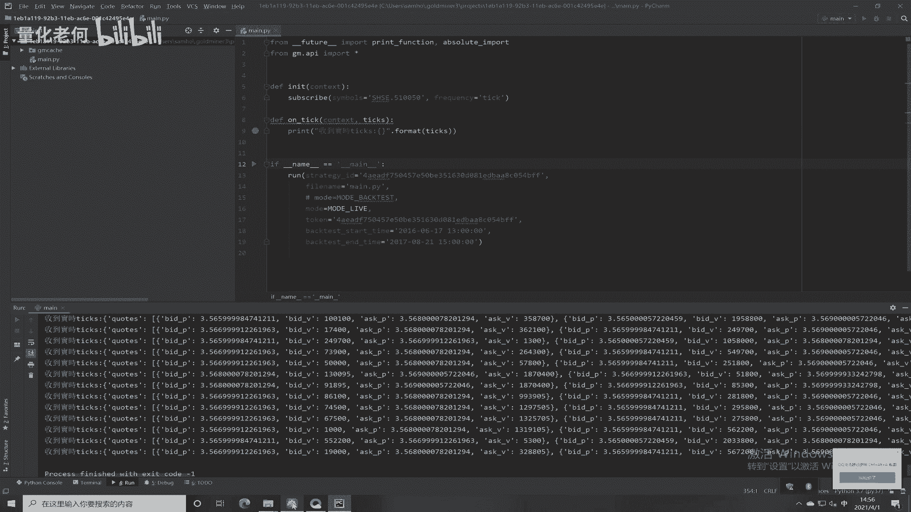

## 策略的驱动模式

上一节我们介绍了掘金量化平台的基础环境配置。本节中，我们来看看策略的核心运行机制——驱动模式。理解驱动模式是编写有效策略的第一步。

学习本节内容，你需要同时打开掘金的Python官方文档，并在PyCharm中准备好相应的工程，以便进行策略编辑和调试。

掘金平台主要支持三种策略驱动模式：

1.  **定时驱动模式**：策略在每天盘中的特定时间点（例如14:50）自动执行预设的算法。
2.  **事件驱动模式**：策略不是按固定时间运行，而是当订阅的行情数据（如K线或Tick）到达时，自动触发相应的处理函数。
3.  **混合驱动模式**：结合了定时和事件驱动，既在特定时间执行任务，也响应行情事件。

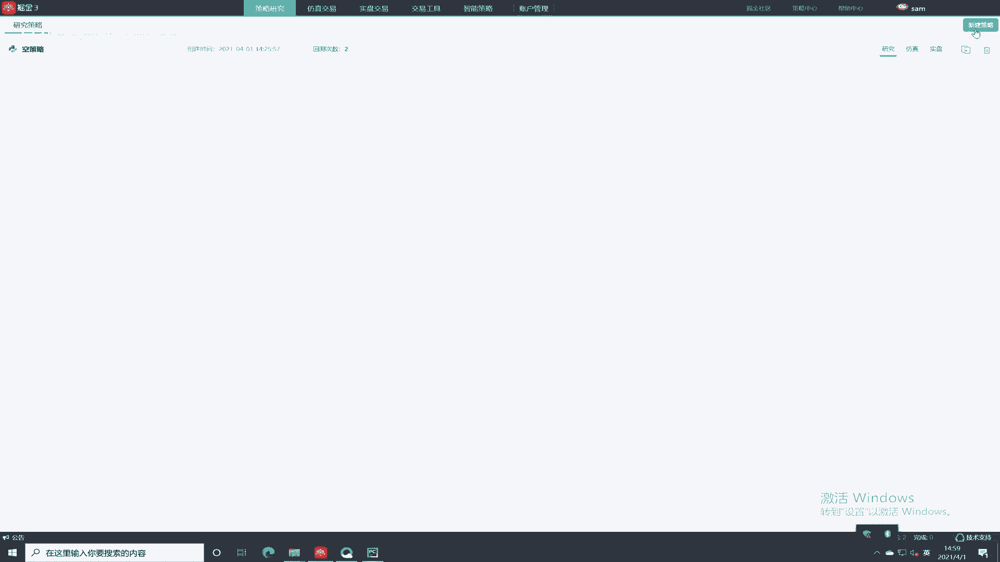

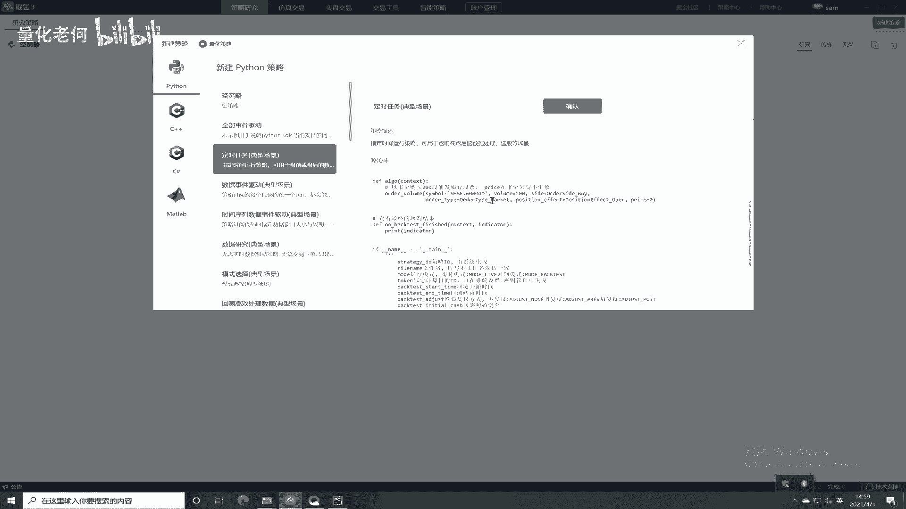

接下来，我们将通过具体实例逐一讲解这三种模式。

---

## 定时驱动模式 ⏰

定时驱动模式适用于需要在固定时间点执行操作的场景，例如每日收盘前检查仓位或执行交易。

以下是定时驱动模式的一个简单实例：在每个交易日的14:50分，买入200股浦发银行股票。

**核心代码结构如下：**

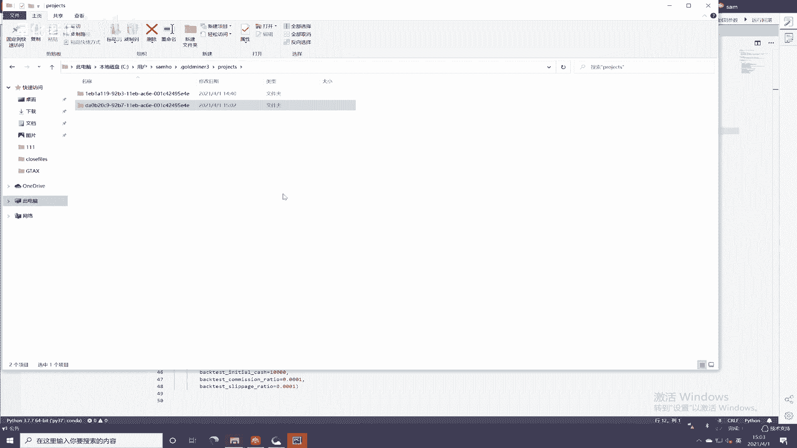

```python
def initialize(context):
    # 初始化函数，策略启动时运行一次
    # 设置定时任务：每天14:50执行`algo`函数
    schedule(schedule_func=algo, date_rule='1d', time_rule='14:50:00')

def algo(context):
    # 在指定时间要执行的函数
    # 以市价单买入200股浦发银行（股票代码：600000.SH）
    order_volume(symbol='600000.SH', volume=200, side=OrderSide_Buy, order_type=OrderType_Market, position_effect=PositionEffect_Open)
```

**策略运行流程解析：**

1.  `initialize(context)` 函数在策略启动时运行一次，用于初始化设置。这里使用 `schedule` 函数安排了一个定时任务。
2.  `schedule` 函数是关键，它指定了执行频率（`date_rule=‘1d’` 表示每天）、执行时间（`time_rule=‘14:50:00’`）以及要执行的函数（`algo`）。
3.  当到达指定时间，平台会自动调用 `algo(context)` 函数。
4.  在 `algo` 函数中，`order_volume` 函数用于下单。参数 `side=OrderSide_Buy` 表示买入，`order_type=OrderType_Market` 表示市价单。

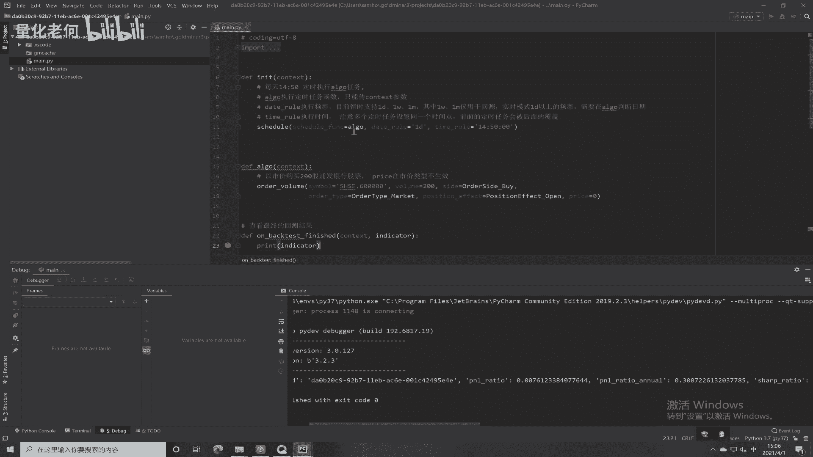

你可以在掘金平台创建“定时任务”策略模板，上述代码框架会自动生成。通过回测功能，可以验证策略在历史数据上的表现。

---

## 事件驱动模式 📈

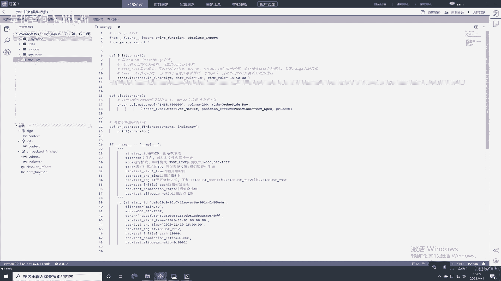

上一节我们介绍了定时驱动，本节中我们来看看事件驱动模式。这种模式是量化策略中最常用的一种，它让策略能够实时响应市场行情的变化。

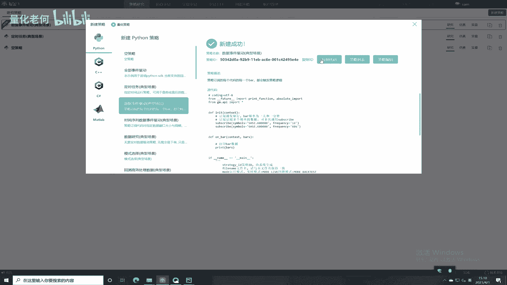

事件驱动模式的核心是“订阅-回调”机制。策略首先订阅感兴趣的标的和数据类型（如每分钟K线），每当新的数据产生，平台就会自动调用策略中对应的回调函数（如 `on_bar`）。

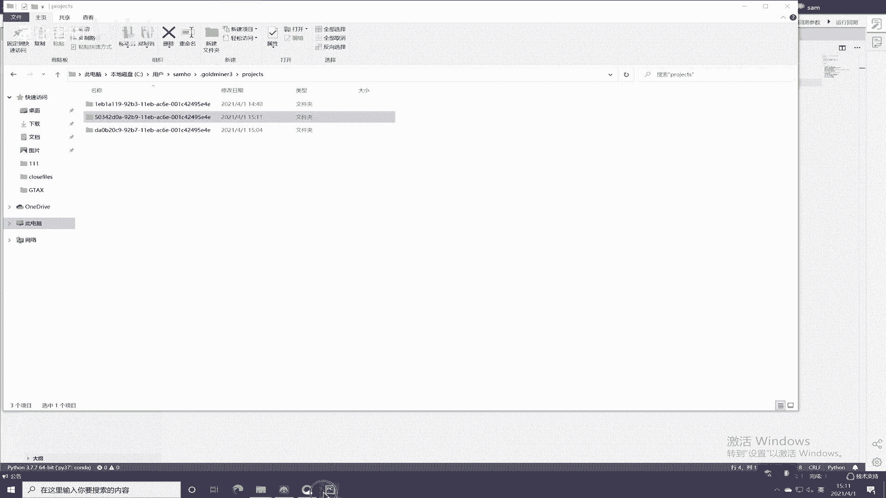

以下是一个简单的事件驱动策略实例：订阅浦发银行的日线（1天）和分钟线（60秒）数据，并在每次收到新K线时打印其信息。

**核心代码结构如下：**

```python
def initialize(context):
    # 初始化时订阅数据
    # 订阅浦发银行的日线(1d)和60秒线(60s)
    subscribe(symbols='600000.SH', frequency='1d')
    subscribe(symbols='600000.SH', frequency='60s')

def on_bar(context, bars):
    # 回调函数，当订阅的K线周期结束时被触发
    # bars 参数是最新生成的那一根K线数据
    print(bars)
```

**策略运行流程解析：**

1.  在 `initialize` 函数中，使用 `subscribe` 函数订阅了股票“600000.SH”的两种频率数据。
2.  每当一根新的K线（无论是日线还是60秒线）形成时，平台就会自动调用 `on_bar(context, bars)` 函数。
3.  参数 `bars` 包含了这根最新K线的所有信息（如开盘价、收盘价、最高价、最低价、成交量等）。
4.  在示例中，我们简单地打印出这根K线信息。在实际策略中，你可以在这里计算指标、判断交易信号并执行下单操作。

通过调试运行，你可以观察到策略会每分钟（对于60秒线）和每天收盘后（对于日线）触发 `on_bar` 函数，并处理最新的市场数据。

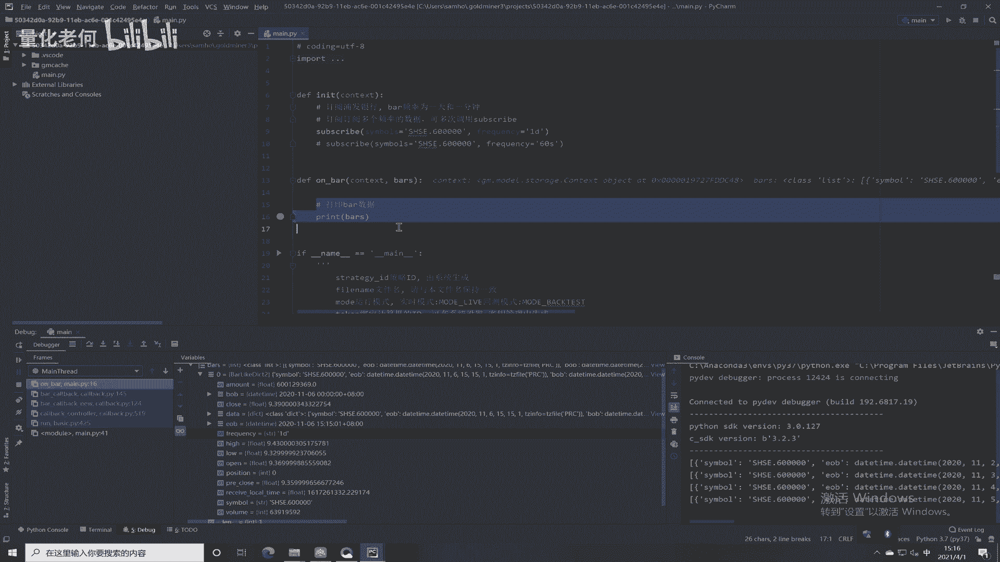

---

## 时间序列与事件驱动结合模式 🔄

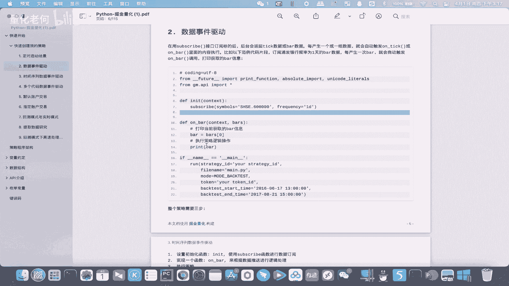

在简单的事件驱动模式中，`on_bar` 函数每次只能获取到最新的一根K线。然而，许多技术指标（如移动平均线MA）的计算需要一定数量的历史K线数据。

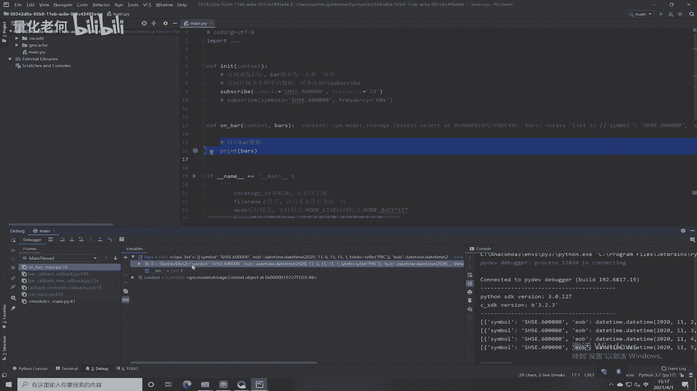

为了解决这个问题，掘金平台提供了“时间序列”驱动模式。它允许你在订阅数据时预先获取一定长度的历史K线，用于指标的初始化计算。

以下实例演示了如何订阅浦发银行的60秒K线，并同时获取最近100根K线：

**核心代码结构如下：**

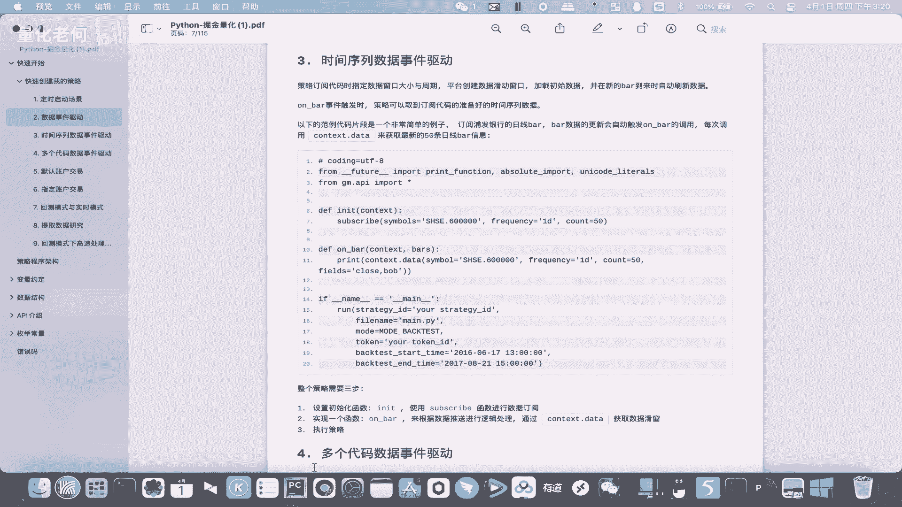

```python
def initialize(context):
    # 订阅时指定获取历史K线的数量 (count=100)
    subscribe(symbols='600000.SH', frequency='60s', count=100)

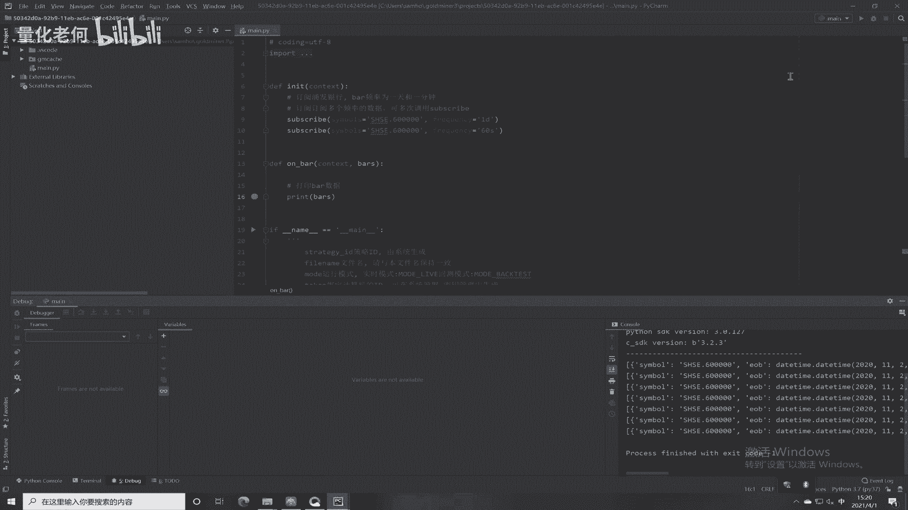

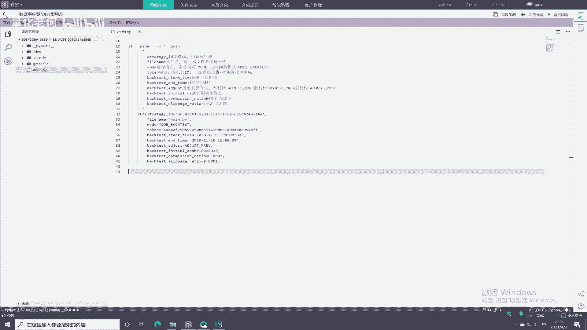

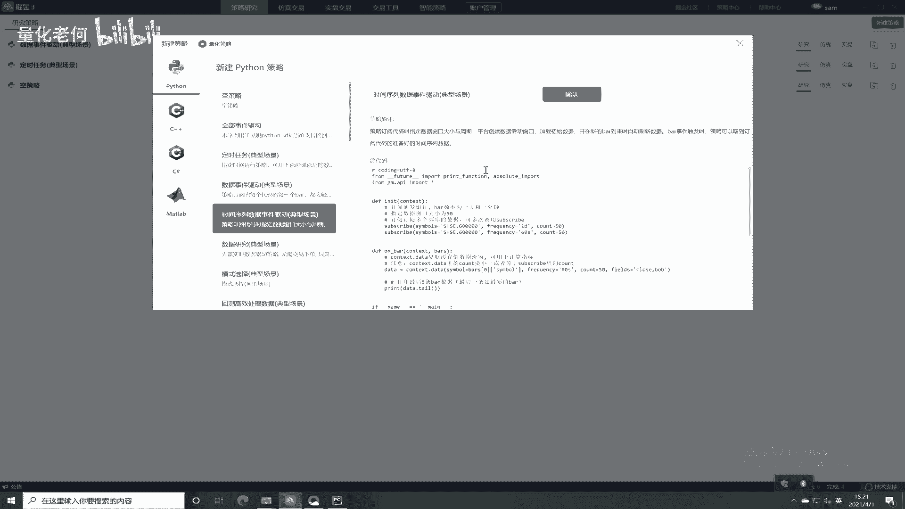

def on_bar(context, bars):
    # bars 仍然是最新的一根K线
    latest_bar = bars[0]
    # 通过 context.data 获取订阅合约的完整历史数据序列
    all_history_data = context.data(symbol=latest_bar.symbol, frequency=latest_bar.frequency)
    # all_history_data 是一个包含最近100根K线的序列
    print(f“最新K线时间：{latest_bar.bob}， 历史数据长度：{len(all_history_data)}”)
```

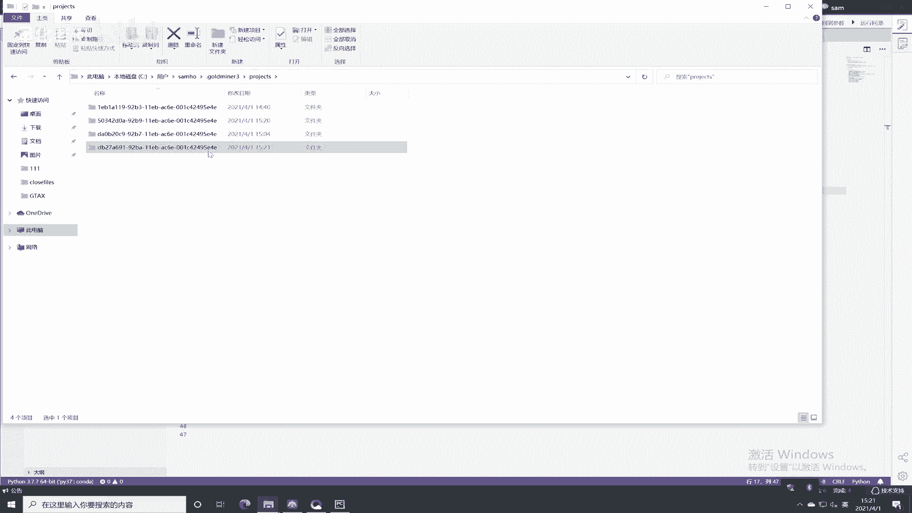

**策略运行流程解析：**

1.  在 `subscribe` 函数中，除了指定标的和频率，还增加了 `count=100` 参数。这表示平台会为策略准备最近100根K线。
2.  在 `on_bar` 回调函数中，`bars` 参数依然只包含最新触发的那一根K线。
3.  通过 `context.data()` 方法，并传入当前K线的标的和频率信息，可以获取到一个包含指定数量历史K线的序列 `all_history_data`。
4.  这样，你既拥有了最新的市场事件驱动，也拥有了计算指标所需的历史时间序列数据。例如，你可以用 `all_history_data.close` 来计算60周期的移动平均线。

**重要提示**：通过 `context.data()` 获取的数据长度不能超过 `subscribe` 时 `count` 参数设定的值。两者需要保持一致以确保能获取到预期的历史数据量。

---

## 总结 🎯

本节课我们一起学习了掘金量化平台的三种核心策略驱动模式：

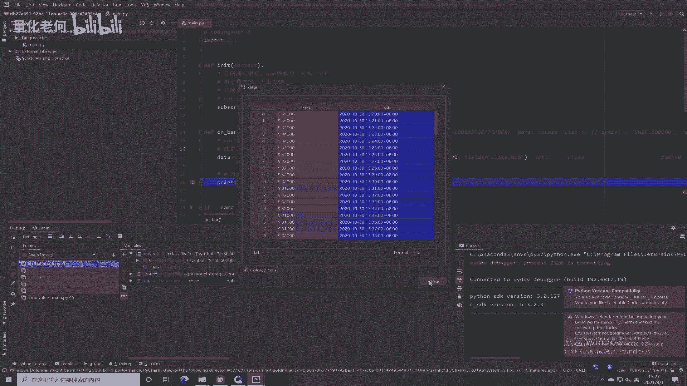

1.  **定时驱动模式**：通过 `schedule` 函数在固定时间执行任务，适用于规律性的操作。
2.  **事件驱动模式**：通过 `subscribe` 和 `on_bar`（或 `on_tick`）函数响应市场行情事件，是实时策略的基础。
3.  **时间序列驱动模式**：在事件驱动的基础上，通过 `subscribe(…, count=N)` 和 `context.data()` 获取历史数据序列，用于技术指标的初始化与计算。

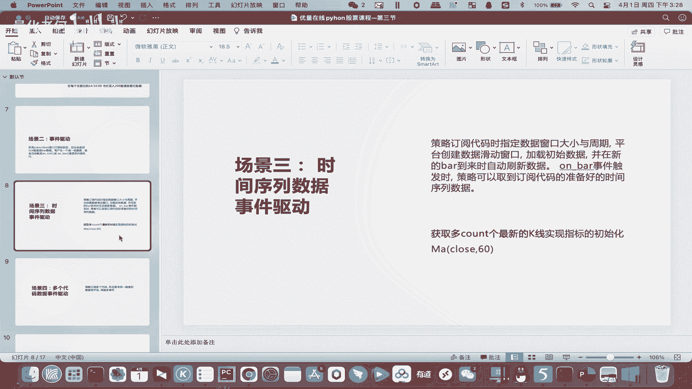

理解并熟练运用这些驱动模式，是构建各类量化交易策略的基石。请结合文档和代码实例多加练习，在后续课程中我们将应用这些知识编写更复杂的策略。