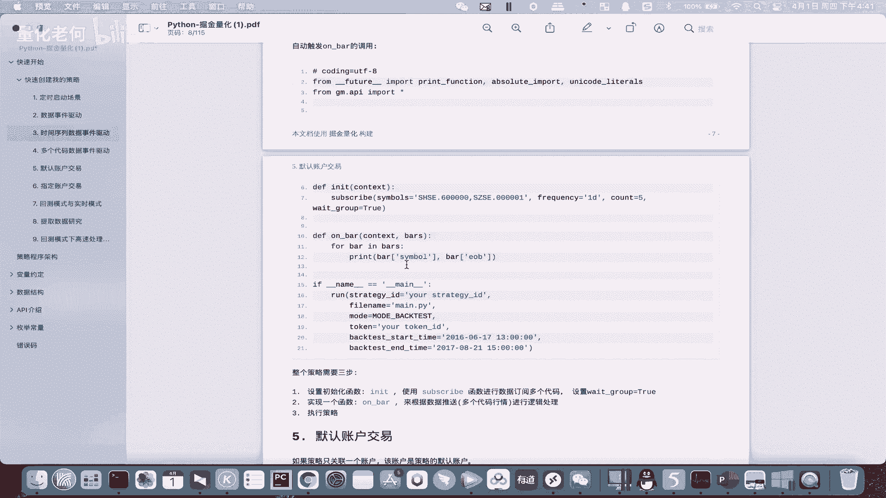
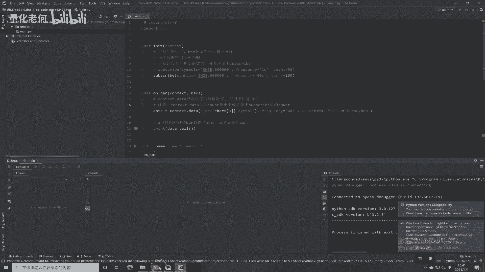
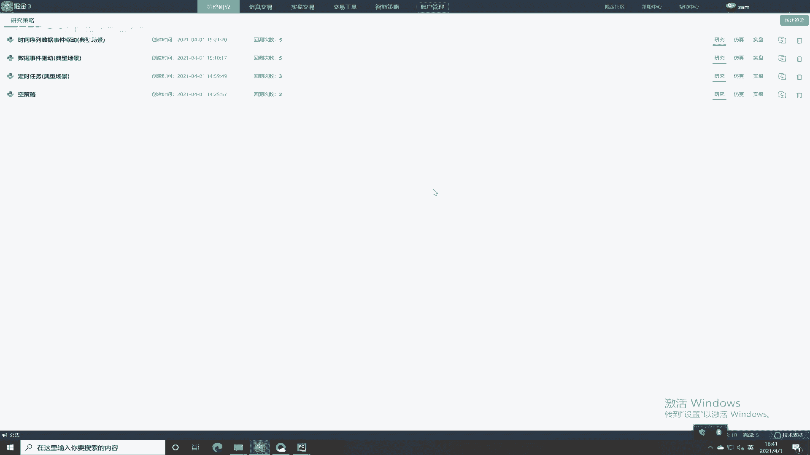
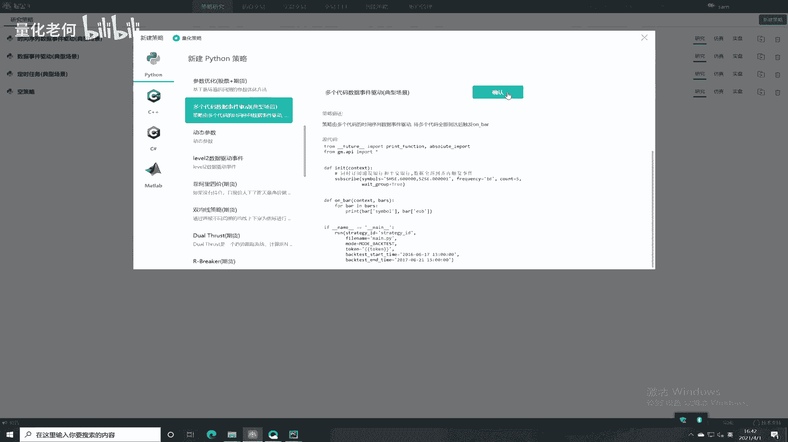
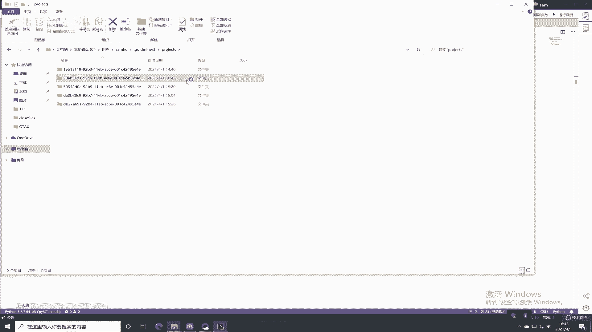
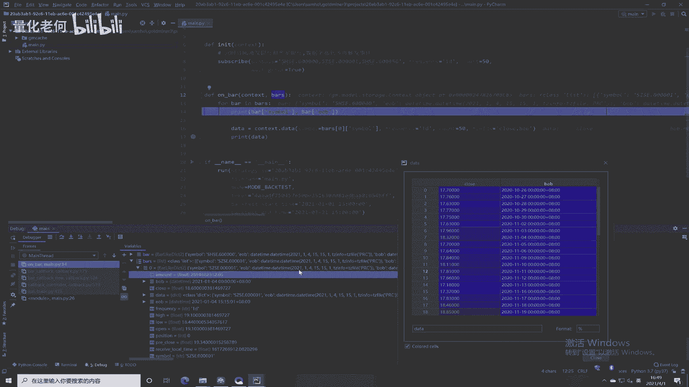
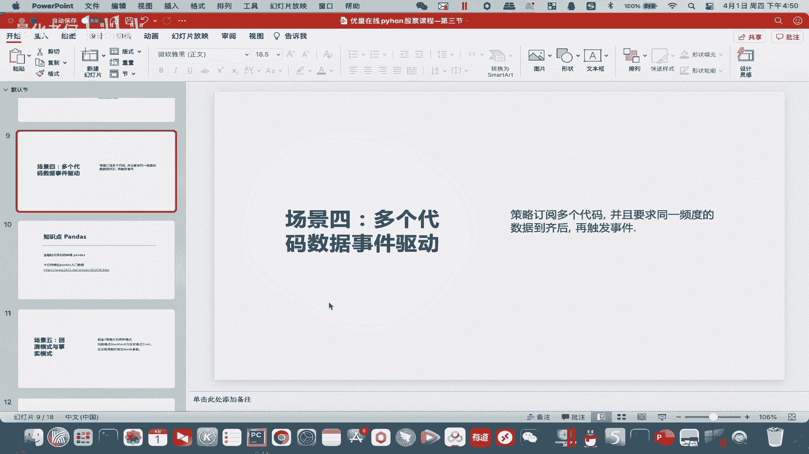
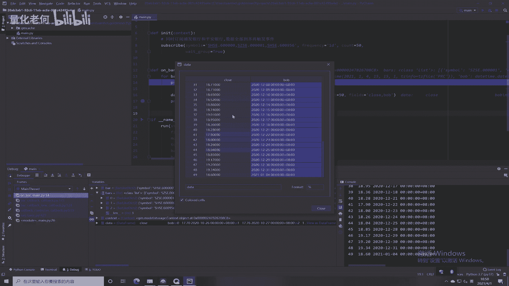
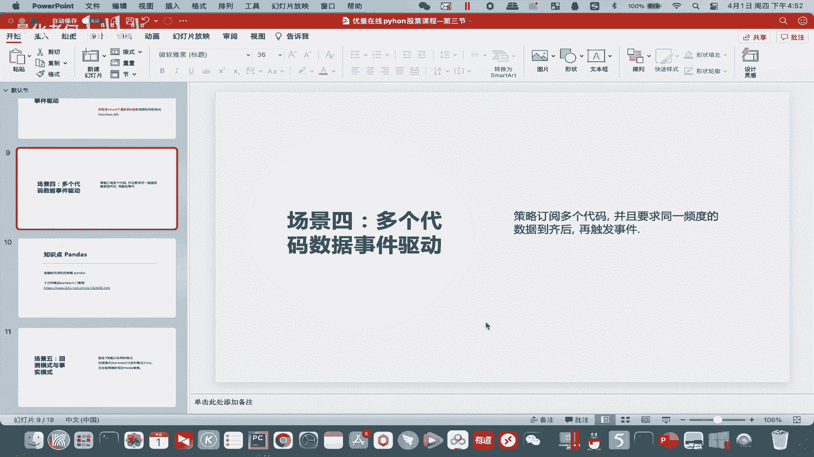

# Python股票实战课程：302b：多标的驱动模式 📈

在本节课中，我们将学习如何同时订阅多个股票代码，并实现数据到齐后统一触发策略执行的事件驱动模式。

上一节我们介绍了单标的的事件驱动，本节中我们来看看如何同时处理多个标的。

## 概述





多个代码数据事件驱动模式的核心是：同时订阅多个股票代码，并等待同一频度（例如日线）的数据全部到齐后，再触发策略逻辑。这通过设置参数 `wait_group=True` 来实现。



## 代码实现与解析



以下是实现多标的驱动模式的核心代码结构：

```python
# 订阅多个股票代码，用逗号分隔
subscribe(symbols='SH600000, SZ000001', frequency='1d', count=5, wait_group=True)

def on_bar(context, bars):
    # bars 是一个列表，包含了所有订阅标的的当前K线数据
    for bar in bars:
        # 对每个标的进行处理
        print(bar.symbol, bar.close)
```



### 关键参数说明

*   **`symbols`**: 用于指定订阅的股票代码列表，多个代码用英文逗号分隔。
*   **`wait_group=True`**: 这是实现“等齐触发”的关键参数。设置为 `True` 后，策略会等待所有订阅标的的当前周期K线数据都到达后，才一次性触发 `on_bar` 函数。

## 实战演示与观察

我们进入代码环境进行实际操作。


首先创建一个新的策略文件，模式选择“多个代码数据事件驱动”。


在策略初始化部分，我们订阅“浦发银行（SH600000）”和“平安银行（SZ000001）”的日线数据，并设置 `wait_group=True`。


设置断点并启动调试后，我们重点观察传入 `on_bar` 函数的 `bars` 变量。此时，`bars` 是一个列表，里面包含了我们所订阅的两个标的的K线数据对象。


如果我们增加订阅的标的数量，例如再添加“招商银行（SH600036）”，那么在一次触发中，`bars` 列表里就会包含三个对象。它们的K线日期和周期是完全一致的。

通过这种方式，我们可以同时监控和处理多个股票。

## 获取与查看历史数据



若要获取这些标的的历史数据进行计算，可以使用以下代码：

```python
# 获取某个标的的历史数据
hist_data = context.data(symbol=bar.symbol, frequency='1d', count=50, fields='close')
```



执行后，`hist_data` 会以一种表格形式的数据结构返回。这里用到了一个非常重要的数据分析库——Pandas。

## 知识延伸：Pandas 库



我们在查看历史数据时看到的表格形式数据，正是 Pandas 库的 `DataFrame` 对象。


Pandas 是专门用于金融时间序列数据分析的强大工具，在量化领域应用极其广泛。

以下是关于学习 Pandas 的建议：
*   作为本课的闯关题，请完整学习 Pandas 的基础入门教程。
*   教程资料可在预习课内容中找到，讲解通俗易懂。
*   动手将教程中的代码示例敲一遍，是掌握它的最佳方式，预计耗时约十分钟。
*   掌握 Pandas 的数据处理、筛选和可视化（绘图）功能，对我们后续的策略开发至关重要。

## 本节总结

本节课中我们一起学习了多标的驱动模式。
1.  我们掌握了如何使用 `subscribe` 函数同时订阅多个股票代码。
2.  我们理解了 `wait_group=True` 参数的作用是等待所有订阅标的的数据到齐后统一触发。
3.  我们知道了在 `on_bar` 函数中，`bars` 参数是一个包含所有标的当前数据的列表，需要通过循环进行逐个处理。
4.  我们介绍了获取历史数据的方法，并引出了后续必须掌握的 Pandas 数据分析库。

## 课后闯关题



1.  **多标的数据处理**：同时订阅五只不同的股票，在 `on_bar` 函数中使用 `for` 循环遍历 `bars`，并打印出每只股票的代码和收盘价。
2.  **Pandas 基础学习**：请根据提供的资料，完整学习 Pandas 入门教程，并亲手实践所有代码示例。