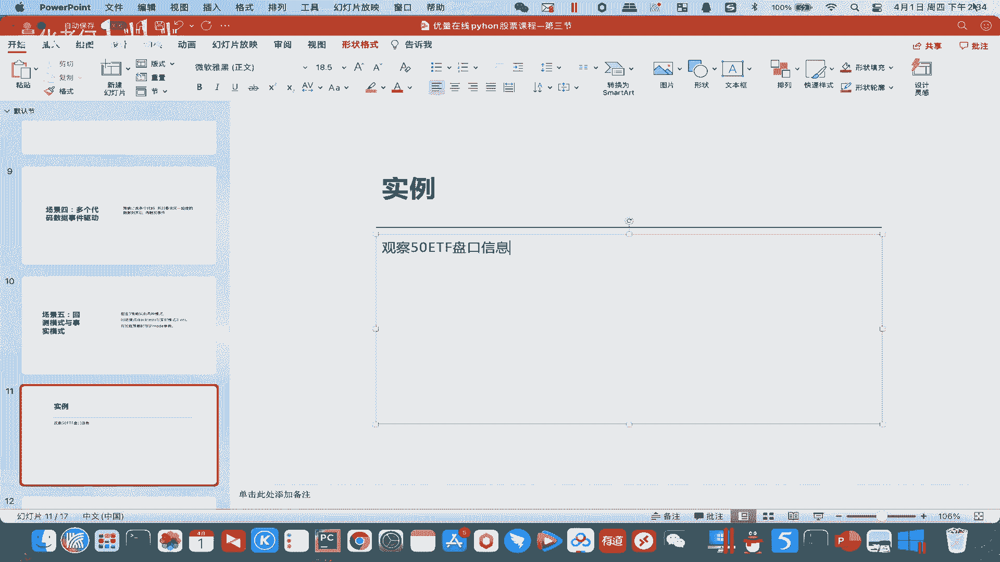
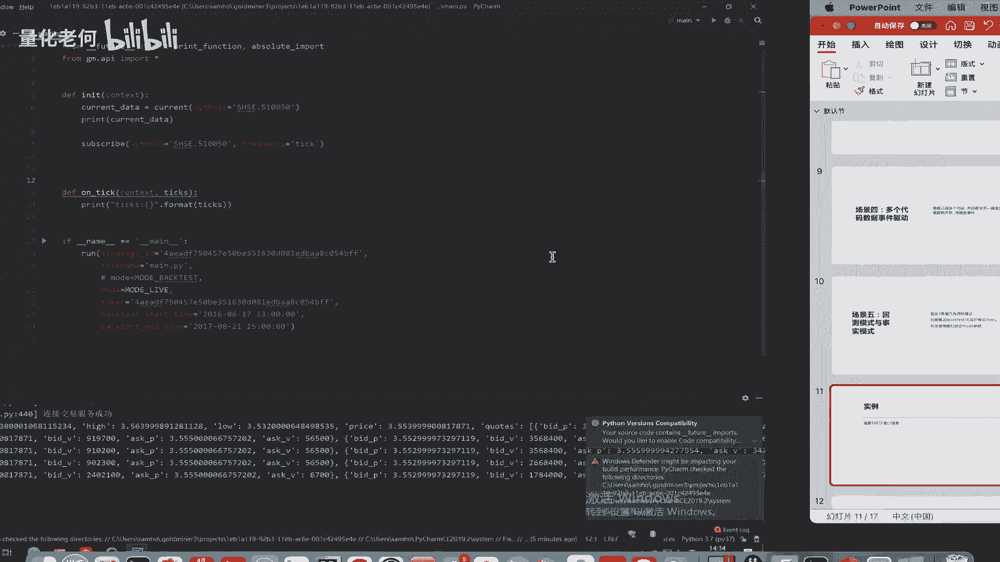
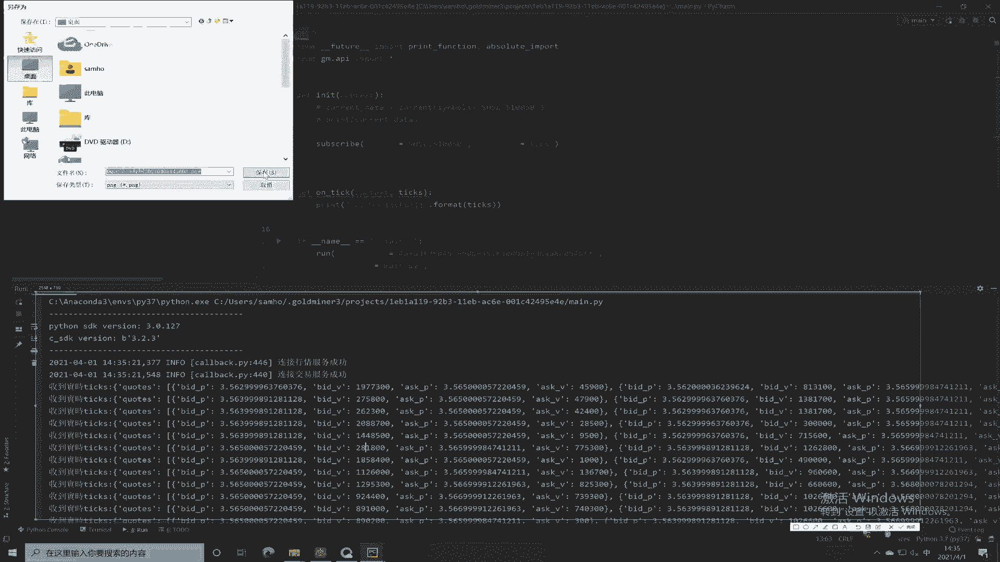
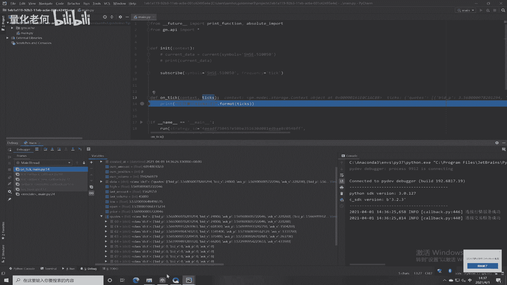
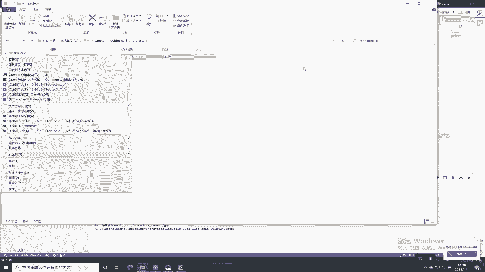
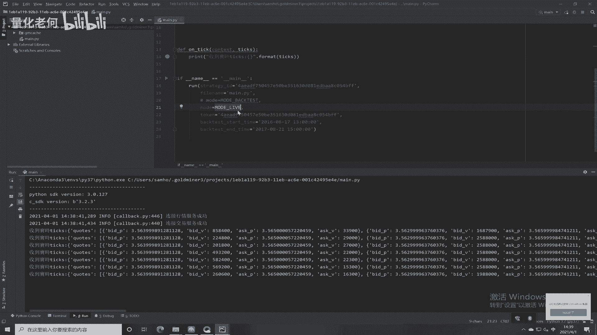
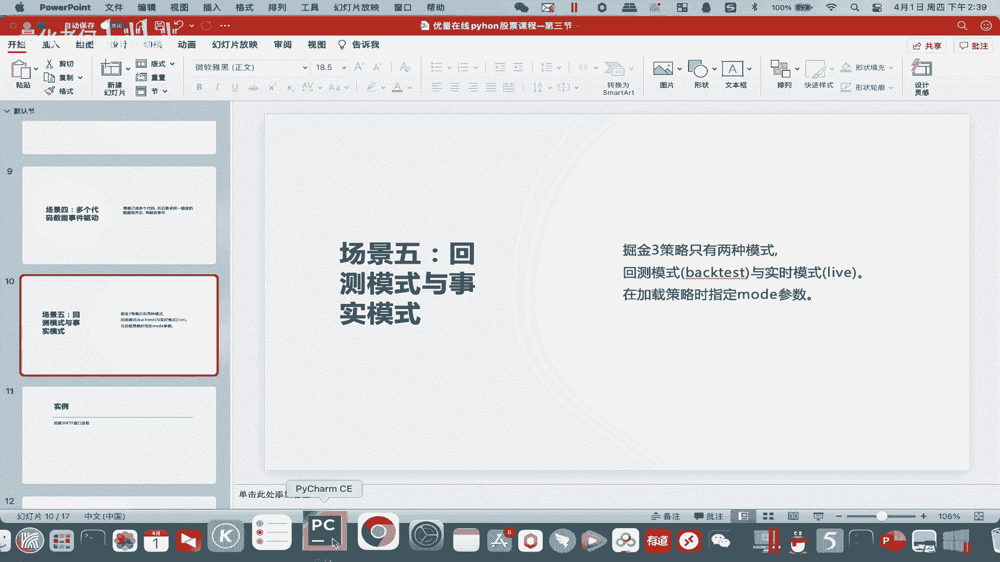

# Python股票实战课程：302c：实时模式讲解

在本节课中，我们将学习掘金量化平台中两种核心的运行模式：回测模式与实盘模式。我们将重点讲解实盘模式（`mode: live`）的作用、使用方法，并通过一个观察50ETF基金实时盘口信息的实例，演示如何接收和处理实时行情数据。

## 模式区分与作用

上一节我们介绍了量化策略的基本框架，本节中我们来看看策略运行的两种不同模式。在掘金平台中，加载策略时可通过`mode`参数进行区分。

以下是两种模式的关键参数：
*   **回测模式**：`mode: backtest`。此模式用于在历史数据上测试和优化策略，是策略开发阶段最常用的工具。
*   **实盘模式**：`mode: live`。此模式用于连接真实市场，接收并处理实时行情数据，是策略实盘运行和调试的关键。

## 实盘模式实例讲解

接下来，我们通过一个具体实例来深入理解实盘模式。本实例的目标是在开盘时间，实时观察“50ETF”基金的盘口信息。



首先，我们回到策略代码。核心代码如下所示：



```python
# 订阅510050（50ETF）的tick级别数据
subscribe(symbols='SHSE.510050', frequency='tick')
# 设置为实盘运行模式
mode: live

def on_tick(tick):
    # 收到实时tick数据
    print(tick)
```

代码说明：
1.  使用`subscribe`函数订阅了代码为`SHSE.510050`的证券的`tick`频率数据。这意味着市场每产生一笔新的tick数据，平台就会推送过来。
2.  将运行模式`mode`设置为`live`，即实盘模式。
3.  定义了`on_tick`回调函数。每当接收到新的tick数据时，此函数就会被触发，我们将接收到的tick对象打印出来。

在开盘时间运行此策略，控制台会持续打印出最新的tick数据流。




为了查看tick数据的具体内容，我们可以使用调试模式。在代码行设置断点并启动调试，可以清晰地看到`tick`对象内部的结构。



tick对象包含了丰富的实时信息，例如：
*   `bid_p` (买一价)
*   `bid_v` (买一量)
*   `ask_p` (卖一价)
*   `ask_v` (卖一量)
*   最新价、成交量等。

通过这个实例，我们可以清晰地看到，使用`live`模式能够让我们获取并观察市场上最新的盘口与行情数据。

## 运行与调试要点


需要注意的是，若直接在编辑器中运行回测（`mode: backtest`），此策略将不会有任何输出，因为回测模式处理的是历史数据快照，而非持续的实时流。

若要进行实盘模式的运行与调试，请遵循以下步骤：
1.  在项目文件管理器中，找到策略文件。
2.  右键点击文件。
3.  选择“使用Python打开”。
4.  选择配置好的Python 3.7（或更高版本）环境来执行。




此操作将启动策略的实盘运行，你便能在控制台看到实时的tick信息。这种方法在策略实盘调试阶段非常便捷高效。

## 模式应用场景总结

本节课中我们一起学习了掘金平台的两种运行模式。

*   **回测模式（`backtest`）**：主要用于策略的历史数据验证、绩效分析和参数优化，是策略研发的基础。
*   **实盘模式（`live`）**：主要用于策略的实时运行、监控和调试。通过在实盘模式下运行策略，可以实时接收市场数据，验证策略逻辑在真实环境中的反应，正如我们实例中观察盘口信息一样。




掌握`live`模式的使用，对于将策略从回测环境平稳过渡到实盘交易至关重要。

## 课后练习

在最终的实践环节，会有一道相关题目：请在开盘时间，运用类似的代码，获取“贵州茅台”股票的实时盘口信息。




虽然代码量不大，但亲手实现这个策略对于理解如何在实盘中获取关键市场信息非常有帮助。请各位同学务必自行练习。