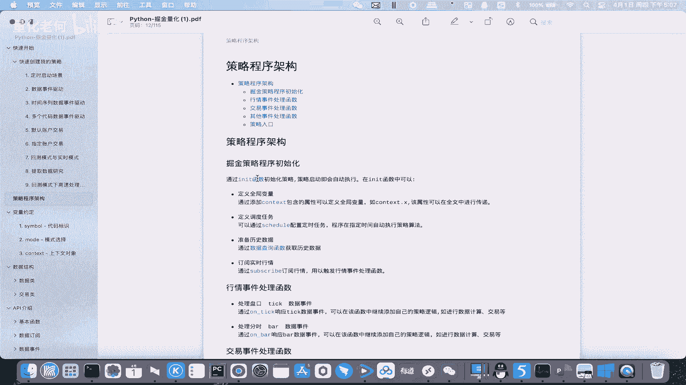
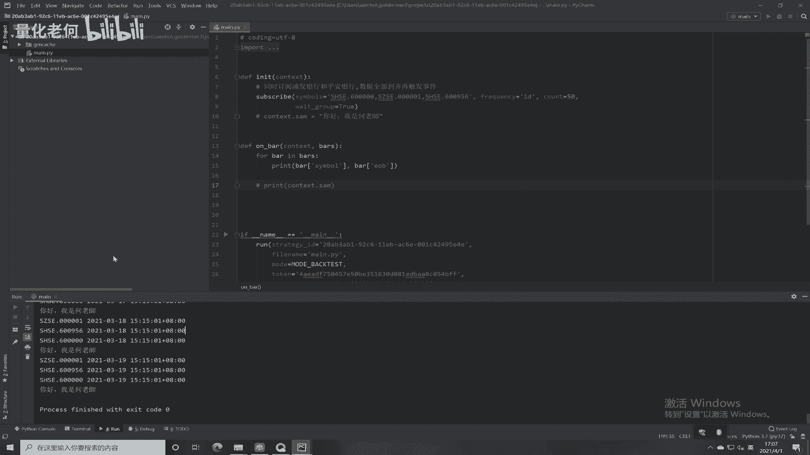
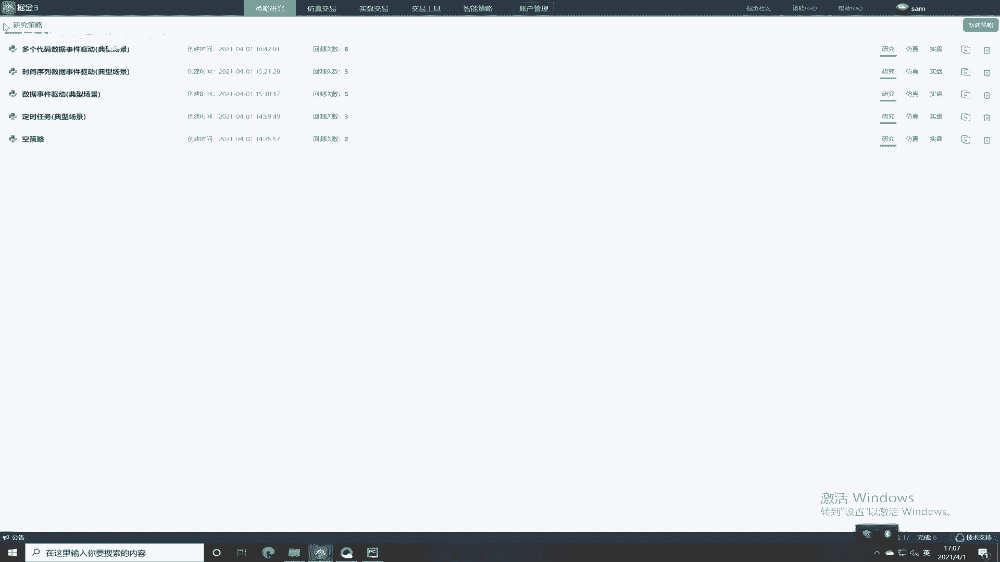
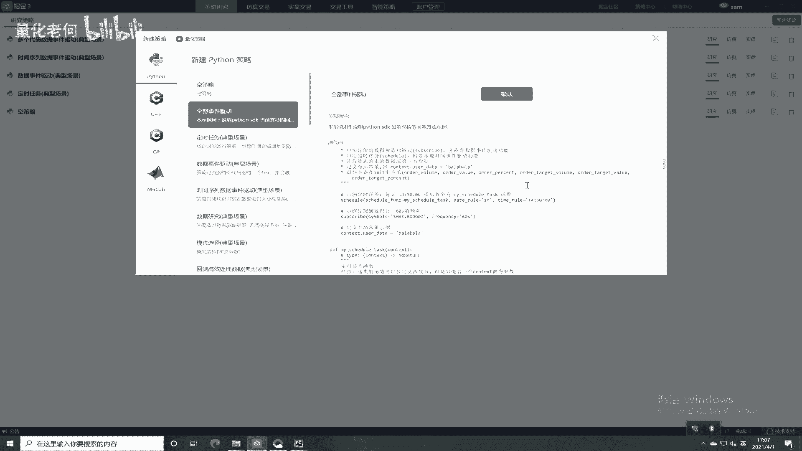
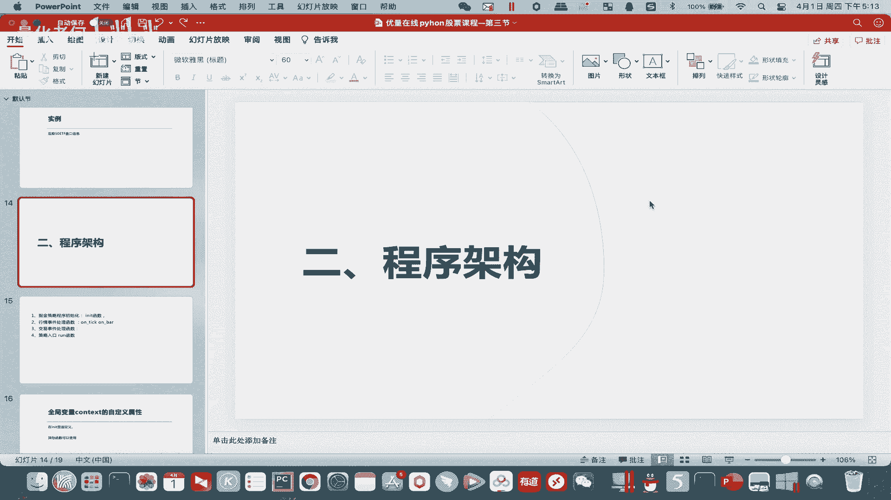
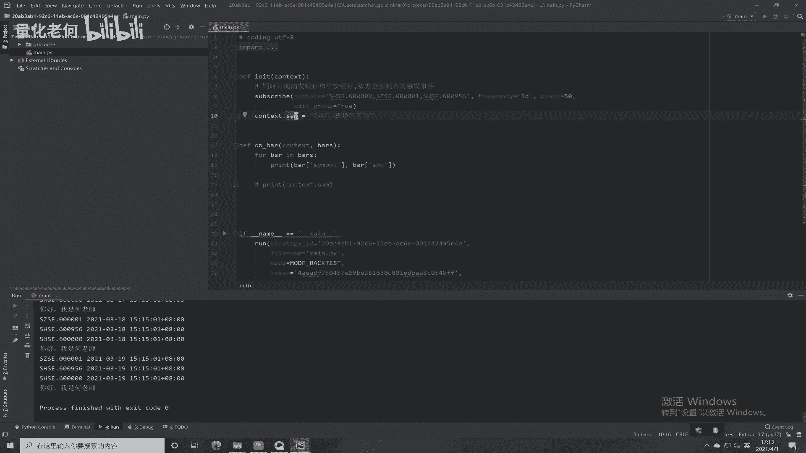
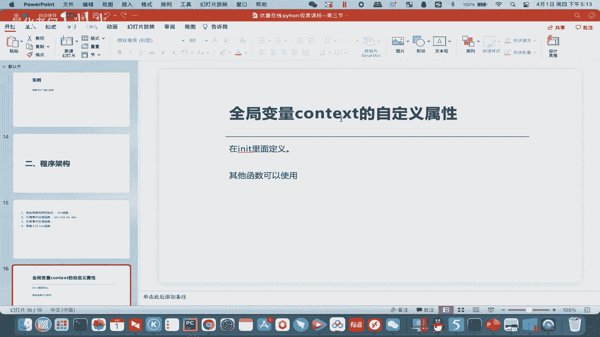
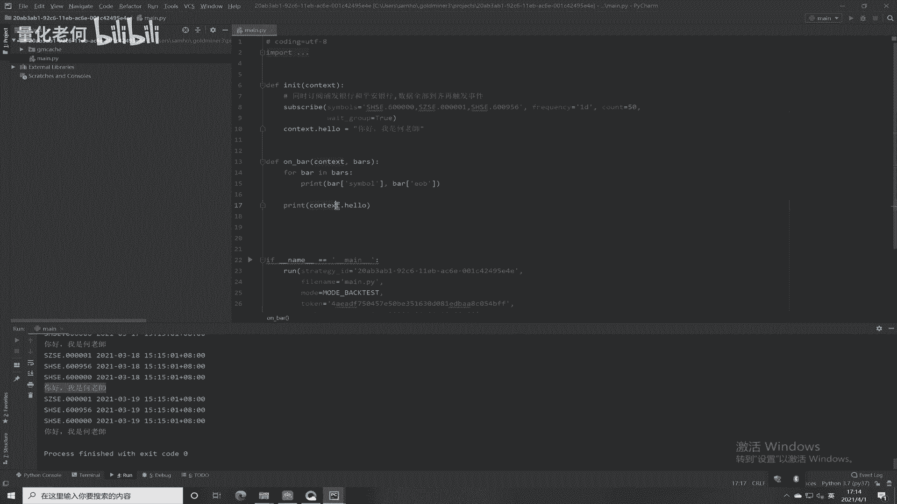
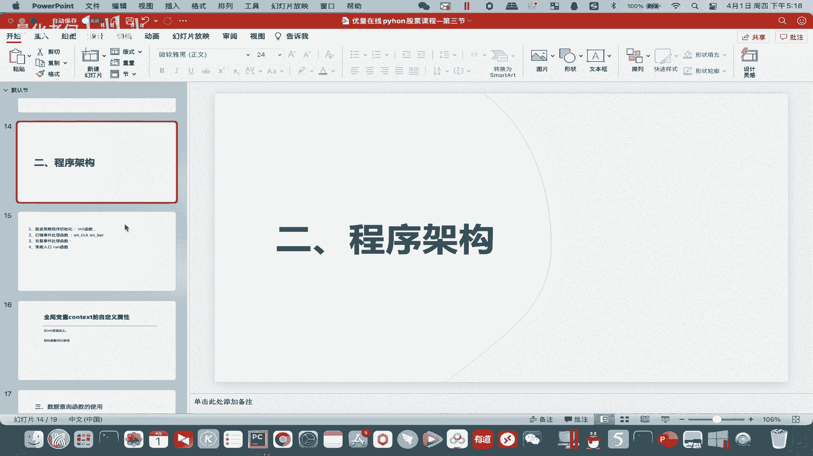

# Python股票实战课程：303：策略程序架构入门 🏗️

在本节课中，我们将学习量化策略程序的基本架构。我们将了解一个策略程序由哪些核心部分组成，每个部分的功能是什么，并通过一个简单的实例来理解全局变量的使用。

## 概述

一个完整的量化策略程序通常包含几个固定的部分：初始化函数、行情事件处理函数、交易事件处理函数以及其他辅助函数。理解这个架构是编写策略的基础。

## 程序核心架构





上一节我们介绍了量化编程的基本概念，本节中我们来看看一个策略程序的具体构成。





### 1. 初始化函数 (`init`)

程序启动时会自动执行 `init` 函数。它主要用于设置策略的初始状态和配置。

以下是 `init` 函数中常见的操作：

*   **定义全局变量 (`context`)**：用于在不同函数之间传递和共享数据。
*   **配置定时任务 (`schedule`)**：设置策略在特定时间点自动执行某些操作。
*   **订阅行情事件 (`subscribe`)**：指定策略需要监听哪些市场数据（如逐笔成交`tick`或K线`bar`）。
*   **准备历史数据**：在策略开始时加载所需的历史数据进行分析（下个小节会详细讲解）。

**代码示例：`init` 函数框架**
```python
def init(context):
    # 定义全局变量
    context.hello = “你好，我是老师”
    # 配置定时任务
    schedule(schedule_func, run_time=‘9:30’)
    # 订阅行情
    subscribe(symbols=“SHSE.000001”, frequency=‘60s’)
```

### 2. 行情事件处理函数

当订阅的行情事件发生时，会自动触发对应的处理函数。

*   **`on_tick` 函数**：当收到逐笔成交（tick）数据时被调用。函数参数 `tick` 包含了该笔成交的详细信息。
*   **`on_bar` 函数**：当收到一根新的K线（bar）数据时被调用。函数参数 `bar` 包含了该K线的开盘价、最高价、最低价、收盘价等信息。

**核心概念**：你订阅了什么类型的数据（`tick` 或 `bar`），就会触发对应的函数（`on_tick` 或 `on_bar`）。

### 3. 交易事件处理函数

当我们发出交易指令后，需要监控订单的执行状态，这些函数用于处理交易相关的反馈。

*   **`on_order_status` 函数**：当订单状态更新时触发（如已提交、部分成交、全部成交、已撤销等）。用于追踪订单执行情况，决定是否需要追单或撤单。
*   **`on_account_status` 函数**：当交易账户状态变化时触发（如连接、断开）。用于监控账户的可用性。

### 4. 其他辅助函数

*   **`on_error` 函数**：当底层SDK或系统发生错误时触发，用于接收错误信息并进行处理。
*   **`run` 函数**：策略的主入口函数。它是整个Python脚本运行的起点。

**代码示例：`run` 函数框架**
```python
if __name__ == ‘__main__’:
    # 策略ID
    strategy_id = ‘your_strategy_id’
    # 文件名
    filename = ‘main.py’
    # 运行模式：实时（real_time）或回测（backtest）
    mode = MODE_BACKTEST
    # 令牌
    token = ‘your_token_here’
    # 回测配置
    backtest_config={
        ‘start_time’: ‘2023-01-01 09:00:00’,
        ‘end_time’: ‘2023-12-31 15:00:00’,
        ‘initial_cash’: 1000000,
        ‘transaction_ratio’: 0.0003, # 手续费
        ‘slippage_ratio’: 0.0001, # 滑点
    }
    run(strategy_id, filename, mode, token, backtest_config=backtest_config)
```
在 `run` 函数中，可以设置策略ID、运行模式（回测/实盘）、回测时间、初始资金、手续费和滑点等参数。



## 实践：全局变量 `context` 的使用



了解了架构之后，我们通过一个小实验来理解全局变量 `context` 的用途。它的主要作用是在所有函数之间无障碍地传递数据。



**任务**：在 `init` 函数中定义一个 `context` 属性，并在 `on_bar` 函数中打印它。

以下是实现步骤：



1.  在 `init` 函数中，为 `context` 对象添加一个自定义属性并赋值。
2.  在 `on_bar` 函数中，访问并打印这个属性的值。

**代码示例：使用 `context`**
```python
def init(context):
    # 在初始化函数中定义全局变量
    context.greeting = “你好，我是老师”
    print(“init函数中打印:”, context.greeting)
    # 订阅一个K线数据以便触发on_bar
    subscribe(symbols=“SHSE.000001”, frequency=‘1d’)

def on_bar(context, bar):
    # 在行情处理函数中访问全局变量
    print(“on_bar函数中打印:”, context.greeting)
```
运行策略后，无论是在 `init` 还是 `on_bar` 函数中，都能成功访问到 `context.greeting` 的值，这证明了 `context` 的全局性。

**闯关题**：请在 `init` 函数中定义一个 `context.start_time` 变量，用于存放策略的启动时间，并在每次触发 `on_bar` 函数时将其打印出来。

## 学习方法总结

本节课我们一起学习了量化策略程序的基本架构。要掌握这些内容，关键在于：

1.  **学会查阅官方文档**：文档中有每个函数的详细说明、参数列表和使用示例，是自主学习最重要的工具。
2.  **研究平台提供的实例**：在掘金等量化平台找到官方示例策略，仔细阅读代码，理解每一段的功能，这是快速上手的最佳途径。
3.  **理解架构，而非死记硬背**：今天介绍的是核心框架概念。后续课程中，我们将通过编写具体的交易策略，来深入讲解每个部分应该如何灵活运用。

记住，文档中还有大量未提及的细节，例如 `context` 对象除了自定义属性，还有许多平台提供的固有属性（如 `context.now` 当前时间）。学会自己查阅文档，才能获得持续进步的能力。



本节课关于策略程序架构的入门讲解到此结束。