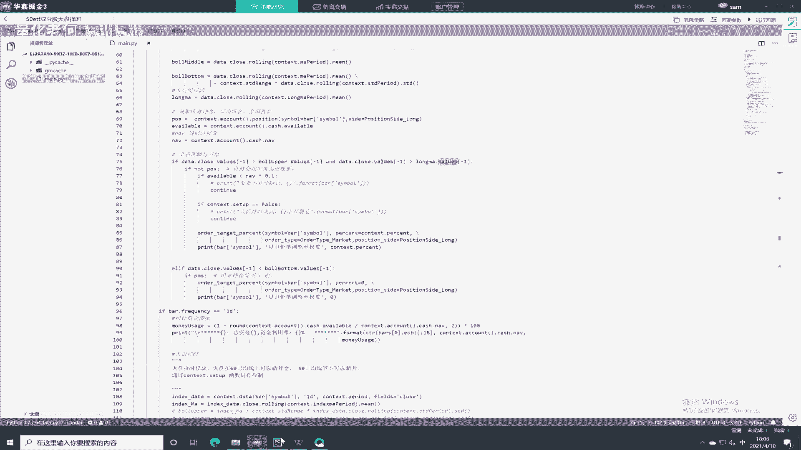
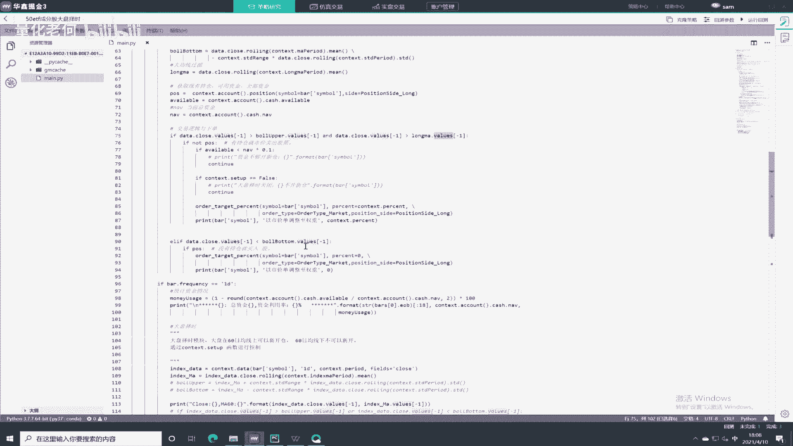
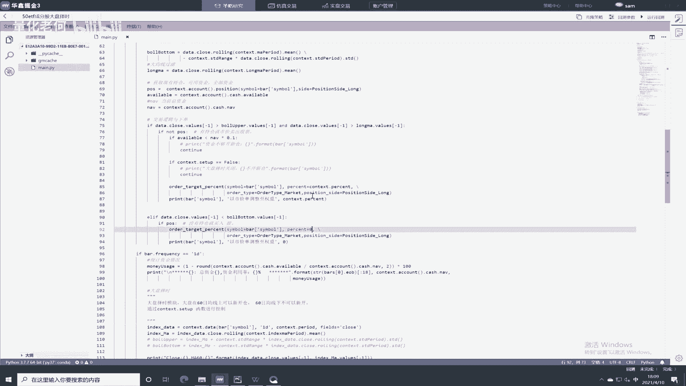
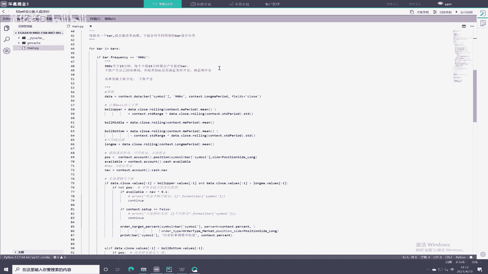

# Python股票实战课程：P1：50ETF布林带择时策略案例解析 📈


在本节课中，我们将学习一个结合个股布林带交易系统与大盘择时的实战策略案例。我们将详细解析策略的构建逻辑、代码实现，并理解如何将两者有效联动。

## 概述


本节课我们将深入分析一个针对50ETF成分股的量化交易策略。该策略的核心在于，为50只个股分别构建布林带交易系统，并引入大盘指数（50ETF）的均线进行择时过滤。我们将学习如何获取成分股数据、实现交易逻辑，并解决个股交易信号与大盘择时条件的联动问题。


## 策略逻辑与参数初始化

上一节我们介绍了策略的基本框架，本节中我们来看看具体的参数设置与初始化部分。

首先，策略初始化设置了一些关键参数。策略使用了布林带指标，其参数包括周期、标准差倍数等，公式通常表示为：
`中轨 = N周期简单移动平均(收盘价)`
`上轨 = 中轨 + K * N周期收盘价的标准差`
`下轨 = 中轨 - K * N周期收盘价的标准差`

此外，还使用了一根长期均线作为方向性过滤。大盘择时则使用了指数的60日均线。下单方式改为按资金比例下单，而非固定手数。同时，设置了一个择时开关，用于控制是否启用大盘过滤条件。

以下是初始化部分的关键代码结构：
```python
# 示例参数初始化
bollinger_period = 20  # 布林带周期
bollinger_std = 2      # 标准差倍数
long_ma_period = 60    # 长期均线周期
index_ma_period = 60   # 大盘均线周期
order_percent = 0.1    # 下单资金比例
enable_timing = True   # 择时开关
```

## 数据订阅与获取

初始化完成后，我们需要获取交易数据。策略需要同时订阅50只个股的15分钟K线数据以及大盘指数的日线数据。

以下是数据获取与处理的关键步骤：
1.  通过特定函数（如 `get_container`）获取50ETF（代码如000050）对应的所有成分股列表。
2.  订阅这50只个股的15分钟（900秒）K线数据。
3.  同时订阅大盘指数（000050）的日线（1天）K线数据。
4.  在回调函数中，通过判断数据周期来区分接收到的是个股数据还是大盘数据，以便进行不同的逻辑处理。

## 个股交易逻辑实现



获取到数据后，我们来构建个股的交易逻辑。该逻辑基于布林带和长期均线。




策略的个股开平仓逻辑可以概括为：
*   **开多仓条件**：当个股同时满足以下两个条件时，使用一定比例的资金开仓。
    1.  收盘价上穿布林带上轨。
    2.  收盘价位于长期均线之上。
*   **平多仓条件**：当个股收盘价下穿布林带下轨时，平掉该个股的仓位。


在代码中，会先计算每个个股的布林带指标和长期均线，然后检查当前持仓和可用资金，最后根据上述条件执行下单或平仓操作。

## 大盘择时逻辑联动

仅有个股信号还不够，我们需要用大盘趋势来过滤交易时机，以提升策略稳定性。



大盘择时逻辑相对简单：
*   计算大盘指数（50ETF）的60日简单移动平均线。
*   **择时开启**：当大盘指数位于其60日均线**之上**时，允许执行个股的开仓逻辑。
*   **择时关闭**：当大盘指数位于其60日均线**之下**时，禁止开立新的多头仓位。**注意**：此条件仅阻止新开仓，并不强制平掉已有仓位，已有仓位仍按个股的布林带下轨规则平仓。


在代码中，通过一个布尔变量（如 `setup_sell`）来控制这个开关。在个股开仓前，会检查此开关状态，若为关闭状态则跳过开仓。

## 策略总结与闯关挑战

本节课我们一起学习了如何构建一个结合个股技术指标与大盘择时的复合型交易策略。该策略为50ETF的每只成分股配置布林带交易系统，并利用大盘指数的均线进行趋势过滤，从而在个股机会与整体市场环境之间取得平衡。



为了加深理解并实践，以下是本节课的作业：

**必做题（1-3题）**：
1.  在模拟环境中成功运行本策略，理解数据流和信号生成过程。
2.  尝试调整布林带参数（周期、标准差）或长期均线周期，观察策略表现的变化。
3.  尝试调整大盘择时均线的周期（例如改为30日或120日均线），分析不同周期过滤效果的影响。

**挑战题（第4题）**：
4.  尝试在现有策略中加入成交量的因素。你可以发挥创意，例如：
    *   要求个股开仓时“量价齐升”。
    *   使用成交量指标（如均量线）对行情进行过滤。
    *   将成交量因素加入大盘择时逻辑中。
    *   （注意：本题目有难度，旨在挑战和拓展思维，初学者可先专注于理解原有策略。）


希望你能通过这个案例，掌握多标的、多周期策略的基本构建方法，并为后续更复杂的策略设计打下基础。