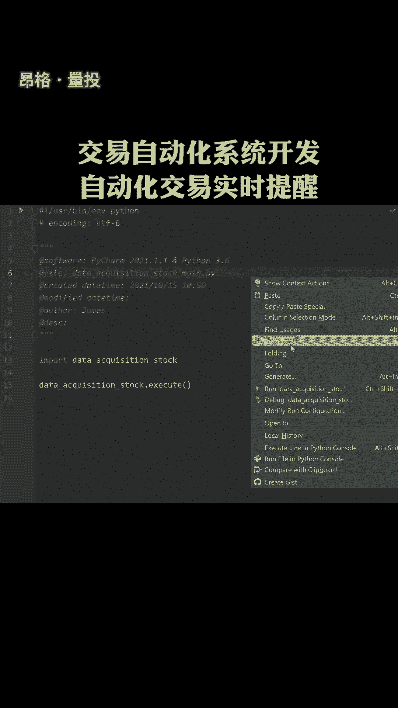
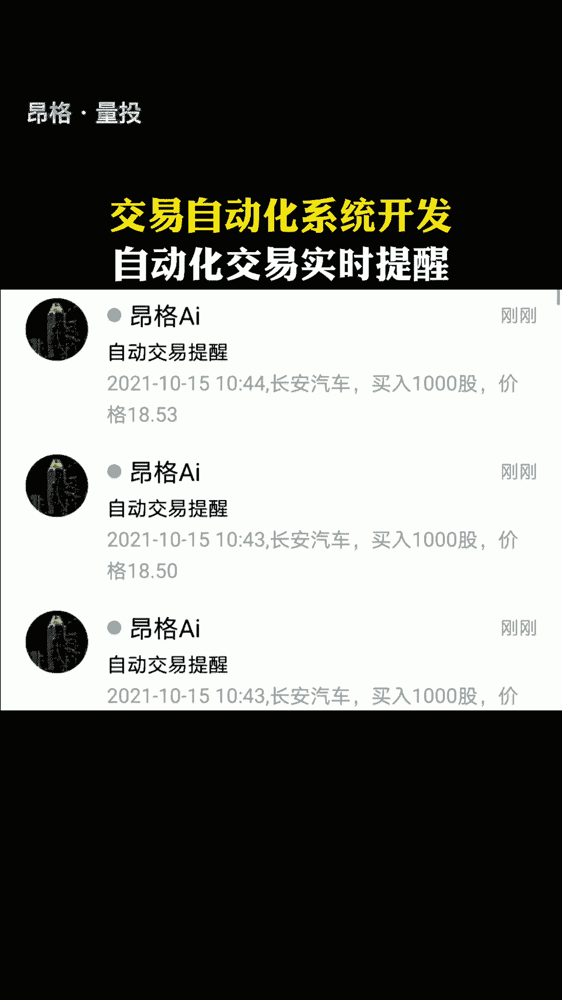

# Python自动化交易系统开发：P1：项目概述与环境搭建

在本节课中，我们将学习如何开始构建一个Python自动化交易系统。该系统将能够实时监控市场数据，并在满足特定条件时自动发送交易提醒。我们将从项目整体介绍和基础环境搭建入手。

## 项目概述

上一节我们明确了学习目标，本节中我们来具体了解项目的核心功能与架构。

这个自动化交易系统旨在实现以下核心功能：
*   实时获取金融市场数据。
*   根据预设的交易策略分析数据。
*   当策略条件被触发时，自动通过指定渠道（如邮件、短信）发送提醒。

其工作流程可以概括为以下步骤：
1.  **数据获取**：从数据源（如交易所API、金融数据平台）拉取实时或近实时的行情数据。
2.  **策略分析**：使用Python对获取的数据进行计算和分析，判断是否满足入场、出场或其他条件。
3.  **触发提醒**：当策略条件满足时，系统自动调用通知接口，发送提醒信息。

## 开发环境搭建



一个稳定的开发环境是项目成功的基础。接下来，我们将一步步搭建所需的Python环境。

以下是搭建开发环境的具体步骤：

1.  **安装Python**：确保你的计算机上安装了Python 3.7或更高版本。你可以从[Python官网](https://www.python.org/)下载并安装。
2.  **创建虚拟环境**：使用虚拟环境可以隔离项目依赖，避免包版本冲突。在项目目录下打开终端，运行：
    ```bash
    python -m venv venv
    ```
3.  **激活虚拟环境**：
    *   **Windows**: `venv\Scripts\activate`
    *   **macOS/Linux**: `source venv/bin/activate`
4.  **安装必要库**：激活虚拟环境后，安装本项目初期将用到的核心库。
    ```bash
    pip install pandas numpy matplotlib
    ```
    *   `pandas`：用于高效处理和分析金融时间序列数据。
    *   `numpy`：提供强大的多维数组对象和数学函数。
    *   `matplotlib`：用于绘制价格走势图、指标线等可视化图表。

## 初始代码结构



环境准备就绪后，我们可以开始创建项目的初始文件结构，这有助于保持代码的组织性和可维护性。

建议创建如下所示的目录与文件：
```
automated_trading_system/
├── config/          # 存放配置文件（如API密钥、参数设置）
├── data/            # 存放本地数据或缓存
├── strategies/      # 存放不同的交易策略模块
├── utils/           # 存放工具函数（如数据获取、通知发送）
├── main.py          # 系统主入口文件
└── requirements.txt # 项目依赖包列表
```
你可以在 `main.py` 中写入一段简单的代码来测试环境是否正常工作，例如：
```python
import pandas as pd
import numpy as np

print("环境测试成功！")
print(f"Pandas版本: {pd.__version__}")
# 后续我们将在这里集成数据获取和策略逻辑
```

本节课中我们一起学习了自动化交易系统的基本概念、核心工作流程，并成功搭建了Python开发环境，创建了项目的基础结构。在下一节，我们将开始学习如何获取实时的金融市场数据。