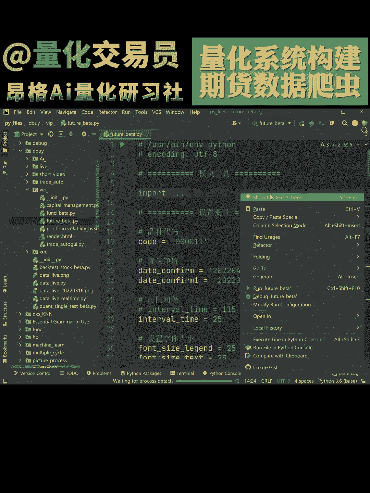
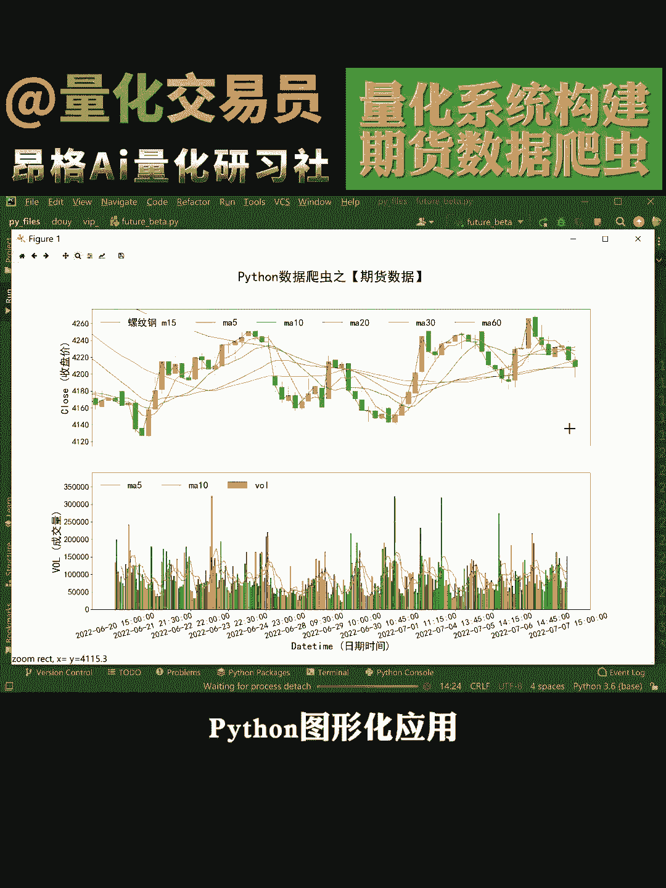

# Python自动化交易系统开发：P1：期货分钟级数据实时采集-分析-图形化应用

## 概述

在本节课中，我们将学习如何构建一个基础的Python自动化交易系统。该系统专注于期货市场，能够实现分钟级数据的实时采集、初步分析以及结果的可视化。我们将从搭建开发环境开始，逐步完成数据获取、数据处理和图形化展示的核心模块。

---

## 开发环境搭建 🛠️

上一节我们介绍了本课程的目标，本节中我们来看看如何搭建必要的开发环境。一个稳定且功能齐全的环境是项目成功的第一步。

以下是搭建环境所需的步骤：

1.  **安装Python**：确保你的计算机上安装了Python 3.7或更高版本。你可以从Python官网下载。
2.  **安装集成开发环境**：推荐使用PyCharm或Visual Studio Code，它们能极大提升编码效率。
3.  **安装关键Python库**：我们将使用几个核心库。打开终端或命令提示符，执行以下命令进行安装：
    ```bash
    pip install pandas numpy matplotlib requests
    ```
    *   `pandas` 用于数据处理。
    *   `numpy` 提供数学计算支持。
    *   `matplotlib` 用于绘制图表。
    *   `requests` 用于从网络API获取数据。

---

## 数据采集模块 📡

环境准备就绪后，我们进入核心环节：数据采集。本模块负责从指定的数据源获取期货的分钟级行情数据。

以下是实现数据采集的关键步骤：

1.  **选择数据源**：你可以使用免费的金融数据API（如某些券商提供的接口）或模拟数据。本教程以概念演示为主。
2.  **构建API请求函数**：使用`requests`库向数据源发送HTTP请求。一个基本的请求函数结构如下：
    ```python
    import requests
    import pandas as pd

    def fetch_minute_data(symbol, minutes=10):
        # 此处应替换为真实的数据API地址和参数
        url = f"https://api.example.com/market/data?symbol={symbol}&interval=1m&limit={minutes}"
        response = requests.get(url)
        if response.status_code == 200:
            data = response.json()
            # 将JSON数据转换为pandas DataFrame
            df = pd.DataFrame(data['candles'])
            return df
        else:
            print("数据请求失败")
            return None
    ```
3.  **处理响应数据**：将API返回的JSON格式数据解析并转换为`pandas DataFrame`，以便后续分析。



---

## 数据分析模块 🔍

获取到原始数据后，我们需要对其进行分析以提取有价值的信息。数据分析模块将对采集到的分钟级数据进行简单计算。

上一节我们完成了数据采集，本节中我们来看看如何进行基础分析。我们将计算两个常用的技术指标。

以下是本模块实现的分析功能：

1.  **计算简单移动平均线**：移动平均线用于平滑价格数据，识别趋势。我们计算一个5分钟周期的SMA。
    ```python
    def calculate_sma(data, window=5):
        # `data` 是包含价格‘close’列的DataFrame
        data['SMA_5'] = data['close'].rolling(window=window).mean()
        return data
    ```
2.  **计算价格波动率**：通过计算标准差来评估近期价格的波动情况。
    ```python
    def calculate_volatility(data, window=5):
        data['Volatility'] = data['close'].rolling(window=window).std()
        return data
    ```

---



## 图形化展示模块 📊

数据分析的结果需要通过直观的图表来呈现。图形化模块将价格和计算出的指标绘制在K线图或折线图上。

以下是创建图表的步骤：

1.  **准备绘图数据**：确保`DataFrame`中包含‘close’，‘SMA_5’等需要绘制的数据列。
2.  **使用Matplotlib绘图**：创建一个包含价格线和移动平均线的图表。
    ```python
    import matplotlib.pyplot as plt

    def plot_data(data):
        plt.figure(figsize=(12, 6))
        plt.plot(data['close'], label='Close Price', alpha=0.7)
        plt.plot(data['SMA_5'], label='5-min SMA', linestyle='--')
        plt.title('Futures Minute Data with SMA')
        plt.xlabel('Time Index')
        plt.ylabel('Price')
        plt.legend()
        plt.grid(True)
        plt.show()
    ```

---

## 总结

本节课中我们一起学习了构建一个Python自动化交易系统的基础框架。我们从搭建开发环境开始，逐步实现了**数据采集**、**数据分析**和**图形化展示**三个核心模块。你现在已经掌握了如何使用`requests`获取数据、用`pandas`和`numpy`处理分析数据，以及用`matplotlib`将结果可视化。这是迈向更复杂量化交易策略的第一步。