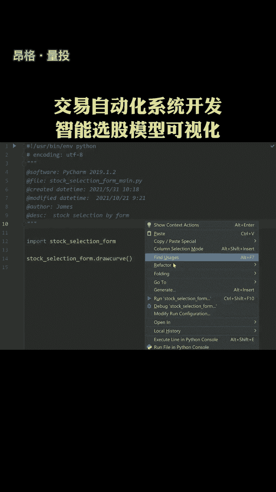
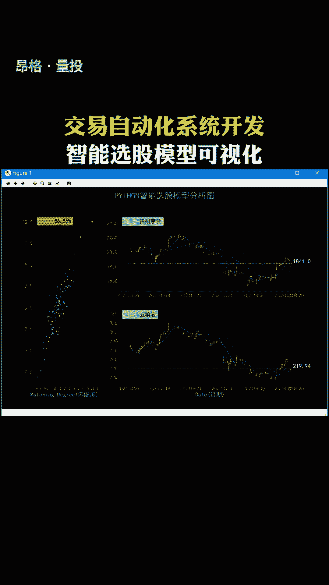

# Python自动化交易系统开发：P1：智能选股模型可视化分析 📈

在本节课中，我们将学习如何利用Python构建一个智能选股模型，并通过数据可视化技术对模型结果进行分析。我们将从获取金融数据开始，逐步实现一个简单的选股策略，并最终将分析结果以图表形式直观展示。

## 1. 环境准备与数据获取

首先，我们需要准备Python编程环境并获取用于分析的股票数据。以下是完成此步骤所需的工具和数据源。

### 所需工具与库
我们将使用以下几个核心Python库：
*   **pandas**: 用于数据处理和分析。
*   **numpy**: 用于数值计算。
*   **yfinance**: 一个用于从雅虎财经获取金融数据的库。
*   **matplotlib / seaborn / plotly**: 用于数据可视化。

### 获取股票数据
我们可以使用 `yfinance` 库轻松下载历史股价数据。以下代码演示了如何获取苹果公司（AAPL）的股票数据。

```python
import yfinance as yf

# 下载苹果公司过去一年的股票数据
ticker = 'AAPL'
data = yf.download(ticker, period='1y')
print(data.head())
```
这段代码会下载AAPL过去一年的每日开盘价、最高价、最低价、收盘价和成交量数据。

## 2. 构建简单的选股策略

上一节我们获取了原始数据，本节中我们来看看如何基于这些数据构建一个基础的选股策略。我们将实现一个基于移动平均线的策略。

### 计算技术指标
移动平均线是常用的技术分析工具。我们可以计算短期（如20日）和长期（如50日）的简单移动平均线。

```python
# 计算20日和50日简单移动平均线
data['MA20'] = data['Close'].rolling(window=20).mean()
data['MA50'] = data['Close'].rolling(window=50).mean()
```

### 定义交易信号
基于移动平均线，我们可以定义一个简单的交易规则：当短期均线上穿长期均线时，产生买入信号；反之，则产生卖出信号。

```python
# 生成交易信号
data['Signal'] = 0
data.loc[data['MA20'] > data['MA50'], 'Signal'] = 1  # 买入信号
data.loc[data['MA20'] < data['MA50'], 'Signal'] = -1 # 卖出信号
```



## 3. 策略回测与绩效分析

策略构建完成后，我们需要评估其历史表现。这个过程称为回测。以下是进行基础回测的步骤。

### 计算策略收益
首先，我们根据交易信号计算策略的每日收益率，并与单纯持有股票的收益率进行对比。

```python
# 计算策略每日收益率（假设在信号出现时以收盘价交易）
data['Strategy_Return'] = data['Signal'].shift(1) * data['Close'].pct_change()
# 计算股票本身的每日收益率
data['Stock_Return'] = data['Close'].pct_change()
```

### 评估绩效指标
我们可以计算几个关键指标来评估策略，例如累计收益、年化收益和夏普比率。

```python
# 计算累计收益
cumulative_strategy_return = (1 + data['Strategy_Return'].dropna()).cumprod()
cumulative_stock_return = (1 + data['Stock_Return'].dropna()).cumprod()
```

## 4. 结果可视化分析



数据可视化能帮助我们更直观地理解策略的运行逻辑和绩效。我们将创建几个关键图表。

### 绘制股价与移动平均线
这张图可以清晰地展示交易信号产生的时机。

```python
import matplotlib.pyplot as plt

plt.figure(figsize=(14, 7))
plt.plot(data['Close'], label='Close Price', alpha=0.5)
plt.plot(data['MA20'], label='20-Day MA')
plt.plot(data['MA50'], label='50-Day MA')
# 标记买入信号
plt.plot(data[data['Signal'] == 1].index, data['MA20'][data['Signal'] == 1], '^', markersize=10, color='g', label='Buy Signal')
# 标记卖出信号
plt.plot(data[data['Signal'] == -1].index, data['MA20'][data['Signal'] == -1], 'v', markersize=10, color='r', label='Sell Signal')
plt.title('Stock Price with Moving Averages and Trading Signals')
plt.legend()
plt.show()
```

### 绘制收益对比曲线
这张图对比了策略收益和基准（股票本身）收益的走势。

```python
plt.figure(figsize=(14, 7))
plt.plot(cumulative_strategy_return, label='Strategy Cumulative Return')
plt.plot(cumulative_stock_return, label='Stock Cumulative Return', alpha=0.7)
plt.title('Cumulative Returns: Strategy vs. Stock')
plt.legend()
plt.show()
```

## 总结

本节课中我们一起学习了Python自动化交易系统开发的第一步——智能选股模型的可视化分析。我们从获取金融数据开始，构建了一个基于双移动平均线的简单选股策略，并对其进行了回测和绩效评估。最后，我们利用matplotlib将股价走势、交易信号以及策略收益曲线可视化，使得分析过程与结果一目了然。这是构建更复杂量化交易系统的坚实基础。