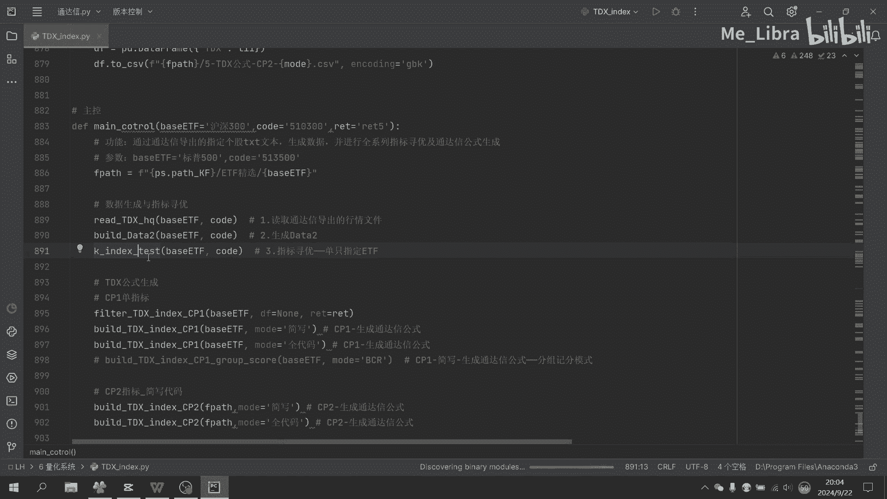
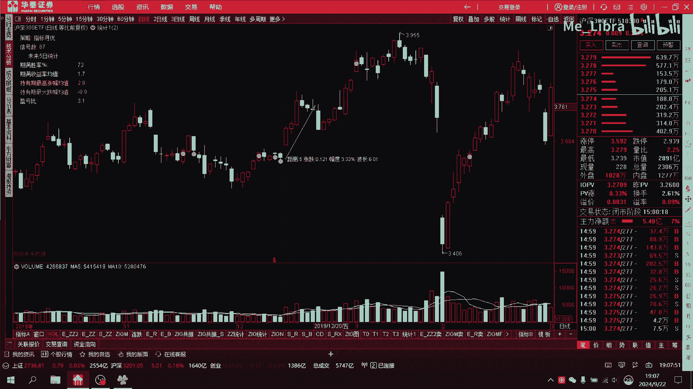

# Python自动指标寻优生成通达信公式：P1：概述与核心概念 🚀

在本节课中，我们将要学习如何利用Python程序化地构建和测试大量技术指标，从中自动寻找高胜率的指标组合，并最终将这些优势条件自动生成为通达信的指标公式。整个过程旨在将数据驱动的量化分析思路，转化为可直接在股票软件中使用的实用工具。

## 核心统计指标介绍 📊

上一节我们介绍了项目的整体目标，本节中我们来看看用于评估策略优劣的核心统计指标。这些指标是Python进行数据挖掘和筛选的依据。

以下是策略回测中需要计算的关键统计数据：

*   **信号数**：策略在整个行情历史中触发的买入信号总次数。理想的信号应数量充足且分布均匀，以满足交易频率和数据统计可靠性的要求。
*   **期满胜率**：在所有信号中，买入后持有固定时长（如5日）到期卖出，盈利交易次数所占的比例。公式为：`胜率 = 盈利交易次数 / 总交易次数`。这是评价策略优劣的首要指标。
*   **期满收益率均值**：所有信号对应交易在持有期满后，所获收益率的平均值。
*   **持有期最高涨幅均值**：在每个信号的持有期内，股价达到的最高点相对于买入价的涨幅，再对所有信号求平均值。它代表了上涨潜力的平均水平。
*   **持有期最大跌幅均值**：在每个信号的持有期内，股价出现的最极端亏损幅度，再对所有信号求平均值。它代表了下跌风险的平均水平。
*   **盈亏比**：上升空间与下跌空间的比值。这里我们采用 `盈亏比 = 持有期最高涨幅均值 / 持有期最大跌幅均值` 来计算。这是另一个非常重要的风险收益评估指标。

## 自动化寻优的必要性 🤖

在理解了评价标准后，我们面临一个现实问题：如何高效地找到符合这些高标准的指标组合？

对于不懂编程的投资者而言，这个过程异常艰难。他们需要手动编写和测试每一个指标及其组合，如同无头苍蝇般乱撞，效率极低且容易出错。许多人甚至不会编写通达信公式，导致投资决策只能依赖他人未经验证的建议。

更关键的是，经过广泛的Python回测验证，网络上和书籍中流传的许多经典形态策略，其历史胜率往往接近50%，与随机猜测无异。那些所谓的“成功案例”常常是经过精心筛选后展示的结果，而大量失败的案例被隐藏了。

因此，我们只相信全面的统计数据。借助Python强大的编程能力，我们可以自动化测试数以万计的指标及组合。例如，程序可以轻松完成10万组测试，这是人工十年都无法完成的工作量。基于这个想法，我们开发了本工具，旨在从海量可能性中，自动挖掘出真正具有统计优势的定制化策略。

## 从Python结果到通达信公式 🔄

上一节我们探讨了自动化寻优的价值，本节中我们来看看如何将Python的挖掘成果落地。

优势指标组合通过Python筛选出来后，下一个挑战是如何将其转化为通达信软件能够识别的公式。最初，这需要人工根据Python的输出结果，在通达信中手动编写复杂的指标公式，过程繁琐且易错。

为了提高效率，我们进一步开发了代码，使得Python在找到优势指标组合后，能够自动将其转换为完整的、可直接使用的通达信指标公式。现在，使用者只需将生成的公式代码粘贴到通达信中即可。之后，可以利用通达信内置的“交易系统评测”功能，直观地观察策略的信号点、胜率及盈亏比统计，实现完美对接。

## 重要注意事项与展望 ⚠️

在享受自动化便利的同时，我们必须清醒地认识到其局限性。

首先，**策略的定制化特性**：针对某一只特定ETF或个股挖掘出的策略，是高度适配其自身“股性”的。该策略在其他股票或ETF上未必有效，切勿盲目套用。

其次，**历史与未来的关系**：过去的优异统计数据并不绝对保证未来表现。然而，如果我们连经过严谨历史回测验证的策略都不相信，转而依赖毫无根据的主观猜测或道听途说，那与赌博并无区别，风险更高。

最后，**胜率与仓位管理**：高胜率是成功的一半，而合理的仓位管理（如定投、网格交易等）是另一半。即使一个策略胜率一般，通过优秀的资金管理策略，依然可能获得良好的整体收益。未来，我们将专门针对不同的资金管理策略进行程序化回测，寻找与高胜率信号结合的最佳仓位管理方案，从而实现更高确定性的投资体系。

## 总结 📝

本节课中我们一起学习了“Python自动指标寻优生成通达信公式”项目的全貌。我们从核心的统计评价指标（如胜率、盈亏比）出发，阐述了利用Python进行海量指标自动化测试与寻优的必要性，并展示了如何将寻优结果自动转换为通达信公式的完整流程。同时，我们也讨论了该方法的定制化特性、历史回测的意义，以及结合仓位管理的重要性。本工具的目标是帮助投资者建立基于数据验证的、属于自己的高胜率交易策略，摆脱对未经验证的传统方法的依赖。