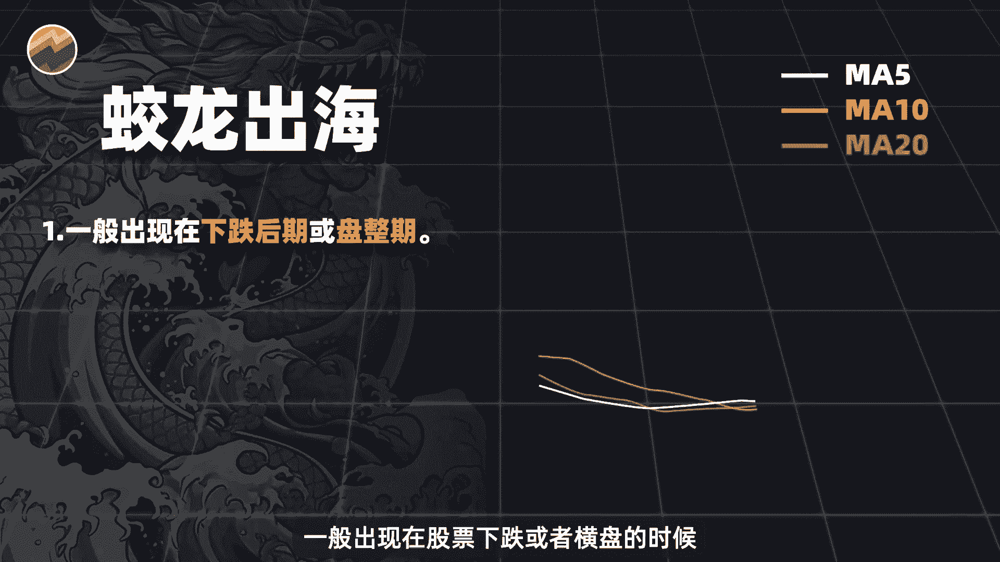
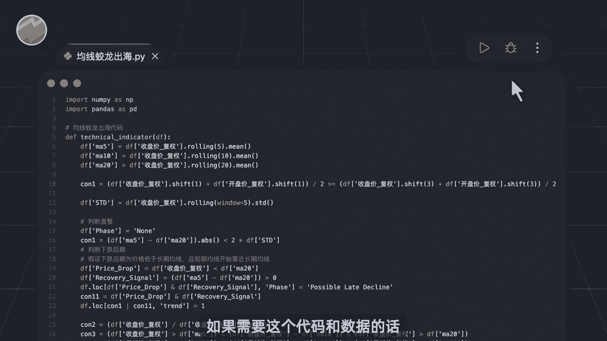
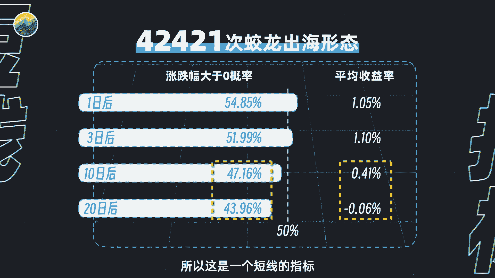
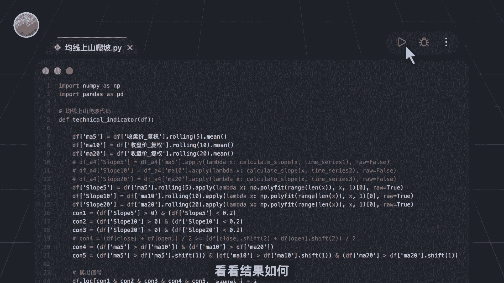
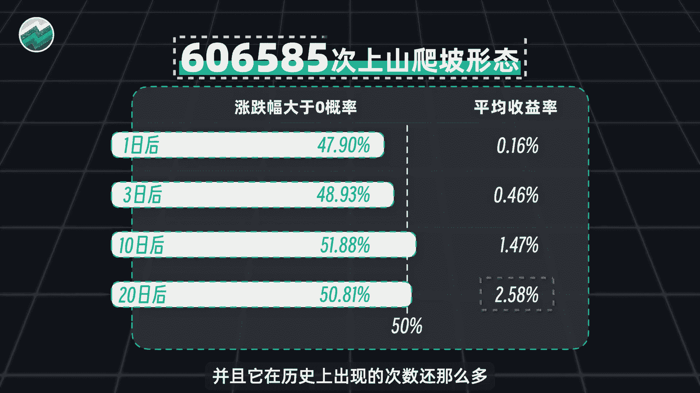
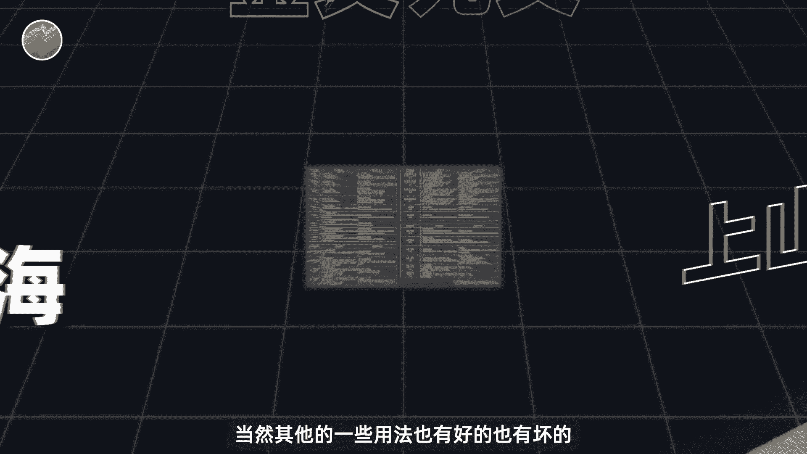
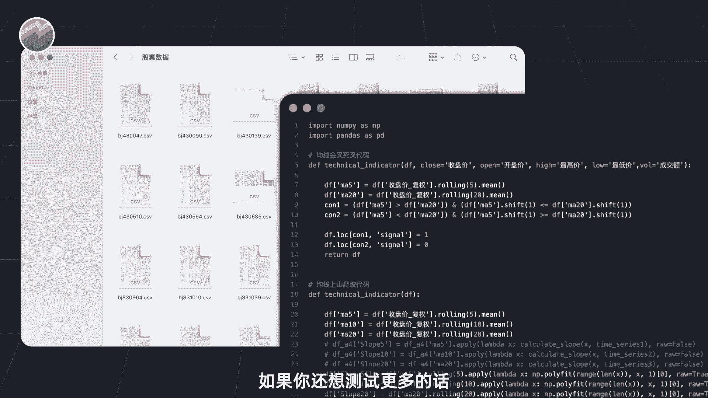
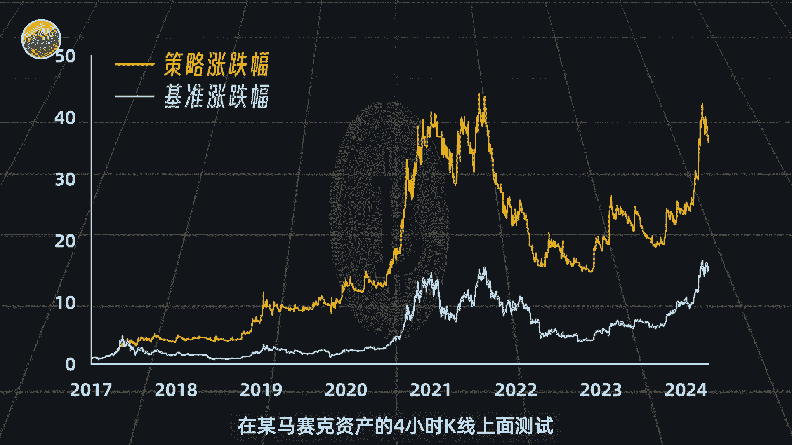

# Python量化交易：第1章：两种有效的均线形态实战解析 📈


在本节课中，我们将学习如何利用Python和A股历史数据，对两种经典的均线交易形态——“蛟龙出海”与“上山爬坡”进行量化回测。我们将分析它们的定义、量化方法、历史表现以及各自的适用场景。



## 概述

均线是技术分析中常用的工具，但并非所有用法都同样有效。本节课程将聚焦于从众多均线形态中筛选出的两种经过数据验证的有效形态，并通过具体的Python代码演示如何进行量化分析。

## 蛟龙出海形态解析


上一节我们概述了课程目标，本节中我们来看看第一种形态：“蛟龙出海”。该形态通常出现在股价下跌或横盘整理阶段。



其核心定义是：某日出现一根实体较大的阳线，这根K线从下方同时向上穿越5日、10日和20日移动平均线，并且其收盘价站稳在这三根均线之上。这被视为强烈的短期看涨信号。

以下是该形态的量化判断逻辑，可以用伪代码表示：



```python
# 假设 df 是包含`close`(收盘价), `ma5`, `ma10`, `ma20`列的DataFrame
# 判断“蛟龙出海”形态
condition = (
    (df[‘close’] > df[‘ma5’]) & # 收盘价在5日均线上
    (df[‘close’] > df[‘ma10’]) & # 收盘价在10日均线上
    (df[‘close’] > df[‘ma20’]) & # 收盘价在20日均线上
    (df[‘close’].shift(1) <= df[‘ma5’].shift(1)) & # 前一日收盘价在5日线下方或等于
    (df[‘close’] - df[‘open’] > threshold) # 当日为大阳线（实体涨幅超过阈值）
)
df[‘jiaolong_chuhai’] = condition # 标记形态出现日
```


## 蛟龙出海的历史回测表现


了解形态定义后，我们通过历史数据来检验其有效性。使用涵盖全部A股的历史数据运行编写好的Python回测程序，可以得到以下统计结果。

从2007年至今，“蛟龙出海”形态在A股市场共出现超过4万次。该形态出现后，股价在短期内（例如未来1-5天）上涨的概率均超过50%，平均收益率可达1%以上。然而，随着持有周期拉长至中长期，其平均收益率呈现衰减趋势。


因此，该形态更适合作为短期交易的参考信号，而非中长期持有的依据。



## 上山爬坡形态解析

在分析了适合短线的“蛟龙出海”后，我们再来看看另一种适合中长期趋势的形态：“上山爬坡”。该形态通常出现在明确的上涨趋势中。



其形态特征是：5日、10日、20日移动平均线按照从上到下（短期在上，长期在下）的多头排列方式，以较小的、稳定的坡度同步向上运行。一般认为，坡度越平缓、上升时间越持久，后续的上涨潜力可能越强。


以下是判断“上山爬坡”形态需关注的几个要点：

1.  **均线多头排列**：`ma5` > `ma10` > `ma20`。
2.  **坡度稳定**：各均线上升角度平缓，可通过计算均线序列的斜率或观察其走势的平滑度来衡量。
3.  **持续时间**：该排列状态需维持一定周期（例如连续N个交易日）。





## 上山爬坡的历史回测表现

同样，我们使用Python代码对“上山爬坡”形态进行量化回测，以评估其历史表现。

从2007年至今，该形态在A股市场出现了约61万次。形态出现后，股价短期（1-5天）内上涨的概率并未显著超过50%，短期平均收益率也较低。但随着时间的推移，其平均收益率呈现稳步上升的态势。在形态出现20个交易日后，平均收益率达到了2.58%。

对于一个简单的均线指标而言，这样的中长期收益表现是相当可观的，加之其出现频率很高，因此“上山爬坡”形态更适合用于识别和跟随中长期上涨趋势。

## 总结与心得

本节课中我们一起学习了两种经过数据验证的均线形态：“蛟龙出海”与“上山爬坡”。前者作为短期看涨信号，在出现后短期内胜率较高；后者则用于捕捉中长期上涨趋势，能带来更为显著的累积收益。



量化分析的核心在于“用数据说话”。虽然我们展示了有效的形态，但交易的世界远不止于此。一个重要的心得是：策略的有效性高度依赖于其应用的市场与环境。有时，将简单的策略（如均线金叉死叉）应用在参与者结构不同、竞争不那么激烈的市场（如某些其他资产类别或特定周期），可能会获得比在A股主流周期中更优异的表现。这提醒我们，科学投资需要不断测试、验证，并主动寻找更适合策略发挥的“牌局”。

> 最后，科学投资意味着依靠数据和系统的方法做决策，而非依赖主观感觉或模糊经验。