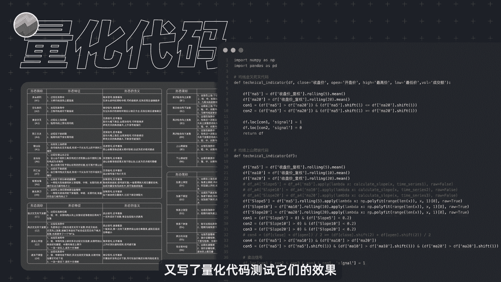
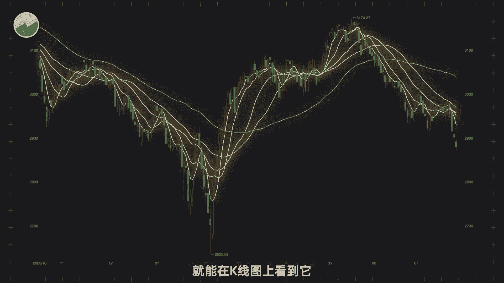
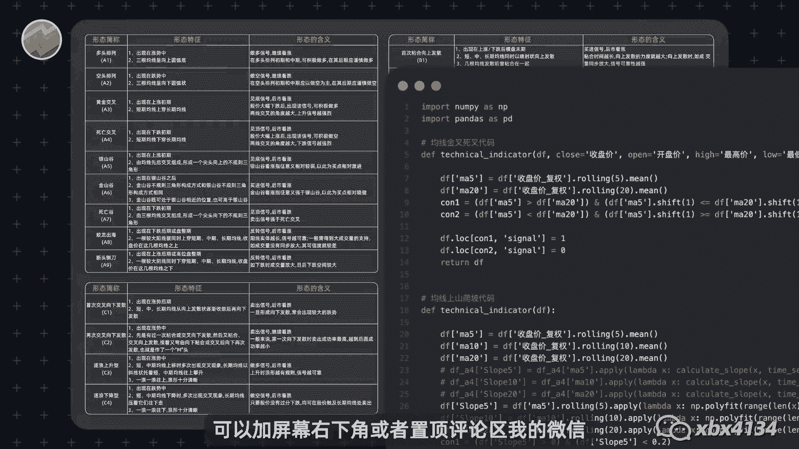
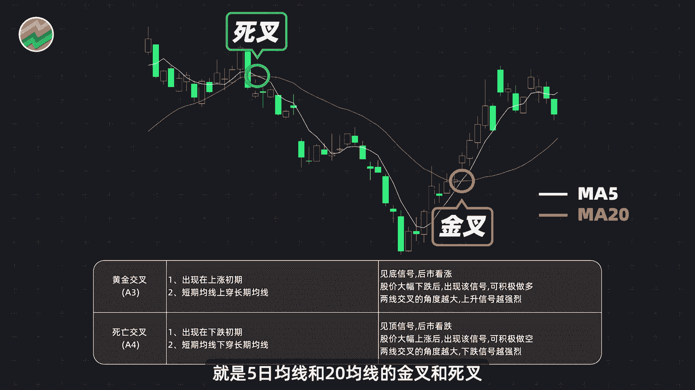
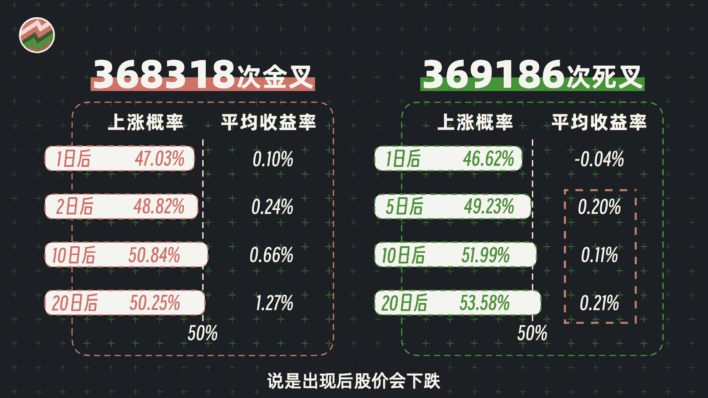
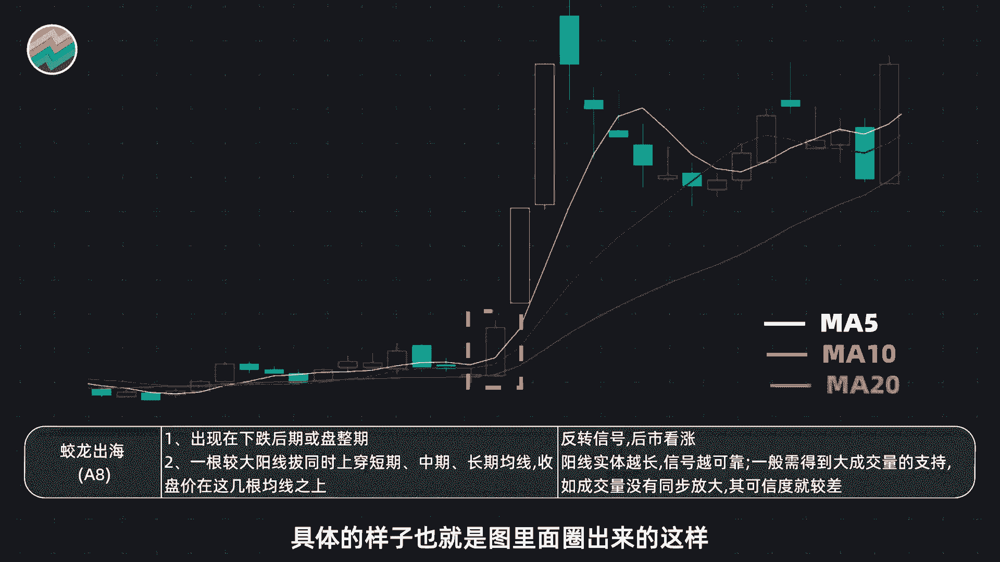
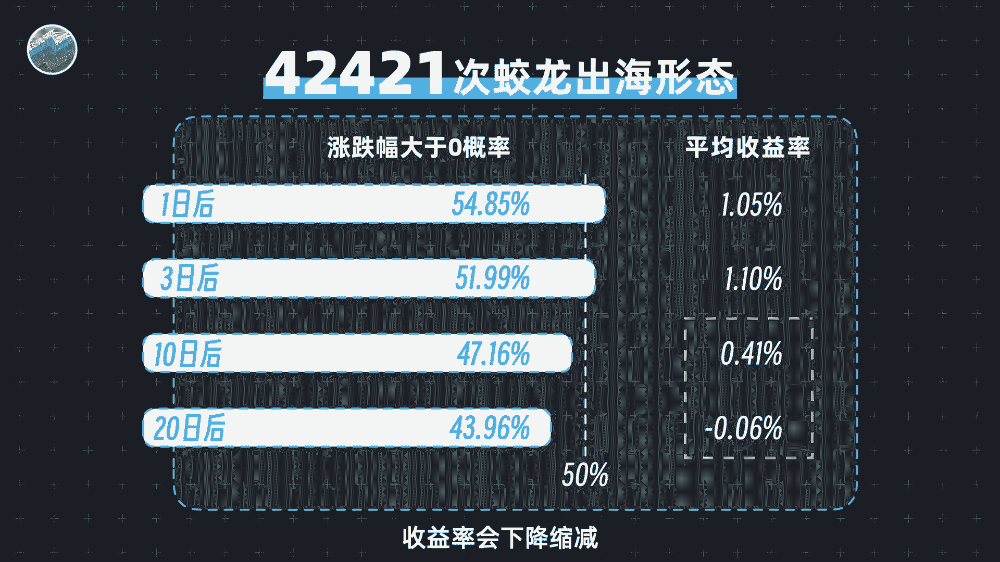
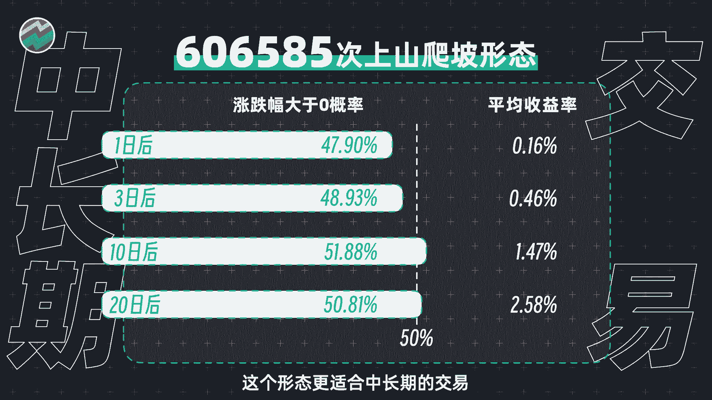
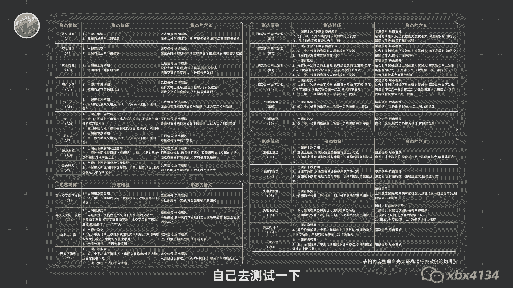
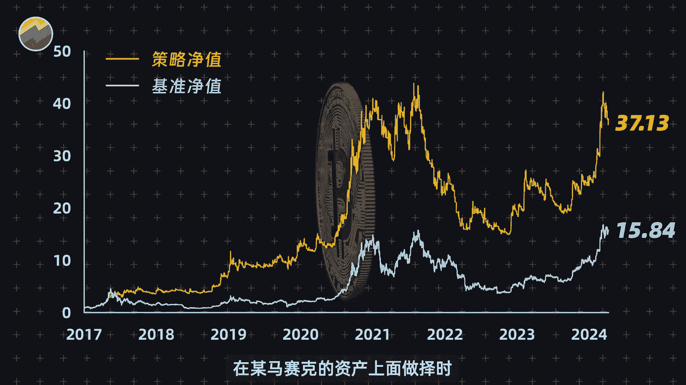

# 量化交易入门：01：25种均线用法的量化测试与筛选 🧮

在本节课中，我们将学习如何通过量化方法，对股票交易中常用的25种均线形态进行效果测试与筛选。我们将摒弃主观经验，完全依赖历史数据来评估哪些形态真正有效，哪些可能只是“传说”。

---

## 概述

我整理归纳了炒股最常用的25种均线用法，并编写了量化代码来测试它们的实际效果。目的是为了从众多形态中，筛选出真正具有实战价值的几种分享给大家。我是专注于量化投资的邢不行。

炒股的朋友应该都知道均线，毕竟打开行情软件就能在K线图上看到，一些官方媒体的报道中也会用它来分析行情。网上也常有老师宣称使用其“均线战法”能获得惊人收益。然而，作为量化交易者，我们更习惯用数据说话。单个案例的图表难以令人信服。

因此，我花费时间整理了25种最常用的均线形态，归纳了它们的用法，并编写了一个可以测试所有形态效果的Python量化程序，对它们进行了全面的历史回测。测试结果有好有坏，下面我将挑选几个有代表性的形态进行介绍。其余形态的测试结果、程序代码和数据，大家可以联系我获取，以便自行验证。

---

## 经典形态测试：金叉与死叉

上一节我们介绍了本次测试的背景与目的，本节中我们来看看大家平时使用最多的两种均线形态：金叉和死叉。

它们的用法定义如下：
*   **金叉**：短期均线（如5日均线）自下而上穿越长期均线（如10日均线），通常被视为买入信号。
*   **死叉**：短期均线自上而下穿越长期均线，通常被视为卖出信号。

以下是量化测试的结果：
*   从2007年至今，A股市场中金叉和死叉形态均出现了大约37万次。
*   两者的胜率（信号发出后股价朝预期方向运动的概率）都不算高。
*   金叉的赔率（平均收益率）尚可，短期平均收益基本可忽略，但中长期表现不错。
*   死叉作为“卖出信号”，测试结果却完全相反，其出现后股价并未表现出预期的下跌趋势。

这引发了一个思考：死叉真的能作为一个可靠的卖出信号吗？

---

## 表现优异的形态：蛟龙出海与上山爬坡

在测试了基础的交叉形态后，我们来看看两种测试效果相对最好的均线形态。

### 形态一：蛟龙出海 🐉

“蛟龙出海”形态的用法是：股价经过长期盘整或下跌后，突然出现一根放量长阳线，同时上穿多根均线（如5日、10日、20日均线），犹如蛟龙冲出水面，气势磅礴。

以下是该形态的量化测试结果：
*   该形态出现后，股价在短期内（如1-5天）上涨的概率超过50%。
*   短期平均收益率可达1%以上。
*   但从长期来看，收益率会逐渐下降。

**结论**：蛟龙出海形态更适用于捕捉短线交易机会，而非用于中长期持股的决策。

### 形态二：上山爬坡 ⛰️

“上山爬坡”形态的用法是：股价处于上升趋势中，短期均线、中期均线、长期均线呈现多头排列（即短期在上，长期在下），且股价沿着短期均线稳步上行，犹如沿山坡向上攀登。

以下是该形态的量化测试结果：
*   形态出现后，股价短期上涨概率并不突出。
*   但平均收益率随着时间稳步上升，在信号出现20天后，平均收益率高达2.58%。
*   该形态在历史上出现了约60万次，样本充足。

**结论**：对于一个简单的均线指标而言，2.58%的收益率已经很高。上山爬坡形态更适合用于指导中长期交易。

---

## 核心启示：寻找“更弱的牌局”

关于均线形态的效果我们就介绍到这里。由于时间有限，无法一一展示全部25种用法的测试结果。大家可以联系我获取完整的程序、用法和数据，自行测试验证。

最后，分享一个核心观点：虽然我们测试出A股的部分均线用法是有效的，但正如我常说的——**与其花时间提高牌技，不如寻找对手更弱的牌局**。

这意味着，在投资中我们不应只扎堆于高手林立、竞争激烈的领域（例如仅用常见指标在A股主板博弈），而应更主动地寻找一些竞争对手更弱、效率更低的市场或资产。这个道理不仅适用于交易，也适用于工作和生活。

例如，即使只使用最简单的均线指标，在一些流动性较差或关注度不高的“马赛克”资产上进行择时交易，我们也能获得更好的策略效果。

**归根结底，我们要用科学的方法和数据进行投资决策，而不是仅仅依赖主观经验或似是而非的“战法”。**

---

## 总结

本节课中，我们一起学习了如何用量化方法检验交易策略的有效性。我们测试了25种常用均线形态，具体分析了金叉、死叉、蛟龙出海和上山爬坡等形态的历史表现，并得出了数据驱动的结论。更重要的是，我们认识到在投资中“选择战场”有时比“优化战术”更重要，应主动寻找更具优势的交易环境。量化交易的核心精神是：**用数据说话**。

感谢大家的阅读。我是邢不行。