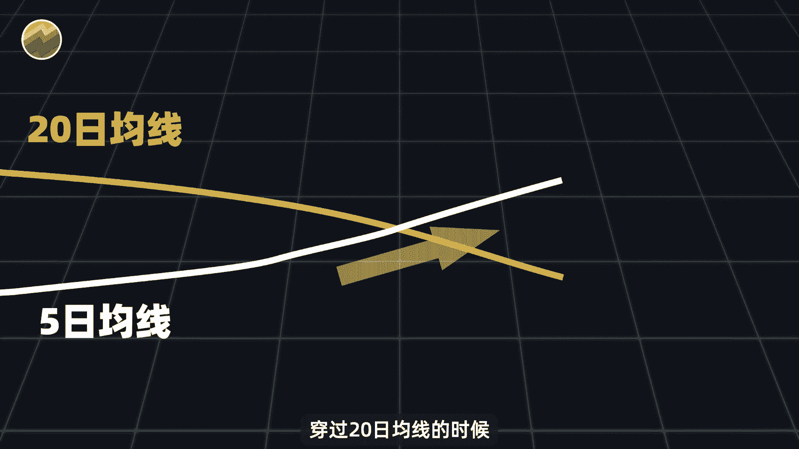
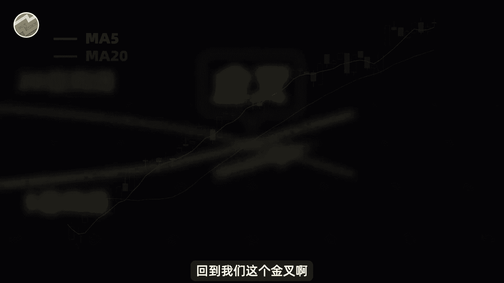
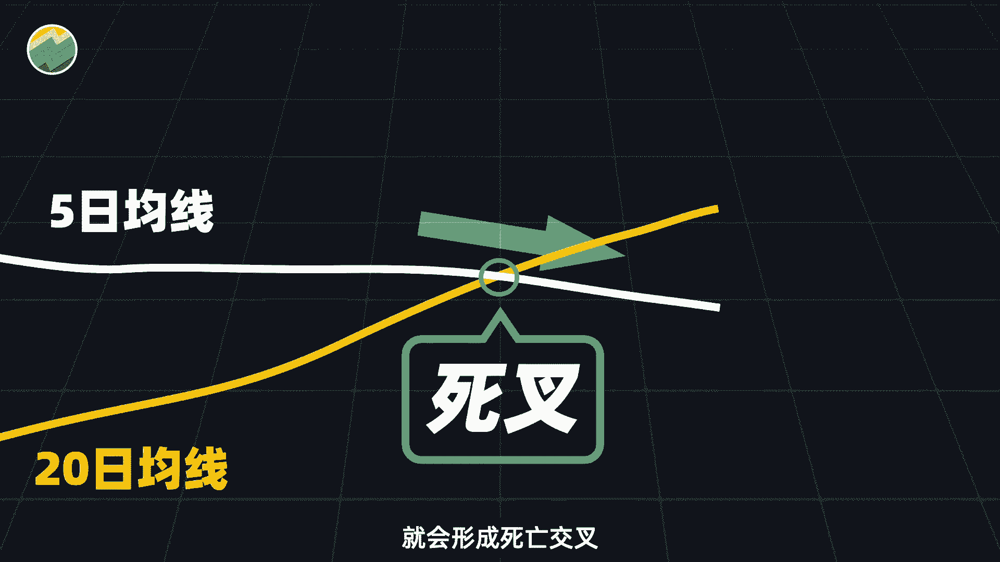
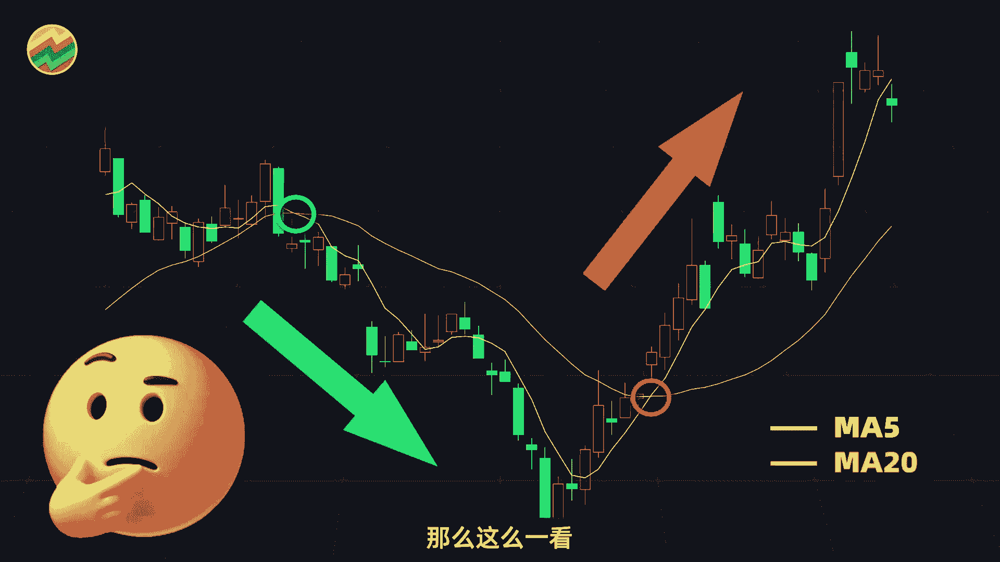
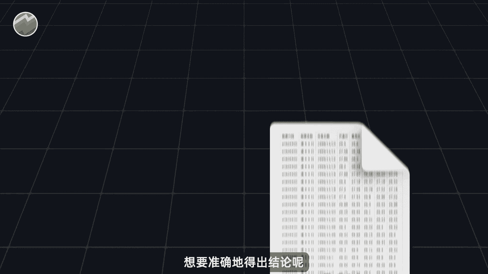
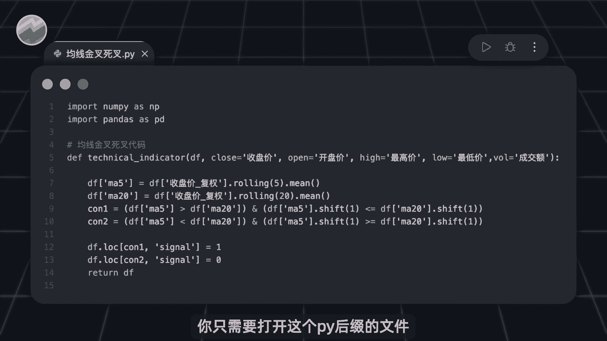
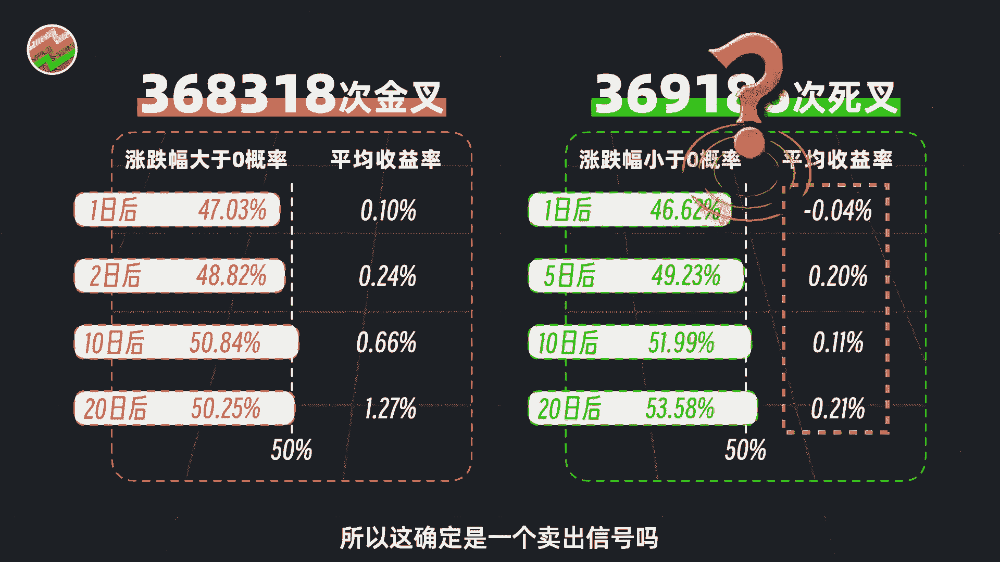
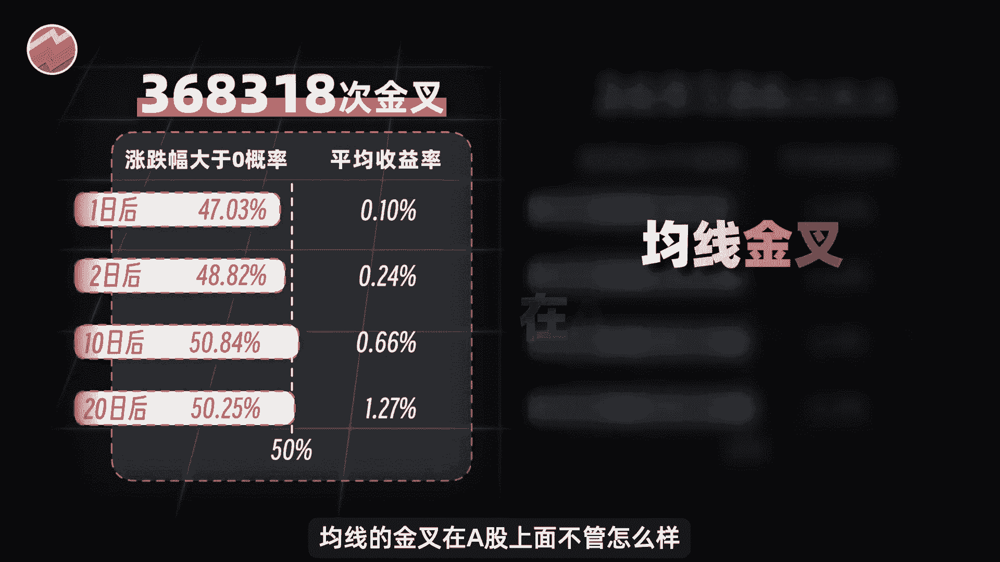
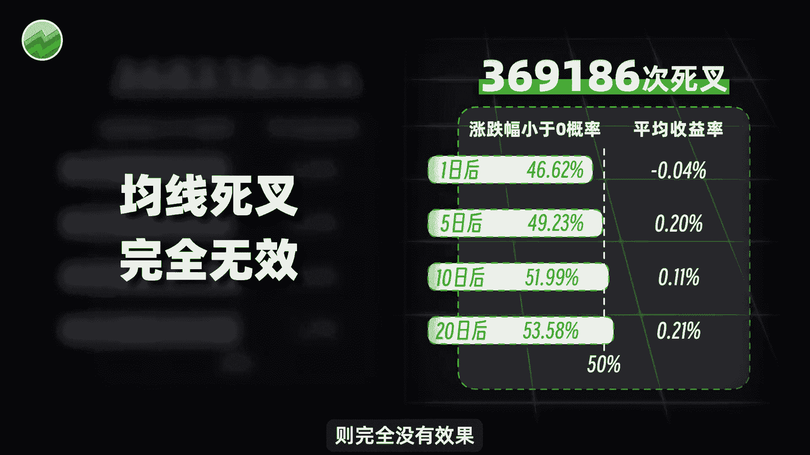
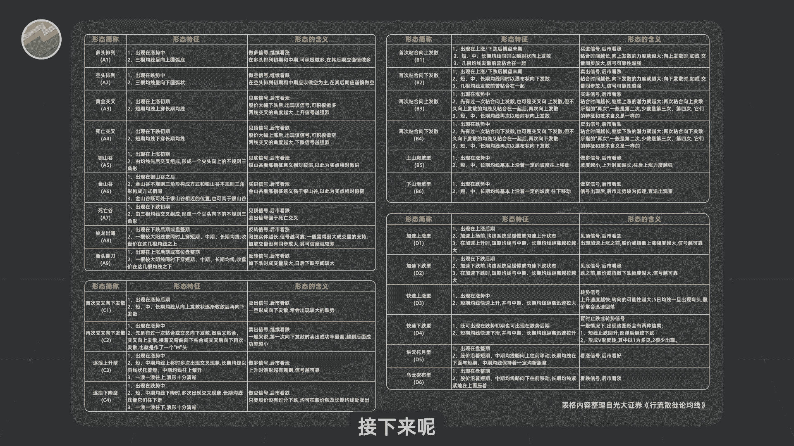

# Python量化：1：均线基础与金叉死叉验证 📈


在本节课中，我们将学习移动平均线（均线）的基础概念，并重点验证最常见的两种均线用法：金叉与死叉。我们将通过Python代码和A股历史数据，科学地分析这两种信号的实际效果。

## 概述



移动平均线是量化交易中常用的技术指标之一。它通过计算过去一段时间内股价的平均值，来平滑价格走势，帮助识别趋势。最常见的用法是观察短期均线与长期均线的交叉，即“金叉”和“死叉”。本节我们将通过历史数据验证这些传统用法的有效性。


## 什么是金叉与死叉？


假设我们有两根均线：一根是代表短期趋势的5日均线，另一根是代表长期趋势的20日均线。

当5日均线从下往上穿过20日均线时，会形成一个交叉。这个交叉在技术分析中被称为“黄金交叉”，简称**金叉**。传统观点认为，金叉是一个良好的买入信号，预示着股价可能开始上涨。




反之，当5日均线从上往下穿过20日均线时，会形成另一个交叉，被称为“死亡交叉”，简称**死叉**。传统观点认为，死叉是一个卖出信号，预示着股价可能开始下跌。




从历史图表上看，似乎确实存在金叉后上涨、死叉后下跌的案例。然而，仅凭几张图表就下结论是不够科学的。

## 用Python和数据验证金叉死叉



为了得出准确的结论，我们需要借助A股全部的历史数据和Python代码进行统计分析。具体方法是：找出历史上所有的均线金叉和死叉，然后统计信号发生后股价的涨跌概率和平均收益。



相关的数据和代码已经准备就绪。你只需要运行指定的Python文件即可。

以下是核心的验证逻辑概述：


```python
# 伪代码示例：计算金叉/死叉后的收益
# 1. 计算股票的5日和20日移动平均线
df[‘ma5’] = df[‘close’].rolling(5).mean()
df[‘ma20’] = df[‘close’].rolling(20).mean()



# 2. 判断金叉（5日线上穿20日线）和死叉（5日线下穿20日线）
df[‘golden_cross’] = (df[‘ma5’] > df[‘ma20’]) & (df[‘ma5’].shift(1) <= df[‘ma20’].shift(1))
df[‘death_cross’] = (df[‘ma5’] < df[‘ma20’]) & (df[‘ma5’].shift(1) >= df[‘ma20’].shift(1))

# 3. 统计金叉/死叉发生后N日的股价涨跌情况
# … (具体统计代码)
```

程序运行结果显示，从2007年至今，A股历史上总共发生了约37万次均线金叉和死叉。

以下是金叉发生后的统计结果：

*   **上涨概率**：大约50%，与抛硬币的概率相近。
*   **短期平均收益**：很小，基本可忽略不计。
*   **中长期平均收益**：10天后平均收益率约为0.66%，20天后约为1.27%。这表明金叉虽然胜率不高，但赔率尚可。



以下是死叉发生后的统计结果：


*   **下跌概率**：同样在50%附近。
*   **未来平均收益**：基本为正，这与“死叉预示下跌”的传统预期完全相反。



## 结论与过渡



通过数据验证，我们可以得出直观的结论：无论是金叉还是死叉，都不能简单地直接运用。金叉作为买入信号，其有效性有限，但中长期看有一定正向收益；而死叉作为卖出信号，则基本无效。



上一节我们验证了最常见的金叉死叉用法，本节中我们来看看两种经过测试表现相对优异的均线用法。由于时间关系，我们无法逐一讲解全部20多种用法，但你可以获取相关数据和代码自行测试。

---


本节课中我们一起学习了移动平均线的基础概念，并重点用Python和数据验证了“金叉”与“死叉”这两种经典用法的实际效果。我们发现，单纯依赖这些交叉信号进行交易并不可靠，量化交易需要更严谨、系统的策略和回测。在接下来的课程中，我们将介绍其他表现更好的均线用法。