# Python量化交易：P1：量化开发环境安装与搭建 🚀

在本节课中，我们将手把手学习如何安装和搭建“大抄手”量化交易系统的开发环境。我们将从下载系统文件开始，逐步完成Python环境配置、依赖包安装，并最终成功运行一个示例策略。请严格按照步骤操作，以确保环境搭建成功。

## 系统下载与准备

首先，我们需要从官网下载必要的系统文件。

1.  访问“大抄手量化投资”官网。
2.  注册并登录账号。
3.  在后台的“客户端下载”页面，复制验证码并下载“开发版”压缩包。
4.  同时，建议下载Python 3.7.3安装包及环境依赖文件。如果不确定，可以直接下载整个文件夹。

下载完成后，请将开发版压缩包解压到一个**不含中文**的路径下，例如 `D:\DCSQuant\大抄手199\`。正确的项目结构应该是顶层目录直接包含项目文件。

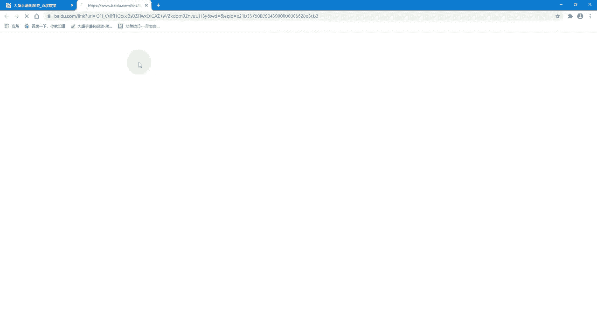

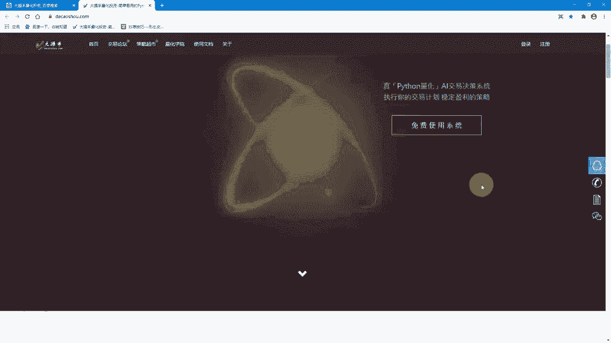

## Python环境安装与配置

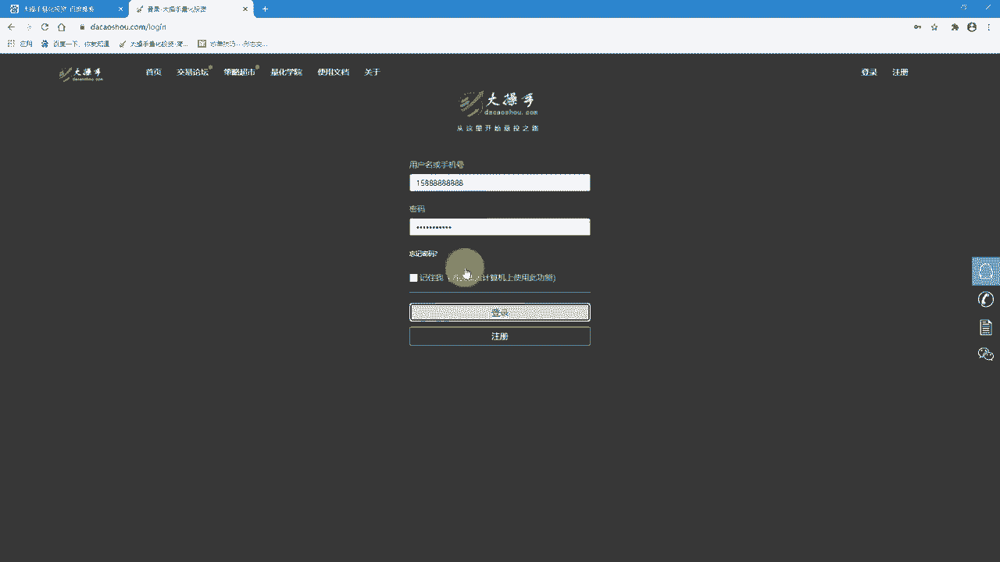

我们的系统基于Python开发，因此需要正确安装指定版本的Python。

上一节我们准备好了系统文件，本节中我们来看看如何安装和配置Python环境。

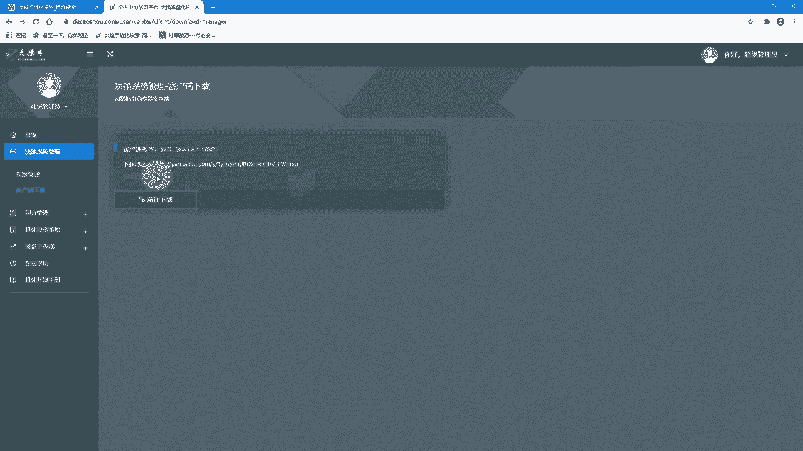

### 检查现有Python版本

首先，检查电脑是否已安装Python，以及其版本。
打开命令行（按 `Win + R`，输入 `cmd` 并回车），输入以下命令：

```bash
python
```

如果显示的版本是3.7.1至3.7.5，通常可以兼容。如果是3.8.0或更高版本，建议重新安装Python 3.7.3。

### 安装Python 3.7.3

如果需要安装或重装，请按以下步骤操作：

1.  **清理旧环境（可选）**：在“此电脑”右键“属性” -> “高级系统设置” -> “环境变量”，在“系统变量”中找到`Path`，删除其中旧的Python安装路径和Scripts路径。
2.  **运行安装程序**：双击下载的 `python-3.7.3.exe` 文件。
3.  **关键配置**：在安装界面，务必勾选 **“Add Python 3.7 to PATH”**。
4.  **自定义安装路径**：点击“Customize installation”，在下一步中选择“Browse”，新建一个英文路径（如 `C:\NewPython373`）进行安装。
5.  **完成安装**：等待安装完成，出现“Setup was successful”提示。如果出现“Disable path length limit”选项，点击它。

安装完成后，再次在命令行输入 `python`，确认版本已变为 **Python 3.7.3**。

### 配置Python镜像源

为了加速后续依赖包的下载，我们需要将pip的下载源更换为国内镜像。

以下是配置清华镜像源的步骤：

1.  打开文件资源管理器，在地址栏输入 `%APPDATA%` 并回车。
2.  进入该目录，查看是否存在 `pip` 文件夹。如果没有，则新建一个名为 `pip` 的文件夹。
3.  进入 `pip` 文件夹，将从下载文件中获得的 `pip.ini` 配置文件复制到此文件夹内。

至此，Python基础环境已配置完成。

## 开发工具与项目依赖安装

环境配置好后，我们需要安装开发工具并加载项目所需的第三方库。

上一节我们配置好了Python，本节中我们来看看如何设置开发环境并安装依赖。

### 安装PyCharm（推荐）

建议使用PyCharm作为代码编写工具。直接运行下载的PyCharm安装程序，按照默认选项完成安装即可。

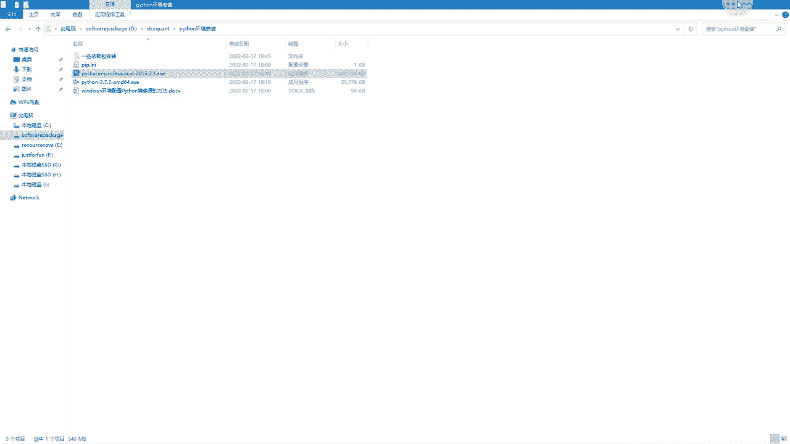

### 使用PyCharm打开项目

安装完成后，将之前解压好的项目文件夹（例如 `大抄手199`）直接拖拽到PyCharm的图标上打开。确保在PyCharm中看到的顶层目录就是项目文件夹本身。

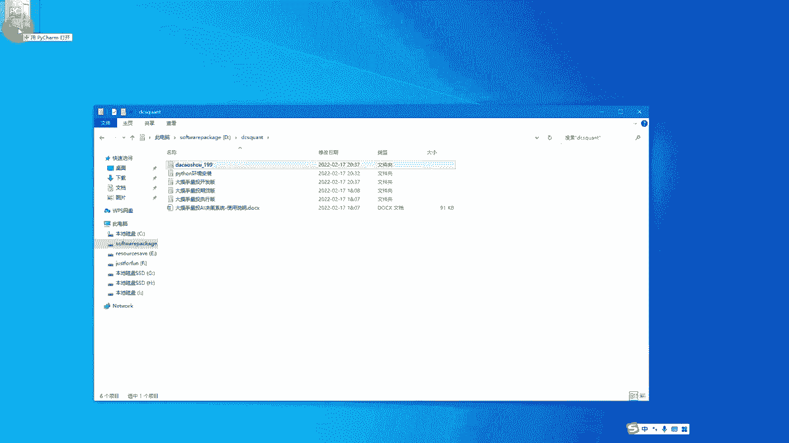

### 安装项目依赖包

项目运行依赖于许多第三方Python库。我们已经提供了自动安装脚本。

以下是安装依赖的步骤：

1.  **方法一（推荐）**：在项目根目录下，直接双击运行 `install.bat` 批处理文件。
2.  **方法二（备用）**：打开命令行，使用 `cd` 命令切换到项目根目录，然后手动运行 `pip install -r requirements.txt`。

安装过程中，如果看到链接包含 `https://pypi.tuna.tsinghua.edu.cn/simple`，说明镜像源配置成功，下载速度会很快。如果安装过程卡住，可以尝试按回车键继续。安装成功的标志是看到所有包后提示“Successfully installed ...”。

**注意**：如果某个特定包安装失败（例如提示找不到某个版本），可以单独安装它。在命令行中使用命令：
```bash
pip install [包名]==[版本号]
```

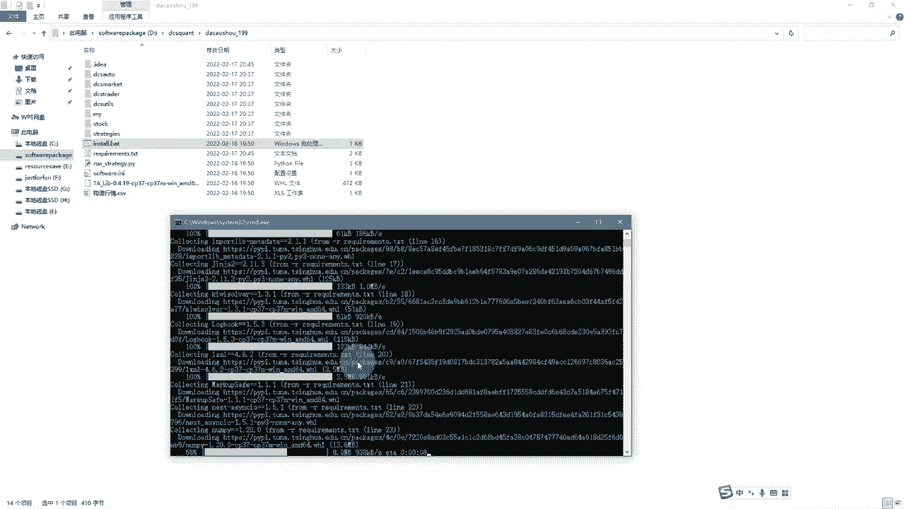

## 运行第一个量化策略

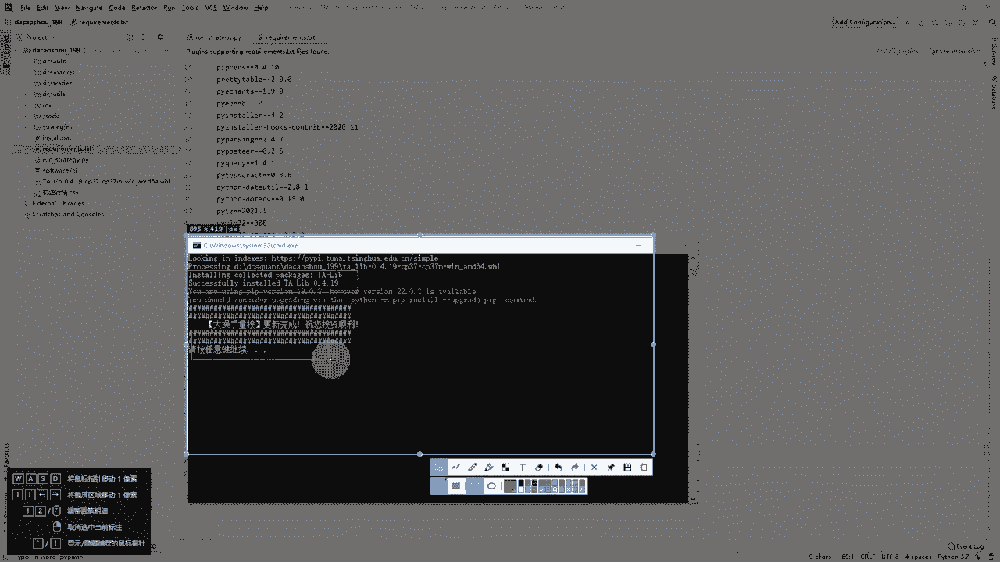

所有环境搭建完毕后，我们可以尝试运行系统自带的示例策略，验证安装是否成功。

上一节我们安装了所有依赖，本节我们来运行第一个策略看看效果。

### 设置用户Token

系统需要验证你的身份才能运行。

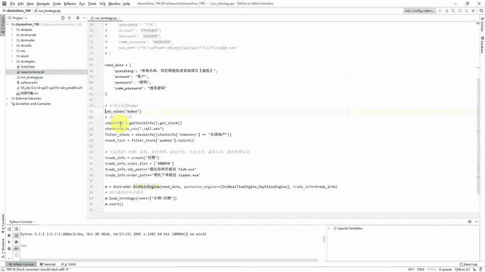

1.  在PyCharm中打开项目根目录下的 `run_strategy.py` 文件。
2.  找到设置token的代码行（通常以 `# token = ‘你的token’` 形式注释）。
3.  登录“大抄手”官网，在“权限管理”页面找到你的个人Token并复制。
4.  在代码中删除该行开头的 `#` 注释符号，并将复制的Token粘贴到引号内。

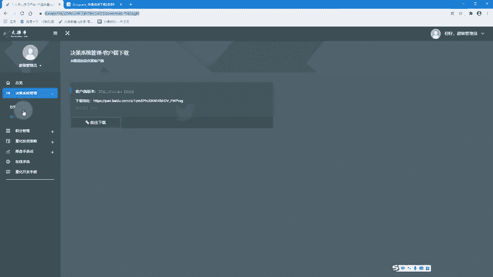

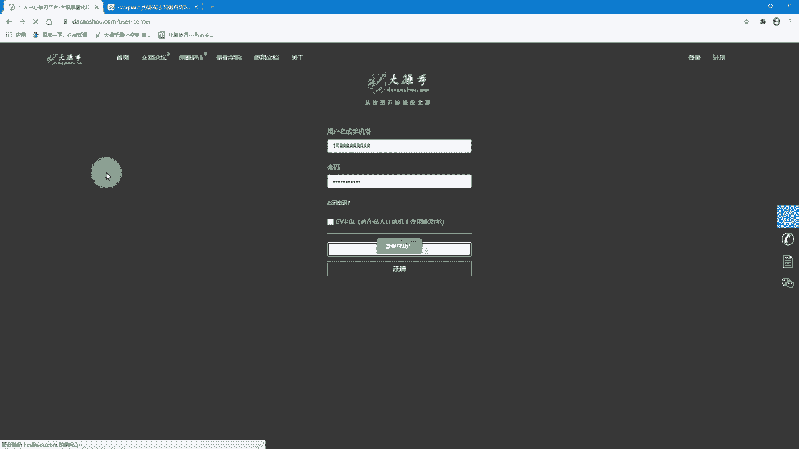

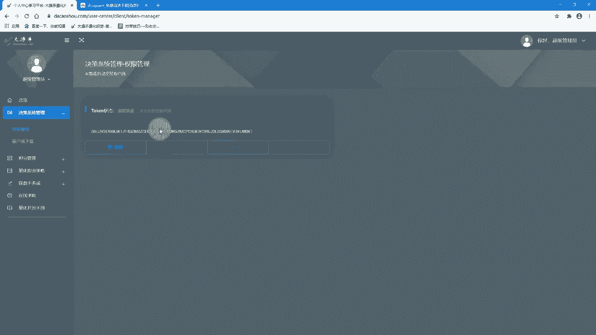

### 执行策略回测

设置好Token后，就可以运行策略了。

1.  在PyCharm中，右键点击 `run_strategy.py` 文件。
2.  选择 **“Debug ‘run_strategy’”**。
3.  程序开始运行，会在下方控制台输出日志。
4.  运行结束后，系统会自动弹出浏览器窗口，展示策略的回测结果报告，包括资金曲线、收益分析等可视化图表。

如果能够成功看到回测报告图表，恭喜你！量化开发环境已经搭建完毕，可以开始编写自己的交易策略了。

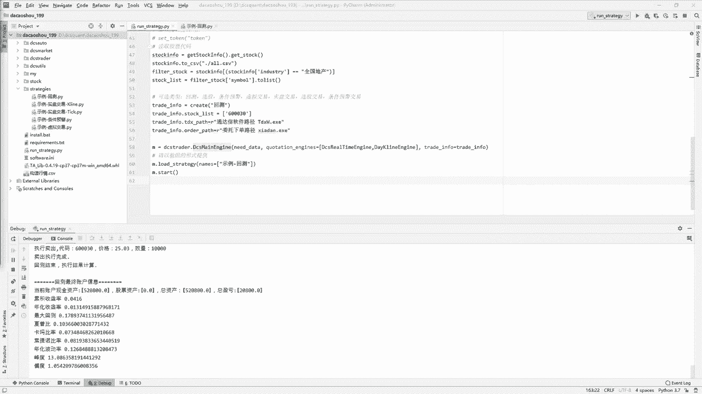

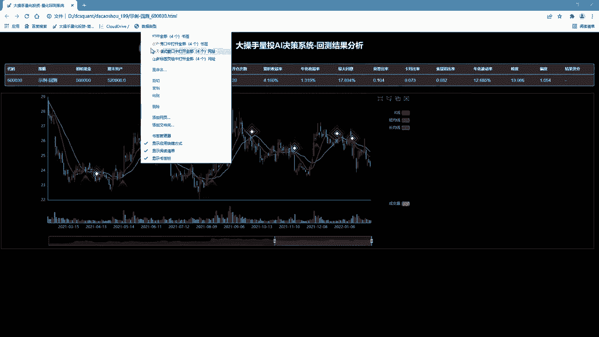

## 总结与后续

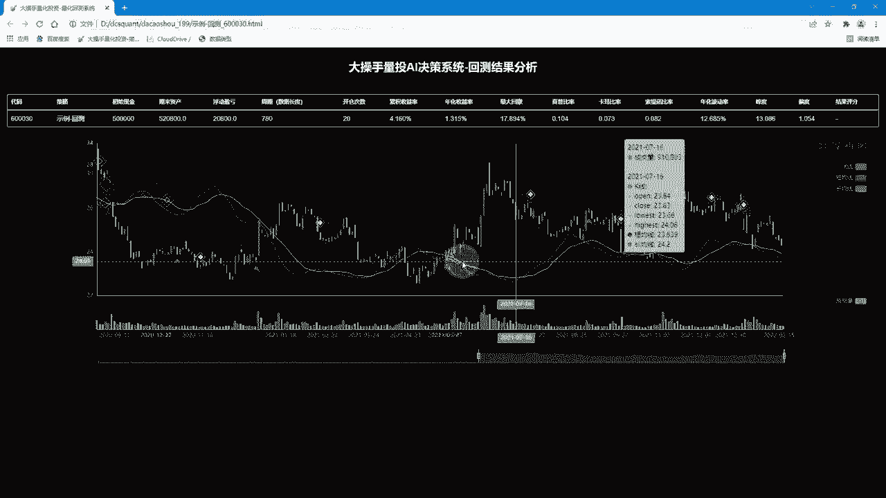

本节课中，我们一起学习了“大抄手”量化交易系统开发环境的完整搭建流程。我们完成了从**系统下载**、**Python安装配置**、**依赖包安装**到**成功运行示例策略**的所有关键步骤。

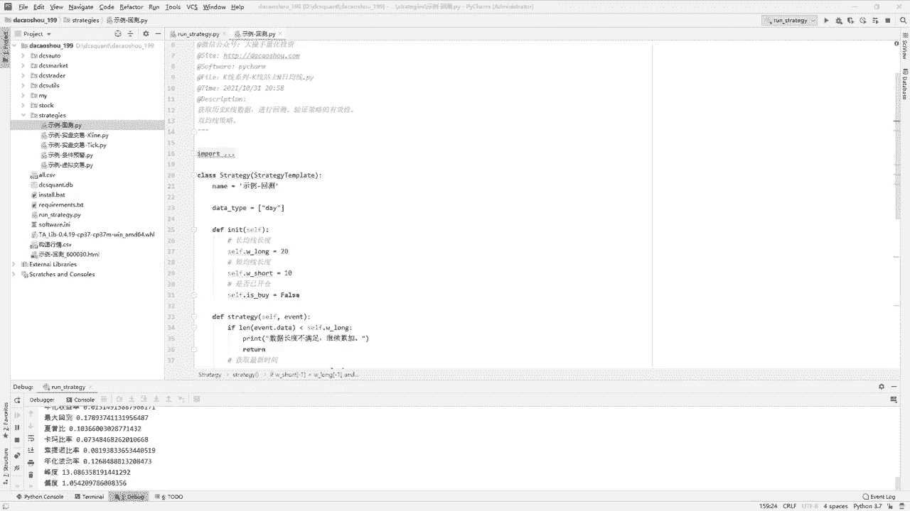

环境搭建是量化学习的第一步，也是最容易遇到问题的一步。如果安装过程中遇到任何问题，请回顾本教程的每一步，检查路径、版本和配置是否正确。接下来，你就可以在 `strategy` 目录下探索和编写自己的量化策略了。