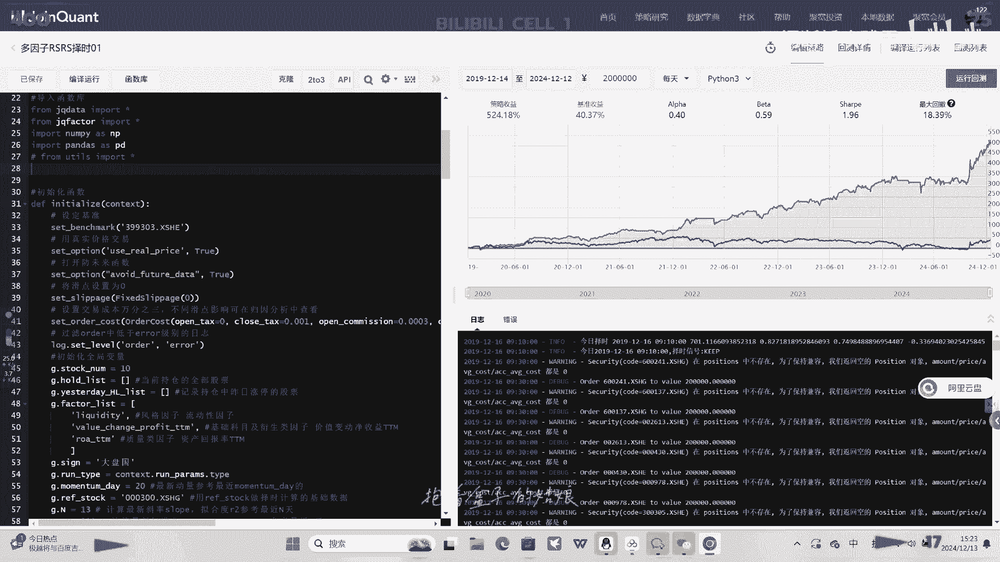

# Python量化交易：P1：课程概述与Python基础入门 🐍

在本节课中，我们将开启Python量化交易的学习之旅。课程将涵盖从Python编程基础到高级量化策略的完整知识体系，旨在帮助初学者构建系统的量化交易能力。

## 课程内容全景图 📚

上一段我们了解了课程的整体目标，现在我们来详细看看课程将覆盖的核心模块。

以下是本系列课程包含的主要内容：

*   **Python基础**：掌握编程语言的核心语法与数据结构。
*   **数据分析**：学习使用Pandas、NumPy等库处理金融数据。
*   **资产定价理论**：理解金融资产价格决定的基本原理。
*   **基本面分析**：研究公司财务报表与宏观经济指标。
*   **技术面分析**：识别图表形态与交易信号。
*   **多因子策略**：构建并评估基于多个因子的选股模型。
*   **机器学习**：应用算法预测市场走势或优化策略。
*   **自动化**：实现策略的回测、执行与监控全流程自动化。

## Python环境搭建与基础语法 ⚙️

在深入任何专业领域之前，坚实的工具基础至关重要。本节我们将学习如何配置Python开发环境并掌握其基础语法。

### 开发环境配置

一个集成好的环境能极大提升学习效率。推荐初学者使用Anaconda，它集成了Python解释器、包管理器和Jupyter Notebook等常用工具。

以下是安装与启动的核心步骤：

1.  访问Anaconda官网下载并安装适合你操作系统的版本。
2.  安装完成后，从开始菜单打开“Anaconda Navigator”。
3.  在Navigator中启动“Jupyter Notebook”，它将在浏览器中打开一个交互式编程环境。

### 变量与数据类型

程序通过变量来存储和操作数据。Python中的变量无需声明类型，赋值即定义。

核心数据类型包括：
*   **整数**：`price = 100`
*   **浮点数**：`return_rate = 0.05`
*   **字符串**：`stock_name = "AAPL"`
*   **布尔值**：`is_rising = True`

### 基本运算与逻辑

Python支持算术运算、比较运算和逻辑运算，这是构建策略判断的基础。

*   **算术运算**：`total = price * shares`
*   **比较运算**：`is_profitable = current_price > buy_price`
*   **逻辑运算**：`should_sell = is_profitable and trend_reversing`

## 控制流：让程序做出决策 🔀

掌握了数据表示后，我们需要让程序能够根据不同条件执行不同操作，这就是控制流语句的作用。

### 条件判断（if语句）

`if`语句允许程序进行分支选择，这是实现交易逻辑（如买入/卖出信号）的关键。

其基本语法结构如下：
```python
if condition:
    # 条件为真时执行的代码
elif another_condition:
    # 另一个条件为真时执行的代码
else:
    # 以上条件都不满足时执行的代码
```
一个简单的交易信号示例：
```python
if price > moving_average:
    signal = "BUY"
elif price < moving_average:
    signal = "SELL"
else:
    signal = "HOLD"
```

### 循环（for与while循环）

循环用于重复执行某段代码，例如计算一系列股票的平均价格或遍历历史数据进行回测。

*   **for循环**：通常用于遍历一个序列（如列表）。
    ```python
    stock_list = ["AAPL", "GOOGL", "MSFT"]
    for stock in stock_list:
        print(f"Processing {stock}")
    ```
*   **while循环**：在条件满足时持续运行。
    ```python
    cash = 10000
    while cash > 0:
        # 执行交易逻辑
        cash -= 1000
    ```


## 核心数据结构：列表与字典 📊

高效地组织和管理数据是量化分析的前提。Python提供了强大的内置数据结构。

### 列表（List）

列表是一个有序的元素集合，可以随时添加和删除其中的元素，非常适合存储时间序列数据，如每日股价。

列表操作示例：
```python
# 创建列表
price_history = [102.5, 103.1, 101.8, 105.2]
# 访问元素
today_price = price_history[-1]  # 获取最后一个元素
# 添加元素
price_history.append(106.0)
```

### 字典（Dictionary）

字典以“键-值”对的形式存储数据，能够通过唯一的键快速访问对应的值。它非常适合存储股票的各类属性信息。

字典操作示例：
```python
# 创建字典
stock_info = {
    "code": "000001",
    "name": "平安银行",
    "price": 15.42,
    "pe_ratio": 8.76
}
# 通过键访问值
company_name = stock_info["name"]
# 添加或修改键值对
stock_info["dividend_yield"] = 0.025
```

## 函数：封装可重用代码块 🧩



当某些代码需要重复使用时，我们可以将其封装成函数。这使代码更清晰、更易维护。

### 定义与调用函数

使用`def`关键字定义函数，并通过函数名加括号来调用它。

定义计算平均价格的函数：
```python
def calculate_average(prices):
    """计算给定价格列表的平均值。"""
    total = sum(prices)
    average = total / len(prices)
    return average

# 调用函数
daily_prices = [100, 102, 101, 105]
avg_price = calculate_average(daily_prices)
print(f"平均价格是：{avg_price}")
```

## 总结与展望 🎯

本节课中，我们一起学习了量化交易课程的宏伟蓝图，并迈出了第一步——搭建Python开发环境，掌握了变量、数据类型、控制流、列表、字典和函数等核心编程概念。这些知识是后续所有数据分析、策略构建和自动化的基石。

在接下来的课程中，我们将运用这些Python技能，开始接触真实的金融数据，并学习如何进行分析和处理。请确保已经熟练本讲内容，准备好进入更精彩的量化实战世界。