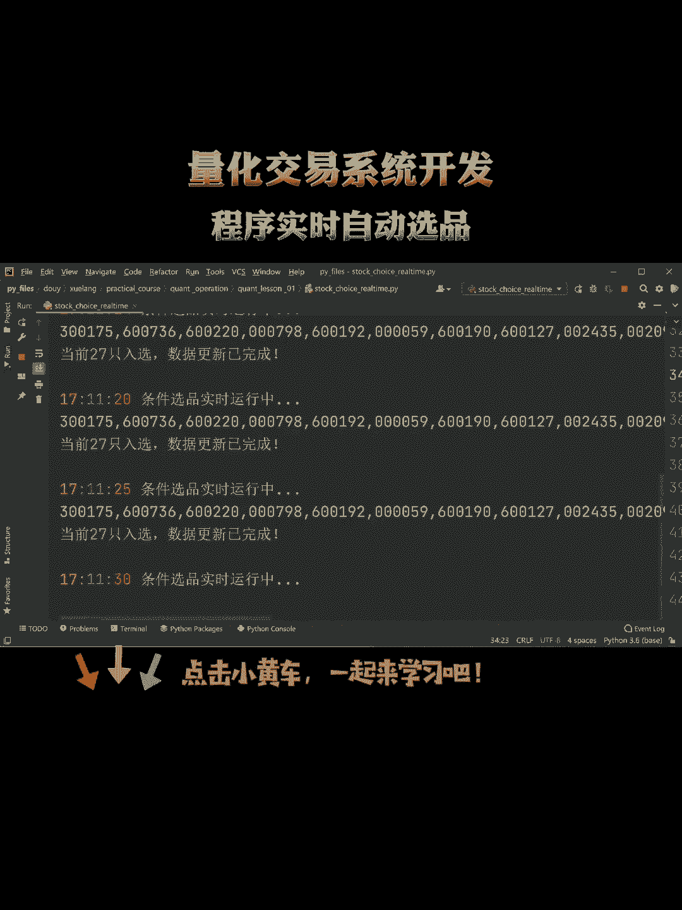

# Python量化交易系统：P1：构建实时自动选品系统

## 概述

在本节课中，我们将学习如何使用Python构建一个量化交易系统，核心功能是实现程序的实时自动选品。我们将从基础概念入手，逐步讲解如何获取数据、设计选品策略，并最终实现一个自动化的流程。

---

## 量化交易基础

上一节我们概述了课程目标，本节中我们来看看量化交易的基础概念。

量化交易是一种利用数学模型、统计分析和计算机程序来识别和执行交易机会的方法。其核心优势在于能够排除人为情绪干扰，实现纪律性、系统化的交易。

以下是量化交易系统的几个关键组成部分：

*   **数据源**：系统需要实时或历史的市场数据，如价格、成交量等。
*   **策略模型**：基于数据分析制定的买卖规则，通常用数学公式或算法描述。
*   **执行引擎**：负责根据策略模型发出的信号，自动执行买入或卖出操作。
*   **风险控制**：设置止损、仓位管理等规则，以控制潜在亏损。

一个简单的动量策略公式可以表示为：
**信号 = 当前价格 / N日前价格 - 1**
当信号值大于某个阈值时，产生买入信号。

---

## 实时数据获取与处理

了解了基础概念后，我们需要为系统注入“血液”，即市场数据。本节将介绍如何获取和处理实时数据。

实时数据是自动选品系统的输入。我们可以通过金融数据API（如`yfinance`, `akshare` 或券商提供的接口）来获取股票、加密货币等资产的实时行情。

以下是处理数据的基本步骤：

1.  **连接数据源**：使用API库建立连接。
2.  **订阅数据**：指定需要获取数据的交易品种和字段（如开盘价、最高价、最低价、收盘价）。
3.  **清洗数据**：处理缺失值、异常值，确保数据质量。
4.  **转换数据**：计算所需的指标，例如移动平均线、收益率等。


获取到数据后，我们通常用Pandas库进行高效处理。例如，计算5日简单移动平均线的代码如下：

```python
import pandas as pd
# 假设df是一个包含‘close’列的DataFrame
df[‘MA5’] = df[‘close’].rolling(window=5).mean()
```

---

## 设计自动选品策略

有了高质量的数据，我们就可以设计核心的“大脑”——选品策略。本节我们来看看如何将一个投资逻辑转化为可执行的程序策略。

选品策略的目标是从众多交易品种中筛选出当前最具有交易机会的标的。策略可以基于技术指标、基本面数据或混合模型。

一个简单的“双均线交叉”选品策略逻辑如下：
*   当短期均线（如MA5）上穿长期均线（如MA20）时，视为**强势启动信号**，将该标的加入候选列表。
*   当短期均线下穿长期均线时，视为**弱势信号**，从候选列表中移除。

以下是实现该策略逻辑的关键步骤：

*   **定义指标**：明确策略所使用的所有指标及其计算方法。
*   **设置信号规则**：用明确的逻辑条件（if/else语句）定义产生买入/卖出或入选/淘汰信号的条件。
*   **回测验证**：在历史数据上测试策略，评估其盈亏表现。
*   **参数优化**：调整策略中的参数（如均线周期），寻找更优配置。

---

## 构建自动化执行流程

策略设计完成后，我们需要将其部署到自动化的流程中。本节将介绍如何将各个模块串联起来，实现无人值守的实时选品。



自动化流程确保系统能够按预定周期（如每分钟、每5分钟）自动运行，完成“数据获取->策略计算->输出结果”的全过程。

以下是构建自动化执行流程的主要环节：

1.  **定时任务**：使用`schedule`或`APScheduler`等库设置定时任务，触发选品程序。
2.  **运行策略**：在定时任务中调用策略函数，对最新数据进行分析。
3.  **生成选品列表**：将策略筛选出的标的整理成清晰的列表或报告。
4.  **输出结果**：将选品列表通过邮件、消息推送或写入文件等方式输出，供交易员参考或直接传递给交易执行模块。
5.  **日志记录**：记录每次运行的时间、选出的品种及关键数据，便于监控和复盘。

```python
import schedule
import time

def job():
    print(“开始执行选品策略...”)
    # 此处调用数据获取、策略分析和结果输出的函数
    # ...
    print(“选品完成。”)

# 设置每5分钟执行一次
schedule.every(5).minutes.do(job)

while True:
    schedule.run_pending()
    time.sleep(1)
```

---

## 总结

本节课中，我们一起学习了构建一个Python实时自动选品量化交易系统的基本框架。我们从量化交易的基础概念讲起，逐步深入到**实时数据获取与处理**、**选品策略的设计与实现**，最后完成了**自动化执行流程的搭建**。

关键要点包括：理解量化系统的组成部分、掌握使用API和Pandas处理金融数据、学会将交易思想转化为具体的策略规则，以及利用定时任务实现流程自动化。这是构建更复杂量化交易系统的坚实第一步。